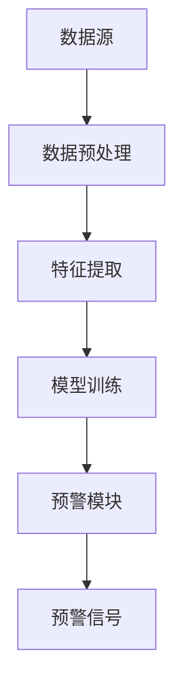
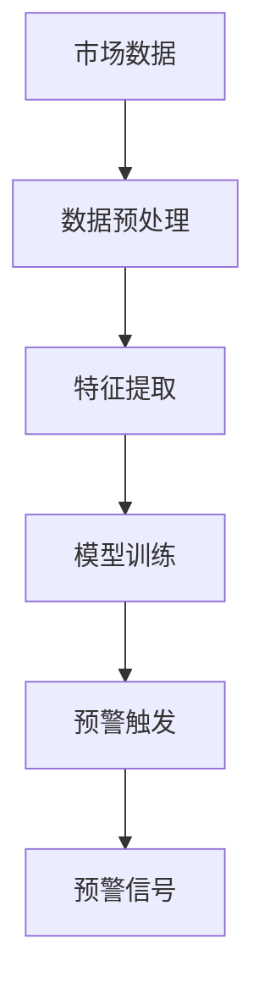
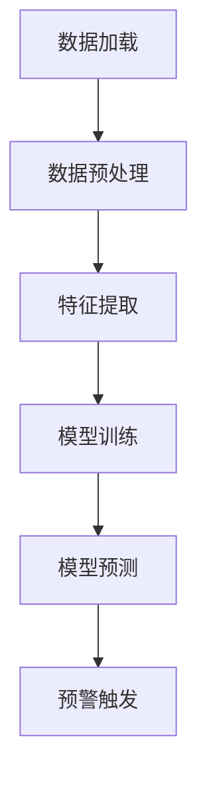
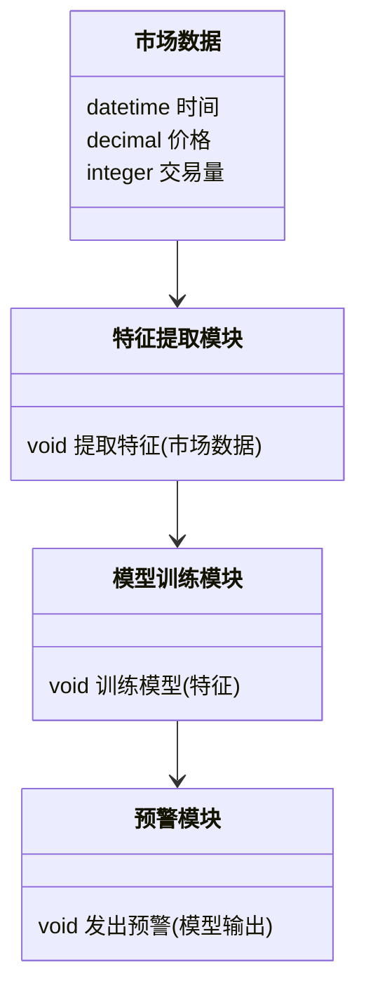
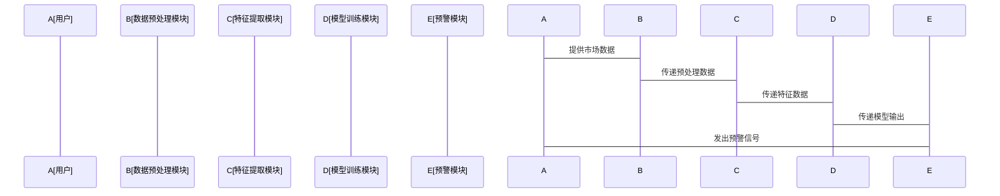

                 


```markdown
# AI驱动的市场流动性枯竭预警

> 关键词：AI技术、市场流动性、预警系统、时间序列分析、LSTM网络、金融风险管理

> 摘要：随着金融市场日益复杂，市场流动性枯竭的风险也随之增加。本文通过AI技术，特别是深度学习算法，探讨如何有效预测和预警市场流动性枯竭。文章详细分析了市场流动性枯竭的定义、特征，以及AI技术在其中的应用。通过时间序列分析、LSTM网络和PCA降维技术，构建了完整的预警系统架构，并结合实际案例，展示了系统的实现和应用效果。

---

# 第一部分: AI驱动的市场流动性枯竭预警概述

# 第1章: 背景与问题背景

## 1.1 问题背景

### 1.1.1 市场流动性枯竭的定义与特征
市场流动性枯竭是指在金融市场中，某种资产或整体市场的交易量急剧下降，导致买卖价差扩大，市场深度不足，无法及时以合理价格买卖资产的情况。其主要特征包括：
- **交易量骤减**：买卖订单大幅减少，市场参与度下降。
- **买卖价差扩大**：买价和卖价之间的差距显著增加。
- **市场深度不足**：市场无法在短时间内吸收大量交易订单。
- **价格波动加剧**：价格可能在短时间内剧烈波动，甚至出现闪崩。

### 1.1.2 AI技术在金融市场中的应用现状
AI技术在金融市场中的应用日益广泛，尤其是在高频交易、风险管理和市场预测方面。AI技术能够处理大量非结构化数据，发现隐藏的市场规律，帮助交易员和机构做出更明智的决策。然而，目前的AI应用主要集中在价格预测和风险评估，而对市场流动性问题的关注相对较少。

### 1.1.3 市场流动性枯竭预警的必要性
市场流动性枯竭往往会导致市场的不稳定性，甚至引发系统性风险。例如，2010年的“闪电崩盘”事件就是因为流动性不足导致的市场剧烈波动。因此，建立有效的流动性枯竭预警系统，可以帮助市场参与者提前采取措施，减少潜在风险。

## 1.2 问题描述

### 1.2.1 市场流动性枯竭的多维度表现
市场流动性枯竭可以从多个维度进行表现，包括：
- **交易量**：成交量急剧下降。
- **买卖价差**：买卖价差扩大。
- **市场深度**：市场深度不足，无法及时成交。
- **波动性**：价格波动加剧。

### 1.2.2 AI驱动预警的核心问题
AI驱动的市场流动性预警的核心问题在于如何通过AI算法，准确预测市场流动性枯竭的可能性，并及时发出预警信号。这需要结合市场数据、交易行为和外部因素，构建一个高效的预测模型。

### 1.2.3 预警系统的边界与外延
预警系统的边界包括：
- **数据范围**：仅限于市场交易数据。
- **预警范围**：仅针对流动性枯竭风险。
- **预警级别**：分为多个级别，如轻微、中度、重度。

## 1.3 问题解决与边界

### 1.3.1 AI驱动的市场流动性预警目标
AI驱动的市场流动性预警系统的目标是通过分析市场数据，识别潜在的流动性风险，并提前发出预警信号，帮助市场参与者采取应对措施。

### 1.3.2 系统边界与功能范围
系统的边界包括：
- **数据输入**：市场交易数据。
- **数据输出**：预警信号。
- **功能范围**：数据采集、特征提取、模型训练、预警触发。

### 1.3.3 核心要素与组成结构
核心要素包括：
- **数据源**：市场交易数据。
- **特征提取**：提取与流动性相关的特征。
- **模型训练**：训练AI模型，预测流动性风险。
- **预警模块**：根据模型输出，触发预警信号。

## 1.4 本章小结
本章介绍了市场流动性枯竭的定义和特征，分析了AI技术在金融市场中的应用现状，并提出了AI驱动的市场流动性预警系统的必要性和目标。下一章将详细讲解核心概念与联系。

---

# 第二部分: 核心概念与联系

# 第2章: 核心概念与联系

## 2.1 核心概念原理

### 2.1.1 市场流动性与AI技术的结合
市场流动性与AI技术的结合主要体现在以下几个方面：
- **数据采集**：通过AI技术采集市场交易数据。
- **特征提取**：通过AI技术提取与流动性相关的特征。
- **模型训练**：通过AI技术训练预测模型。

### 2.1.2 AI算法在市场分析中的应用
AI算法在市场分析中的应用主要包括：
- **时间序列分析**：用于预测市场走势。
- **深度学习**：用于识别市场模式。
- **自然语言处理**：用于分析市场新闻和评论。

### 2.1.3 流动性枯竭预警的数学模型
流动性枯竭预警的数学模型包括：
- **ARIMA模型**：用于时间序列预测。
- **LSTM网络**：用于长期依赖关系的预测。
- **PCA降维技术**：用于特征提取和降维。

## 2.2 核心概念对比

### 2.2.1 市场流动性与交易量的关系
市场流动性与交易量密切相关，交易量的减少往往意味着市场流动性的下降。

### 2.2.2 AI模型与传统统计模型的对比
AI模型与传统统计模型的对比如下：
| 对比维度 | AI模型 | 传统统计模型 |
|----------|--------|--------------|
| 数据需求 | 高     | 低           |
| 计算复杂度 | 高     | 低           |
| 预测精度 | 高     | 中           |

### 2.2.3 不同市场环境下的流动性特征
不同市场环境下的流动性特征包括：
- **牛市**：流动性充足。
- **熊市**：流动性不足。
- **突发事件**：流动性急剧下降。

## 2.3 实体关系图

### 2.3.1 ER实体关系图
```mermaid
erDiagram
    participant 市场参与者 {
        uuid id
        string name
    }
    participant 交易数据 {
        uuid id
        datetime timestamp
        decimal price
        integer volume
    }
    participant 流动性预警系统 {
        uuid id
        string预警级别
    }
    市场参与者 --> 交易数据 : 生成
    交易数据 --> 流动性预警系统 : 分析
```

### 2.3.2 流动性预警系统架构图


### 2.3.3 数据流与信息交互图


## 2.4 本章小结
本章通过ER图和架构图展示了市场流动性预警系统的核心概念和实体关系，分析了AI模型与传统统计模型的差异，并比较了不同市场环境下的流动性特征。下一章将详细讲解算法原理与实现。

---

# 第三部分: 算法原理讲解

# 第3章: 算法原理与实现

## 3.1 算法原理

### 3.1.1 时间序列分析原理
时间序列分析是一种统计技术，用于预测未来的市场走势。常用的模型包括ARIMA和LSTM网络。

### 3.1.2 LSTM网络在市场预测中的应用
LSTM（长短期记忆网络）是一种特殊的RNN，能够有效捕捉时间序列中的长期依赖关系。

### 3.1.3 PCA降维技术
PCA（主成分分析）是一种统计技术，用于降维和特征提取。

## 3.2 算法流程图

### 3.2.1 流动性预警算法流程


## 3.3 算法实现代码

### 3.3.1 数据加载与预处理
```python
import pandas as pd
import numpy as np

# 加载数据
data = pd.read_csv('market_data.csv')

# 数据预处理
data['datetime'] = pd.to_datetime(data['datetime'])
data.set_index('datetime', inplace=True)
data = data.resample('D').mean()
```

### 3.3.2 模型训练代码
```python
from sklearn.preprocessing import MinMaxScaler
from keras.models import Sequential
from keras.layers import LSTM, Dense

# 数据归一化
scaler = MinMaxScaler()
data_scaled = scaler.fit_transform(data)

# 划分训练集和测试集
train_size = int(len(data_scaled) * 0.7)
train_data = data_scaled[:train_size]
test_data = data_scaled[train_size:]

# 构建训练样本
def create_samples(data, look_back=30):
    X, Y = [], []
    for i in range(len(data) - look_back):
        X.append(data[i:i+look_back])
        Y.append(data[i+look_back])
    return np.array(X), np.array(Y)

X_train, Y_train = create_samples(train_data)
X_test, Y_test = create_samples(test_data)

# 构建LSTM模型
model = Sequential()
model.add(LSTM(50, input_shape=(30, 1)))
model.add(Dense(1))
model.compile(loss='mean_squared_error', optimizer='adam')

# 训练模型
model.fit(X_train, Y_train, epochs=100, batch_size=32)
```

### 3.3.3 模型预测与评估代码
```python
# 预测测试数据
Y_pred = model.predict(X_test)

# 计算评估指标
from sklearn.metrics import mean_squared_error, mean_absolute_error

rmse = np.sqrt(mean_squared_error(Y_test, Y_pred))
mae = mean_absolute_error(Y_test, Y_pred)

print(f'RMSE: {rmse}')
print(f'MAE: {mae}')
```

## 3.4 本章小结
本章详细讲解了时间序列分析、LSTM网络和PCA降维技术的原理，并通过代码示例展示了如何实现这些算法。下一章将详细讲解系统的数学模型和公式。

---

# 第四部分: 数学模型与公式

# 第4章: 数学模型与公式

## 4.1 时间序列模型

### 4.1.1 ARIMA模型公式
ARIMA模型的数学公式如下：
$$ARIMA(p, d, q)$$
其中：
- $p$ 表示自回归阶数。
- $d$ 表示差分阶数。
- $q$ 表示移动平均阶数。

### 4.1.2 LSTM模型公式
LSTM模型的数学公式如下：
$$f(x) = \tanh(W_{f}x + U_{f}h + b_{f})$$
其中：
- $W_{f}$ 表示输入门的权重矩阵。
- $U_{f}$ 表示隐藏层门的权重矩阵。
- $b_{f}$ 表示偏置向量。

## 4.2 本章小结
本章通过数学公式详细讲解了时间序列模型和LSTM网络的原理，为后续的算法实现奠定了理论基础。下一章将详细讲解系统分析与架构设计方案。

---

# 第五部分: 系统分析与架构设计方案

# 第5章: 系统分析与架构设计方案

## 5.1 问题场景介绍
市场流动性枯竭预警系统的应用场景包括股票市场、外汇市场和加密货币市场等。

## 5.2 系统功能设计

### 5.2.1 领域模型类图


### 5.2.2 系统架构图


### 5.2.3 系统接口设计
系统接口设计包括：
- 数据接口：数据输入和输出接口。
- 预警接口：预警信号的输出接口。

### 5.2.4 系统交互流程图


## 5.3 本章小结
本章通过系统架构图和交互流程图，详细展示了市场流动性预警系统的整体结构和功能模块。下一章将详细讲解项目实战内容。

---

# 第六部分: 项目实战

# 第6章: 项目实战

## 6.1 环境安装与配置

### 6.1.1 安装Python环境
```bash
python --version
pip install --upgrade pip
```

### 6.1.2 安装相关库
```bash
pip install pandas numpy scikit-learn keras tensorflow
```

## 6.2 系统核心实现

### 6.2.1 数据加载与预处理
```python
import pandas as pd
import numpy as np

# 加载数据
data = pd.read_csv('market_data.csv')

# 数据预处理
data['datetime'] = pd.to_datetime(data['datetime'])
data.set_index('datetime', inplace=True)
data = data.resample('D').mean()
```

### 6.2.2 特征提取
```python
from sklearn.preprocessing import MinMaxScaler

# 数据归一化
scaler = MinMaxScaler()
data_scaled = scaler.fit_transform(data)

# 划分训练集和测试集
train_size = int(len(data_scaled) * 0.7)
train_data = data_scaled[:train_size]
test_data = data_scaled[train_size:]
```

### 6.2.3 模型训练
```python
from keras.models import Sequential
from keras.layers import LSTM, Dense

# 构建LSTM模型
model = Sequential()
model.add(LSTM(50, input_shape=(30, 1)))
model.add(Dense(1))
model.compile(loss='mean_squared_error', optimizer='adam')

# 训练模型
model.fit(train_data, train_labels, epochs=100, batch_size=32)
```

### 6.2.4 预警触发
```python
# 预测测试数据
Y_pred = model.predict(test_data)

# 计算评估指标
from sklearn.metrics import mean_squared_error, mean_absolute_error

rmse = np.sqrt(mean_squared_error(Y_test, Y_pred))
mae = mean_absolute_error(Y_test, Y_pred)

print(f'RMSE: {rmse}')
print(f'MAE: {mae}')
```

## 6.3 实际案例分析与解读

### 6.3.1 案例分析
假设我们有一个股票市场的数据集，我们可以通过上述代码实现市场流动性预警系统。

### 6.3.2 案例解读
通过训练好的模型，我们可以预测未来的市场流动性情况，并根据预测结果发出预警信号。

## 6.4 本章小结
本章通过实际案例展示了如何安装环境、实现系统核心功能，并通过预测模型评估预警系统的性能。下一章将总结最佳实践。

---

# 第七部分: 最佳实践

# 第7章: 最佳实践

## 7.1 小结
AI驱动的市场流动性枯竭预警系统通过结合时间序列分析、LSTM网络和PCA降维技术，能够有效预测和预警市场流动性风险。

## 7.2 注意事项
- 数据质量：确保数据的准确性和完整性。
- 模型选择：选择合适的模型和参数。
- 实时性：确保系统的实时性，能够及时发出预警信号。

## 7.3 未来研究方向
- 提高模型的预测精度。
- 引入更多的市场数据，如新闻和社交媒体数据。
- 结合多模态数据，提升预警系统的准确性。

## 7.4 拓展阅读
- 《时间序列分析与应用》
- 《深度学习实战》
- 《金融市场风险管理》

---

# 作者：AI天才研究院/AI Genius Institute & 禅与计算机程序设计艺术/Zen And The Art of Computer Programming
```

