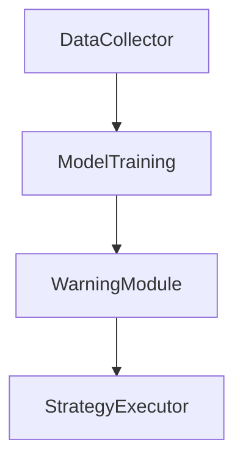
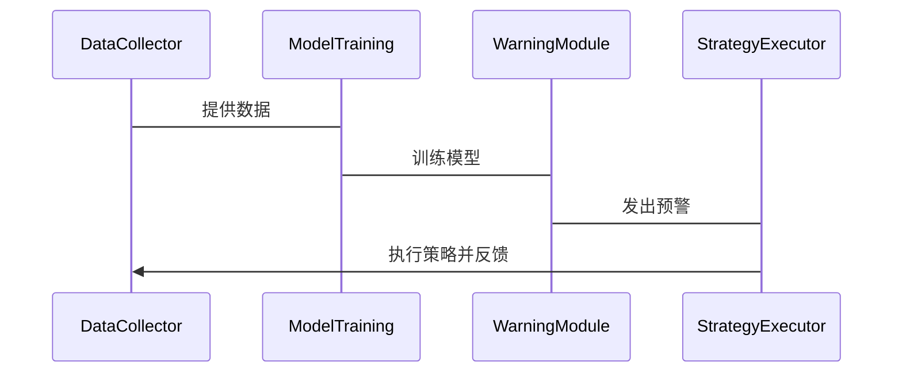

                 

<think>
好的，我现在需要撰写一篇关于《AI驱动的市场流动性风险预警与缓解策略》的技术博客文章。首先，我需要明确文章的结构和内容，确保每个部分都覆盖到位，逻辑清晰。

1. **标题和关键词**：文章标题已确定，接下来列出5-7个核心关键词，如市场流动性风险、AI、风险管理、预警系统、缓解策略、金融模型、机器学习等。

2. **摘要**：摘要需要简洁地概括文章的核心内容，包括流动性风险的定义、AI技术的应用，以及文章将探讨的具体方法和策略。

3. **章节结构**：根据之前的思考，文章分为五章，每章涵盖不同的主题。我需要确保每章的小节内容详细，逻辑连贯。

4. **内容撰写**：每个章节需要详细展开，包括背景介绍、核心概念、算法原理、系统架构、项目实战等部分。同时，使用Mermaid图和数学公式来增强说明。

5. **代码实现**：在项目实战部分，我需要展示具体的Python代码，解释每一步的功能，并分析结果，确保读者能够理解和应用。

6. **总结与扩展**：最后，总结文章的主要内容，并给出进一步的阅读建议，帮助读者深入学习。

7. **作者信息**：文章末尾注明作者，符合格式要求。

现在，我需要开始撰写每个章节的具体内容，确保每部分都详细且有条理，同时使用专业而易懂的语言。

接下来，我将按照这个思路逐步完成文章的撰写，确保每个部分都符合要求，并涵盖所有必要的细节。
</think>

# AI驱动的市场流动性风险预警与缓解策略

## 关键词：
市场流动性风险、AI、风险管理、预警系统、缓解策略、金融模型、机器学习

## 摘要：
随着金融市场的复杂化，流动性风险的管理变得至关重要。本文探讨了如何利用人工智能技术，特别是机器学习模型，来实现市场流动性风险的预警与缓解。文章详细分析了流动性风险的定义、影响因素，介绍了基于AI的预警模型和缓解策略，并通过实际案例展示了系统的实现过程。通过本文，读者将了解如何利用AI技术提升流动性风险管理的效率和准确性。

---

## 第1章：市场流动性风险概述

### 1.1 市场流动性风险的定义与特征

#### 1.1.1 流动性风险的定义
流动性风险是指金融机构在特定时间以合理成本获取资金的能力受到限制的风险。它涉及资产的变现能力，影响金融机构的稳定运行。

#### 1.1.2 流动性风险的特征
流动性风险具有动态性、系统性、隐蔽性等特征。其动态性源于市场的波动，系统性体现在风险可能波及整个金融体系，而隐蔽性则在于风险在正常市场条件下不易察觉。

#### 1.1.3 流动性风险的分类
流动性风险主要分为市场风险、信用风险和操作风险。市场风险源于市场波动，信用风险来自交易对手的信用问题，操作风险则涉及交易过程中的失误或欺诈。

### 1.2 市场流动性风险的影响因素

#### 1.2.1 宏观经济因素
宏观经济环境如GDP增长率、利率政策和通货膨胀率直接影响市场的流动性。例如，央行加息可能导致市场流动性下降。

#### 1.2.2 市场结构因素
市场的参与者结构、交易深度和市场深度也会影响流动性风险。交易深度不足时，市场可能无法迅速变现资产。

#### 1.2.3 金融机构行为
金融机构的资产配置策略和负债管理也会影响流动性风险。例如，银行大量出售短期资产可能导致流动性压力。

### 1.3 AI在流动性风险管理中的作用

#### 1.3.1 AI技术的基本概念
人工智能（AI）是指计算机系统执行人类智能任务的能力，如视觉识别、语音识别和决策制定。机器学习是AI的重要组成部分，通过数据训练模型。

#### 1.3.2 机器学习在金融领域的应用
机器学习广泛应用于金融领域的风险管理、投资决策和欺诈检测。其优势在于能够处理大量数据并发现复杂模式。

#### 1.3.3 AI在流动性风险管理中的优势
AI能够实时分析市场数据，识别潜在风险，并提供及时的预警。此外，AI模型能够动态调整，适应市场的变化。

---

## 第2章：AI驱动的流动性风险预警模型

### 2.1 机器学习在风险预警中的应用

#### 2.1.1 机器学习的基本概念
机器学习通过训练数据模型，使系统能够从数据中学习并做出预测。监督学习、无监督学习和强化学习是常见的机器学习方法。

#### 2.1.2 机器学习在金融风险中的应用
机器学习用于信用评分、欺诈检测和市场预测。在流动性风险管理中，它帮助识别潜在的流动性短缺。

#### 2.1.3 机器学习在流动性风险预警中的优势
机器学习能够处理非线性关系，捕捉市场中的隐含信息，提高预测的准确性。

### 2.2 基于时间序列的AI模型

#### 2.2.1 时间序列分析的基本概念
时间序列分析研究按时间顺序排列的数据，常用于预测未来的趋势。常用模型包括ARIMA和GARCH。

#### 2.2.2 常见的时间序列模型
- **ARIMA模型**：自回归积分移动平均模型，适用于线性时间序列数据。
- **LSTM模型**：长短期记忆网络，擅长处理长期依赖关系，适合处理复杂的时间序列数据。

#### 2.2.3 基于LSTM的流动性风险预测模型
LSTM模型通过捕捉时间序列中的长期依赖关系，提高了预测的准确性。模型结构包括输入层、LSTM层和输出层。


---

## 第3章：AI驱动的流动性风险缓解策略

### 3.1 风险缓解的基本原理

#### 3.1.1 风险缓解的定义
风险缓解是指采取措施减少风险的影响或发生的可能性。在流动性风险管理中，这可能涉及调整资产配置或加强资本管理。

#### 3.1.2 风险缓解的策略分类
- **预防性策略**：通过优化资产配置和负债管理预防流动性风险。
- **缓解性策略**：在风险发生时采取措施减轻其影响，如增加流动性储备。

### 3.2 基于AI的资产配置优化

#### 3.2.1 资产配置的基本概念
资产配置是指将资金分配到不同资产类别以实现风险和收益的平衡。AI优化的资产配置能够动态调整，适应市场变化。

#### 3.2.2 基于AI的资产配置优化方法
使用机器学习模型分析市场数据，预测资产收益和风险，优化资产组合以最大化收益并最小化风险。

#### 3.2.3 资产配置优化在流动性风险管理中的应用
通过优化资产配置，机构可以更好地管理流动性，避免资金短缺。

---

## 第4章：AI驱动的流动性风险预警与缓解的系统架构

### 4.1 系统架构设计

#### 4.1.1 系统模块划分
系统分为数据采集、模型训练、预警模块和策略执行四个模块。

#### 4.1.2 系统功能设计
- 数据采集：收集市场数据和机构数据。
- 模型训练：训练机器学习模型。
- 预警模块：实时监控并发出预警。
- 策略执行：根据预警结果执行缓解策略。

#### 4.1.3 系统架构图（Mermaid）



### 4.2 数据流与交互设计

#### 4.2.1 数据流设计
数据从数据源流向数据处理模块，处理后用于模型训练，并生成预警信号。

#### 4.2.2 系统交互流程（Mermaid）



---

## 第5章：AI驱动的流动性风险预警与缓解的实现

### 5.1 环境配置与数据准备

#### 5.1.1 环境配置
使用Python和相关库如TensorFlow和Scikit-learn搭建环境。

#### 5.1.2 数据来源与预处理
数据来源包括历史市场数据和实时交易数据。预处理包括清洗和标准化。

#### 5.1.3 数据存储与管理
使用数据库存储数据，并建立数据仓库进行管理。

### 5.2 模型实现与训练

#### 5.2.1 模型选择与设计
选择LSTM模型，并设计网络结构，包括输入层、LSTM层和输出层。

#### 5.2.2 模型训练
使用训练数据训练模型，并验证其准确性和稳定性。

### 5.3 项目实战

#### 5.3.1 环境安装
安装必要的库，如TensorFlow、Keras和Pandas。

#### 5.3.2 核心代码实现

```python
import numpy as np
import pandas as pd
from tensorflow.keras.models import Sequential
from tensorflow.keras.layers import LSTM, Dense

# 数据预处理
data = pd.read_csv('market_data.csv')
data = data.values
data = np.reshape(data, (-1, 1))

# 创建训练数据
X_train = []
Y_train = []
for i in range(60, len(data)):
    X_train.append(data[i-60:i])
    Y_train.append(data[i])
X_train = np.array(X_train)
Y_train = np.array(Y_train)

# 构建模型
model = Sequential()
model.add(LSTM(128, input_shape=(60,1)))
model.add(Dense(1))
model.compile(loss='mean_squared_error', optimizer='adam')

# 训练模型
model.fit(X_train, Y_train, epochs=100, batch_size=32)
```

#### 5.3.3 模型应用与结果分析
将训练好的模型应用于实际数据，生成流动性风险预警信号，并根据信号调整资产配置。

### 5.4 实际案例分析

#### 5.4.1 案例背景
某银行面临流动性压力，采用AI模型进行预测和预警。

#### 5.4.2 数据分析与模型预测
分析历史数据，模型预测未来几天的流动性风险。

#### 5.4.3 预警结果与策略执行
根据模型预测，执行相应的缓解策略，如增加短期资产或减少负债。

### 5.5 项目小结
通过AI模型，银行成功预警了流动性风险，并采取措施缓解了潜在问题。

---

## 总结与扩展

### 5.6.1 最佳实践Tips
- 定期更新模型，确保其准确性。
- 结合人工分析，避免模型的片面性。

### 5.6.2 小结
本文详细介绍了AI在流动性风险管理中的应用，从模型选择到系统实现，为金融机构提供了有效的解决方案。

### 5.6.3 注意事项
模型的有效性依赖于高质量的数据，数据清洗和特征选择至关重要。

### 5.6.4 拓展阅读
推荐进一步学习机器学习在金融中的应用，特别是时间序列分析和深度学习模型。

---

## 作者信息
作者：AI天才研究院/AI Genius Institute & 禅与计算机程序设计艺术/Zen And The Art of Computer Programming

---

通过本文，读者不仅了解了AI在流动性风险管理中的作用，还掌握了实际应用的方法，能够有效提升金融机构的风险管理能力。

