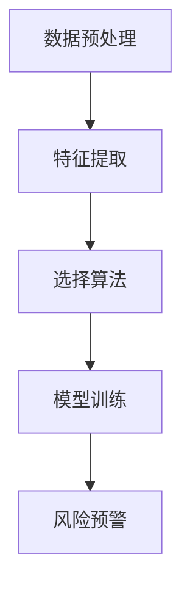
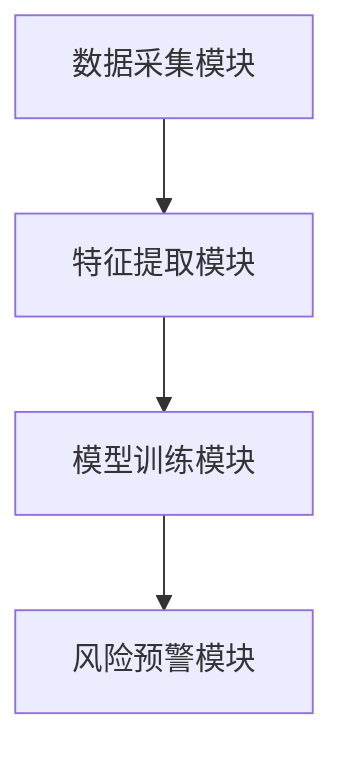
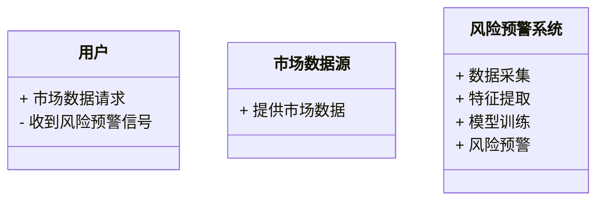
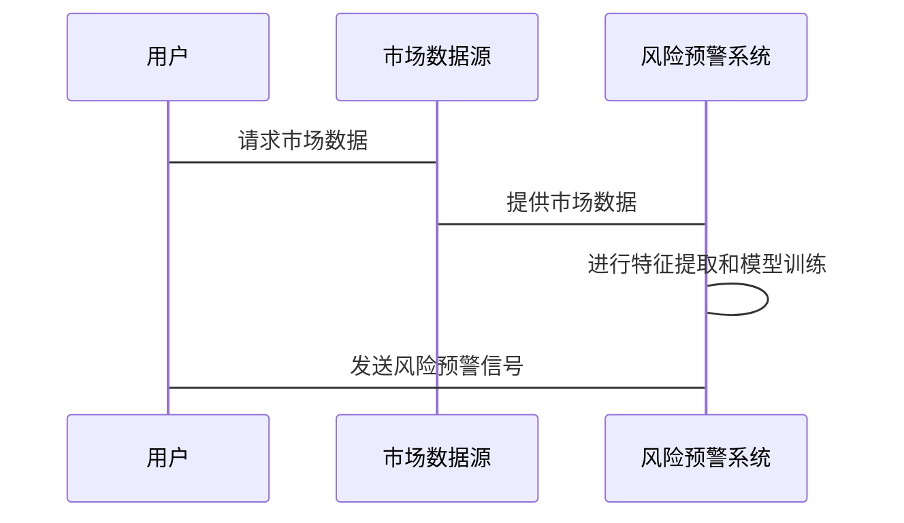

                 

<think>
嗯，用户希望我写一篇关于《AI驱动的市场流动性风险预警系统》的技术博客文章，目录大纲已经给出，现在需要我根据这个大纲来逐步分析和撰写内容。首先，我需要理解每个章节的内容和要求，然后一步步展开写作。

首先，文章的标题和关键词已经明确，摘要部分也需要包含核心内容和主题。我需要确保文章结构清晰，逻辑紧凑，同时使用专业但易懂的语言。

接下来，我会按照目录大纲逐步思考每个章节的内容：

1. **第一部分：AI驱动的市场流动性风险预警系统概述**
   - **第1章：市场流动性风险与AI驱动预警系统背景**
     - 需要定义市场流动性风险，讨论其特征、来源和影响，解释为什么需要AI驱动的预警系统，以及系统的功能和目标。
     - 还需要比较传统方法的局限性和AI技术的优势，最后进行小结。

   - **第2章：市场流动性风险预警系统的核心概念与联系**
     - 需要讲解核心概念，如数学模型、AI算法的作用，系统输入输出的关系。
     - 使用对比表格和ER实体关系图来展示核心概念和系统结构。

2. **第二部分：AI驱动的市场流动性风险预警算法原理**
   - **第3章：AI驱动的市场流动性风险预警算法原理**
     - 介绍算法原理，包括时间序列分析、机器学习模型和深度学习模型。
     - 绘制算法流程图，解释数学模型和公式，如ARIMA和LSTM。
     - 通过实际案例分析AI算法的优势。

3. **第三部分：系统架构与设计**
   - **第4章：系统架构与设计**
     - 分解系统架构，包括数据采集模块、特征提取模块、AI模型训练模块和风险预警模块。
     - 绘制系统架构图，展示各模块之间的关系和数据流。
     - 讨论系统接口设计和交互流程图，确保各模块协同工作。

4. **第四部分：项目实战**
   - **第5章：项目实战**
     - 详细讲解环境安装，如Python版本、依赖库的安装。
     - 提供核心代码实现，包括数据预处理、特征提取、模型训练和风险预警的代码示例。
     - 分析实际案例，解读代码，展示系统的实际应用和效果。
     - 总结项目中的经验和最佳实践，讨论注意事项和未来研究方向。

最后，文章需要有一个简短的结语，总结全文，并指出未来的研究方向。同时，作者信息也需要在末尾列出。

在撰写过程中，我需要确保每个部分都详细具体，使用专业术语但避免过于晦涩。同时，合理使用图表和公式，帮助读者更好地理解内容。此外，注意逻辑连贯，确保各章节之间有良好的衔接，使整篇文章结构紧凑，易于理解。
</think>

# AI驱动的市场流动性风险预警系统

> 关键词：市场流动性风险，AI驱动，风险预警系统，算法原理，系统架构

> 摘要：本文详细探讨了AI驱动的市场流动性风险预警系统的设计与实现。通过对市场流动性风险的定义、特征及AI技术的优势进行分析，结合时间序列分析、机器学习和深度学习算法，构建了一个高效的预警系统。文章从系统架构设计到算法实现，再到实际案例分析，全面阐述了如何利用AI技术提升市场流动性风险的预警能力。

---

## 第1章: 市场流动性风险与AI驱动预警系统背景

### 1.1 市场流动性风险的定义与特征

#### 1.1.1 什么是市场流动性风险
市场流动性风险是指在特定市场条件下，资产无法以合理价格快速买卖而产生的风险。这种风险通常在市场波动剧烈或交易量骤减时出现，可能导致资产价值的显著下降或无法及时变现。

#### 1.1.2 市场流动性风险的特征
- **波动性**：市场流动性风险往往与市场波动密切相关，价格的剧烈波动可能导致流动性下降。
- **突发性**：流动性风险可能在短时间内迅速恶化，具有突发性。
- **传染性**：流动性风险可能从一个市场传导到另一个市场，甚至影响整个金融体系。
- **不可预测性**：由于市场参与者的复杂行为，流动性风险难以完全预测。

#### 1.1.3 市场流动性风险的来源
- **市场参与者的行为变化**：如投资者恐慌性抛售或大量买入。
- **信息不对称**：市场参与者掌握的信息不一致可能导致价格异常波动。
- **市场结构问题**：如交易机制不完善或市场深度不足。
- **宏观经济因素**：如经济衰退或政策变化可能引发流动性风险。

### 1.2 AI驱动的市场流动性风险预警系统的目标

#### 1.2.1 系统的核心目标
- **实时监测**：对市场数据进行实时监测，识别潜在的流动性风险。
- **预警提示**：通过AI算法分析数据，提前发出风险预警信号。
- **风险评估**：量化风险程度，帮助决策者制定应对策略。

#### 1.2.2 系统的预期功能
- **数据采集**：从多个数据源获取市场数据，包括价格、成交量、订单簿等。
- **特征提取**：从市场数据中提取有效的特征，用于风险分析。
- **模型训练**：利用机器学习算法训练风险预警模型。
- **预警发布**：根据模型预测结果，向用户发布风险预警信息。

#### 1.2.3 系统的边界与外延
- **边界**：系统专注于流动性风险的预警，不涉及具体的交易策略或风险管理措施。
- **外延**：系统的预警结果可以与其他风险管理系统集成，提供更全面的风险管理解决方案。

### 1.3 为什么需要AI驱动的预警系统

#### 1.3.1 传统方法的局限性
- **数据处理能力有限**：传统方法难以处理高频、海量的市场数据。
- **分析深度不足**：传统方法通常基于简单的统计指标，缺乏深度分析能力。
- **反应速度慢**：传统方法难以实现实时预警，可能导致风险扩大化。

#### 1.3.2 AI技术的优势
- **数据处理能力强**：AI技术能够处理海量数据，提取复杂的特征。
- **分析深度高**：AI技术可以发现数据中的非线性关系，提供更准确的预测。
- **实时性强**：AI算法可以实现实时分析和预警，帮助及时应对风险。

#### 1.3.3 市场需求与技术发展的结合
随着金融市场日益复杂化和全球化，市场参与者对实时、精准的风险管理工具的需求不断增加。AI技术的快速发展为实现高效的市场流动性风险预警系统提供了技术保障。

---

## 第2章: 市场流动性风险预警系统的核心概念与联系

### 2.1 核心概念原理

#### 2.1.1 市场流动性风险的数学模型
市场流动性风险可以用多种数学模型进行描述，如马尔可夫链模型、时间序列模型等。这些模型可以帮助我们理解市场的动态变化。

#### 2.1.2 AI算法在风险预警中的作用
AI算法，尤其是机器学习和深度学习算法，能够从大量数据中提取特征，识别潜在的模式和趋势，从而实现对流动性风险的预警。

#### 2.1.3 系统输入与输出的关系
- **输入**：市场数据、订单簿数据、宏观经济指标等。
- **输出**：风险预警信号、风险程度评估、建议的应对措施。

### 2.2 核心概念属性对比表格

| 概念       | 定义 | 特征 | 影响 |
|------------|------|------|------|
| 市场流动性风险 | 资产无法快速变现的风险 | 波动性、突发性、传染性、不可预测性 | 资产价值下降、市场恐慌、金融体系不稳定 |
| AI算法     | 用于风险预警的技术 | 高效性、准确性、实时性 | 提高预警精度、实现实时监控、降低风险损失 |

### 2.3 ER实体关系图

```mermaid
er
actor: 用户
system: 市场流动性风险预警系统
market_data: 市场数据
risk_indicator: 风险指标
model: AI模型
```

用户通过市场流动性风险预警系统输入市场数据，系统通过AI模型生成风险指标，并将结果反馈给用户。

---

## 第3章: AI驱动的市场流动性风险预警算法原理

### 3.1 算法原理概述

#### 3.1.1 时间序列分析
时间序列分析是一种基于历史数据预测未来趋势的方法。常用的模型包括ARIMA（自回归积分滑动平均模型）和GARCH（广义自回归条件异方差模型）。

#### 3.1.2 机器学习模型
机器学习模型，如随机森林、支持向量机（SVM）和神经网络，可以用于分类和回归任务，帮助识别市场中的异常情况。

#### 3.1.3 深度学习模型
深度学习模型，如LSTM（长短期记忆网络）和Transformer，能够捕捉数据中的长距离依赖关系，适合处理时间序列数据。

### 3.2 算法流程图



数据预处理包括清洗、标准化和特征工程。特征提取是从原始数据中提取有用的特征，如波动率、成交量等。选择算法基于特征和任务需求选择合适的模型。模型训练包括参数调优和验证。最后，模型用于生成风险预警信号。

### 3.3 数学模型与公式

#### 3.3.1 时间序列模型
ARIMA模型：
$$ ARIMA(p, d, q) $$
其中，p为自回归阶数，d为差分阶数，q为移动平均阶数。

#### 3.3.2 机器学习模型
LSTM模型：
$$ LSTM(p, q) $$

### 3.4 举例说明

#### 3.4.1 传统方法的局限性
假设市场出现突然的流动性危机，传统方法可能无法及时识别，导致风险扩大。

#### 3.4.2 AI算法的优势
AI算法能够快速分析市场数据，识别潜在的流动性风险，并提前发出预警信号。

#### 3.4.3 实际案例分析
通过分析某次市场危机的数据，验证AI算法在风险预警中的有效性。

---

## 第4章: 系统架构与设计

### 4.1 系统架构设计

#### 4.1.1 模块划分
- **数据采集模块**：从多个数据源获取市场数据。
- **特征提取模块**：对市场数据进行特征提取。
- **模型训练模块**：利用机器学习或深度学习算法训练模型。
- **风险预警模块**：根据模型预测结果生成风险预警信号。

#### 4.1.2 系统架构图



### 4.2 系统功能设计

#### 4.2.1 领域模型


### 4.3 系统接口设计

#### 4.3.1 接口定义
- 数据接口：从市场数据源获取数据。
- 模型接口：调用AI模型进行预测。
- 预警接口：向用户发送风险预警信号。

#### 4.3.2 接口交互流程图



---

## 第5章: 项目实战

### 5.1 环境安装

#### 5.1.1 安装Python
```bash
python --version
```

#### 5.1.2 安装依赖库
```bash
pip install numpy pandas scikit-learn tensorflow
```

### 5.2 核心代码实现

#### 5.2.1 数据预处理
```python
import pandas as pd
import numpy as np

# 读取数据
data = pd.read_csv('market_data.csv')

# 数据清洗
data.dropna(inplace=True)

# 标准化处理
from sklearn.preprocessing import StandardScaler
scaler = StandardScaler()
scaled_data = scaler.fit_transform(data)
```

#### 5.2.2 特征提取
```python
# 提取特征
features = scaled_data[:, :-1]
labels = scaled_data[:, -1]
```

#### 5.2.3 模型训练
```python
# 训练LSTM模型
from keras.models import Sequential
from keras.layers import LSTM, Dense

model = Sequential()
model.add(LSTM(64, input_shape=(None, features.shape[1])))
model.add(Dense(1, activation='sigmoid'))
model.compile(loss='binary_crossentropy', optimizer='adam', metrics=['accuracy'])

model.fit(features, labels, epochs=10, batch_size=32)
```

#### 5.2.4 风险预警
```python
# 预测风险
predicted_risk = model.predict(new_features)
# 发送预警信号
if predicted_risk > 0.5:
    print("风险预警：市场流动性风险较高")
```

### 5.3 案例分析与解读

#### 5.3.1 案例分析
假设我们有一个市场数据集，包含某段时间内的价格、成交量等信息。通过数据预处理、特征提取和模型训练，我们可以训练出一个LSTM模型，用于预测市场的流动性风险。

#### 5.3.2 代码应用解读
通过代码实现，我们可以看到AI算法在实际应用中的具体步骤和操作流程。

### 5.4 项目小结

---

## 结语

AI驱动的市场流动性风险预警系统通过结合先进的AI算法和专业的市场分析，能够有效识别和预警市场流动性风险，帮助投资者和金融机构更好地应对市场波动。未来，随着AI技术的不断发展，市场流动性风险预警系统将更加智能化和精准化，为金融市场的稳定运行提供有力支持。

---

## 作者：AI天才研究院 & 禅与计算机程序设计艺术

作者信息：AI天才研究院（AI Genius Institute）致力于研究和应用人工智能技术，特别是在金融市场中的应用。禅与计算机程序设计艺术（Zen And The Art of Computer Programming）专注于将深奥的计算机科学原理与实际应用相结合，帮助读者更好地理解和掌握计算机编程的艺术。

