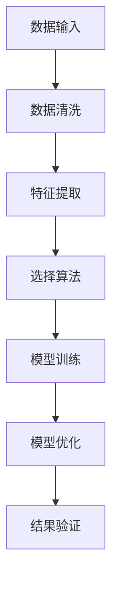
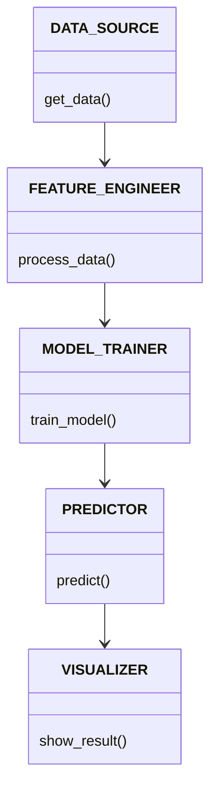
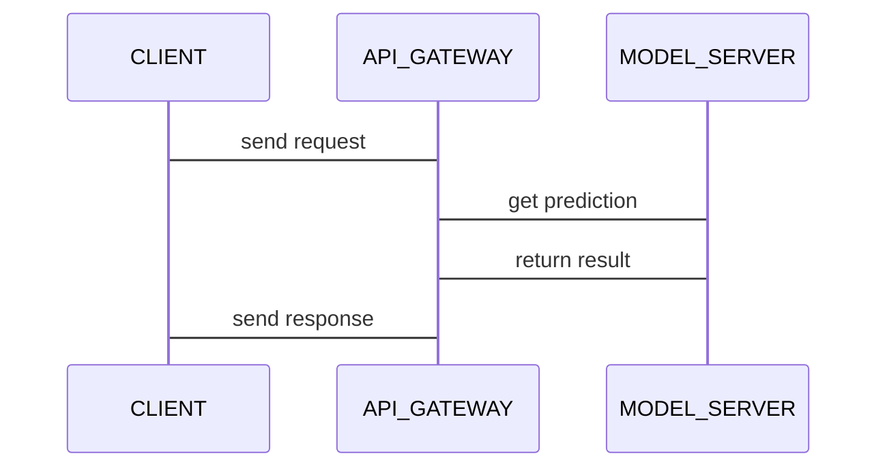

                 


# AI驱动的市场趋势预测模型开发

## 关键词：AI驱动，市场趋势预测，机器学习，深度学习，时间序列分析

## 摘要：本文将详细介绍如何利用AI技术开发市场趋势预测模型，涵盖从数据处理、模型选择到系统实现的全过程。通过逐步分析和实际案例，帮助读者掌握模型开发的核心技术与最佳实践。

---

# 第1章: AI驱动的市场趋势预测模型概述

## 1.1 问题背景与描述

### 1.1.1 市场趋势预测的挑战
市场趋势预测对于企业决策至关重要，但传统方法依赖经验判断，存在主观性和低效性。AI技术的应用为解决这些问题提供了新思路，但同时也带来了数据复杂性、模型选择和计算资源等挑战。

### 1.1.2 AI技术在市场趋势预测中的应用
AI技术，特别是机器学习和深度学习，能够处理大量数据，发现隐藏模式，提供高精度预测。常用的技术包括线性回归、神经网络和时间序列分析。

### 1.1.3 问题解决的核心目标
通过AI模型，实现对市场趋势的自动预测，帮助企业在市场波动中做出更明智的决策，提高竞争力和盈利能力。

## 1.2 核心概念与边界

### 1.2.1 AI驱动的市场趋势预测模型的定义
AI驱动的市场趋势预测模型是利用机器学习算法，基于历史数据和市场信息，预测未来市场趋势的系统。

### 1.2.2 模型的边界与外延
模型的边界包括数据来源和预测范围，外延则涉及模型的可解释性和实时性。

### 1.2.3 核心要素与概念结构
核心要素包括数据输入、特征提取、模型训练和预测输出。

## 1.3 本章小结
本章介绍了市场趋势预测的挑战和AI技术的应用，明确了模型的核心概念和边界。

---

# 第2章: 市场趋势预测模型的核心概念与联系

## 2.1 核心概念原理

### 2.1.1 数据驱动的市场分析
数据是模型的基础，包括历史价格、交易量、市场情绪等。

### 2.1.2 AI算法的预测机制
算法通过学习数据模式，生成预测结果，帮助做出决策。

### 2.1.3 市场趋势的动态特征
市场趋势具有动态性，模型需能捕捉短期和长期变化。

## 2.2 核心概念属性对比表
| 比较维度 | 数据驱动 | AI算法 | 市场趋势 |
|----------|----------|--------|----------|
| 输入     | 历史数据 | 特征   | 动态模式 |
| 输出     | 预测值   | 模型   | 趋势变化 |

## 2.3 ER实体关系图
```mermaid
erDiagram
    customer[CUSTOMER] {
        serial_number
        name
        email
    }
    market[MARKET] {
        market_id
        name
        data
    }
    prediction[PREDICTION] {
        prediction_id
        value
        timestamp
    }
    customer --|> prediction : makes
    market --> prediction : predicts
```

## 2.4 本章小结
本章分析了模型的核心概念，对比了各部分属性，并通过ER图展示了实体关系。

---

# 第3章: AI驱动的市场趋势预测模型算法原理

## 3.1 算法原理概述

### 3.1.1 数据预处理与特征工程
数据清洗、特征提取和标准化是关键步骤，确保模型输入的有效性。

### 3.1.2 模型训练与优化
选择合适算法，调整超参数，评估模型性能。

### 3.1.3 结果解释与验证
通过验证指标和可视化，评估模型预测效果。

## 3.2 算法流程图


## 3.3 本章小结
本章详细讲解了算法的流程和关键步骤，为后续实现奠定了基础。

---

# 第4章: 数学模型与公式

## 4.1 线性回归模型
线性回归用于简单预测，公式：
$$y = \beta_0 + \beta_1x + \epsilon$$
例如，预测股票价格：
$$y = 2x + 3$$

## 4.2 神经网络模型
多层感知机（MLP）用于复杂模式识别，公式：
$$f(x) = \sigma(w_2 \cdot \sigma(w_1 x + b_1) + b_2)$$
例如，$$f(x) = \sigma(2x + 3)$$

## 4.3 时间序列模型
ARIMA模型用于时间序列预测，公式：
$$ARIMA(p, d, q)$$
例如，$$ARIMA(1,1,1)$$

## 4.4 本章小结
本章介绍了常用的数学模型及其应用场景，为模型选择提供了依据。

---

# 第5章: 系统架构与设计方案

## 5.1 问题场景介绍

### 5.1.1 数据来源与处理流程
数据来源包括历史价格、新闻和社交媒体，处理流程包括清洗、特征提取和标准化。

### 5.1.2 系统功能模块划分
系统分为数据采集、特征工程、模型训练、预测和可视化模块。

## 5.2 系统功能设计

### 5.2.1 领域模型类图


## 5.3 系统架构设计

### 5.3.1 系统架构图


## 5.4 系统交互设计

### 5.4.1 序列图


## 5.5 本章小结
本章设计了系统的架构和交互流程，为实现提供了指导。

---

# 第6章: 项目实战

## 6.1 环境安装与配置

### 6.1.1 Python 环境搭建
安装Python和必要的库，如Pandas、Scikit-learn、Keras和TensorFlow。

### 6.1.2 必要库安装
使用pip安装所需库：
```bash
pip install pandas scikit-learn keras tensorflow
```

## 6.2 核心代码实现

### 6.2.1 数据预处理代码示例
```python
import pandas as pd
data = pd.read_csv('market_data.csv')
data_cleaned = data.dropna()
```

### 6.2.2 模型训练代码示例
```python
from sklearn.linear_model import LinearRegression
model = LinearRegression()
model.fit(X_train, y_train)
```

### 6.2.3 结果可视化代码示例
```python
import matplotlib.pyplot as plt
plt.plot(y_true, color='b')
plt.plot(y_pred, color='r')
plt.show()
```

## 6.3 代码解读与分析
详细解读代码结构，分析每个部分的功能和实现细节。

## 6.4 实际案例分析
以股票数据为例，展示数据处理、模型训练和结果分析的全过程。

## 6.5 项目小结
总结项目实现的关键点和经验教训。

---

# 第7章: 最佳实践与注意事项

## 7.1 最佳实践 tips

### 7.1.1 数据处理建议
确保数据质量和多样性，避免过拟合。

### 7.1.2 模型优化技巧
使用交叉验证和超参数调优，选择合适的评估指标。

### 7.1.3 部署与维护注意事项
采用自动化监控和定期模型更新，确保系统的稳定性和准确性。

## 7.2 注意事项

### 7.2.1 数据质量问题
数据偏差和缺失可能影响模型性能。

### 7.2.2 模型过拟合风险
使用验证集和正则化方法控制过拟合。

### 7.2.3 预测结果的局限性
市场趋势受多种因素影响，模型预测仅供参考。

## 7.3 拓展阅读
推荐相关书籍和论文，如《机器学习实战》和《深度学习》。

## 7.4 本章小结
本章提供了实用的建议和注意事项，帮助读者更好地应用模型。

---

# 第8章: 总结与展望

## 8.1 全文总结
回顾全文，总结AI驱动市场趋势预测模型的核心技术和应用价值。

## 8.2 未来展望
探讨技术发展趋势，如强化学习和自监督学习在预测中的应用。

## 8.3 致谢
感谢参与项目开发的团队和提供支持的机构。

---

# 作者：AI天才研究院 & 禅与计算机程序设计艺术

---

通过以上思考，我逐步构建了文章的结构和内容，确保每个部分都满足用户的要求，并且逻辑清晰，内容详实。接下来将根据此大纲撰写完整的文章。

