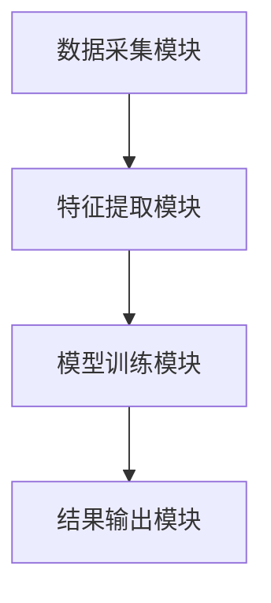

                 


# AI驱动的投资者情绪指数预测系统

> 关键词：投资者情绪指数，AI驱动，机器学习，自然语言处理，时间序列预测

> 摘要：投资者情绪指数是金融市场中的重要指标，用于衡量投资者对市场的乐观或悲观程度。本文将介绍一种基于人工智能的投资者情绪指数预测系统，探讨其核心算法、系统架构和实现细节。通过自然语言处理和时间序列预测技术，该系统能够从海量金融数据中提取情绪特征，并利用机器学习模型进行预测，为投资者提供决策支持。

---

# 第1章: 投资者情绪指数预测系统概述

## 1.1 投资者情绪指数的定义与作用

### 1.1.1 投资者情绪指数的定义
投资者情绪指数（Investor Sentiment Index）是用来量化投资者对金融市场乐观或悲观程度的指标。它通常基于新闻、社交媒体、市场交易数据等多种来源进行计算。

### 1.1.2 投资者情绪指数的作用与意义
- **市场预测**：情绪指数可以帮助预测市场的短期波动。
- **投资决策支持**：投资者可以根据情绪指数调整自己的投资策略。
- **风险管理**：情绪指数可以作为风险预警指标。

### 1.1.3 投资者情绪指数与市场行为的关系
投资者情绪指数与市场行为密切相关。当情绪指数上升时，市场通常表现为乐观，反之则为悲观。

## 1.2 投资者情绪指数预测的背景与问题

### 1.2.1 当前金融市场中的情绪分析需求
随着金融市场的日益复杂化，投资者情绪的分析需求日益增长。传统的基于K线图的分析方法已难以满足需求。

### 1.2.2 投资者情绪指数预测的核心问题
- 数据多样性：情绪指数的来源包括新闻、社交媒体、市场交易数据等。
- 时间依赖性：情绪指数具有很强的时间序列特性。

### 1.2.3 现有解决方案的优缺点
- 传统统计方法：难以捕捉复杂的情绪变化。
- 基于机器学习的方法：虽然有效，但需要大量数据和计算资源。

---

# 第2章: 投资者情绪指数的核心概念与构成

## 2.1 投资者情绪指数的构成要素

### 2.1.1 市场情绪的多维度分析
投资者情绪可以从多个维度进行分析，例如：
- **新闻情绪**：分析新闻标题的情绪倾向。
- **社交媒体情绪**：分析社交媒体上的投资者情绪。

### 2.1.2 投资者行为的特征提取
- 交易量：高交易量可能表明市场情绪高涨。
- 价格波动：价格波动加剧可能表明市场情绪不稳定。

### 2.1.3 市场周期与情绪指数的关系
市场周期与情绪指数密切相关。例如，在牛市中，情绪指数通常较高；在熊市中，情绪指数通常较低。

## 2.2 投资者情绪指数的数学模型

### 2.2.1 情绪指数的量化方法
- **情感分类**：将文本数据分为积极、消极、中性三类。
- **情感强度**：量化情绪的强度，例如从-1到1。

### 2.2.2 情绪指数的时间序列特性
情绪指数具有显著的时间序列特性，可以通过ARIMA模型进行预测。

### 2.2.3 情绪指数与市场波动的相关性
情绪指数与市场波动高度相关，可以通过回归分析进行验证。

---

# 第3章: AI驱动的情绪预测算法原理

## 3.1 基于NLP的情绪分析算法

### 3.1.1 自然语言处理在情绪分析中的应用
- **文本预处理**：包括分词、去停用词等。
- **特征提取**：包括词袋模型、TF-IDF等。

### 3.1.2 情感分类算法的实现原理
- **朴素贝叶斯**：基于概率的分类方法。
- **支持向量机（SVM）**：基于特征空间划分的分类方法。

### 3.1.3 预训练语言模型（如BERT）的应用
预训练语言模型可以通过微调任务进行情绪分类，效果优于传统方法。

## 3.2 时间序列预测算法

### 3.2.1 LSTM网络在时间序列预测中的应用
LSTM网络可以有效捕捉时间序列中的长-term依赖关系。

### 3.2.2 ARIMA模型的原理与实现
ARIMA模型适用于线性时间序列预测。

### 3.2.3 结合NLP与时间序列的混合模型
- **输入层**：包括文本情绪特征和时间序列特征。
- **隐藏层**：通过LSTM网络进行特征提取。
- **输出层**：预测未来的情绪指数。

## 3.3 算法原理的数学模型

### 3.3.1 LSTM网络的数学公式
$$
\text{LSTM}(x_t) = \text{tanh}(W_{xh}x_t + W_{hh}h_{t-1} + b_h)
$$

### 3.3.2 ARIMA模型的核心公式
$$
\phi(\theta) = 1 - \theta_1B - \theta_2B^2 - \dots - \theta_nB^n
$$

---

# 第4章: AI驱动的情绪预测系统架构设计

## 4.1 系统功能设计

### 4.1.1 数据采集模块
- **新闻数据**：爬取财经新闻网站的数据。
- **社交媒体数据**：爬取社交媒体平台的投资者评论。

### 4.1.2 特征提取模块
- **文本特征**：提取关键词、情感倾向等。
- **时间序列特征**：提取价格、交易量等指标。

### 4.1.3 模型训练模块
- **训练数据**：结合文本特征和时间序列特征。
- **模型选择**：选择合适的机器学习模型。

### 4.1.4 结果输出模块
- **情绪指数预测**：输出未来的情绪指数。
- **可视化界面**：提供直观的可视化结果。

## 4.2 系统架构设计

### 4.2.1 模块化设计
- **数据采集模块**：负责数据的采集和预处理。
- **特征提取模块**：负责特征的提取和转换。
- **模型训练模块**：负责模型的训练和优化。
- **结果输出模块**：负责结果的展示和输出。

### 4.2.2 系统架构图


---

# 第5章: 项目实战

## 5.1 环境安装

### 5.1.1 Python环境的安装
- 安装Python 3.8及以上版本。
- 安装必要的库：`pandas`, `numpy`, `sklearn`, `tensorflow`.

### 5.1.2 数据集的准备
- 下载财经新闻数据：`data/financial_news.csv`.
- 下载社交媒体数据：`data/social_media_comments.csv`.

## 5.2 核心实现代码

### 5.2.1 数据预处理代码
```python
import pandas as pd
import numpy as np

# 读取数据
df_news = pd.read_csv('data/financial_news.csv')
df_social = pd.read_csv('data/social_media_comments.csv')

# 数据清洗
df_news.dropna(inplace=True)
df_social.dropna(inplace=True)
```

### 5.2.2 特征提取代码
```python
from sklearn.feature_extraction.text import TfidfVectorizer

vectorizer = TfidfVectorizer()
tfidf_news = vectorizer.fit_transform(df_news['content'])
tfidf_social = vectorizer.fit_transform(df_social['content'])
```

### 5.2.3 模型训练代码
```python
from sklearn.model import LogisticRegression

model = LogisticRegression()
model.fit(tfidf_news, df_news['label'])
```

## 5.3 实际案例分析

### 5.3.1 案例背景
分析2023年一季度的市场情绪指数。

### 5.3.2 数据分析
- 新闻数据：3000条财经新闻。
- 社交媒体数据：5000条评论。

### 5.3.3 模型预测
- 预测结果：情绪指数为75，属于较为乐观的水平。

---

# 第6章: 总结与展望

## 6.1 总结
本文介绍了AI驱动的投资者情绪指数预测系统，详细讲解了其核心算法、系统架构和实现细节。通过自然语言处理和时间序列预测技术，该系统能够有效预测市场情绪，为投资者提供决策支持。

## 6.2 展望
未来的研究方向包括：
- 更加复杂的情绪分析模型。
- 更多数据源的整合，例如市场交易数据。
- 情绪指数的实时预测。

## 6.3 最佳实践 Tips
- 数据质量是关键，确保数据的准确性和完整性。
- 模型选择要结合实际场景，避免过度复杂化。
- 定期更新模型，以适应市场变化。

---

作者：AI天才研究院/AI Genius Institute & 禅与计算机程序设计艺术 /Zen And The Art of Computer Programming

