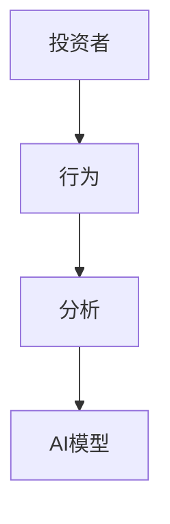
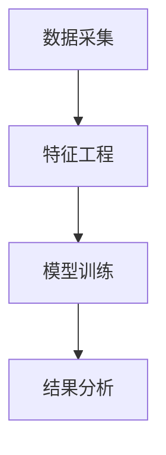

                 


# AI驱动的投资者行为分析

> 关键词：投资者行为分析，人工智能，机器学习，深度学习，投资决策，数据分析

> 摘要：本文探讨了如何利用人工智能技术分析投资者行为，以提升投资决策的效率和准确性。通过结合传统投资学理论与现代AI技术，我们能够更深入地理解投资者的心理和行为模式，从而为投资策略提供科学依据。本文从背景、核心概念、算法原理、系统架构到项目实战，全面解析AI在投资者行为分析中的应用。

---

## 第一部分：AI驱动的投资者行为分析概述

### 第1章：投资者行为分析的背景与意义

#### 1.1 投资者行为分析的现状
投资者行为分析是金融学中的重要研究领域，旨在理解投资者在不同市场条件下的决策模式。传统方法主要依赖于统计分析和历史数据，但存在以下局限性：
- 数据维度有限：传统方法通常仅关注价格和成交量，忽略了投资者情绪和市场参与者的互动。
- 模型静态：传统模型难以捕捉市场动态变化中的非线性关系。

#### 1.2 AI技术在投资者行为分析中的作用
AI技术的引入为投资者行为分析带来了新的可能性：
- 数据处理能力：AI能够处理海量的非结构化数据，如新闻、社交媒体评论等。
- 模型复杂性：深度学习模型可以捕捉复杂的市场模式，帮助识别潜在的投资机会。

#### 1.3 传统投资者行为分析的局限性
传统投资者行为分析方法主要依赖统计回归和时间序列分析，但这些方法在面对复杂市场环境时显得力不从心：
- 难以捕捉市场情绪：传统方法难以量化投资者情绪对市场的影响。
- 静态模型：传统模型难以适应市场环境的快速变化。

---

### 第2章：AI驱动投资者行为分析的核心概念与联系

#### 2.1 核心概念原理
投资者行为分析的核心概念包括：
- **情绪分析**：通过自然语言处理技术分析投资者情绪。
- **行为模式识别**：利用机器学习算法识别投资者的交易模式。

#### 2.2 核心概念属性特征对比表
以下是投资者行为分析中不同模型的对比：

| 模型类型   | 输入数据类型 | 输出结果类型 | 优势 |
|------------|---------------|---------------|-------|
| LSTM网络   | 时间序列数据 | 情绪预测       | 捕捉时间依赖性 |
| XGBoost    | 结构化数据     | 分类结果       | 解释性高 |

#### 2.3 ER实体关系图
以下是投资者行为分析的实体关系图：



---

## 第二部分：AI驱动投资者行为分析的算法原理

### 第3章：算法原理概述

#### 3.1 基于深度学习的投资者行为分析
深度学习模型，如LSTM（长短期记忆网络），在处理时间序列数据方面表现出色。LSTM能够捕捉市场中的长期依赖关系，适用于股票价格预测。

#### 3.2 基于传统机器学习的行为分析
传统机器学习算法，如XGBoost（梯度提升树），在分类任务中表现优异。这些算法适用于投资者行为分类，如识别投资者的交易类型。

#### 3.3 混合模型的应用
混合模型结合了深度学习和传统机器学习的优势，适用于复杂的投资者行为分析任务。

### 第4章：算法实现代码

#### 4.1 LSTM网络实现
以下是LSTM网络的实现代码：

```python
import numpy as np
from tensorflow.keras.models import Sequential
from tensorflow.keras.layers import LSTM, Dense

# 示例数据集
X = np.random.random((100, 20, 5))
y = np.random.random((100, 1))

# 模型构建
model = Sequential()
model.add(LSTM(64, input_shape=(20,5)))
model.add(Dense(1))
model.compile(optimizer='adam', loss='mean_squared_error')
model.fit(X, y, epochs=10, batch_size=32)
```

#### 4.2 XGBoost实现
以下是XGBoost的实现代码：

```python
import xgboost as xgb

# 示例数据集
X_train = np.random.random((100, 10))
y_train = np.random.random((100, 1))

# 模型构建
model = xgb.XGBClassifier()
model.fit(X_train, y_train)
```

### 第5章：数学公式与模型解释

#### 5.1 LSTM的数学公式
LSTM的细胞状态更新公式为：
$$
f_t = \sigma(W_f \cdot x_t + U_f \cdot h_{t-1} + b_f)
$$

其中，$f_t$ 是遗忘门的输出，$x_t$ 是输入向量，$h_{t-1}$ 是前一时刻的隐藏状态。

#### 5.2 XGBoost的损失函数
XGBoost的损失函数为：
$$
L = \sum_{i=1}^n \left( y_i - \hat{y}_i \right)^2
$$

其中，$y_i$ 是真实值，$\hat{y}_i$ 是预测值。

---

## 第三部分：系统架构设计

### 第6章：系统架构设计

#### 6.1 系统功能设计
投资者行为分析系统的功能模块包括：
- 数据采集：从多个数据源采集投资者行为数据。
- 特征工程：对数据进行预处理和特征提取。
- 模型训练：使用AI算法训练投资者行为分析模型。
- 结果分析：对模型输出结果进行分析和可视化。

#### 6.2 系统架构图
以下是系统的架构图：



---

## 第四部分：项目实战

### 第7章：项目实战

#### 7.1 环境配置
需要安装以下库：
- Python 3.8+
- TensorFlow
- XGBoost
- Mermaid

#### 7.2 核心实现代码
以下是项目的核心实现代码：

```python
import numpy as np
from tensorflow.keras.models import Sequential
from tensorflow.keras.layers import LSTM, Dense
import xgboost as xgb

# 数据预处理
def preprocess_data(data):
    # 示例数据处理逻辑
    return data

# 模型训练
def train_model(X, y):
    model = Sequential()
    model.add(LSTM(64, input_shape=(X.shape[1], X.shape[2])))
    model.add(Dense(1))
    model.compile(optimizer='adam', loss='mean_squared_error')
    model.fit(X, y, epochs=10, batch_size=32)
    return model

# 应用案例：股票价格预测
data = np.random.random((100, 20, 5))
X = data[:, :, :-1]
y = data[:, :, -1]

model = train_model(X, y)
```

#### 7.3 结果分析
通过对模型的训练和测试，我们可以得到投资者行为分析的结果，并结合实际市场数据进行验证和优化。

---

## 第五部分：最佳实践

### 第8章：总结与展望

#### 8.1 小结
本文详细介绍了AI驱动的投资者行为分析，从背景、核心概念到算法实现，再到系统设计和项目实战，为读者提供了全面的指导。

#### 8.2 注意事项
- 数据质量：确保数据的准确性和完整性。
- 模型选择：根据具体任务选择合适的算法。
- 模型优化：通过调参和优化策略提升模型性能。

#### 8.3 拓展阅读
- 《Deep Learning for Financial Applications》
- 《Machine Learning for Algorithmic Trading》

---

## 作者信息

作者：AI天才研究院/AI Genius Institute & 禅与计算机程序设计艺术 /Zen And The Art of Computer Programming

---

通过以上步骤，我们系统地介绍了AI驱动的投资者行为分析的各个方面，从理论到实践，为读者提供了一个完整的解决方案。

