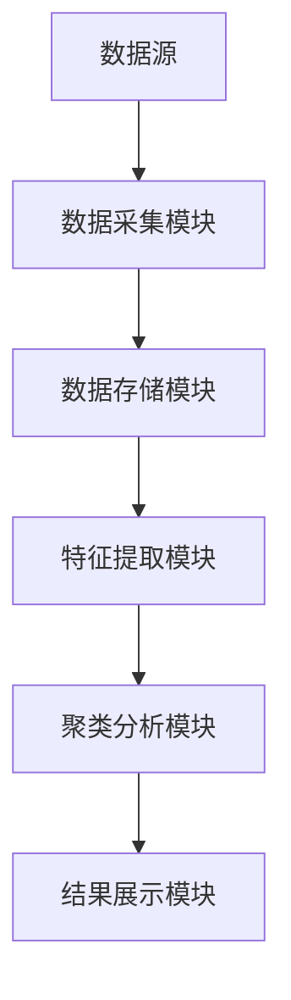
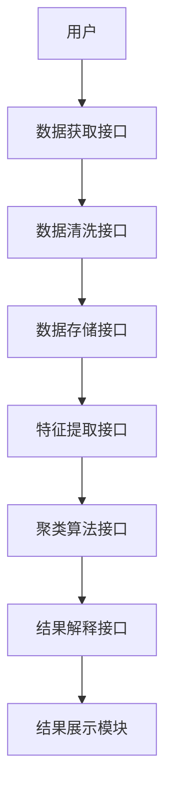

                 


# AI驱动的投资者行为模式聚类分析

> 关键词：投资者行为模式，聚类分析，人工智能，机器学习，数据挖掘，金融分析

> 摘要：本文通过结合人工智能和聚类分析技术，系统地探讨投资者行为模式的聚类分析方法。文章首先介绍投资者行为模式的基本概念和聚类分析的核心原理，然后详细阐述投资者行为模式的特征提取、聚类算法的选择与实现，以及基于AI的投资者行为模式聚类分析系统的架构设计。最后，本文通过实际案例展示了投资者行为模式聚类分析的应用价值，并总结了该领域的研究趋势和未来发展方向。

---

# 第一部分: AI驱动的投资者行为模式聚类分析背景与基础

## 第1章: 投资者行为模式聚类分析概述

### 1.1 投资者行为模式的定义与特征

#### 1.1.1 投资者行为模式的定义
投资者行为模式是指投资者在金融市场中进行决策和交易时所表现出的一系列行为特征和规律。这些行为模式可以通过数据采集、分析和建模等方法进行识别和分类。

#### 1.1.2 投资者行为模式的特征
投资者行为模式具有以下特征：
- **个体差异性**：不同投资者在风险偏好、决策风格等方面存在显著差异。
- **动态变化性**：投资者的行为模式会受到市场环境、个人情绪等多种因素的影响而发生变化。
- **可量化的特征**：通过交易数据、市场反应等量化指标可以提取投资者行为模式的特征。

#### 1.1.3 投资者行为模式的分类
投资者行为模式可以分为以下几类：
- **情绪驱动型**：投资者的行为主要受情绪影响，如贪婪和恐惧。
- **理性分析型**：投资者基于基本面分析进行决策。
- **技术分析型**：投资者通过技术指标进行交易决策。

### 1.2 聚类分析的基本概念

#### 1.2.1 聚类分析的定义
聚类分析是一种无监督学习方法，旨在将数据点按照某种相似性度量进行分组，使得同一组内的数据点具有较高的相似性，而不同组之间的数据点具有较低的相似性。

#### 1.2.2 聚类分析的核心原理
聚类分析的核心原理包括以下几个方面：
- **相似性度量**：通过计算数据点之间的相似性或距离，确定数据点的归属。
- **聚类算法**：选择合适的算法对数据点进行分组。
- **优化目标**：通过优化目标函数，使得同一组内的数据点尽可能相似，而不同组之间的数据点尽可能不同。

#### 1.2.3 聚类分析的应用场景
聚类分析在投资者行为模式分析中的应用场景包括：
- **客户细分**：根据投资者的行为特征进行客户细分，制定个性化的投资策略。
- **市场趋势预测**：通过分析投资者行为模式的变化，预测市场的趋势。
- **风险控制**：识别具有相似风险特征的投资者群体，制定相应的风险管理策略。

### 1.3 AI技术在投资者行为分析中的作用

#### 1.3.1 AI技术在金融领域的应用
AI技术在金融领域的应用包括：
- **智能投顾**：通过AI技术为投资者提供个性化的投资建议。
- **风险评估**：利用AI技术对投资者的风险偏好和风险承受能力进行评估。
- **市场预测**：通过AI技术预测市场的波动和趋势。

#### 1.3.2 AI驱动的投资者行为分析的优势
AI技术在投资者行为分析中的优势包括：
- **数据处理能力**：AI技术能够处理海量的投资者行为数据，提取有用的特征。
- **自动化分析**：通过自动化分析投资者行为数据，提高分析效率。
- **实时性**：AI技术可以实时分析投资者行为数据，及时发现市场变化。

#### 1.3.3 聚类分析在投资者行为研究中的价值
聚类分析在投资者行为研究中的价值包括：
- **发现隐含模式**：通过聚类分析发现投资者行为中的隐含模式。
- **客户细分**：根据投资者行为特征进行客户细分，制定个性化服务策略。
- **市场研究**：通过投资者行为模式分析，为市场研究提供数据支持。

## 第2章: 投资者行为模式聚类分析的背景与问题

### 2.1 投资者行为分析的现状

#### 2.1.1 传统投资者行为分析方法
传统的投资者行为分析方法主要包括：
- **定量分析**：通过统计分析方法对投资者行为数据进行分析。
- **定性分析**：通过访谈、问卷调查等方式了解投资者的行为特征。

#### 2.1.2 AI技术对投资者行为分析的革新
AI技术对投资者行为分析的革新包括：
- **数据处理能力的提升**：AI技术能够处理更大规模的投资者行为数据。
- **分析效率的提高**：通过自动化分析，提高了投资者行为分析的效率。
- **分析深度的增加**：AI技术能够发现投资者行为中的深层次规律。

### 2.2 投资者行为模式聚类分析的问题背景

#### 2.2.1 投资者行为数据的复杂性
投资者行为数据的复杂性主要体现在：
- **数据维度高**：投资者行为数据通常包含多个维度，如交易频率、交易金额、交易时间等。
- **数据噪声大**：投资者行为数据中通常包含大量的噪声数据，需要进行数据清洗。
- **数据动态变化**：投资者行为数据会受到市场环境和个人情绪的影响而动态变化。

#### 2.2.2 聚类分析在投资者行为研究中的挑战
聚类分析在投资者行为研究中的挑战包括：
- **特征选择的困难**：如何选择合适的特征进行聚类分析是一个难题。
- **算法选择的困难**：如何选择合适的聚类算法也是一个挑战。
- **结果解释的困难**：聚类结果的解释需要结合投资者行为的实际情况进行。

#### 2.2.3 传统聚类方法的局限性
传统聚类方法的局限性包括：
- **对数据分布的假设过于严格**：如K-means算法假设数据是凸分布的。
- **对初始参数的敏感性**：如K-means算法对初始质心的敏感性较高。
- **计算复杂度高**：对于大规模数据，某些聚类算法的计算复杂度较高。

### 2.3 本书的研究目标与意义

#### 2.3.1 研究目标
本书的研究目标是：
- **提出一种基于AI的投资者行为模式聚类分析方法**：通过结合AI技术和聚类分析方法，提出一种新的投资者行为模式聚类分析方法。
- **实现投资者行为模式的自动化识别**：通过自动化分析投资者行为数据，实现投资者行为模式的自动识别。
- **为投资者行为研究提供理论支持**：为投资者行为研究提供理论支持和方法论指导。

#### 2.3.2 研究意义
本书的研究意义包括：
- **推动投资者行为研究的智能化**：通过AI技术推动投资者行为研究的智能化发展。
- **提高投资者行为分析的效率**：通过自动化分析提高投资者行为分析的效率。
- **为金融决策提供支持**：通过投资者行为模式分析为金融决策提供支持。

#### 2.3.3 本书的创新点
本书的创新点包括：
- **提出了一种新的投资者行为模式聚类分析方法**：结合AI技术和聚类分析方法，提出了一种新的投资者行为模式聚类分析方法。
- **实现投资者行为模式的自动化识别**：通过自动化分析投资者行为数据，实现投资者行为模式的自动识别。
- **为投资者行为研究提供理论支持**：为投资者行为研究提供理论支持和方法论指导。

---

# 第二部分: 投资者行为模式聚类分析的核心概念与联系

## 第3章: 投资者行为模式的特征提取

### 3.1 投资者行为数据的特征维度

#### 3.1.1 市场行为特征
市场行为特征包括：
- **交易频率**：投资者在一定时间内的交易次数。
- **交易金额**：投资者在一定时间内的交易金额。
- **交易时间**：投资者进行交易的时间点。

#### 3.1.2 交易行为特征
交易行为特征包括：
- **交易策略**：投资者采用的交易策略类型，如短线交易、长线交易等。
- **交易风格**：投资者的交易风格，如激进型、保守型等。
- **交易情绪**：投资者在交易过程中的情绪变化。

#### 3.1.3 风险偏好特征
风险偏好特征包括：
- **风险承受能力**：投资者对风险的承受能力。
- **风险偏好**：投资者对风险的偏好程度。
- **风险认知**：投资者对风险的认知和态度。

### 3.2 投资者行为模式的特征提取方法

#### 3.2.1 基于统计的特征提取
基于统计的特征提取方法包括：
- **均值计算**：计算投资者行为数据的均值，如交易金额的均值。
- **方差计算**：计算投资者行为数据的方差，如交易金额的方差。
- **相关性分析**：分析投资者行为数据之间的相关性。

#### 3.2.2 基于机器学习的特征提取
基于机器学习的特征提取方法包括：
- **主成分分析（PCA）**：通过主成分分析提取投资者行为数据的主要特征。
- **线性判别分析（LDA）**：通过线性判别分析提取投资者行为数据的特征。
- **支持向量机（SVM）**：通过支持向量机提取投资者行为数据的特征。

#### 3.2.3 基于深度学习的特征提取
基于深度学习的特征提取方法包括：
- **卷积神经网络（CNN）**：通过卷积神经网络提取投资者行为数据的特征。
- **循环神经网络（RNN）**：通过循环神经网络提取投资者行为数据的特征。
- **自注意力机制（Self-Attention）**：通过自注意力机制提取投资者行为数据的特征。

## 第4章: 聚类分析的核心原理与方法

### 4.1 聚类分析的基本原理

#### 4.1.1 聚类分析的数学模型
聚类分析的数学模型可以通过以下公式表示：
$$
\text{目标函数} = \sum_{i=1}^{n} \sum_{j=1}^{k} w_{ij}d(x_i, x_j)
$$
其中，$w_{ij}$是数据点i和数据点j之间的权重，$d(x_i, x_j)$是数据点i和数据点j之间的距离。

#### 4.1.2 聚类分析的相似性度量
聚类分析的相似性度量方法包括：
- **欧氏距离**：计算两个数据点之间的欧氏距离。
- **曼哈顿距离**：计算两个数据点之间的曼哈顿距离。
- **余弦相似度**：计算两个数据点之间的余弦相似度。

#### 4.1.3 聚类分析的优化目标
聚类分析的优化目标包括：
- **最大化组内相似性**：使得同一组内的数据点尽可能相似。
- **最小化组间相似性**：使得不同组之间的数据点尽可能不同。

### 4.2 常见聚类算法的对比分析

#### 4.2.1 K-means算法
K-means算法是一种经典的聚类算法，其步骤如下：
1. 初始化：随机选择k个初始质心。
2. 赋类：将每个数据点分配到最近的质心所在的组。
3. 更新质心：计算每个组的质心。
4. 重复步骤2和3，直到质心不再变化。

#### 4.2.2 层次聚类算法
层次聚类算法是一种基于层次结构的聚类算法，其步骤如下：
1. 初始化：将每个数据点作为一个单独的组。
2. 计算相似性矩阵：计算所有组之间的相似性矩阵。
3. 合并组：根据相似性矩阵，合并相似性最高的两个组。
4. 重复步骤3，直到所有组合并成一个组。

#### 4.2.3 DBSCAN算法
DBSCAN算法是一种基于密度的聚类算法，其步骤如下：
1. 初始化：将所有数据点标记为未访问。
2. 遍历数据点：对于每个未访问的数据点，检查其邻域内的数据点数量。
3. 标记噪声点：如果邻域内的数据点数量小于阈值，则标记为噪声点。
4. 标记边界点和核心点：否则，标记为核心点或边界点。
5. 合并邻域：将邻域内的核心点和边界点合并成一个组。

### 4.3 投资者行为模式聚类的算法选择

#### 4.3.1 算法选择的依据
在选择聚类算法时，需要考虑以下因素：
- **数据特征**：数据的特征，如数据分布、数据维度等。
- **计算复杂度**：算法的计算复杂度。
- **结果解释性**：算法的解释性。
- **实际应用场景**：算法在实际应用中的表现。

---

# 第三部分: 投资者行为模式聚类分析的系统设计与实现

## 第5章: 投资者行为模式聚类分析系统的架构设计

### 5.1 系统功能设计

#### 5.1.1 数据采集模块
数据采集模块的功能包括：
- **数据接口**：提供与数据源的接口，获取投资者行为数据。
- **数据清洗**：对获取的数据进行清洗，去除噪声数据。
- **数据存储**：将清洗后的数据存储到数据库中。

#### 5.1.2 特征提取模块
特征提取模块的功能包括：
- **特征选择**：根据投资者行为模式的特征维度，选择合适的特征。
- **特征提取**：通过统计、机器学习或深度学习方法提取投资者行为模式的特征。

#### 5.1.3 聚类分析模块
聚类分析模块的功能包括：
- **算法选择**：根据实际需求选择合适的聚类算法。
- **模型训练**：对选定的算法进行训练，得到聚类结果。
- **结果解释**：对聚类结果进行解释，识别投资者行为模式。

#### 5.1.4 可视化模块
可视化模块的功能包括：
- **结果展示**：将聚类结果以可视化的方式展示出来。
- **交互分析**：提供交互式分析功能，方便用户查看详细信息。

### 5.2 系统架构设计

#### 5.2.1 系统架构图
以下是投资者行为模式聚类分析系统的架构图：



#### 5.2.2 核心功能模块的实现
核心功能模块的实现包括：
- **数据采集模块**：使用Flask框架实现数据接口。
- **特征提取模块**：使用Python的scikit-learn库实现特征提取。
- **聚类分析模块**：使用Python的scikit-learn库实现聚类分析。
- **结果展示模块**：使用Django框架实现结果展示。

### 5.3 系统接口设计

#### 5.3.1 数据接口
数据接口的设计包括：
- **数据获取接口**：用于获取投资者行为数据。
- **数据清洗接口**：用于清洗投资者行为数据。
- **数据存储接口**：用于存储投资者行为数据。

#### 5.3.2 聚类接口
聚类接口的设计包括：
- **特征提取接口**：用于提取投资者行为模式的特征。
- **聚类算法接口**：用于选择和训练聚类算法。
- **结果解释接口**：用于解释聚类结果。

### 5.4 系统交互设计

#### 5.4.1 用户交互流程
用户交互流程包括：
1. 用户访问数据获取接口，获取投资者行为数据。
2. 用户访问数据清洗接口，清洗投资者行为数据。
3. 用户访问数据存储接口，存储投资者行为数据。
4. 用户访问特征提取接口，提取投资者行为模式的特征。
5. 用户访问聚类算法接口，选择和训练聚类算法。
6. 用户访问结果解释接口，解释聚类结果。
7. 用户访问结果展示模块，查看聚类结果。

#### 5.4.2 系统交互图
以下是投资者行为模式聚类分析系统的交互图：



---

# 第四部分: 投资者行为模式聚类分析的项目实战

## 第6章: 投资者行为模式聚类分析的实战案例

### 6.1 项目背景与目标

#### 6.1.1 项目背景
本项目旨在通过AI技术对投资者行为模式进行聚类分析，帮助投资者和金融机构更好地理解投资者行为，制定个性化投资策略。

#### 6.1.2 项目目标
项目目标包括：
- **实现投资者行为模式的特征提取**：通过统计、机器学习和深度学习方法提取投资者行为模式的特征。
- **实现投资者行为模式的聚类分析**：选择合适的聚类算法，对投资者行为模式进行聚类分析。
- **实现投资者行为模式的可视化展示**：将聚类结果以可视化的方式展示出来。

### 6.2 数据获取与预处理

#### 6.2.1 数据获取
数据获取可以通过以下步骤进行：
1. **数据接口设计**：设计数据获取接口，获取投资者行为数据。
2. **数据清洗**：对获取的数据进行清洗，去除噪声数据。
3. **数据存储**：将清洗后的数据存储到数据库中。

#### 6.2.2 数据预处理
数据预处理包括：
- **特征选择**：根据投资者行为模式的特征维度，选择合适的特征。
- **特征提取**：通过统计、机器学习或深度学习方法提取投资者行为模式的特征。
- **数据标准化**：对提取的特征进行标准化处理。

### 6.3 聚类算法实现

#### 6.3.1 算法选择
在本项目中，选择K-means算法进行投资者行为模式的聚类分析。

#### 6.3.2 算法实现
以下是K-means算法的Python实现代码：

```python
from sklearn.cluster import KMeans
from sklearn.metrics import silhouette_score
from sklearn.preprocessing import StandardScaler

# 假设X是投资者行为数据的特征矩阵
scaler = StandardScaler()
X_scaled = scaler.fit_transform(X)

# 初始化K-means模型
kmeans = KMeans(n_clusters=3, random_state=42)

# 训练模型
kmeans.fit(X_scaled)

# 预测聚类结果
labels = kmeans.predict(X_scaled)

# 计算 silhouette score 评估聚类效果
score = silhouette_score(X_scaled, labels)
print("Silhouette Score:", score)
```

### 6.4 聚类结果分析与可视化

#### 6.4.1 聚类结果分析
通过分析聚类结果，可以识别出不同的投资者行为模式，例如：
- **情绪驱动型**：投资者的行为主要受情绪影响。
- **理性分析型**：投资者基于基本面分析进行决策。
- **技术分析型**：投资者通过技术指标进行交易决策。

#### 6.4.2 聚类结果可视化
以下是聚类结果的可视化代码：

```python
import matplotlib.pyplot as plt
from sklearn.manifold import TSNE

# 使用TSNE进行数据降维
tsne = TSNE(n_components=2, random_state=42)
X_tsne = tsne.fit_transform(X_scaled)

# 绘制聚类结果图
plt.figure(figsize=(8, 6))
for i in range(3):
    plt.scatter(X_tsne[labels == i, 0], X_tsne[labels == i, 1], label=f'Cluster {i+1}')

plt.xlabel('Dimension 1')
plt.ylabel('Dimension 2')
plt.legend()
plt.show()
```

---

# 第五部分: 投资者行为模式聚类分析的总结与展望

## 第7章: 项目总结与最佳实践

### 7.1 项目总结

#### 7.1.1 项目成果
通过本项目，我们实现了投资者行为模式的特征提取、聚类分析和可视化展示，识别出不同的投资者行为模式，为投资者和金融机构提供了理论支持和方法论指导。

#### 7.1.2 项目经验
在项目实施过程中，我们总结了以下经验：
- **数据清洗的重要性**：数据清洗是确保聚类分析结果准确性的关键步骤。
- **特征选择的影响**：特征选择对聚类分析结果有重要影响，需要根据实际需求选择合适的特征。
- **算法选择的灵活性**：在实际应用中，需要根据数据特征和实际需求选择合适的聚类算法。

### 7.2 最佳实践

#### 7.2.1 数据处理 tips
- 数据清洗：在进行聚类分析之前，必须对数据进行清洗，去除噪声数据。
- 数据标准化：在进行聚类分析之前，需要对数据进行标准化处理，确保不同特征之间的可比性。

#### 7.2.2 算法选择 tips
- 算法选择：根据数据特征和实际需求选择合适的聚类算法，如K-means算法适用于球形分布的数据，DBSCAN算法适用于密度分布的数据。
- 参数调优：对于某些聚类算法，如K-means算法，需要进行参数调优，以获得最佳的聚类效果。

#### 7.2.3 结果解释 tips
- 结果可视化：通过可视化工具，如t-SNE，将聚类结果以可视化的方式展示出来，方便理解和分析。
- 结果解释：根据聚类结果，结合投资者行为的实际特征，对聚类结果进行解释和分类，识别出不同的投资者行为模式。

### 7.3 项目注意事项

#### 7.3.1 数据隐私与安全
在进行投资者行为模式分析时，需要注意数据隐私与安全，确保数据的安全存储和传输。

#### 7.3.2 算法的可解释性
在实际应用中，需要关注聚类算法的可解释性，确保聚类结果能够被业务人员理解和应用。

#### 7.3.3 模型的可扩展性
在进行投资者行为模式聚类分析时，需要考虑模型的可扩展性，确保模型能够适应数据量和数据特征的变化。

## 第8章: 未来研究方向与总结

### 8.1 未来研究方向

#### 8.1.1 新型聚类算法的研究
未来可以研究新型聚类算法，如基于深度学习的聚类算法，提高聚类分析的准确性和效率。

#### 8.1.2 多模态数据的聚类分析
未来可以研究多模态数据的聚类分析，如结合文本、图像等多种数据源，提高投资者行为模式识别的准确性。

#### 8.1.3 动态数据的聚类分析
未来可以研究动态数据的聚类分析方法，如在线聚类算法，能够实时处理动态变化的投资者行为数据。

### 8.2 项目总结
通过本项目，我们深入探讨了AI技术在投资者行为模式聚类分析中的应用，提出了一种新的投资者行为模式聚类分析方法，为投资者行为研究提供了理论支持和方法论指导。未来，我们将进一步研究新型聚类算法和多模态数据的聚类分析，推动投资者行为研究的智能化发展。

---

# 结语

通过本文的系统阐述，我们全面探讨了AI驱动的投资者行为模式聚类分析的方法和应用。从背景介绍到系统设计，从算法实现到项目实战，我们一步步揭示了投资者行为模式聚类分析的核心原理和实现细节。希望本文能够为投资者、金融机构以及研究人员提供有价值的参考和启发。

---

作者：AI天才研究院/AI Genius Institute & 禅与计算机程序设计艺术 /Zen And The Art of Computer Programming

