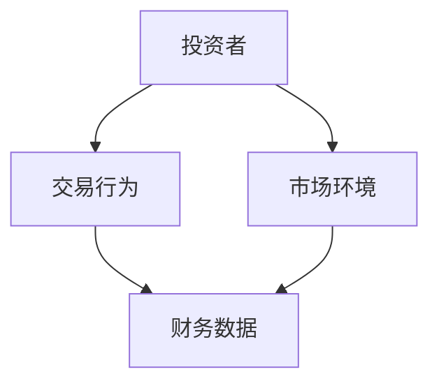
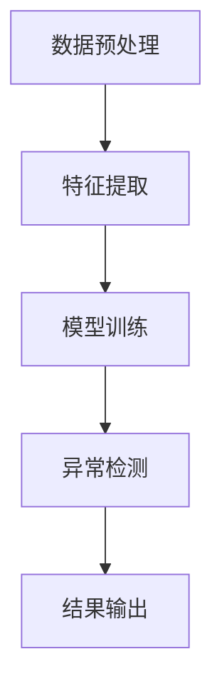
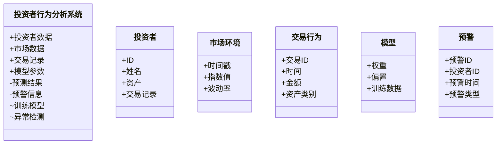
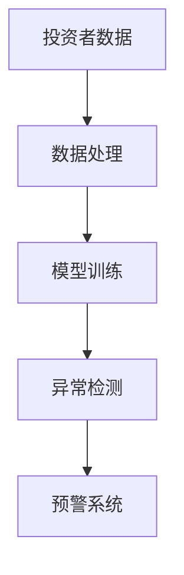
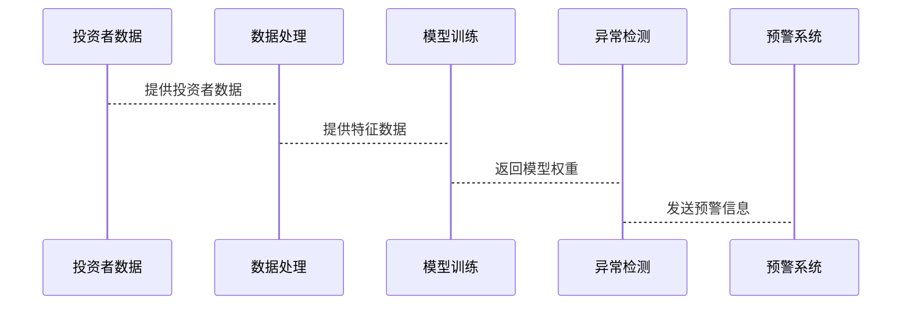

                 


# AI驱动的投资者行为模式识别与异常预警

## 关键词：投资者行为分析，AI技术，异常行为识别，深度学习，金融风险管理

## 摘要：本文探讨如何利用AI技术分析投资者行为模式，并实现异常行为的早期预警。通过深度学习和数据挖掘技术，识别投资者的行为特征，构建预测模型，从而为金融机构提供有效的风险管理工具，提升投资决策的科学性和安全性。

---

## 第1章: 背景介绍

### 1.1 问题背景

#### 1.1.1 投资者行为分析的重要性
投资者的行为直接关系到市场的波动和风险。通过分析投资者的行为模式，金融机构可以更好地理解市场动态，优化投资策略，降低风险。

#### 1.1.2 异常行为识别的必要性
投资者的异常行为可能导致市场波动，例如恐慌性抛售或过度交易。及时识别这些行为，可以帮助金融机构采取措施，减少市场风险。

#### 1.1.3 AI技术在金融领域的应用现状
AI技术在金融领域的应用日益广泛，特别是在投资者行为分析和风险管理方面，AI技术能够处理大量数据，发现复杂模式，提供决策支持。

---

### 1.2 问题描述

#### 1.2.1 投资者行为模式的复杂性
投资者行为受到多种因素影响，包括市场环境、个体心理、经济状况等，导致行为模式复杂多样。

#### 1.2.2 异常行为的定义与分类
异常行为通常指偏离正常交易模式的行为，包括突然增加的交易频率、异常资金流动等。

#### 1.2.3 当前投资者行为分析的挑战
传统方法难以捕捉复杂的行为模式，数据量大、维度高，需要借助AI技术进行高效分析。

---

### 1.3 问题解决

#### 1.3.1 AI技术如何解决投资者行为分析问题
AI技术能够处理海量数据，提取特征，识别模式，为投资者行为分析提供高效工具。

#### 1.3.2 异常行为识别的AI方法
利用深度学习和自然语言处理技术，分析投资者的行为数据，识别异常模式。

#### 1.3.3 技术与业务结合的解决方案
结合AI技术和金融业务知识，构建投资者行为分析模型，实现异常行为预警。

---

### 1.4 概念结构与核心要素

#### 1.4.1 投资者行为模式的核心要素
- 交易频率
- 交易金额
- 交易时间
- 投资偏好

#### 1.4.2 异常行为识别的边界与外延
- 异常交易模式
- 不寻常的交易时间
- 突然的资金流动

#### 1.4.3 模型构建的逻辑框架
1. 数据采集
2. 特征提取
3. 模型训练
4. 异常检测
5. 预警触发

---

## 第2章: 核心概念与联系

### 2.1 投资者行为模式识别的原理

#### 2.1.1 数据采集与特征提取
- 数据源：交易记录、市场数据、投资者信息
- 特征提取：交易频率、金额、时间、资产配置

#### 2.1.2 模型训练与特征学习
- 使用深度学习模型（如LSTM）捕捉时序特征
- 通过神经网络提取非线性特征

#### 2.1.3 模式识别的算法选择
- 常见算法：聚类、分类、回归
- 选择算法：根据数据特性选择最优模型

---

### 2.2 异常行为预警的机制

#### 2.2.1 异常检测的基本原理
- 基于统计的异常检测
- 基于机器学习的异常检测

#### 2.2.2 基于AI的异常检测方法
- 使用深度学习模型（如GAN）生成异常样本
- 利用聚类算法识别异常群

#### 2.2.3 预警触发的条件与策略
- 设置阈值：当检测指标超过阈值触发预警
- 分级预警：根据异常程度发送不同级别的预警

---

### 2.3 核心概念对比分析

#### 2.3.1 行为模式与异常行为的对比
| 特征 | 正常行为 | 异常行为 |
|------|----------|----------|
| 交易频率 | 稳定 | 突然增加或减少 |
| 交易时间 | 集中 | 分散或异常时间段 |
| 资金流动 | 平稳 | 突然波动 |

#### 2.3.2 不同异常检测方法的对比
| 方法 | 优点 | 缺点 |
|------|------|------|
| 聚类 | 无监督，发现潜在模式 | 对噪声敏感 |
| 分类 | 需要标签数据 | 适合已知异常类型 |
| GAN | 能生成异常样本 | 需要大量数据 |

#### 2.3.3 AI模型在行为识别中的优势
- 高维度数据处理能力强
- 能捕捉非线性特征
- 实时分析能力

---

### 2.4 ER实体关系图



---

## 第3章: 算法原理讲解

### 3.1 基于深度学习的投资者行为分析

#### 3.1.1 神经网络模型的选择
- LSTM网络用于时序数据分析
- CNN网络用于特征提取

#### 3.1.2 模型训练与优化
- 使用交叉验证选择超参数
- 通过早停法防止过拟合

#### 3.1.3 模型实现的代码示例

```python
import numpy as np
from tensorflow.keras import layers

# 示例代码：构建LSTM模型
model = layers.Sequential()
model.add(layers.LSTM(64, input_shape=(timesteps, features)))
model.add(layers.Dense(1, activation='sigmoid'))
model.compile(optimizer='adam', loss='binary_crossentropy', metrics=['accuracy'])
```

---

### 3.2 异常检测的算法实现

#### 3.2.1 基于聚类的异常检测
- 使用K-Means聚类模型
- 识别远离主群的交易行为

#### 3.2.2 基于深度学习的异常检测
- 使用生成对抗网络（GAN）生成异常样本

#### 3.2.3 算法实现的代码示例

```python
import tensorflow as tf
from tensorflow.keras import layers

# 示例代码：构建GAN模型
# 生成器
generator = layers.Sequential([
    layers.Dense(256, activation='relu'),
    layers.Dense(128, activation='relu'),
    layers.Dense(64, activation='sigmoid')
])

# 判别器
discriminator = layers.Sequential([
    layers.Dense(64, activation='relu'),
    layers.Dense(32, activation='relu'),
    layers.Dense(1, activation='sigmoid')
])
```

---

### 3.3 算法流程图



---

### 3.4 数学模型与公式

#### 3.4.1 概率模型
$$P(x|y) = \frac{P(y|x)P(x)}{P(y)}$$

#### 3.4.2 分类模型
$$y = f(x)$$

---

### 3.5 实际案例分析

#### 3.5.1 案例背景
分析某段时间内的投资者交易数据，识别异常交易行为。

#### 3.5.2 数据分析与处理
- 清洗数据
- 特征工程

#### 3.5.3 模型训练与评估
- 训练模型
- 评估指标（准确率、召回率）

#### 3.5.4 结果解读与优化
- 确定异常交易
- 调整模型参数

---

## 第4章: 系统分析与架构设计

### 4.1 系统功能设计

#### 4.1.1 领域模型（类图）



---

### 4.2 系统架构设计

#### 4.2.1 系统架构图



---

### 4.3 系统接口设计

#### 4.3.1 接口描述
- 数据接口：接收投资者数据和市场数据
- 模型接口：调用训练好的模型进行预测
- 预警接口：发送预警信息

#### 4.3.2 接口交互示例



---

## 第5章: 项目实战

### 5.1 环境安装

#### 5.1.1 安装Python
- 安装Anaconda

#### 5.1.2 安装依赖
- TensorFlow、Keras、Mermaid、Plotly

#### 5.1.3 环境配置
- 设置虚拟环境
- 安装必要的库

---

### 5.2 系统核心实现

#### 5.2.1 核心代码实现

```python
import numpy as np
import pandas as pd
from tensorflow.keras import layers

# 数据加载
data = pd.read_csv('investor_data.csv')

# 特征提取
features = data[['transaction_amount', 'time_stamp', 'asset_class']]
labels = data['is_abnormal']

# 模型构建
model = layers.Sequential()
model.add(layers.Dense(64, activation='relu', input_dim=3))
model.add(layers.Dense(1, activation='sigmoid'))
model.compile(optimizer='adam', loss='binary_crossentropy', metrics=['accuracy'])

# 训练模型
model.fit(features, labels, epochs=100, batch_size=32)
```

---

### 5.3 代码应用解读

#### 5.3.1 代码功能解读
- 数据加载：读取CSV文件中的投资者数据
- 特征提取：选择关键特征进行分析
- 模型训练：构建并训练深度学习模型
- 结果输出：生成异常检测结果

#### 5.3.2 代码优化建议
- 调整模型结构
- 使用交叉验证
- 优化超参数

---

### 5.4 实际案例分析

#### 5.4.1 案例背景
分析某投资者的交易数据，识别是否存在异常交易行为。

#### 5.4.2 数据分析与处理
- 清洗数据
- 特征工程

#### 5.4.3 模型训练与评估
- 训练模型
- 评估准确率和召回率

#### 5.4.4 结果解读与优化
- 确定异常交易
- 调整模型参数

---

## 第6章: 最佳实践

### 6.1 小结
通过AI技术实现投资者行为模式识别与异常预警，能够有效降低投资风险，提升决策效率。

### 6.2 注意事项
- 数据隐私保护
- 模型解释性
- 实时性要求

### 6.3 拓展阅读
- 《深度学习在金融领域的应用》
- 《时间序列分析与异常检测》

---

## 附录: 工具安装指南

### 附录A: Python环境配置
- 安装Anaconda
- 使用pip安装依赖

### 附录B: 数据集说明
- 数据格式
- 数据字段
- 数据预处理

---

## 作者：AI天才研究院 & 禅与计算机程序设计艺术

