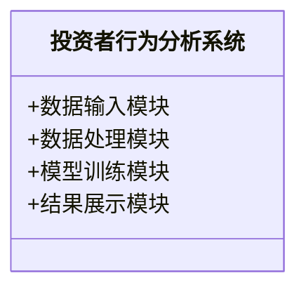
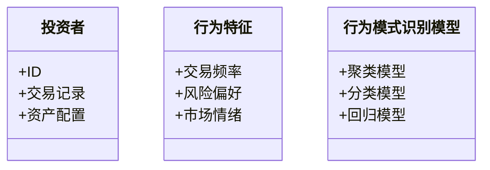
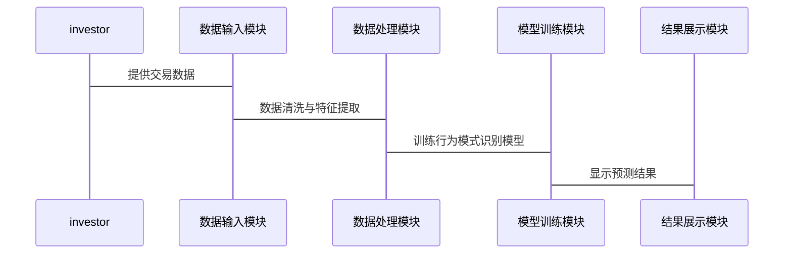

                 

<think>
嗯，我需要为这本书设计一个详细的目录，涵盖投资者行为模式识别与预测的各个方面。用户已经提供了一个示例，但看起来需要进一步细化。

首先，我应该明确这本书的核心主题，即如何利用AI技术来分析投资者的行为模式，并进行预测。这涉及到数据分析、机器学习、行为建模等多个领域。

接下来，考虑目录的结构。通常，技术书籍的目录分为几个主要部分，每个部分包含几个章节，每个章节下有几个小节。我需要确保每个部分都详细且有逻辑性。

第一部分是背景介绍，这里需要解释为什么投资者行为模式识别与预测是重要的，以及AI在其中的作用。可能需要包括投资者行为的基本概念、AI技术的优势，以及当前的应用现状和挑战。

第二部分是核心概念与联系，这部分需要深入讲解投资者行为模式识别的理论基础，包括相关的核心概念、数学模型，以及使用ER实体关系图和属性对比表来展示概念之间的联系。

第三部分是算法原理，这里需要详细分析几种常用的机器学习算法，如聚类、分类和回归，并使用mermaid流程图和数学公式来解释它们的工作原理。

第四部分是系统分析与架构设计，这部分需要介绍如何构建一个完整的投资者行为分析系统，包括系统功能设计、架构设计、接口设计和交互设计，可能使用mermaid的类图、架构图和序列图来展示。

第五部分是项目实战，这里需要通过具体的案例来展示如何应用前面的理论，包括环境安装、代码实现、结果分析等步骤，并提供详细的代码示例。

最后，第六部分是最佳实践、小结和注意事项，总结全书的内容，并给出实际应用中的建议。

现在，我需要将这些部分细化到章节和小节，确保每个部分都有足够的深度和广度。同时，要确保目录结构清晰，逻辑连贯，覆盖用户提到的所有要求，如背景介绍、核心概念、算法原理、系统架构、项目实战和最佳实践等。

在设计过程中，我可能会遇到如何平衡理论和实践的问题，因此需要确保每个部分既有理论支撑，又有实际案例支持。此外，数学公式和图表的使用也是关键，需要确保它们准确且易于理解。

最后，检查整个目录是否符合用户的要求，是否覆盖了所有必要的内容，并且结构合理，逻辑清晰。确保每个章节和小节都有明确的主题，并且相互之间有良好的衔接。
</think>

# AI驱动的投资者行为模式识别与预测

## 关键词：AI，投资者行为模式，预测，机器学习，行为建模，数据分析

## 摘要：本文深入探讨了AI技术在投资者行为模式识别与预测中的应用，结合理论分析和实际案例，系统介绍了投资者行为分析的核心概念、算法原理、系统架构以及项目实战，为读者提供全面的指导和深入的见解。

---

# 第一部分: 背景介绍

## 第1章: 投资者行为模式识别的背景与意义

### 1.1 投资者行为分析的基本概念
- 1.1.1 投资者行为的定义与分类
- 1.1.2 投资者行为模式识别的重要性
- 1.1.3 AI技术在投资者行为分析中的应用前景

### 1.2 AI驱动的投资者行为分析的优势
- 1.2.1 数据驱动的分析方法
- 1.2.2 机器学习在行为预测中的应用
- 1.2.3 自然语言处理在投资者情绪分析中的作用

## 第2章: AI技术在金融领域的应用现状

### 2.1 人工智能在金融领域的核心应用
- 2.1.1 金融数据分析与预测
- 2.1.2 投资组合优化与风险管理
- 2.1.3 交易行为分析与市场情绪预测

### 2.2 当前AI技术在投资者行为分析中的挑战
- 2.2.1 数据质量与隐私问题
- 2.2.2 模型的可解释性与稳定性
- 2.2.3 算法的实时性与高效性

---

# 第二部分: 投资者行为模式识别的核心概念与联系

## 第3章: 投资者行为模式识别的理论基础

### 3.1 投资者行为模式识别的核心概念
- 3.1.1 行为特征的提取与分类
- 3.1.2 模式识别的基本原理
- 3.1.3 机器学习在模式识别中的应用

### 3.2 投资者行为模式识别的数学模型
- 3.2.1 线性回归模型
- 3.2.2 支持向量机模型
- 3.2.3 随机森林与决策树模型

## 第4章: 核心概念与联系的ER实体关系图

### 4.1 投资者行为模式识别的ER实体关系图

```mermaid
er
actor:投资者
action:投资行为
feature:行为特征
model:行为模式识别模型
result:预测结果
actor -[1]-> action
action -[1]-> feature
feature -[n]-> model
model -[1]-> result
```

### 4.2 投资者行为模式识别的概念属性特征对比表格

| 属性 | 描述 |
|------|------|
| 投资者类型 | 零售投资者、机构投资者、个人投资者 |
| 行为特征 | 交易频率、资产配置、风险偏好 |
| 模式识别 | 分类、聚类、回归 |
| 预测结果 | 投资收益预测、市场情绪预测 |

---

# 第三部分: 算法原理讲解

## 第5章: 基于聚类算法的行为模式识别

### 5.1 聚类算法的原理与流程


### 5.2 K-means聚类算法实现
```python
from sklearn.cluster import KMeans

# 示例数据
X = [[1, 2], [3, 4], [5, 6], [7, 8]]

# 模型训练
kmeans = KMeans(n_clusters=2, random_state=0)
kmeans.fit(X)

# 预测结果
print(kmeans.labels_)
```

### 5.3 聚类算法在投资者行为分析中的应用
- 示例：根据交易频率和资产配置将投资者分为高风险和低风险两类。

---

## 第6章: 基于分类算法的行为预测模型

### 6.1 分类算法的原理与流程


### 6.2 随机森林分类算法实现
```python
from sklearn.ensemble import RandomForestClassifier

# 示例数据
X = [[1, 2], [3, 4], [5, 6], [7, 8]]
y = [0, 1, 0, 1]

# 模型训练
rf = RandomForestClassifier(n_estimators=2, random_state=0)
rf.fit(X, y)

# 预测结果
print(rf.predict([[9, 10]]))
```

### 6.3 分类算法在投资者行为预测中的应用
- 示例：根据投资者的历史交易数据预测其未来的投资行为。

---

## 第7章: 基于回归算法的收益预测模型

### 7.1 回归算法的原理与流程


### 7.2 线性回归算法实现
```python
from sklearn.linear_model import LinearRegression

# 示例数据
X = [[1], [2], [3], [4]]
y = [2, 4, 6, 8]

# 模型训练
lr = LinearRegression()
lr.fit(X, y)

# 预测结果
print(lr.predict([[5]]))
```

### 7.3 回归算法在投资者收益预测中的应用
- 示例：根据市场指数预测投资者的收益。

---

# 第四部分: 系统分析与架构设计

## 第8章: 投资者行为分析系统的功能设计

### 8.1 系统功能模块


### 8.2 系统功能设计的领域模型


## 第9章: 系统架构设计

### 9.1 系统架构设计


### 9.2 系统架构的详细说明
- 数据库层：存储投资者的交易数据和行为特征。
- 业务逻辑层：包括数据处理、模型训练和预测功能。
- 表现层：提供用户友好的界面，展示分析结果。

## 第10章: 系统接口设计与交互

### 10.1 系统接口设计


---

# 第五部分: 项目实战

## 第11章: 环境安装与核心实现

### 11.1 环境安装
- 安装Python和必要的库（如scikit-learn、pandas、numpy）

### 11.2 核心实现
```python
import pandas as pd
from sklearn.cluster import KMeans

# 数据加载
data = pd.read_csv('investor_data.csv')

# 特征选择
features = data[['交易频率', '资产配置', '风险偏好']]

# 聚类模型训练
kmeans = KMeans(n_clusters=3, random_state=0)
kmeans.fit(features)

# 可视化结果
print(kmeans.labels_)
```

## 第12章: 案例分析与结果解读

### 12.1 案例分析
- 示例数据：投资者的交易频率、资产配置和风险偏好。

### 12.2 结果解读
- 聚类结果：将投资者分为高风险、中风险和低风险三类。

## 第13章: 项目小结

### 13.1 项目总结
- 本项目展示了如何使用机器学习算法进行投资者行为模式识别与预测。

### 13.2 经验与教训
- 数据质量对模型性能的影响。
- 模型选择与调优的重要性。

---

# 第六部分: 最佳实践、小结与注意事项

## 第14章: 最佳实践

### 14.1 数据处理
- 数据清洗与特征工程的重要性。

### 14.2 模型选择
- 根据数据特点选择合适的算法。

### 14.3 模型优化
- 使用交叉验证和超参数调优提高模型性能。

## 第15章: 小结与注意事项

### 15.1 小结
- 本文详细介绍了AI技术在投资者行为模式识别与预测中的应用。

### 15.2 注意事项
- 数据隐私与合规性问题。
- 模型的可解释性与稳定性。

## 第16章: 拓展阅读

### 16.1 推荐书籍与论文
- 《机器学习实战》
- 《行为金融学》
- 《深度学习在金融中的应用》

---

# 作者：AI天才研究院/AI Genius Institute & 禅与计算机程序设计艺术/Zen And The Art of Computer Programming

