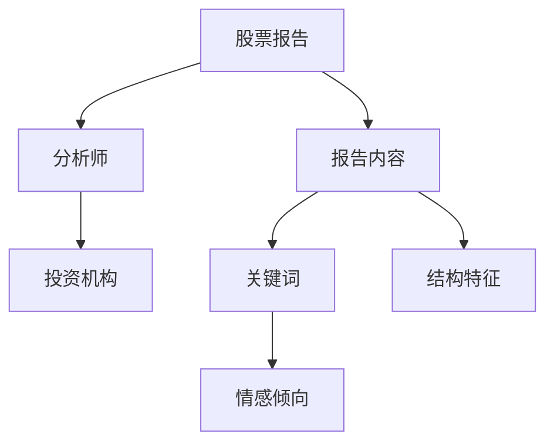
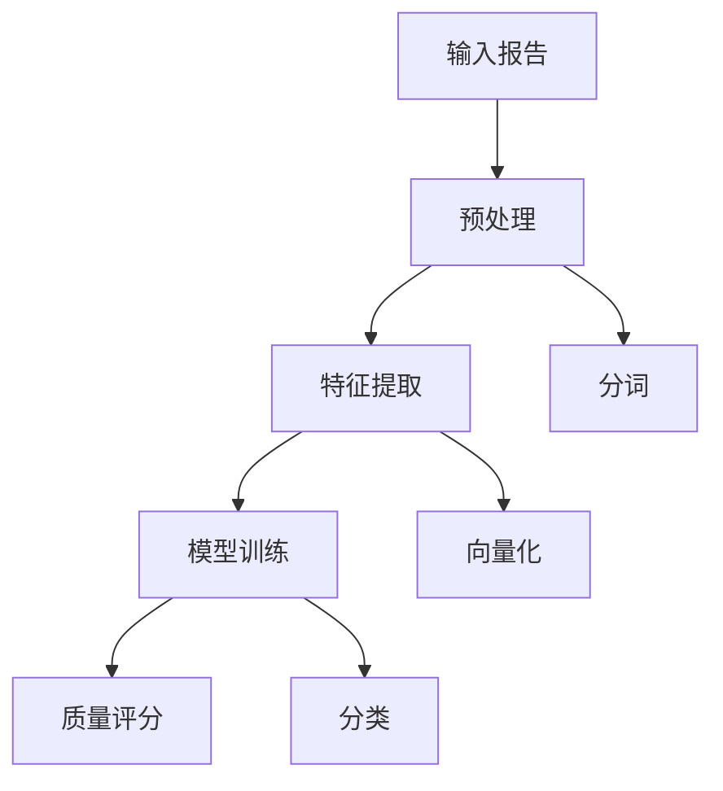
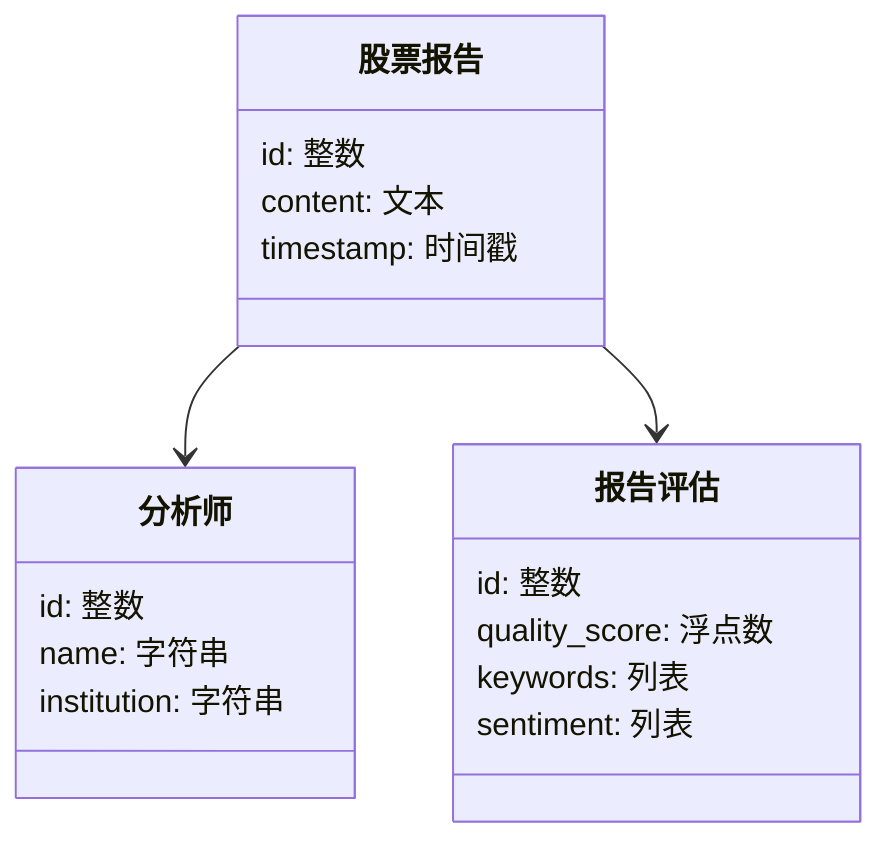
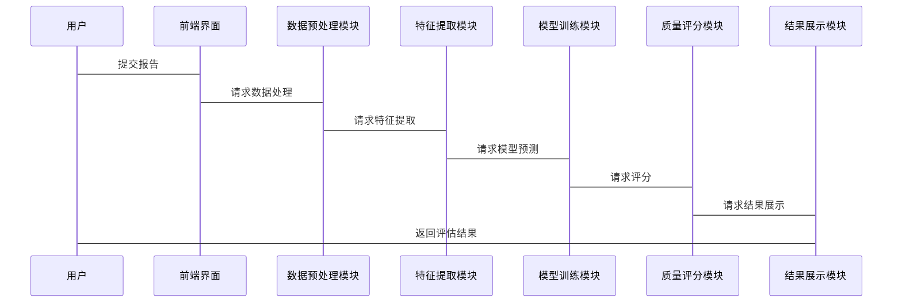

                 

<think>
嗯，用户让我写一篇关于《AI驱动的股票分析师报告质量评估》的技术博客。首先，我需要明确这篇文章的目标读者是谁。可能是程序员、数据科学家或者金融领域的专业人士，他们对如何利用AI技术提升金融分析的效率和准确性感兴趣。

接下来，我得考虑文章的结构。用户已经给出了一个详细的目录，我需要按照这个结构来展开。从背景介绍开始，说明为什么传统报告评估有局限性，以及AI在其中的作用。

在核心概念部分，我需要详细解释NLP和机器学习在金融中的应用，特别是如何通过这些技术来评估报告质量。可能需要用表格来对比不同模型的特点，比如BERT、随机森林和LSTM的区别。

然后，算法原理部分，我得用mermaid流程图来展示整个评估过程，从数据预处理到特征提取，再到模型训练和质量评分。数学公式方面，我会解释BERT模型和随机森林的分类公式，用LaTeX表示，确保清晰易懂。

系统架构部分，我需要用类图和架构图来展示系统的各个模块及其交互。这部分可能需要解释数据预处理模块、特征提取模块、模型训练模块和质量评分模块之间的关系，以及它们如何与前端交互。

项目实战部分，我需要提供具体的代码示例，说明如何安装依赖库，如何加载预训练模型，如何进行数据处理和模型训练。实际案例分析要详细，比如分析一个真实报告的结构，提取关键词，评估其质量。

最后，最佳实践部分要给出一些实用的建议，比如数据清洗的重要性、模型调参的方法，以及持续学习的必要性。还要总结整个项目，并提示读者注意数据隐私和模型泛化能力。

在写作过程中，我需要确保每个部分都详细且有深度，同时语言要专业但不失清晰。使用适当的图表和代码示例，帮助读者更好地理解内容。同时，保持逻辑连贯，确保读者能够一步步跟随我的分析，从背景到实现，再到实际应用。

总的来说，我需要全面覆盖用户的需求，提供一个结构清晰、内容详实的技术博客，帮助读者理解如何利用AI技术提升股票分析师报告的质量评估。
</think>

# AI驱动的股票分析师报告质量评估

## 关键词：AI，股票分析，报告质量，自然语言处理，机器学习，深度学习

## 摘要：本文深入探讨了如何利用人工智能技术，特别是自然语言处理和机器学习，来评估股票分析师报告的质量。通过分析报告的文本内容、结构和语言特征，结合量化指标，构建了一个基于AI的评估系统，以提高投资决策的准确性和效率。

---

## 第一章：股票分析师报告质量评估的背景与问题

### 1.1 股票分析师报告的重要性

股票分析师的报告是投资者做出决策的重要依据。这些报告通常包含对市场趋势、公司基本面、行业动态的分析，以及对未来股票价格的预测。然而，报告的质量直接影响投资者的决策效果和投资收益。

#### 1.1.1 股票分析师报告的核心作用
股票分析师报告的核心作用在于提供专业、客观的分析，帮助投资者做出明智的决策。高质量的报告通常具有以下特点：
- **逻辑清晰**：报告结构合理，分析深入。
- **数据准确**：引用的数据真实可靠。
- **预测精准**：对市场趋势和公司业绩的预测具有较高的准确性。
- **语言专业**：用词准确，表达清晰。

#### 1.1.2 报告质量对投资决策的影响
报告质量直接影响投资者的决策。高质量的报告能够帮助投资者抓住投资机会，避免潜在风险。而低质量的报告可能导致错误的决策，造成经济损失。

#### 1.1.3 传统报告评估的局限性
传统上，报告质量的评估主要依赖人工阅读和主观判断。这种方法存在以下问题：
- **主观性强**：不同评估者对同一份报告的评价可能差异较大。
- **效率低下**：人工评估耗时长，难以应对大量报告的评估需求。
- **缺乏量化标准**：缺乏统一的量化标准，评估结果难以比较。

### 1.2 AI驱动评估的必要性

#### 1.2.1 传统评估方法的不足
传统评估方法主观性强、效率低且缺乏量化标准，难以满足现代金融市场的需要。

#### 1.2.2 AI技术在金融领域的潜力
人工智能技术在金融领域的应用越来越广泛。通过自然语言处理（NLP）、机器学习等技术，可以对股票分析师报告进行自动化、智能化的评估。

#### 1.2.3 股票报告评估的智能化趋势
随着AI技术的不断发展，智能化评估股票分析师报告的质量已成为行业趋势。通过AI技术，可以提高评估效率，降低评估成本，同时提高评估的客观性和准确性。

### 1.3 问题背景与目标

#### 1.3.1 问题背景分析
股票分析师报告的质量评估是一个复杂的过程，涉及多个因素，如报告的内容、结构、语言等。传统的人工评估方法存在效率低、主观性强等问题，难以满足现代金融市场的需要。

#### 1.3.2 问题解决的必要性
通过AI技术，可以实现股票分析师报告的质量评估自动化，提高评估效率和准确性，降低评估成本。

#### 1.3.3 本研究的目标与意义
本研究的目标是构建一个基于AI的股票分析师报告质量评估系统，通过自然语言处理和机器学习技术，实现报告的自动评估。这将为投资者提供更加客观、准确的报告质量评估结果，提高投资决策的效率和准确性。

---

## 第二章：核心概念与联系

### 2.1 AI模型在金融领域的应用

#### 2.1.1 自然语言处理（NLP）在股票报告中的应用
自然语言处理技术可以对股票报告中的文本进行分析，提取关键词、主题和情感倾向。例如，可以使用词袋模型、TF-IDF、BERT等模型对报告内容进行表示。

#### 2.1.2 机器学习在金融预测中的作用
机器学习技术可以对股票报告进行分类、聚类和预测。例如，可以使用随机森林、支持向量机（SVM）、神经网络等算法对报告质量进行分类。

#### 2.1.3 深度学习模型的优势
深度学习模型（如BERT、GPT）在文本理解和生成方面具有显著优势，可以用于股票报告的质量评估、内容生成和预测。

### 2.2 核心概念对比与ER实体关系图

#### 2.2.1 不同AI模型的对比分析
以下表格对比了常用AI模型的特点：

| 模型名称 | 输入类型 | 输出类型 | 优势 | 劣势 |
|----------|-----------|-----------|------|------|
| BERT     | 文本       | 向量/分类 | 高精度 | 计算资源需求高 |
| 随机森林 | 特征向量   | 分类/回归 | 鲁棒性好 | 解释性差 |
| LSTM     | 序列数据   | 生成/预测 | 长序列处理能力强 | 训练时间长 |

#### 2.2.2 实体关系图（ER图）展示
股票分析师报告质量评估系统的实体关系图如下：



### 2.3 算法原理与流程图

#### 2.3.1 算法流程图
股票分析师报告质量评估的算法流程图如下：



---

## 第三章：算法原理与数学模型

### 3.1 自然语言处理模型

#### 3.1.1 BERT模型的文本表示
BERT模型通过自注意力机制对文本进行编码，生成上下文相关的向量表示。其数学公式如下：

$$\text{BERT}(x) = \text{MLP}(x)$$

其中，$x$ 是输入文本，$\text{MLP}$ 是多层感知机。

#### 3.1.2 模型的数学表示
股票报告的质量评估可以通过分类任务进行建模，使用交叉熵损失函数：

$$L = -\frac{1}{N}\sum_{i=1}^{N} \sum_{k=1}^{K} y_{i,k} \log(p_{i,k})$$

其中，$N$ 是样本数，$K$ 是类别数，$y_{i,k}$ 是标签，$p_{i,k}$ 是预测概率。

### 3.2 机器学习分类器

#### 3.2.1 随机森林分类器
随机森林是一种基于决策树的集成学习方法。其分类公式为：

$$y = \text{argmax}(\sum_{i=1}^{n} w_i x_i)$$

其中，$w_i$ 是特征权重，$x_i$ 是输入特征。

#### 3.2.2 分类器的数学模型
随机森林通过投票机制进行分类，公式如下：

$$\hat{y} = \text{mode}(\{y_1, y_2, ..., y_n\})$$

其中，$y_i$ 是每个决策树的预测结果，$\text{mode}$ 表示众数。

---

## 第四章：系统分析与架构设计方案

### 4.1 问题场景介绍

股票分析师报告质量评估系统需要处理以下问题：
- 如何对大量股票报告进行自动化评估。
- 如何提取报告中的关键信息并生成量化指标。
- 如何构建高效的AI模型并实现快速预测。

### 4.2 系统功能设计

#### 4.2.1 领域模型设计
股票分析师报告质量评估系统的领域模型如下：



#### 4.2.2 系统架构设计
股票分析师报告质量评估系统的架构图如下：


#### 4.2.3 系统接口设计
系统接口设计包括：
- 数据输入接口：接收股票报告文本。
- 数据处理接口：对文本进行预处理和特征提取。
- 模型调用接口：调用AI模型进行预测。
- 结果输出接口：返回质量评分和相关分析结果。

#### 4.2.4 系统交互设计
系统交互流程如下：



---

## 第五章：项目实战

### 5.1 环境安装

#### 5.1.1 安装Python和相关库
安装Python和以下库：
```bash
pip install numpy pandas scikit-learn transformers
```

### 5.2 系统核心实现源代码

#### 5.2.1 数据预处理模块
```python
import pandas as pd

def preprocess_report(report_text):
    # 分词
    words = report_text.split()
    # 去除停用词
    stop_words = set(['的', '了', '是', '在'])
    filtered_words = [word for word in words if word not in stop_words]
    return ' '.join(filtered_words)
```

#### 5.2.2 特征提取模块
```python
from sklearn.feature_extraction.text import TfidfVectorizer

vectorizer = TfidfVectorizer()
X = vectorizer.fit_transform(reports)
```

#### 5.2.3 模型训练模块
```python
from sklearn.ensemble import RandomForestClassifier

model = RandomForestClassifier()
model.fit(X, labels)
```

#### 5.2.4 质量评分模块
```python
import numpy as np

def evaluate_quality(reports, labels, model, vectorizer):
    X = vectorizer.transform(reports)
    y_pred = model.predict(X)
    accuracy = np.mean(y_pred == labels)
    return accuracy
```

### 5.3 实际案例分析与详细讲解

#### 5.3.1 案例分析
分析一份股票报告，提取关键词、情感倾向，并进行质量评分。

#### 5.3.2 分析解读
通过对报告的关键词和情感倾向的分析，评估报告的质量。例如：
- 关键词提取：公司业绩、行业趋势、政策影响。
- 情感倾向：正面、中性、负面。

---

## 第六章：最佳实践、小结、注意事项、拓展阅读

### 6.1 最佳实践

#### 6.1.1 数据清洗的重要性
在数据预处理阶段，需要对文本进行分词、去除停用词和标点符号等处理，以提高模型的准确性。

#### 6.1.2 模型调参的技巧
随机森林和神经网络模型需要进行参数调优，以提高分类效果。

#### 6.1.3 持续学习的必要性
金融市场变化迅速，需要定期更新模型和数据，以保持模型的泛化能力。

### 6.2 小结

通过AI技术，我们可以实现股票分析师报告的质量评估自动化。本文详细介绍了AI驱动的股票分析师报告质量评估的背景、核心概念、算法原理、系统架构和项目实战。

### 6.3 注意事项

- 数据隐私：在处理股票报告时，需要注意数据的隐私和保密性。
- 模型泛化：需要保证模型的泛化能力，避免过拟合。
- 持续优化：需要定期更新模型和数据，以适应市场变化。

### 6.4 拓展阅读

- 《自然语言处理实战：基于深度学习的NLP应用》
- 《机器学习实战：基于Scikit-Learn和TensorFlow的算法实现》
- 《深度学习在金融领域的应用》

---

## 作者：AI天才研究院/AI Genius Institute & 禅与计算机程序设计艺术/Zen And The Art of Computer Programming

---

以上是《AI驱动的股票分析师报告质量评估》的技术博客文章，希望对您有所帮助！

