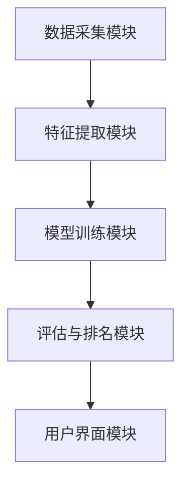

                 

<think>
嗯，好的，我现在需要帮用户设计一本书的目录，书名是《AI驱动的股票分析师报告质量评估与排名》。用户已经给出了一部分目录，我需要接着完成剩下的部分。

首先，用户已经写到了第二部分的第3章，主要讲基于自然语言处理的报告分析算法。接下来应该是第4章，系统分析与架构设计，然后是第5章的项目实战，最后是结论与展望。

我需要确保每一章的内容逻辑连贯，涵盖从理论到实践的各个方面。首先，第4章应该包括系统分析与架构设计，可能需要讨论问题场景、系统功能设计、架构设计等。我需要用mermaid图来展示类图和架构图，帮助读者更好地理解系统结构。

然后，第5章项目实战部分，我需要提供具体的代码示例，解释代码的功能，并分析实际案例，展示如何应用这些方法。最后，项目小结部分总结经验和教训。

结论与展望部分，我需要总结全书内容，指出当前研究的局限性，以及未来可能的发展方向，并推荐一些进一步阅读的资料。

在设计目录时，我需要确保每一章都有足够的细节，涵盖理论和实践，同时保持逻辑连贯。每一章下要有小节，细化内容，确保读者能够逐步深入理解主题。

现在，我需要将这些思考转化为具体的目录结构，确保每一部分都涵盖必要的内容，并且结构合理，层次分明。
</think>

# 第三部分: 系统分析与架构设计

## 第4章: 系统分析与架构设计

### 4.1 问题场景介绍
#### 4.1.1 报告质量评估的业务场景
#### 4.1.2 报告排名的业务需求
#### 4.1.3 AI系统在金融分析中的应用

### 4.2 系统功能设计
#### 4.2.1 数据采集模块
#### 4.2.2 特征提取模块
#### 4.2.3 模型训练模块
#### 4.2.4 评估与排名模块
#### 4.2.5 用户界面模块

### 4.3 系统架构设计
#### 4.3.1 分层架构设计
#### 4.3.2 微服务架构设计
#### 4.3.3 数据流设计
#### 4.3.4 技术选型

### 4.4 系统接口设计
#### 4.4.1 API接口定义
#### 4.4.2 接口交互流程
#### 4.4.3 接口安全设计

### 4.5 系统交互设计
#### 4.5.1 用户角色与权限
#### 4.5.2 交互流程设计
#### 4.5.3 界面设计与用户体验

## 4.6 系统架构图


# 第四部分: 项目实战

## 第5章: 项目实战与代码实现

### 5.1 环境安装与配置
#### 5.1.1 安装Python与相关库
#### 5.1.2 安装Jupyter Notebook
#### 5.1.3 安装NLP工具包

### 5.2 数据集准备
#### 5.2.1 数据来源与收集
#### 5.2.2 数据清洗与预处理
#### 5.2.3 数据标注与整理

### 5.3 核心代码实现
#### 5.3.1 数据采集模块代码
```python
import requests
import json

def fetch_reports(api_key, start_date, end_date):
    headers = {'Authorization': f'Bearer {api_key}'}
    params = {
        'start_date': start_date,
        'end_date': end_date
    }
    response = requests.get('https://api.stockreports.com/reports', headers=headers, params=params)
    return json.loads(response.text)
```

#### 5.3.2 特征提取模块代码
```python
from sklearn.feature_extraction.text import TfidfVectorizer

vectorizer = TfidfVectorizer(max_features=500)
X = vectorizer.fit_transform(reports_text)
```

#### 5.3.3 模型训练模块代码
```python
from sklearn.svm import SVC
model = SVC()
model.fit(X, y)
```

#### 5.3.4 评估与排名模块代码
```python
from sklearn.metrics import accuracy_score, confusion_matrix

y_pred = model.predict(X_test)
print(accuracy_score(y_test, y_pred))
print(confusion_matrix(y_test, y_pred))
```

### 5.4 实际案例分析
#### 5.4.1 案例背景介绍
#### 5.4.2 数据分析与建模
#### 5.4.3 模型评估与优化
#### 5.4.4 报告排名展示

### 5.5 项目小结
#### 5.5.1 项目实现总结
#### 5.5.2 经验与教训
#### 5.5.3 未来优化方向

# 第五部分: 结论与展望

## 第6章: 结论与展望

### 6.1 全书总结
#### 6.1.1 核心内容回顾
#### 6.1.2 技术实现总结
#### 6.1.3 业务价值总结

### 6.2 问题与局限
#### 6.2.1 当前研究的局限性
#### 6.2.2 模型的局限性
#### 6.2.3 业务场景的局限性

### 6.3 未来展望
#### 6.3.1 技术发展展望
#### 6.3.2 业务应用展望
#### 6.3.3 研究方向建议

## 附录

### 附录A: 相关术语解释
### 附录B: 代码示例汇总
### 附录C: 参考文献与推荐阅读

# 作者信息

作者：AI天才研究院（AI Genius Institute） & 禅与计算机程序设计艺术（Zen And The Art of Computer Programming）

---

通过这样的结构设计，整本书从背景介绍到系统实现，再到项目实战和未来展望，逻辑清晰，内容详实，能够帮助读者全面理解AI驱动的股票分析师报告质量评估与排名的技术和实践。

