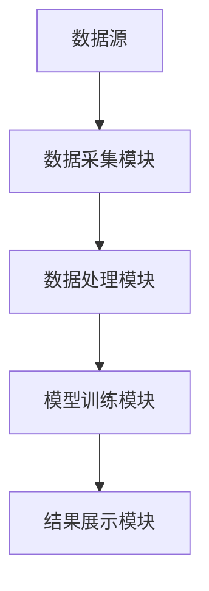
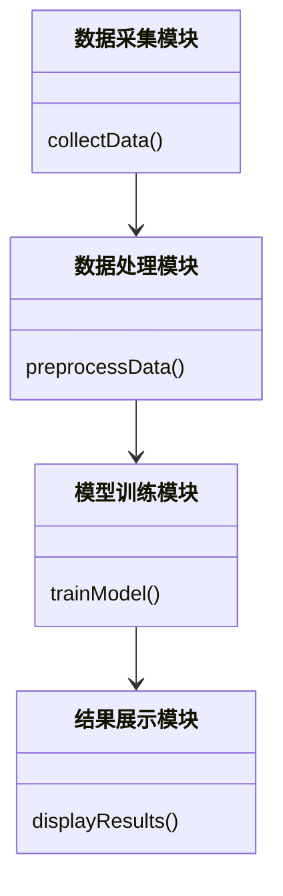

                 


# AI驱动的股票技术分析工具

> 关键词：AI，股票分析，技术指标，机器学习，深度学习，金融工具

> 摘要：本文将深入探讨AI在股票技术分析中的应用，从背景、核心概念、算法原理到系统架构和项目实战，全面解析如何利用AI技术提升股票分析的效率和准确性。通过详细分析和实例，展示如何构建一个高效可靠的AI驱动的股票技术分析工具。

---

# 第1章: 股票技术分析与AI的结合

## 1.1 股票技术分析的背景与意义

### 1.1.1 股票技术分析的核心概念
股票技术分析是一种通过分析历史价格和成交量等数据，预测未来价格走势的方法。其核心在于识别市场趋势、形态和交易信号。

### 1.1.2 AI技术在金融领域的应用前景
人工智能（AI）技术，尤其是机器学习和深度学习，正在改变金融领域的许多方面，包括股票分析。AI能够处理大量非结构化数据，发现隐藏的模式，并提供实时预测。

### 1.1.3 股票技术分析工具的演变
从传统的手工绘制图表到现代的计算机辅助分析工具，股票技术分析工具经历了从简单到复杂的演变。AI的引入进一步提升了工具的智能化和自动化水平。

## 1.2 AI驱动的股票技术分析工具的优势

### 1.2.1 提高分析效率
AI能够快速处理大量数据，生成实时分析结果，大大提高了股票分析的效率。

### 1.2.2 增强预测准确性
通过机器学习模型，AI可以识别传统方法难以发现的复杂模式，从而提高预测的准确性。

### 1.2.3 降低人为干扰
AI工具减少了人为情绪和偏见的影响，提供了更加客观和理性的分析结果。

## 1.3 本书的核心目标与内容框架

### 1.3.1 本书的核心目标
本书旨在介绍如何利用AI技术构建股票技术分析工具，涵盖从理论到实践的全过程。

### 1.3.2 本书的主要内容框架
- 第1章：介绍股票技术分析和AI的结合。
- 第2章：分析股票技术分析的核心数据特征。
- 第3章：探讨常见AI算法在股票分析中的应用。
- 第4章：详细讲解系统架构设计。
- 第5章：提供项目实战和代码实现。
- 第6章：总结最佳实践和未来展望。

### 1.3.3 本书的适用读者
本书适合对股票技术分析和AI技术感兴趣的读者，包括程序员、数据科学家、金融从业者以及相关领域的学生。

## 1.4 本章小结
本章介绍了股票技术分析的背景、AI技术在其中的应用优势，以及本书的结构和目标。

---

# 第2章: 股票技术分析的核心数据特征

## 2.1 股票价格数据的特征分析

### 2.1.1 时间序列数据的特性
股票价格数据具有时间依赖性，表现出趋势、周期性和随机性等特点。

### 2.1.2 常见技术指标
- **K线图**：显示开盘价、收盘价、最高价和最低价。
- **均线（MA）**：常用5日、10日、20日均线等。
- **MACD**：移动平均收敛散度指标，用于判断买卖信号。

### 2.1.3 市场情绪与新闻事件的影响
市场情绪和新闻事件会影响股票价格，这些因素可以通过社交媒体、新闻数据等非结构化数据进行分析。

## 2.2 AI驱动的特征工程

### 2.2.1 特征的选择与提取
通过统计分析和相关性分析，选择对预测影响最大的特征。

### 2.2.2 特征的标准化与归一化
使用标准化（Z-score）或归一化（Min-Max）等方法，确保不同特征具有可比性。

### 2.2.3 时间序列特征的构建
提取如动量、波动率、相对强弱等特征，用于模型训练。

## 2.3 核心概念对比分析

### 2.3.1 不同特征对预测效果的影响
通过实验对比，分析不同特征对模型预测能力的影响。

### 2.3.2 AI模型对特征的敏感性分析
通过特征重要性分析，确定哪些特征对模型预测结果影响最大。

### 2.3.3 特征与模型的交互作用
探讨特征选择与模型类型之间的相互影响。

## 2.4 本章小结
本章详细分析了股票技术分析中的核心数据特征，为后续模型构建奠定了基础。

---

# 第3章: 常见AI算法在股票分析中的应用

## 3.1 线性回归模型

### 3.1.1 线性回归的基本原理
线性回归是一种统计学方法，用于建立自变量和因变量之间的线性关系模型。

$$ y = \beta_0 + \beta_1 x_1 + \beta_2 x_2 + ... + \beta_n x_n $$

### 3.1.2 线性回归在股票预测中的应用
用于预测股票价格的趋势，但受制于其线性假设，可能无法捕捉复杂的价格波动。

### 3.1.3 线性回归的优缺点
- **优点**：简单易懂，计算高效。
- **缺点**：假设线性关系，可能不适用于复杂的时间序列数据。

## 3.2 随机森林模型

### 3.2.1 随机森林的基本原理
随机森林是一种基于决策树的集成学习方法，通过投票或平均的方式进行预测。

### 3.2.2 随机森林在股票预测中的应用
用于分类任务，如判断股票的涨跌趋势。

### 3.2.3 随机森林的优缺点
- **优点**：抗过拟合，适合高维数据。
- **缺点**：解释性较差，计算复杂度高。

## 3.3 LSTM模型

### 3.3.1 LSTM的基本原理
LSTM（长短期记忆网络）通过引入记忆单元和门控机制，能够捕捉长期依赖关系。

### 3.3.2 LSTM在时间序列预测中的应用
广泛应用于股票价格预测，能够捕捉时间序列中的复杂模式。

### 3.3.3 LSTM的优缺点
- **优点**：适合时间序列数据，能够捕捉长期依赖关系。
- **缺点**：训练复杂，可能需要大量计算资源。

## 3.4 算法对比与选择策略

### 3.4.1 不同算法的性能对比
通过实验对比线性回归、随机森林和LSTM在股票预测中的表现。

### 3.4.2 算法选择的影响因素
包括数据类型、任务类型（回归/分类）、计算资源等。

### 3.4.3 实际场景中的算法优化
结合业务需求和数据特点，进行算法调优和组合策略。

## 3.5 本章小结
本章介绍了几种常见的AI算法，并分析了它们在股票预测中的应用和优缺点。

---

# 第4章: 系统功能设计与实现

## 4.1 系统功能模块划分

### 4.1.1 数据采集模块
负责收集股票历史数据、市场新闻等信息。

### 4.1.2 数据处理模块
对数据进行清洗、特征提取和预处理。

### 4.1.3 模型训练模块
选择合适的算法，训练模型并进行调优。

### 4.1.4 结果展示模块
将模型预测结果以可视化形式呈现，帮助用户做出决策。

## 4.2 数据流与系统架构设计

### 4.2.1 数据流设计
从数据源到模型输出的完整流程。



### 4.2.2 系统架构设计
采用分层架构，包括数据层、业务逻辑层和表现层。



## 4.3 本章小结
本章详细描述了系统功能模块和架构设计，为后续实现奠定了基础。

---

# 第5章: 项目实战与代码实现

## 5.1 环境安装与配置

### 5.1.1 安装Python和相关库
安装`numpy`、`pandas`、`scikit-learn`、`keras`等库。

### 5.1.2 数据源获取
从Yahoo Finance获取股票数据。

## 5.2 核心代码实现

### 5.2.1 数据预处理代码

```python
import pandas as pd
import numpy as np

# 读取数据
data = pd.read_csv('stock_data.csv')

# 数据清洗
data = data.dropna()
data = data[~data['volume'].isin([0])]
```

### 5.2.2 LSTM模型实现

```python
from tensorflow.keras.models import Sequential
from tensorflow.keras.layers import LSTM, Dense

model = Sequential()
model.add(LSTM(50, input_shape=(timesteps, features)))
model.add(Dense(1))
model.compile(loss='mean_squared_error', optimizer='adam')
```

## 5.3 实际案例分析

### 5.3.1 数据分析与可视化
使用Matplotlib绘制股票价格走势和预测结果对比图。

### 5.3.2 模型评估与优化
通过均方误差（MSE）和R平方值评估模型性能，并进行超参数调优。

## 5.4 本章小结
本章通过实际案例展示了如何利用AI技术构建股票技术分析工具，并提供了详细的代码实现。

---

# 第6章: 最佳实践与未来展望

## 6.1 最佳实践

### 6.1.1 数据处理的注意事项
确保数据的完整性和准确性，避免噪声干扰。

### 6.1.2 模型选择的策略
根据具体任务和数据特点选择合适的算法，并进行充分的实验验证。

### 6.1.3 结果验证的技巧
通过回测和交叉验证，评估模型的稳定性和可靠性。

## 6.2 未来展望

### 6.2.1 多模态数据的融合
结合文本数据、图像数据等多模态信息，提升分析效果。

### 6.2.2 自适应模型的开发
开发能够自适应市场变化的动态模型，提高预测的实时性。

## 6.3 本章小结
本章总结了AI驱动的股票技术分析工具的最佳实践，并展望了未来的发展方向。

---

# 作者：AI天才研究院 & 禅与计算机程序设计艺术

