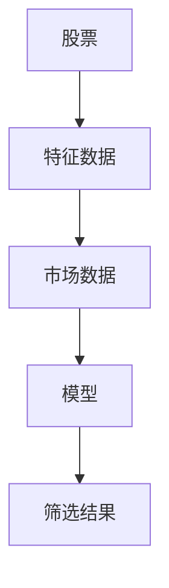
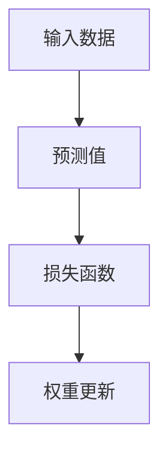
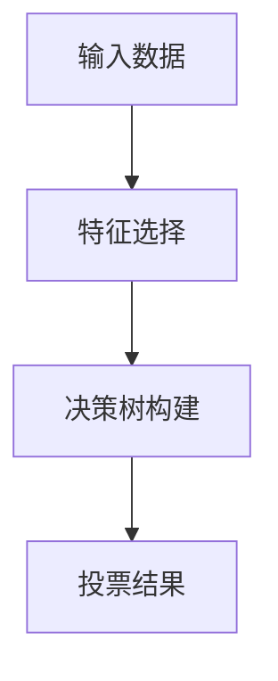
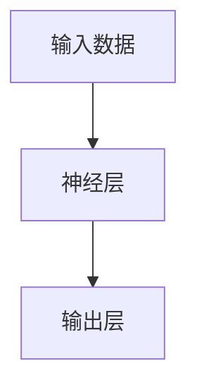
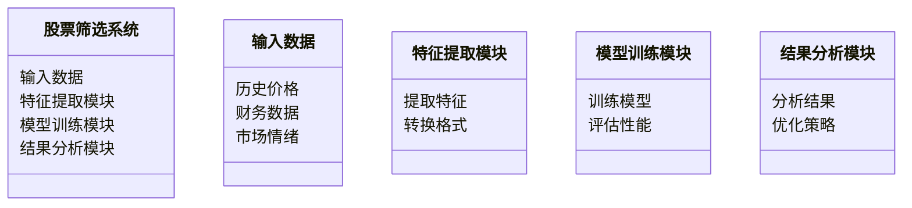

                 


# AI驱动的股票筛选工具

> 关键词：AI驱动，股票筛选工具，投资决策，机器学习，数据分析

> 摘要：本文将详细探讨AI驱动的股票筛选工具的构建与应用。通过分析传统股票筛选的局限性，介绍AI技术在金融领域的潜力，阐述工具的核心概念与算法原理，并通过实际案例展示其应用效果。最后，总结工具的优势与未来发展方向。

## 第1章: 背景介绍

### 1.1 问题背景与描述

#### 1.1.1 传统股票筛选的局限性
- **信息过载**：金融市场数据繁多，投资者难以从中提取有效信息。
- **情绪影响**：投资者情绪波动可能导致决策失误。
- **计算复杂度**：传统筛选方法依赖人工经验，效率低下。

#### 1.1.2 AI技术在金融领域的应用潜力
- **数据处理能力**：AI能够处理大量非结构化数据，如新闻、社交媒体信息。
- **模式识别**：AI能识别复杂数据中的模式，预测市场趋势。
- **实时分析**：AI工具能够实时监控市场变化，提供及时反馈。

#### 1.1.3 AI驱动股票筛选工具的必要性
- **提高效率**：自动化数据处理和分析，节省时间。
- **增强准确性**：基于大量数据训练的模型，提高预测精度。
- **个性化投资**：根据投资者风险偏好定制筛选策略。

### 1.2 核心概念与目标

#### 1.2.1 股票筛选工具的核心目标
- 筛选出符合特定条件的股票，帮助投资者做出决策。

#### 1.2.2 AI驱动的定义与实现方式
- **定义**：利用AI技术，通过数据分析和机器学习模型，筛选股票。
- **实现方式**：数据收集、特征提取、模型训练、结果分析。

#### 1.2.3 工具的边界与外延
- **边界**：仅提供筛选功能，不涉及交易执行。
- **外延**：可扩展至市场预测、风险评估等。

## 第2章: 核心概念与联系

### 2.1 AI与股票筛选的结合

#### 2.1.1 数据特征提取
- **财务指标**：市盈率、市净率、ROE等。
- **市场情绪指标**：新闻标题情感分析、社交媒体热度。

#### 2.1.2 模型选择与训练
- **选择模型**：根据数据类型和任务选择合适的算法，如随机森林、神经网络。
- **训练模型**：使用历史数据训练模型，调整参数优化性能。

#### 2.1.3 结果分析与优化
- **分析结果**：评估模型准确率、召回率等。
- **优化策略**：调整特征、模型参数，或引入新数据。

### 2.2 核心概念属性对比

#### 2.2.1 数据特征对比表

| 特征类型 | 特征名称 | 描述 | 示例 |
|----------|----------|------|------|
| 财务指标 | 市盈率   | 价格与收益比 | 15.2 |
| 市场情绪 | 情感指数 | 新闻情感分析结果 | 正向 |
| 技术指标 | 均线     | 移动平均线 | 100 |

#### 2.2.2 模型性能对比表

| 模型名称 | 准确率 | 召回率 | F1分数 |
|----------|--------|--------|--------|
| 线性回归 | 70%    | 65%    | 67.5%  |
| 随机森林 | 85%    | 80%    | 82.5%  |
| 神经网络 | 88%    | 82%    | 85%    |

### 2.3 ER实体关系图



## 第3章: 算法原理

### 3.1 机器学习算法

#### 3.1.1 线性回归



公式：
$$ y = \beta_0 + \beta_1x + \epsilon $$

#### 3.1.2 随机森林



### 3.2 深度学习算法

#### 3.2.1 神经网络



## 第4章: 数学模型与公式

### 4.1 线性回归模型

公式：
$$ y = \beta_0 + \beta_1x + \epsilon $$

### 4.2 随机森林算法

公式：
$$ \text{投票结果} = \sum (\text{投票数}) $$

## 第5章: 系统分析与架构设计

### 5.1 系统架构设计



## 第6章: 项目实战

### 6.1 环境安装

- **Python**：安装Anaconda或Miniconda。
- **库安装**：使用pip安装numpy、pandas、scikit-learn、keras、tensorflow。

### 6.2 核心实现

#### 6.2.1 数据预处理

```python
import pandas as pd
import numpy as np

# 加载数据
data = pd.read_csv('stock_data.csv')

# 特征提取
features = data[['PE', 'PB', 'ROE', 'sentiment_score']]
labels = data['target']

# 数据分割
from sklearn.model_selection import train_test_split
X_train, X_test, y_train, y_test = train_test_split(features, labels, test_size=0.2, random_state=42)
```

#### 6.2.2 模型训练

```python
from sklearn.ensemble import RandomForestClassifier

model = RandomForestClassifier(n_estimators=100, max_depth=2, random_state=42)
model.fit(X_train, y_train)
```

#### 6.2.3 结果分析

```python
from sklearn.metrics import accuracy_score, recall_score, f1_score

y_pred = model.predict(X_test)
print(f"准确率：{accuracy_score(y_test, y_pred)}")
print(f"召回率：{recall_score(y_test, y_pred)}")
print(f"F1分数：{f1_score(y_test, y_pred)}")
```

### 6.3 案例分析

- **数据来源**：某段时间内的股票数据，包括价格、财务指标、新闻标题。
- **模型训练**：使用随机森林模型，筛选出高潜力股票。
- **结果验证**：验证筛选出的股票在后续的表现，评估模型的有效性。

## 第7章: 最佳实践与小结

### 7.1 最佳实践

- **数据质量**：确保数据来源可靠，清洗充分。
- **模型选择**：根据数据类型和任务选择合适的算法。
- **结果验证**：定期验证模型性能，及时调整。

### 7.2 小结

本文详细介绍了AI驱动的股票筛选工具的构建过程，从背景分析到算法实现，再到实际应用，展示了其在投资决策中的巨大潜力。通过具体案例，验证了工具的有效性，为投资者提供了有力的支持。

## 作者

作者：AI天才研究院/AI Genius Institute & 禅与计算机程序设计艺术 /Zen And The Art of Computer Programming

