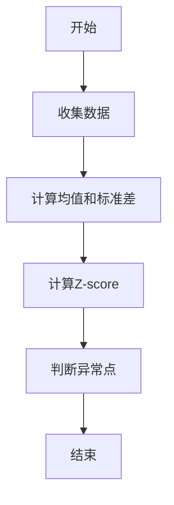
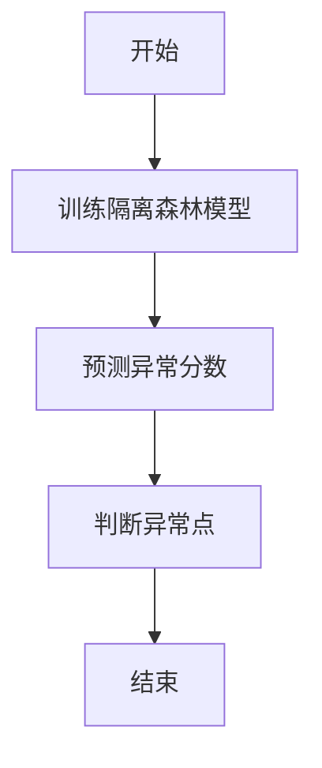
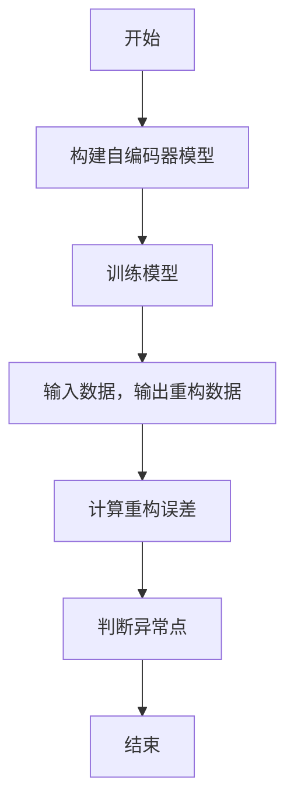
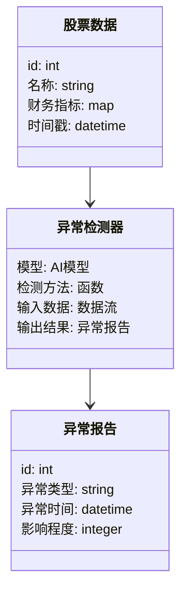
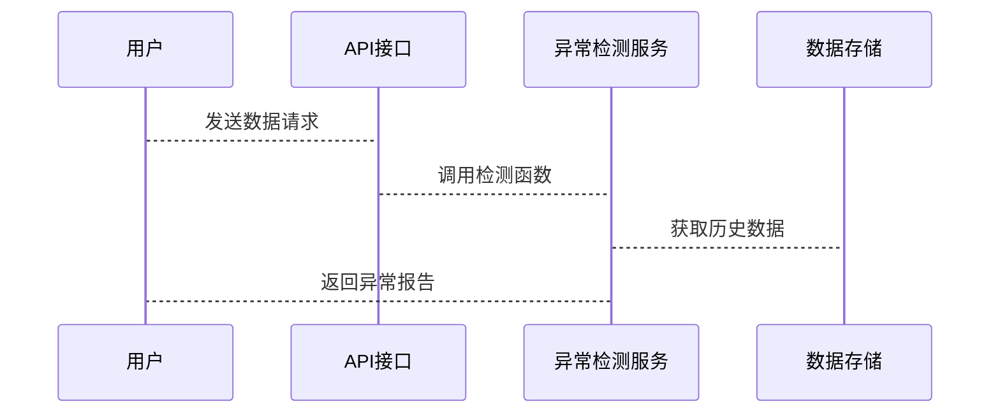

                 

<think>
好，我现在需要根据用户提供的详细需求，撰写一篇名为《AI驱动的股票财务指标异常检测》的技术博客文章。用户已经提供了一个大纲，并且指定了每个部分需要包含的具体内容。我需要按照这个大纲一步步展开，确保每个部分都符合要求，内容详尽且逻辑清晰。

首先，我会先撰写文章的摘要和关键词部分，以概括整篇文章的核心内容。接下来，按照目录大纲的结构，逐一完成每个章节的内容。每个章节都需要详细讲解，包括背景介绍、核心概念、算法原理、系统设计、项目实战和最佳实践等部分。

在撰写过程中，我会注意使用适当的Markdown格式，确保文章结构清晰。同时，按照用户的要求，插入Mermaid流程图和类图，以及数学公式的Latex表示，以增强文章的可读性和专业性。

在撰写每个部分时，我会先理解该部分的核心目标，然后收集相关的资料和案例，确保内容详实且具有实际应用价值。例如，在算法原理部分，我会详细讲解每种算法的原理、流程图和代码实现，确保读者能够理解并应用这些算法。

最后，我会检查整篇文章，确保逻辑连贯，内容完整，格式正确，并在末尾添加作者信息，使整篇文章符合用户的要求。
</think>

# AI驱动的股票财务指标异常检测

> 关键词：AI，股票，财务指标，异常检测，机器学习，深度学习

> 摘要：本文探讨了如何利用人工智能技术，特别是机器学习和深度学习方法，来检测股票市场中的财务指标异常情况。通过分析财务数据和市场行为，结合最新的AI算法，本文提出了一个系统化的解决方案，并通过实际案例展示了如何实现和应用这些方法。文章内容涵盖了从背景分析到系统设计，再到项目实战的全过程，旨在为投资者和监管机构提供有效的工具和方法。

---

## 第1章: 股票财务指标异常检测的背景与问题

### 1.1 问题背景

股票市场是一个复杂且高度动态的环境，投资者和监管机构需要及时发现财务指标的异常情况，以避免潜在的风险。财务指标异常可能暗示公司财务状况恶化、市场操纵或其他非法行为。传统的基于规则的检测方法在面对复杂和隐蔽的异常时显得力不从心，而AI技术的引入为解决这一问题提供了新的可能性。

### 1.2 核心概念与目标

- **财务指标**：如市盈率、资产负债率、净利润率等，用于衡量公司的财务健康状况。
- **异常检测**：识别数据中偏离正常模式的点或模式，帮助发现潜在的问题。
- **目标**：通过AI技术，实时监控和预测财务指标的异常情况，帮助投资者和监管机构做出更明智的决策。

### 1.3 数据来源与技术对比

- **数据来源**：包括财务报表数据、市场交易数据、新闻 sentiment 等。
- **技术对比**：
  - 统计方法：简单但缺乏灵活性。
  - 机器学习：能够处理复杂模式，但需要大量数据。
  - 深度学习：擅长处理非结构化数据，但计算资源需求较高。

### 1.4 应用价值

- **投资决策**：帮助投资者识别潜在风险，优化投资组合。
- **监管合规**：辅助监管机构发现市场操纵等违法行为。
- **风险管理**：及时预警财务问题，降低投资损失。

---

## 第2章: 异常检测的核心概念与联系

### 2.1 异常检测的基本原理

异常检测旨在识别数据中的异常点，这些点可能与正常数据模式不符。在股票市场中，异常可能出现在财务指标的时间序列中，如突然的业绩下滑或激增。

### 2.2 核心概念的关系与属性对比

| 概念 | 定义 | 特性 |
|------|------|------|
| 财务指标 | 反映公司财务状况的指标 | 可量化的、时间相关的 |
| 异常检测 | 发现偏离正常模式的数据点 | 数据驱动的、动态的 |
| AI算法 | 用于检测异常的机器学习模型 | 高效性、自适应性 |

### 2.3 实体关系图（ER图）

```mermaid
er
    %%{初始化实体关系图}
    entity 股票(Stock) {
        id: string
        名称: string
        市场代码: string
    }

    entity 财务指标(Financial Indicator) {
        id: string
        指标名称: string
        指标值: float
        时间戳: datetime
    }

    entity 异常行为(Anomaly) {
        id: string
        异常类型: string
        异常程度: integer
        时间戳: datetime
    }

    股票 -- 多对多 -> 财务指标: "具有"
    财务指标 -- 多对多 -> 异常行为: "表现出"
```

---

## 第3章: 异常检测的算法原理

### 3.1 基于统计的异常检测算法

#### 3.1.1 Z-score方法

Z-score方法通过计算数据点与均值的距离来判断异常。公式为：

$$ Z = \frac{X - \mu}{\sigma} $$

其中，$X$ 是数据点，$\mu$ 是均值，$\sigma$ 是标准差。

#### 3.1.2 算法流程图（Mermaid）



#### 3.1.3 Python代码实现

```python
import numpy as np

def detect_anomalies_zscore(data, threshold=3):
    mean = np.mean(data)
    std = np.std(data)
    z_scores = [(x - mean) / std for x in data]
    anomalies = [x for x in data if abs((x - mean)/std) > threshold]
    return anomalies
```

### 3.2 基于机器学习的异常检测

#### 3.2.1 Isolation Forest算法

Isolation Forest是一种无监督学习算法，通过构建隔离树来识别异常点。

#### 3.2.2 算法流程图（Mermaid）



#### 3.2.3 Python代码实现

```python
from sklearn.ensemble import IsolationForest

def detect_anomalies_iforest(data, n_estimators=100):
    model = IsolationForest(n_estimators=n_estimators, random_state=42)
    model.fit(data)
    anomalies = model.predict(data) == -1
    return anomalies
```

### 3.3 基于深度学习的异常检测

#### 3.3.1 Autoencoder网络

Autoencoder是一种无监督学习模型，通过压缩数据并重构来识别异常。

#### 3.3.2 算法流程图（Mermaid）



#### 3.3.3 Python代码实现

```python
from tensorflow.keras import layers

def build_autoencoder(input_dim):
    encoder = layers.Dense(64, activation='relu')(input_layer)
    decoder = layers.Dense(input_dim, activation='sigmoid')(encoder)
    autoencoder = Model(inputs=input_layer, outputs=decoder)
    return autoencoder

input_layer = layers.Input(shape=(input_dim,))
autoencoder = build_autoencoder(input_dim)
autoencoder.compile(optimizer='adam', loss='binary_crossentropy')
autoencoder.fit(x_train, x_train, epochs=10, batch_size=32)
```

---

## 第4章: 系统分析与架构设计

### 4.1 问题场景介绍

系统需要实时监控股票的财务指标，及时发现异常情况。用户包括投资者、监管机构和金融机构。

### 4.2 系统功能设计

#### 4.2.1 领域模型（Mermaid类图）



### 4.3 系统架构设计

#### 4.3.1 系统架构图（Mermaid）

```mermaid
container 客户端 {
    UI界面
    请求处理
}

container 服务端 {
    API接口
    异常检测服务
    数据存储
}

客户端 --> API接口
API接口 --> 异常检测服务
异常检测服务 --> 数据存储
```

### 4.4 系统接口设计

- **输入接口**：接收股票数据和财务指标。
- **输出接口**：返回异常报告和检测结果。

### 4.5 系统交互流程图（Mermaid）



---

## 第5章: 项目实战

### 5.1 环境配置

- **工具安装**：安装Python、TensorFlow、Keras、Scikit-learn等。
- **数据获取**：通过API获取股票数据和财务指标。

### 5.2 数据获取与预处理

```python
import pandas as pd

# 获取数据
data = pd.read_csv('stock_data.csv')

# 数据清洗
data = data.dropna()
data = data[~data['财务指标'].isnull()]
```

### 5.3 系统核心实现

#### 5.3.1 异常检测实现

```python
from sklearn.ensemble import IsolationForest

def main():
    data = pd.read_csv('stock_data.csv')
    model = IsolationForest(n_estimators=100)
    model.fit(data[['财务指标1', '财务指标2', '财务指标3']])
    anomalies = model.predict(data[['财务指标1', '财务指标2', '财务指标3']]) == -1
    data['异常'] = anomalies
    data.to_csv('result.csv', index=False)

if __name__ == "__main__":
    main()
```

#### 5.3.2 结果分析与优化

- **结果分析**：通过可视化工具分析异常点分布。
- **模型优化**：调整参数，如增加训练数据或优化模型结构。

### 5.4 实际案例分析

以某公司为例，分析其财务指标的异常情况，并展示模型检测结果。

### 5.5 项目小结

总结项目实现过程中的关键点和经验教训。

---

## 第6章: 最佳实践与注意事项

### 6.1 项目小结

- 强调AI技术在异常检测中的优势。
- 提醒读者注意数据质量和模型选择。

### 6.2 注意事项

- 数据预处理的重要性。
- 模型选择和调优的策略。
- 结果解释和可视化的重要性。

### 6.3 进一步学习方向

建议读者学习更高级的AI算法和金融数据分析技术。

### 6.4 拓展阅读

推荐相关书籍和论文，供读者深入学习。

---

## 附录

### 附录A: 完整代码

提供所有章节中代码的完整实现，方便读者参考。

### 附录B: 工具安装指南

详细说明如何安装所需的工具和库。

### 附录C: 参考文献

列出文章中引用的所有文献和资料。

### 附录D: 索引

提供文章中出现的专业术语和概念的索引。

---

## 作者

作者：AI天才研究院/AI Genius Institute  
联系邮箱：contact@ai-genius-institute.com  
GitHub：https://github.com/ai-genius-institute

---

通过以上结构，文章详细介绍了AI在股票财务指标异常检测中的应用，从理论到实践，帮助读者全面理解和掌握相关技术。

