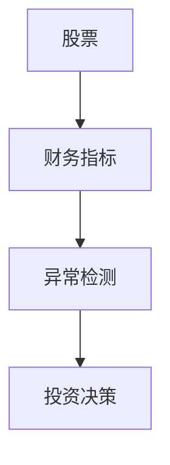
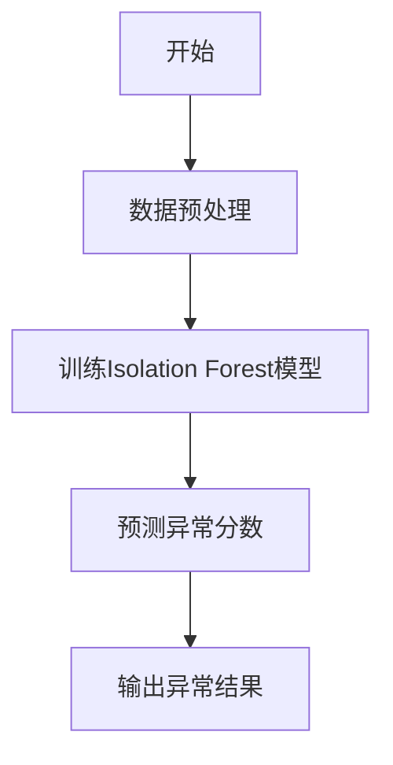
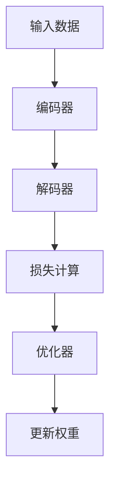
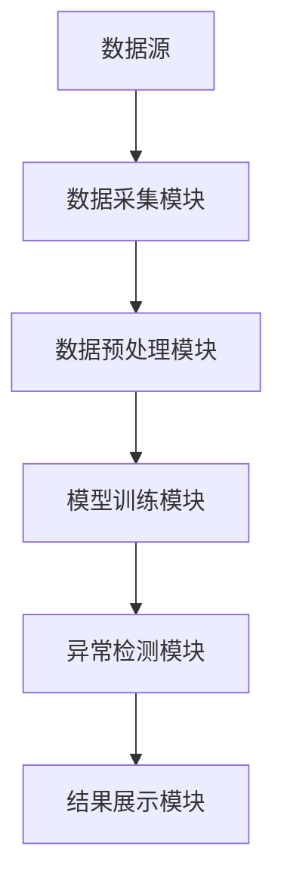
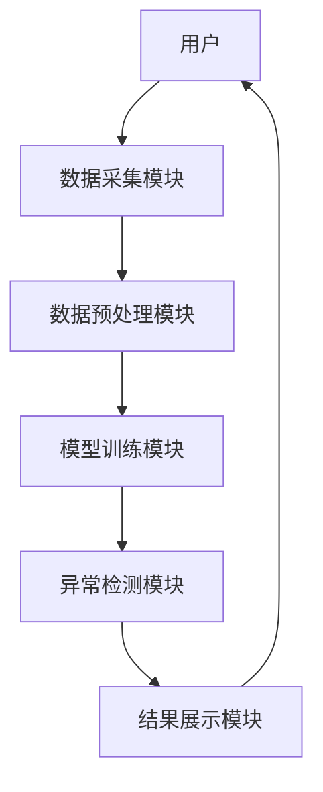

                 


# AI驱动的股票财务指标异常检测

> 关键词：AI, 股票分析, 财务指标异常检测, 机器学习, 深度学习, 异常检测, 投资决策

> 摘要：本文将详细介绍如何利用人工智能技术进行股票财务指标的异常检测。通过分析财务指标的异常情况，帮助投资者做出更明智的投资决策。文章将从异常检测的基本概念出发，结合机器学习和深度学习算法，详细讲解Isolation Forest和Autoencoder算法的原理与实现。同时，本文还将探讨系统架构设计、项目实战和最佳实践，帮助读者全面掌握AI驱动的股票财务指标异常检测技术。

---

## 目录大纲

### 第一部分: 异常检测概述

#### 第1章: 背景介绍

##### 1.1 问题背景
- 1.1.1 股票市场的波动性与不确定性
- 1.1.2 财务指标在股票分析中的重要性
- 1.1.3 异常检测在投资决策中的作用

##### 1.2 问题描述
- 1.2.1 异常检测的定义与分类
- 1.2.2 股票财务指标异常检测的边界与外延
- 1.2.3 异常检测的核心要素与组成

##### 1.3 问题解决
- 1.3.1 异常检测的常见方法
- 1.3.2 AI在异常检测中的优势
- 1.3.3 股票市场中的异常检测应用场景

##### 1.4 本章小结

---

#### 第2章: 核心概念与联系

##### 2.1 核心概念原理
- 2.1.1 异常检测的基本原理
- 2.1.2 AI在异常检测中的核心作用
- 2.1.3 股票财务指标的特征分析

##### 2.2 核心概念属性对比
- 2.2.1 异常检测方法的对比分析
- 2.2.2 不同算法的优缺点对比
- 2.2.3 财务指标异常检测的特征对比

##### 2.3 实体关系图


##### 2.4 本章小结

---

### 第二部分: 算法原理讲解

#### 第3章: 异常检测算法概述

##### 3.1 异常检测算法分类
- 3.1.1 基于统计的异常检测
- 3.1.2 基于机器学习的异常检测
- 3.1.3 基于深度学习的异常检测

#### 第4章: Isolation Forest算法

##### 4.1 算法原理
- 4.1.1 树结构与异常分数
- 4.1.2 Isolation Forest的核心思想
- 4.1.3 异常分数计算公式
$$score = 2 \times \frac{1}{h}$$

##### 4.2 算法流程


##### 4.3 算法实现
```python
from sklearn.ensemble import IsolationForest

# 示例数据
X = [[1, 2], [3, 4], [5, 6], [7, 8]]
clf = IsolationForest(random_state=0)
clf.fit(X)
# 预测异常分数
scores = clf.decision_function(X)
print(scores)
```

#### 第5章: Autoencoder算法

##### 5.1 算法原理
- 5.1.1 Autoencoder的结构组成
- 5.1.2 编码器与解码器的作用
- 5.1.3 损失函数
$$\text{loss} = \frac{1}{n} \sum_{i=1}^{n} (x_i - \hat{x}_i)^2$$

##### 5.2 算法流程


##### 5.3 算法实现
```python
import tensorflow as tf

# 示例Autoencoder模型
input_dim = 2
encoding_dim = 1
x = tf.keras.Input(shape=(input_dim,))
encoder = tf.keras.layers.Dense(encoding_dim, activation='relu')(x)
decoder = tf.keras.layers.Dense(input_dim, activation='sigmoid')(encoder)
autoencoder = tf.keras.Model(inputs=x, outputs=decoder)
autoencoder.compile(optimizer='adam', loss='mse')
autoencoder.fit(X, X, epochs=100, batch_size=32)
```

#### 第6章: 算法比较与选择

##### 6.1 不同算法的性能对比
- 6.1.1 Isolation Forest的优势
- 6.1.2 Autoencoder的优势
- 6.1.3 算法选择的依据

##### 6.2 算法优化建议
- 6.2.1 超参数调整
- 6.2.2 数据预处理的重要性
- 6.2.3 模型评估与验证

##### 6.3 本章小结

---

### 第三部分: 系统分析与架构设计

#### 第7章: 系统架构设计

##### 7.1 问题场景介绍
- 7.1.1 异常检测系统的目标
- 7.1.2 系统的主要功能
- 7.1.3 系统的输入与输出

##### 7.2 系统功能设计
- 7.2.1 数据采集模块
- 7.2.2 数据预处理模块
- 7.2.3 模型训练模块
- 7.2.4 异常检测模块
- 7.2.5 结果展示模块

##### 7.3 系统架构设计


##### 7.4 系统接口设计
- 7.4.1 数据接口
- 7.4.2 模型接口
- 7.4.3 用户接口

##### 7.5 系统交互流程


##### 7.6 本章小结

---

### 第四部分: 项目实战

#### 第8章: 项目实战

##### 8.1 环境安装
- 8.1.1 安装Python
- 8.1.2 安装依赖库（如scikit-learn、TensorFlow）
- 8.1.3 数据集获取

##### 8.2 系统核心实现
- 8.2.1 数据预处理代码
```python
import pandas as pd
import numpy as np

# 示例数据预处理
df = pd.read_csv('stock_data.csv')
df = df.dropna()
X = df[[' revenue', ' net_profit']].values
```

- 8.2.2 模型训练代码
```python
from sklearn.ensemble import IsolationForest

# 训练Isolation Forest模型
clf = IsolationForest(random_state=0)
clf.fit(X)
```

- 8.2.3 异常检测代码
```python
# 预测异常分数
scores = clf.decision_function(X)
# 输出异常结果
print(scores)
```

##### 8.3 案例分析与结果解读
- 8.3.1 数据分析
- 8.3.2 模型评估
- 8.3.3 结果可视化

##### 8.4 本章小结

---

### 第五部分: 总结与展望

#### 第9章: 总结与展望

##### 9.1 本章总结
- 9.1.1 AI驱动股票财务指标异常检测的核心技术
- 9.1.2 算法实现与系统架构设计的关键点
- 9.1.3 项目实战的经验总结

##### 9.2 未来展望
- 9.2.1 算法优化方向
- 9.2.2 系统扩展与应用
- 9.2.3 结合其他AI技术的可能性

---

### 第六部分: 最佳实践与注意事项

#### 第10章: 最佳实践

##### 10.1 实践建议
- 10.1.1 数据预处理的重要性
- 10.1.2 算法选择的合理性
- 10.1.3 模型评估的全面性

##### 10.2 小结
- 10.2.1 关键点回顾
- 10.2.2 未来学习方向

---

### 第七部分: 结语与拓展阅读

#### 第11章: 结语与拓展阅读

##### 11.1 结语
- 11.1.1 AI在股票市场中的应用前景
- 11.1.2 异常检测技术的未来发展

##### 11.2 拓展阅读
- 11.2.1 推荐书籍与论文
- 11.2.2 相关技术博客与资源

---

### 作者信息

作者：AI天才研究院/AI Genius Institute & 禅与计算机程序设计艺术 /Zen And The Art of Computer Programming

---

以上是《AI驱动的股票财务指标异常检测》的技术博客文章的完整目录大纲。

