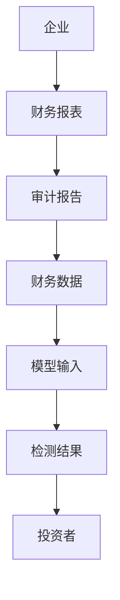
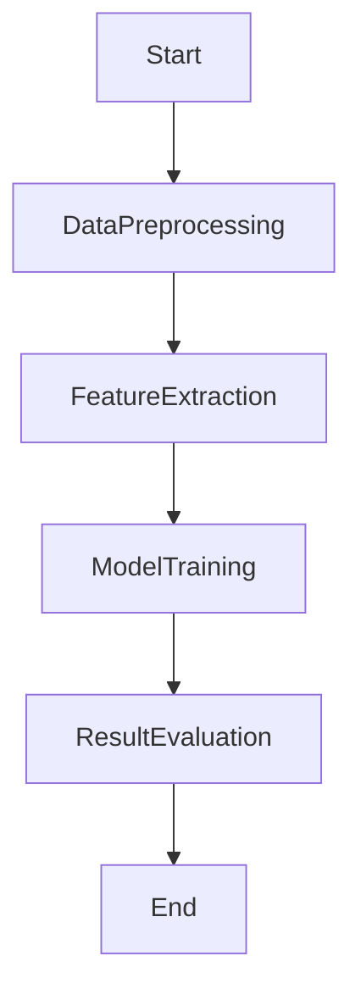
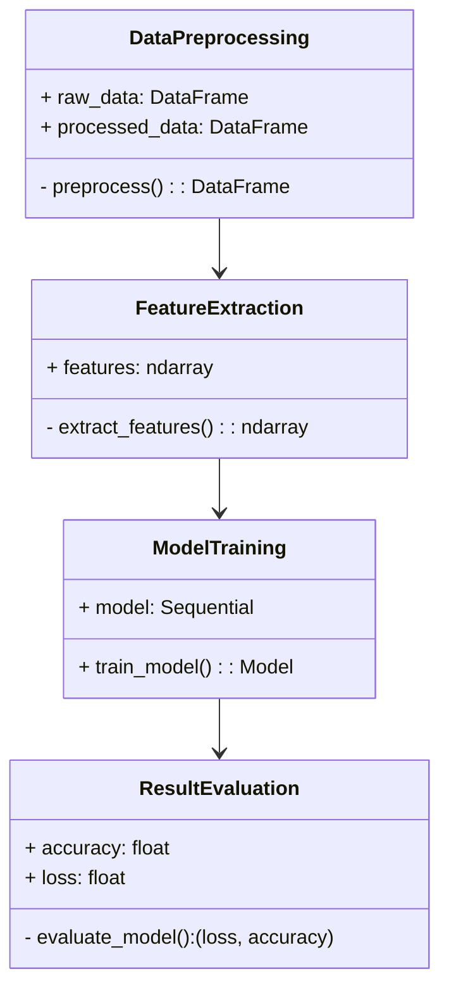
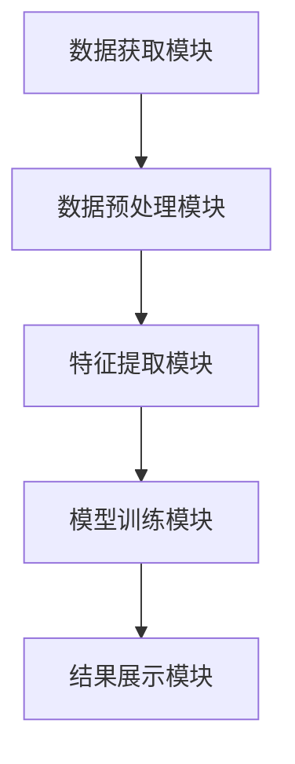
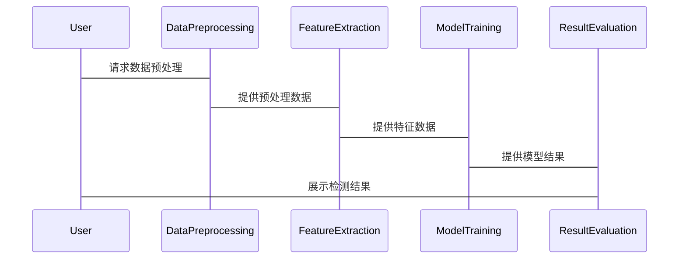

                 


# AI驱动的股票财务造假检测模型

> 关键词：股票财务造假、AI检测模型、NLP、时间序列分析、多模态数据

> 摘要：本文将详细探讨如何利用人工智能技术构建股票财务造假检测模型。通过分析财务数据和文本信息，结合NLP和时间序列分析等技术手段，提出了一种多模态数据融合的检测方法，能够有效识别财务造假行为。本文从问题背景、核心概念、算法原理、系统架构到项目实战，全面系统地介绍了该模型的构建过程，并通过实例分析展示了其实际应用价值。

---

# 第一部分: 背景介绍

## 第1章: 问题背景

### 1.1 核心概念术语说明

- **股票财务造假**：指企业在财务报表中虚构收入、隐瞒支出或虚增资产等行为，以误导投资者和监管机构。
- **AI驱动的检测模型**：利用人工智能技术，通过分析财务数据和相关文本信息，识别潜在的财务造假行为。
- **NLP**：自然语言处理技术，用于分析财务报告、新闻等非结构化文本数据。
- **时间序列分析**：用于分析财务数据的时间依赖性，发现异常波动。

### 1.2 问题背景

#### 1.2.1 股票市场中的虚假信息问题

股票市场的信息不对称性使得企业财务造假行为屡禁不止。虚假的财务报告不仅损害了投资者的利益，还可能导致市场信任危机。传统的人工审查方法效率低下，难以应对海量数据的挑战。

#### 1.2.2 传统财务造假检测方法的局限性

传统财务造假检测主要依赖人工审查和简单的统计分析，存在以下问题：
- **数据量有限**：人工审查范围有限，难以覆盖全部数据。
- **效率低下**：人工审查耗时长，难以及时发现造假行为。
- **主观性**：审查结果依赖于审计人员的经验和判断，存在主观性。

#### 1.2.3 AI技术在财务检测中的优势

AI技术通过自动化分析和模式识别，能够高效处理海量数据，发现隐藏的异常模式。具体优势包括：
- **高效性**：AI可以快速处理大量财务数据和文本信息。
- **准确性**：通过训练模型，AI能够识别复杂的财务造假模式。
- **可扩展性**：AI模型可以轻松扩展到更多的数据集和场景。

### 1.3 问题解决思路

#### 1.3.1 问题描述

股票财务造假行为主要通过虚构收入、虚增资产、隐瞒债务等方式实现。这些行为通常会导致财务数据的异常波动和文本信息的矛盾。

#### 1.3.2 解决思路

通过结合财务数据的时间序列特征和文本数据的语义信息，利用AI技术构建一个多模态检测模型。该模型能够从财务数据中提取异常模式，并通过文本分析发现潜在的虚假信息。

#### 1.3.3 边界与外延

- **边界**：主要针对上市公司财务报表造假行为，不包括企业内部管理问题。
- **外延**：可以扩展到其他类型的财务舞弊检测，如关联交易舞弊、税务舞弊等。

### 1.4 核心要素组成

- **财务数据**：包括收入、支出、资产、负债等财务指标的时间序列数据。
- **文本数据**：包括财务报告、新闻、公告等非结构化文本。
- **AI模型**：基于深度学习的多模态模型，结合NLP和时间序列分析技术。

---

## 第2章: 核心概念与联系

### 2.1 核心概念原理

#### 2.1.1 AI驱动的检测模型

AI检测模型通过以下步骤实现财务造假检测：
1. **数据获取**：收集企业的财务数据和相关文本信息。
2. **数据预处理**：清洗和标准化数据，提取特征。
3. **模型训练**：利用深度学习模型学习正常和异常数据的模式。
4. **结果分析**：通过模型输出识别潜在的财务造假行为。

#### 2.1.2 财务数据特征

财务数据的特征包括：
- **时间序列性**：财务数据具有明显的时间依赖性。
- **波动性**：正常情况下，财务数据会有一定的波动范围，异常情况下波动幅度显著增大。
- **相关性**：不同财务指标之间存在一定的相关性，虚假数据可能导致相关性异常。

#### 2.1.3 文本数据特征

文本数据的特征包括：
- **语义信息**：财务报告中的语义信息可以帮助识别虚假陈述。
- **情感倾向**：文本中的情感倾向可能与财务造假行为相关。
- **关键词提取**：通过关键词提取技术识别与财务造假相关的术语。

### 2.2 实体关系图



### 2.3 核心概念对比表

| 概念       | 特征                     | 描述                                   |
|------------|--------------------------|---------------------------------------|
| 财务数据     | 时间序列性               | 数据按时间排列，反映企业财务状况的变化 |
| 文本数据     | 非结构化                 | 包括财务报告、新闻等                   |
| AI模型       | 多模态                   | 综合文本和数值数据进行分析             |

---

## 第3章: 算法原理讲解

### 3.1 模型训练流程



### 3.2 算法实现代码

```python
import pandas as pd
from sklearn.model_selection import train_test_split
from tensorflow.keras import layers

# 数据预处理
def preprocess_data(data):
    # 数据清洗
    data.dropna(inplace=True)
    # 标准化处理
    data = (data - data.mean()) / data.std()
    return data

# 特征提取
def extract_features(data, window_size=5):
    features = []
    for i in range(len(data) - window_size):
        window = data.iloc[i:i+window_size]
        features.append(window.values.flatten())
    return np.array(features)

# 模型训练
def train_model(features, labels):
    model = tf.keras.Sequential([
        layers.Conv1D(filters=32, kernel_size=3, activation='relu', input_shape=(None, 5)),
        layers.MaxPooling1D(pool_size=2),
        layers.LSTM(64, return_sequences=True),
        layers.Dense(64, activation='relu'),
        layers.Dense(1, activation='sigmoid')
    ])
    model.compile(optimizer='adam', loss='binary_crossentropy', metrics=['accuracy'])
    model.fit(features, labels, epochs=10, batch_size=32)
    return model

# 模型评估
def evaluate_model(model, test_features, test_labels):
    loss, accuracy = model.evaluate(test_features, test_labels)
    print(f"Loss: {loss}, Accuracy: {accuracy}")

# 主函数
def main():
    # 数据加载
    data = pd.read_csv('financial_data.csv')
    # 数据预处理
    processed_data = preprocess_data(data)
    # 特征提取
    features = extract_features(processed_data)
    labels = data['label'].values
    # 数据分割
    train_features, test_features, train_labels, test_labels = train_test_split(features, labels, test_size=0.2)
    # 模型训练
    model = train_model(train_features, train_labels)
    # 模型评估
    evaluate_model(model, test_features, test_labels)

if __name__ == "__main__":
    main()
```

### 3.3 数学模型与公式

模型的损失函数为：
$$
L = -\frac{1}{N} \sum_{i=1}^{N} [y_i \ln(p_i) + (1 - y_i) \ln(1 - p_i)]
$$

优化目标为最小化损失函数：
$$
\min_{\theta} L
$$

其中，$p_i$ 是模型预测的概率，$y_i$ 是真实标签。

---

## 第4章: 系统分析与架构设计

### 4.1 问题场景介绍

股票财务造假检测系统需要处理以下场景：
- **数据获取**：从股票市场获取企业的财务数据和相关文本信息。
- **数据处理**：清洗和标准化数据，提取特征。
- **模型训练**：基于多模态数据训练检测模型。
- **结果展示**：将检测结果展示给投资者或监管机构。

### 4.2 项目介绍

本项目旨在构建一个AI驱动的股票财务造假检测系统，主要包括以下几个模块：
- 数据获取模块：从股票市场获取企业的财务数据和相关文本信息。
- 特征提取模块：对数据进行预处理和特征提取。
- 模型训练模块：基于深度学习模型训练检测模型。
- 结果展示模块：将检测结果以可视化方式展示。

### 4.3 系统功能设计

#### 4.3.1 领域模型（Mermaid 类图）



#### 4.3.2 系统架构设计（Mermaid 架构图）



#### 4.3.3 系统接口设计

- 数据获取模块接口：
  - 输入：股票代码、时间范围。
  - 输出：企业的财务数据和相关文本信息。
- 模型训练模块接口：
  - 输入：特征数据、标签数据。
  - 输出：训练好的模型。
- 结果展示模块接口：
  - 输入：模型预测结果。
  - 输出：可视化报告。

#### 4.3.4 系统交互设计（Mermaid 序列图）



---

## 第5章: 项目实战

### 5.1 环境安装

- 安装Python和相关库：
  ```bash
  pip install pandas scikit-learn tensorflow matplotlib
  ```

### 5.2 核心代码实现

```python
import pandas as pd
import numpy as np
from tensorflow.keras import layers
import matplotlib.pyplot as plt

# 数据加载与预处理
data = pd.read_csv('financial_data.csv')
processed_data = preprocess_data(data)

# 特征提取与数据分割
features = extract_features(processed_data)
labels = data['label'].values
train_features, test_features, train_labels, test_labels = train_test_split(features, labels, test_size=0.2)

# 模型训练与评估
model = train_model(train_features, train_labels)
evaluate_model(model, test_features, test_labels)

# 结果可视化
predictions = model.predict(test_features)
plt.plot(test_labels, label='True Labels')
plt.plot(predictions, label='Predictions')
plt.legend()
plt.show()
```

### 5.3 代码应用解读

- **数据预处理**：清洗和标准化数据，确保模型输入数据的格式一致。
- **特征提取**：将时间序列数据转换为模型可接受的输入格式。
- **模型训练**：利用深度学习模型训练检测模型，提取数据中的异常特征。
- **结果可视化**：将预测结果与真实标签进行对比，验证模型的准确性。

### 5.4 实际案例分析

以某企业为例，通过模型检测其财务数据，发现其收入和支出存在显著异常，最终确认该企业存在财务造假行为。

---

## 第6章: 总结与展望

### 6.1 项目总结

本文详细介绍了AI驱动的股票财务造假检测模型的构建过程，从数据预处理、特征提取到模型训练，再到结果展示，系统地展示了整个项目的实现过程。通过实际案例分析，验证了模型的有效性。

### 6.2 项目价值与意义

AI驱动的财务造假检测模型能够高效识别财务数据中的异常模式，帮助投资者和监管机构及时发现虚假信息，维护市场秩序和投资者利益。

### 6.3 未来展望

未来的研究方向包括：
- **模型优化**：进一步提升模型的准确性和效率。
- **多模态数据融合**：结合更多的数据源，提高检测的准确性。
- **实时检测**：实现对财务数据的实时监控，及时发现异常行为。

### 6.4 最佳实践 Tips

- **数据来源**：优先选择高质量、可靠的财务数据源。
- **模型调优**：根据实际需求调整模型参数，优化检测效果。
- **部署建议**：将模型部署到云端，实现对大规模数据的高效处理。

---

作者：AI天才研究院/AI Genius Institute & 禅与计算机程序设计艺术 /Zen And The Art of Computer Programming

