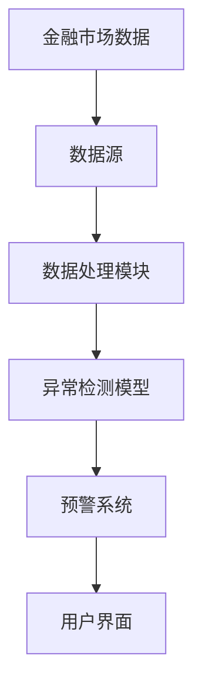
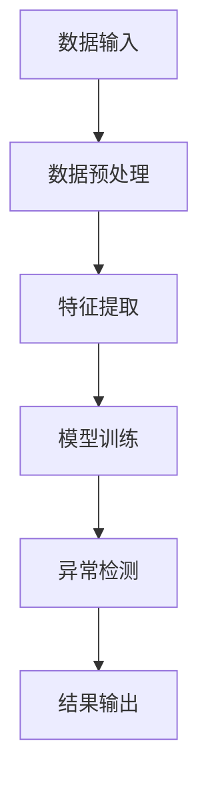
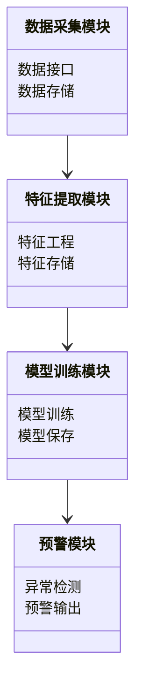
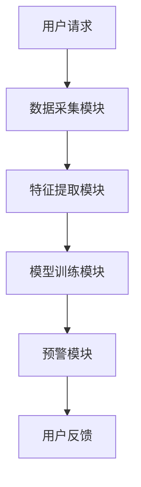
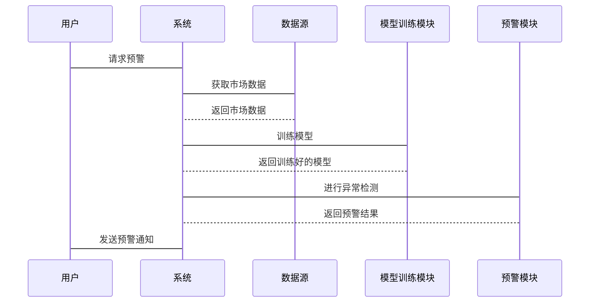

                 


# AI驱动的金融市场异常波动预警系统

> 关键词：AI技术、金融市场、异常波动、预警系统、深度学习、时间序列分析、金融风险管理

> 摘要：本文详细探讨了基于AI技术的金融市场异常波动预警系统的设计与实现。通过分析金融市场数据的复杂性与实时性，提出了结合时间序列分析与深度学习模型的解决方案，并通过实际案例展示了系统的有效性。本文旨在为金融从业者与技术开发者提供一种高效、可靠的金融风险管理工具。

---

# 第一部分: AI驱动的金融市场异常波动预警系统概述

## 第1章: 异常波动预警系统背景介绍

### 1.1 问题背景

#### 1.1.1 金融市场波动的复杂性
金融市场是一个高度动态且复杂的系统，受到多种因素的影响，包括经济指标、政策变化、市场情绪等。这些因素使得市场价格波动呈现出高度非线性特征，传统的统计方法往往难以捕捉这些复杂的变化。

#### 1.1.2 异常波动对投资者的影响
异常波动通常伴随着市场的剧烈波动，例如股市的剧烈下跌或上涨，这种波动往往会对投资者造成重大损失。及时发现并预警异常波动，可以帮助投资者采取规避风险的措施。

#### 1.1.3 传统预警方法的局限性
传统的金融预警方法主要依赖于统计指标和经验判断，例如波动率、成交量等指标。然而，这些方法往往缺乏对市场复杂性的全面捕捉，且难以应对市场的突发性事件。

### 1.2 问题描述

#### 1.2.1 异常波动的定义与特征
异常波动通常指的是市场波动率显著偏离历史平均水平，或者市场走势出现突变。这种波动往往伴随着市场参与者的恐慌情绪和非理性行为。

#### 1.2.2 市场数据的多样性与实时性
金融市场数据具有高度的多样性和实时性，包括股票价格、成交量、订单簿数据等。这些数据需要实时处理和分析，以实现对异常波动的及时预警。

#### 1.2.3 预警系统的必要性与目标
预警系统的目的是通过实时监控市场数据，识别潜在的异常波动，并提前通知投资者或监管机构采取应对措施。系统的有效性取决于其准确性和响应速度。

### 1.3 问题解决

#### 1.3.1 AI技术在金融预警中的应用
人工智能技术，特别是深度学习和自然语言处理，能够从海量数据中提取有用的特征，并通过复杂的模型捕捉市场波动的规律。

#### 1.3.2 数据驱动的异常检测方法
通过收集和分析大量的市场数据，利用机器学习算法，可以实现对市场异常波动的自动化检测和预警。

#### 1.3.3 系统化预警流程的设计
系统化预警流程包括数据采集、特征提取、模型训练、异常检测和结果输出等步骤，确保预警系统的高效性和可靠性。

### 1.4 边界与外延

#### 1.4.1 系统的适用范围
该预警系统适用于股票、期货、外汇等金融市场，能够对多种金融资产的异常波动进行预警。

#### 1.4.2 系统的局限性
由于市场的复杂性和数据的不完整性，预警系统可能存在一定的误报和漏报现象。此外，系统的效果还受到模型选择和参数设置的影响。

#### 1.4.3 系统与其他金融工具的协同
预警系统可以与其他金融工具相结合，例如量化交易策略、风险管理模型等，形成完整的金融风险管理体系。

### 1.5 核心要素组成

#### 1.5.1 数据来源与处理
数据来源包括股票价格、成交量、订单簿数据、新闻舆情等。数据处理包括清洗、特征提取和标准化等步骤。

#### 1.5.2 模型构建与训练
选择合适的机器学习模型，例如LSTM、ARIMA等，对数据进行建模和训练，以捕捉市场的波动规律。

#### 1.5.3 预警机制与反馈
通过设定阈值和触发条件，系统能够在异常波动发生时及时发出预警，并根据反馈不断优化模型。

---

## 第2章: 核心概念与联系

### 2.1 核心概念原理

#### 2.1.1 异常波动的数学定义
异常波动可以定义为市场价格偏离其历史均值的过程。通过统计学方法，如Z-score或标准差，可以衡量波动的异常程度。

#### 2.1.2 时间序列分析的基本原理
时间序列分析是一种通过历史数据预测未来趋势的方法。常用模型包括ARIMA、GARCH等，能够捕捉时间序列中的趋势和周期性特征。

#### 2.1.3 AI模型在异常检测中的作用
深度学习模型，如LSTM和Transformer，能够从复杂的时间序列数据中提取特征，并通过非线性关系预测未来的市场走势。

### 2.2 概念属性特征对比

#### 2.2.1 不同异常检测方法的对比
| 方法         | 优点                          | 缺点                          |
|--------------|-------------------------------|-------------------------------|
| 基于统计的方法 | 简单易懂，计算效率高          | 易受数据分布影响，难以捕捉复杂模式 |
| 基于机器学习的方法 | 能捕捉复杂模式，准确性高      | 计算资源消耗大，需要大量数据训练 |
| 基于深度学习的方法 | 能处理长序列数据，捕捉时间依赖 | 训练时间长，模型复杂度高        |

#### 2.2.2 数据特征与模型性能的关系
数据特征的选取直接影响模型的性能。例如，使用高阶差分、均值回归等特征，可以提高模型的预测准确性。

#### 2.2.3 系统响应时间与准确性的平衡
为了保证预警的及时性，系统需要在较短的时间内完成数据处理和模型预测，这可能需要在模型复杂度和计算效率之间进行权衡。

### 2.3 ER实体关系图架构



---

## 第3章: 算法原理讲解

### 3.1 时间序列分析模型

#### 3.1.1 ARIMA模型的原理
ARIMA（自回归积分滑动平均模型）是一种常用的时间序列分析模型。它通过自回归和滑动平均的组合，能够捕捉数据中的趋势和周期性。

#### 3.1.2 LSTM网络的应用
LSTM（长短期记忆网络）是一种特殊的RNN结构，能够有效处理长序列数据中的时间依赖关系。在金融时间序列预测中，LSTM表现出色。

#### 3.1.3 异常检测算法的流程
1. 数据预处理：包括数据清洗、特征提取和标准化。
2. 模型训练：使用训练数据对异常检测模型进行训练。
3. 异常检测：通过模型预测正常波动范围，并与实际数据进行对比，识别异常波动。

### 3.2 深度学习模型

#### 3.2.1 卷积神经网络在时间序列中的应用
通过将时间序列数据转换为图像形式，卷积神经网络可以有效地提取局部特征。

#### 3.2.2 双向LSTM网络的结构
双向LSTM网络能够同时捕捉前后时间步的信息，适用于捕捉复杂的市场波动模式。

#### 3.2.3 模型训练与优化
通过交叉验证和超参数调优，可以提高模型的泛化能力和预测精度。

### 3.3 算法流程图



---

## 第4章: 数学模型与公式

### 4.1 时间序列模型

#### 4.1.1 ARIMA模型公式
$$ARIMA(p, d, q)$$

### 4.2 LSTM网络结构

#### 4.2.1 LSTM单元公式
$$f(t) = \sigma(g(x_t + W_f h_{t-1} + U_f s_{t-1}))$$

### 4.3 异常检测算法

#### 4.3.1 马尔可夫链模型
通过状态转移概率，可以捕捉数据中的异常模式。

---

## 第5章: 系统分析与架构设计方案

### 5.1 问题场景介绍
金融市场异常波动预警系统的应用场景包括股票交易、风险管理、量化投资等。

### 5.2 项目介绍
本项目旨在开发一个实时监控金融市场数据的系统，能够通过AI算法识别异常波动并发出预警。

### 5.3 系统功能设计

#### 5.3.1 领域模型


### 5.4 系统架构设计

#### 5.4.1 系统架构图


### 5.5 系统接口设计

#### 5.5.1 接口描述
系统提供API接口，供外部系统调用预警结果。

### 5.6 系统交互流程图



---

## 第6章: 项目实战

### 6.1 环境安装

#### 6.1.1 安装Python环境
使用Anaconda安装Python 3.8及以上版本。

#### 6.1.2 安装依赖库
安装numpy、pandas、keras、tensorflow等库。

### 6.2 系统核心实现源代码

#### 6.2.1 数据预处理代码
```python
import numpy as np
import pandas as pd

# 数据加载
data = pd.read_csv('market_data.csv')

# 数据清洗
data.dropna(inplace=True)

# 特征提取
data['return'] = data['price'].pct_change()

# 标准化
from sklearn.preprocessing import StandardScaler
scaler = StandardScaler()
data[['return']] = scaler.fit_transform(data[['return']])
```

#### 6.2.2 模型训练代码
```python
from keras.models import Sequential
from keras.layers import LSTM, Dense

# 模型构建
model = Sequential()
model.add(LSTM(64, input_shape=(timesteps, features)))
model.add(Dense(1, activation='sigmoid'))
model.compile(optimizer='adam', loss='binary_crossentropy', metrics=['accuracy'])

# 模型训练
model.fit(x_train, y_train, epochs=10, batch_size=32)
```

### 6.3 案例分析

#### 6.3.1 案例描述
以某段时间内的股票价格数据为例，展示系统如何识别异常波动。

#### 6.3.2 实际操作步骤
1. 数据采集与预处理
2. 模型训练
3. 异常检测
4. 预警结果输出

### 6.4 代码应用解读与分析
通过实际案例分析，展示系统的预警效果和优化空间。

### 6.5 项目小结
总结项目的实现过程，提出改进建议。

---

## 第7章: 最佳实践 tips、小结、注意事项、拓展阅读

### 7.1 最佳实践 tips
- 数据预处理是关键，需要仔细清洗和特征提取。
- 模型选择和调优直接影响系统效果，需要反复试验。
- 系统的实时性和响应速度需要优化，可以通过分布式计算和缓存技术实现。

### 7.2 小结
本文详细介绍了AI驱动的金融市场异常波动预警系统的构建与实现，从背景分析到系统设计，再到实际应用，为读者提供了全面的指导。

### 7.3 注意事项
- 数据隐私和安全问题需要重视。
- 模型的泛化能力需要通过多数据集验证。
- 系统的稳定性需要通过压力测试保证。

### 7.4 拓展阅读
建议读者进一步学习时间序列分析、深度学习在金融中的应用以及金融风险管理的相关知识。

---

作者：AI天才研究院/AI Genius Institute & 禅与计算机程序设计艺术 /Zen And The Art of Computer Programming

