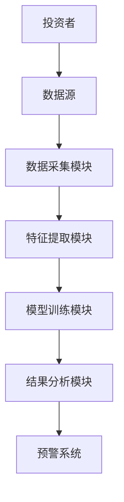
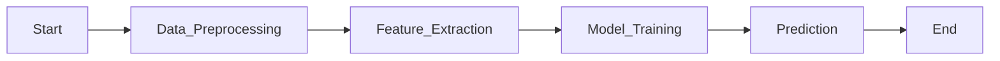
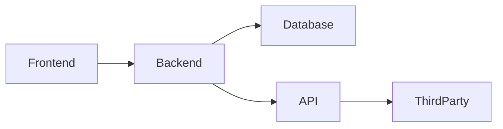
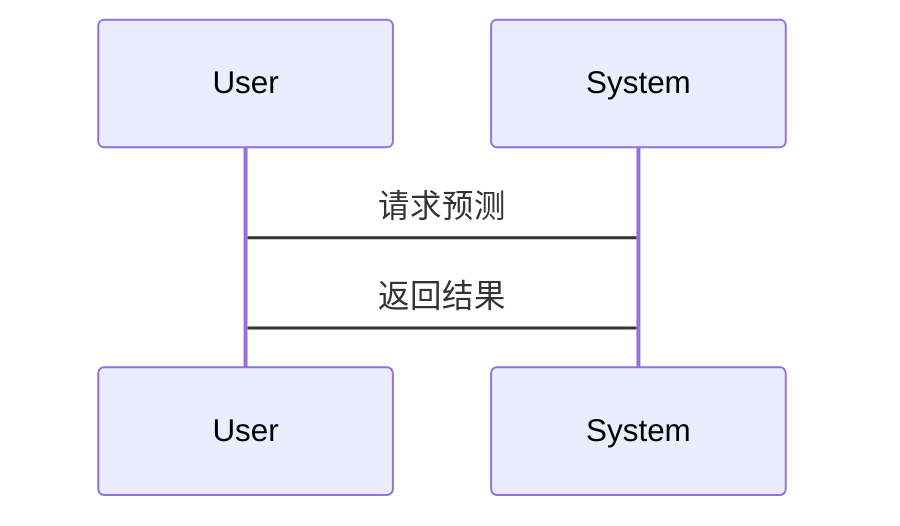

                 


# AI驱动的金融市场泡沫识别系统

> 关键词：AI，金融市场，泡沫识别，机器学习，时间序列分析，自然语言处理

> 摘要：本文介绍了一种基于AI的金融市场泡沫识别系统，通过分析历史数据和市场情绪，利用机器学习算法和时间序列分析，实现对金融市场泡沫的早期识别和预警。

---

## 第一部分：背景介绍

### 第1章：金融市场泡沫识别的背景与挑战

#### 1.1 问题背景
金融市场中的泡沫现象是一个复杂且重要的问题，它不仅影响投资者的决策，还可能导致经济波动。传统的方法依赖于市场专家的经验和简单的统计指标，存在主观性和滞后性。随着AI技术的发展，我们可以通过更高效和客观的方式识别泡沫。

#### 1.2 问题描述
泡沫识别的核心在于发现资产价格与实际价值的偏离。传统方法如PE比率分析、Z-score模型等存在局限性，难以捕捉市场中的复杂模式。AI的引入可以弥补这些不足，通过分析大量非结构化数据，如新闻、社交媒体和交易数据，提供更精准的预测。

#### 1.3 问题解决
AI驱动的系统通过机器学习和深度学习技术，从多源数据中提取特征，构建预测模型。这些模型能够实时监控市场动态，提供早期预警，帮助投资者做出更明智的决策。

#### 1.4 系统的边界与外延
该系统主要针对股票市场，但也适用于其他金融资产。系统的局限性在于数据质量和模型解释性，未来可以通过引入更丰富的数据和更复杂的模型来改进。

#### 1.5 概念结构与核心要素
系统由数据采集、特征提取、模型训练和结果分析四个模块组成。核心要素包括时间序列数据、文本数据、特征向量和预测模型。

---

## 第二部分：核心概念与联系

### 第2章：AI驱动的金融市场泡沫识别系统的核心原理

#### 2.1 核心概念解析
系统通过数据处理、特征提取、模型训练和结果分析，识别市场中的异常行为。数据处理包括清洗和预处理，特征提取涉及统计特征和语义特征。

#### 2.2 核心概念属性对比
| 特征类型 | 时间序列特征 | 文本特征 |
|----------|--------------|----------|
| 示例     | 股价波动     | 新闻标题   |
| 方法     | ARIMA        | TF-IDF    |

#### 2.3 系统实体关系图


---

## 第三部分：算法原理讲解

### 第3章：AI驱动的金融市场泡沫识别系统的算法实现

#### 3.1 算法原理
系统采用LSTM进行时间序列预测，结合情感分析提取文本特征。LSTM能够捕捉长期依赖关系，适合处理时间序列数据。

#### 3.2 算法流程图


#### 3.3 算法实现
```python
import numpy as np
from tensorflow.keras.models import Sequential
from tensorflow.keras.layers import LSTM, Dense

# 示例数据
data = np.random.random(1000, 1)

# 模型构建
model = Sequential()
model.add(LSTM(64, input_shape=(None, 1)))
model.add(Dense(1))
model.compile(optimizer='adam', loss='mean_squared_error')

# 训练
model.fit(data, data, epochs=10, batch_size=32)
```

---

## 第四部分：数学模型和公式

### 第4章：AI驱动的金融市场泡沫识别系统的数学模型

#### 4.1 时间序列模型
ARIMA模型用于预测未来的价格：
$$ARIMA(p, d, q)$$
其中，p为自回归阶数，d为差分阶数，q为移动平均阶数。

#### 4.2 情感分析得分
情感得分计算公式：
$$\text{sentiment\_score} = \sum (\text{word\_score} \times \text{word\_weight})$$

---

## 第五部分：系统分析与架构设计方案

### 第5章：AI驱动的金融市场泡沫识别系统的架构设计

#### 5.1 项目背景
系统旨在实时监控金融市场，帮助投资者识别潜在泡沫。

#### 5.2 功能设计
- 数据采集：从多种数据源获取实时数据。
- 特征提取：提取统计和语义特征。
- 模型训练：构建和训练机器学习模型。
- 结果分析：生成预测结果和预警信号。

#### 5.3 系统架构图


#### 5.4 接口设计
系统提供REST API，支持数据查询和预警通知。

#### 5.5 交互流程


---

## 第六部分：项目实战

### 第6章：AI驱动的金融市场泡沫识别系统的项目实现

#### 6.1 环境安装
安装Python、TensorFlow、Pandas等工具。

#### 6.2 核心代码
```python
import pandas as pd
from sklearn.preprocessing import MinMaxScaler
from tensorflow.keras.models import Sequential
from tensorflow.keras.layers import LSTM, Dense

# 数据预处理
data = pd.read_csv('stock_data.csv')
scaler = MinMaxScaler()
data_scaled = scaler.fit_transform(data)

# 模型训练
model = Sequential()
model.add(LSTM(64, input_shape=(None, 1)))
model.add(Dense(1))
model.compile(optimizer='adam', loss='mean_squared_error')

history = model.fit(data_scaled, epochs=50, batch_size=32)
```

#### 6.3 案例分析
通过实际数据训练模型，展示预测结果和预警信号。

#### 6.4 项目小结
总结项目的实现过程和经验，强调数据质量和模型优化的重要性。

---

## 第七部分：最佳实践与总结

### 第7章：AI驱动的金融市场泡沫识别系统的最佳实践

#### 7.1 最佳实践 tips
- 数据来源：选择可靠的数据源，如Yahoo Finance。
- 模型优化：尝试不同的深度学习模型和超参数调优。
- 系统维护：定期更新模型和数据，确保系统的准确性和稳定性。

#### 7.2 小结
本文详细介绍了AI驱动的金融市场泡沫识别系统，从理论到实践，展示了系统的设计和实现过程。

#### 7.3 注意事项
- 数据质量和完整性直接影响模型性能。
- 模型的解释性是实际应用中的重要考量。

#### 7.4 拓展阅读
推荐相关书籍和论文，如《机器学习实战》和《金融时间序列分析》。

---

## 作者

作者：AI天才研究院/AI Genius Institute & 禅与计算机程序设计艺术 /Zen And The Art of Computer Programming

---

通过以上结构，文章详细讲解了AI在金融市场泡沫识别中的应用，从背景到实现，为读者提供了全面的技术指导。

