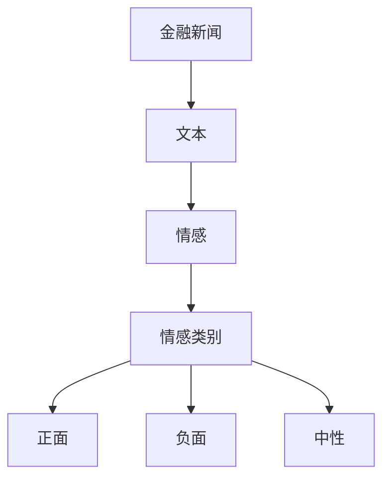
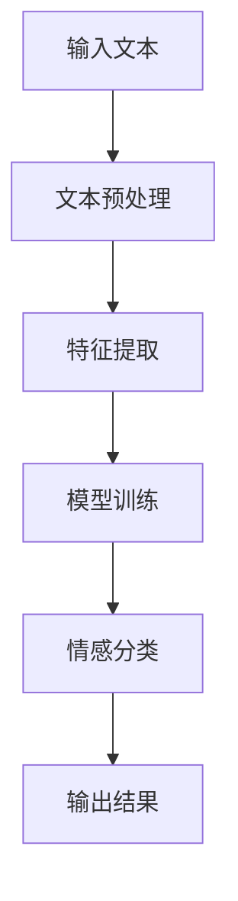
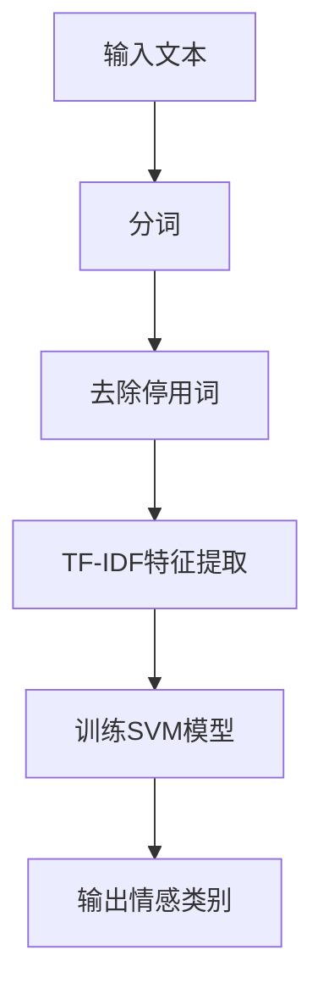
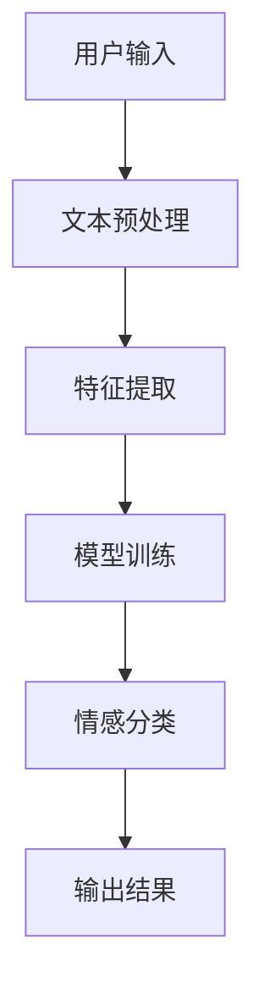

                 


# AI驱动的金融新闻情感分析系统

## 关键词：AI, 情感分析, 金融新闻, 自然语言处理, 机器学习, 金融投资, 文本挖掘

## 摘要：  
本文深入探讨了基于人工智能的金融新闻情感分析系统的设计与实现。通过分析金融新闻中的情感倾向，该系统能够帮助投资者快速理解市场情绪，做出更明智的投资决策。文章从问题背景、核心概念、算法原理、系统架构设计、项目实战到高级应用，全面解析了AI在金融新闻情感分析中的应用，并提供了详细的实现步骤和案例分析。

---

## 第1章: 问题背景与核心概念

### 1.1 问题背景

#### 1.1.1 金融新闻的重要性  
金融新闻是金融市场信息的主要来源，涵盖了股票、债券、基金等金融产品的市场动态。通过分析金融新闻，投资者可以获取市场情绪、预测价格走势，从而做出投资决策。然而，金融新闻的海量性和复杂性使得人工分析效率低下，亟需借助AI技术实现自动化分析。

#### 1.1.2 情感分析的必要性  
情感分析是自然语言处理（NLP）中的一个关键任务，旨在识别文本中的情感倾向。在金融领域，情感分析可以帮助识别市场情绪，预测股票价格波动，为投资者提供决策支持。

#### 1.1.3 AI驱动的解决方案  
AI技术，尤其是机器学习和深度学习，为金融新闻情感分析提供了强大的工具。通过训练模型，AI可以自动识别文本中的情感倾向，实现高效、准确的分析。

### 1.2 核心概念与定义

#### 1.2.1 金融新闻的定义与特征  
金融新闻是指与金融市场相关的信息，通常包括公司公告、市场报告、行业分析等。其特征包括专业性、时效性和情感倾向性。

#### 1.2.2 情感分析的定义与分类  
情感分析是通过计算机技术对文本的情感倾向进行分类的过程。在金融领域，情感分析可以分为整体情感分析和基于关键词的情感分析。

#### 1.2.3 AI驱动的定义与技术特点  
AI驱动的情感分析系统利用机器学习算法，通过训练数据提取特征，建立情感分类模型。其技术特点包括高效性、准确性、可扩展性。

### 1.3 问题解决的边界与外延

#### 1.3.1 问题的边界  
金融新闻情感分析的边界包括文本范围、时间范围和情感范围。文本范围限定在金融新闻，时间范围限定在实时或历史数据，情感范围限定在正面、负面和中性三种。

#### 1.3.2 问题的外延  
外延包括对非金融文本的情感分析、跨语言情感分析以及情感分析与其他金融分析任务的结合。

#### 1.3.3 核心要素组成  
核心要素包括金融新闻文本、情感标签、特征提取方法和情感分类模型。

---

## 第2章: 核心概念与联系

### 2.1 核心概念原理

#### 2.1.1 情感分析的基本原理  
情感分析通过文本预处理、特征提取和模型训练，建立情感分类模型。模型基于特征对文本进行分类，输出情感倾向。

#### 2.1.2 自然语言处理的核心原理  
自然语言处理通过文本预处理、语义分析和生成，实现对文本的理解和生成。在情感分析中，NLP技术用于提取文本特征。

#### 2.1.3 金融领域的特殊性  
金融新闻具有专业性和复杂性，情感分析需要考虑金融术语、市场情绪和数据稀疏性。

### 2.2 核心概念属性特征对比

#### 2.2.1 情感分析与文本分类的对比  
情感分析是文本分类的一个特例，分类目标为情感类别。文本分类的目标更为广泛，包括主题分类、情感分类等。

#### 2.2.2 金融新闻与普通新闻的对比  
金融新闻具有专业性和数据稀疏性，情感分析需要考虑市场情绪和金融术语。普通新闻情感分析相对简单，通常涉及社会新闻、娱乐新闻等。

#### 2.2.3 AI驱动与其他方法的对比  
AI驱动方法通过机器学习算法实现情感分析，具有高效性和可扩展性。传统方法依赖人工分析，效率较低。

### 2.3 ER实体关系图



---

## 第3章: 算法原理讲解

### 3.1 算法流程



### 3.2 核心算法代码示例

```python
import numpy as np
from sklearn.feature_extraction.text import TfidfVectorizer
from sklearn.svm import SVC

# 示例代码
vectorizer = TfidfVectorizer()
model = SVC()
```

### 3.3 算法流程图



---

## 第4章: 数学模型与公式

### 4.1 文本表示模型

$$ \text{TF-IDF} = \frac{\text{term frequency}}{\text{document frequency}} $$

### 4.2 情感分类模型

$$ P(y|X) = \frac{P(X|y)P(y)}{P(X)} $$

---

## 第5章: 系统架构设计

### 5.1 问题场景介绍

金融新闻情感分析系统需要处理大量金融新闻数据，实时更新市场情绪，为投资者提供决策支持。

### 5.2 系统功能设计

- 文本预处理模块：实现分词、去除停用词等。
- 特征提取模块：提取文本特征，如TF-IDF。
- 模型训练模块：训练情感分类模型。
- 情感分类模块：对新文本进行情感分类。

### 5.3 系统架构图



---

## 第6章: 项目实战

### 6.1 环境安装

安装Python、scikit-learn、nltk等库。

### 6.2 核心代码实现

```python
from sklearn.model_selection import train_test_split
from sklearn.metrics import accuracy_score
from sklearn.feature_extraction.text import TfidfVectorizer
from sklearn.svm import SVC

# 数据预处理
X = [...]  # 金融新闻文本
y = [...]  # 情感标签

# 划分训练集和测试集
X_train, X_test, y_train, y_test = train_test_split(X, y, test_size=0.2)

# 特征提取
vectorizer = TfidfVectorizer()
X_train_vec = vectorizer.fit_transform(X_train)
X_test_vec = vectorizer.transform(X_test)

# 模型训练
model = SVC()
model.fit(X_train_vec, y_train)

# 模型测试
y_pred = model.predict(X_test_vec)
print(accuracy_score(y_test, y_pred))
```

### 6.3 案例分析

通过实际案例分析，验证系统在金融新闻情感分析中的有效性。

### 6.4 项目总结

总结项目实现过程中的经验和教训，提出改进建议。

---

## 第7章: 高级应用与优化

### 7.1 模型调优

优化特征提取方法、调整模型参数，提高分类准确率。

### 7.2 实时数据处理

实现金融新闻的实时情感分析，快速响应市场变化。

### 7.3 高级案例分析

分析复杂金融事件中的情感变化，提供更深层次的市场洞察。

### 7.4 未来趋势

探讨AI技术在金融新闻情感分析中的未来发展方向，如深度学习、多模态分析等。

---

## 附录

### 附录A: 数据集说明

介绍数据集的来源、格式和使用方法。

### 附录B: 参考文献

列出文章中引用的相关文献和资源。

---

## 作者：AI天才研究院/AI Genius Institute & 禅与计算机程序设计艺术 /Zen And The Art of Computer Programming

---

以上是《AI驱动的金融新闻情感分析系统》的技术博客文章的完整目录大纲和部分详细内容。文章从背景、核心概念、算法原理、系统架构设计、项目实战到高级应用，全面解析了AI在金融新闻情感分析中的应用，为读者提供了从理论到实践的详细指导。

