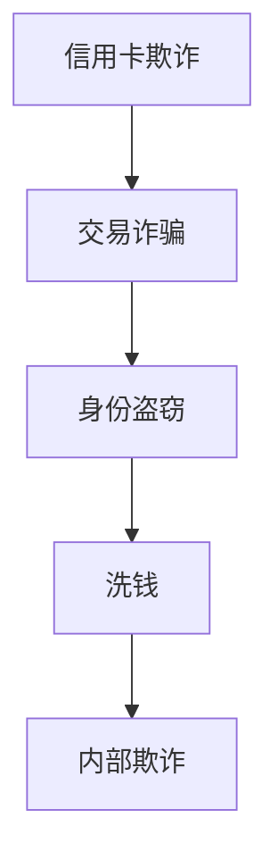
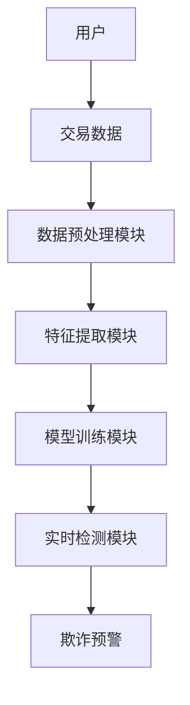
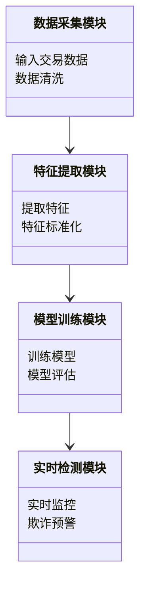

                 

<think>
好的，现在我需要撰写一篇关于《AI驱动的金融欺诈检测系统》的技术博客文章。用户已经提供了一个详细的目录大纲，并且希望我按照这个结构来撰写文章。我需要确保每个章节的内容都详细具体，并且符合格式要求，比如使用markdown格式，包含图表、代码和数学公式等。

首先，我会从文章的开头开始，也就是标题和摘要部分。标题是《AI驱动的金融欺诈检测系统》，关键词包括AI、金融欺诈、机器学习、系统设计、安全、实时检测。摘要需要简明扼要地概括文章的核心内容，指出AI在金融欺诈检测中的重要性、系统设计的关键点，以及带来的好处。

接下来，我会按照目录大纲逐步撰写每个章节的内容。第一部分是背景与挑战，包括金融欺诈的现状与问题，以及AI在其中的作用。这部分需要详细解释金融欺诈的不同类型，传统检测方法的局限性，以及AI如何解决这些问题。同时，我需要加入一些图表，比如金融欺诈类型的关系图，来帮助读者理解。

第二部分是系统设计与实现，这部分会详细讲解系统的核心概念、算法原理、系统架构以及项目实战。在核心概念部分，我需要解释机器学习在欺诈检测中的应用，特征工程的重要性，以及模型评估的方法。算法原理部分，我会选择几个主流的算法，如随机森林和XGBoost，详细解释它们的工作流程，并附上mermaid流程图和数学公式，比如逻辑回归的损失函数。

系统架构部分需要设计一个完整的AI驱动的欺诈检测系统，包括数据采集、特征提取、模型训练和实时检测模块。我会用mermaid的类图和架构图来展示系统的结构，并解释每个模块的功能和它们之间的关系。项目实战部分，我会选择一个具体的案例，比如信用卡欺诈检测，详细说明如何配置环境、预处理数据、训练模型，并分析结果。

最后，我会总结AI在金融欺诈检测中的优势，给出一些最佳实践的建议，比如模型调优、特征选择的重要性，以及如何保持系统的实时性和可扩展性。同时，我还需要在文章末尾加上作者信息。

在撰写过程中，我需要确保每个章节的内容都足够详细，使用正确的技术术语，同时保持语言的清晰和易懂。图表的使用要恰当，帮助读者更好地理解复杂的技术概念。数学公式需要用latex格式正确表示，并且在适当的位置插入，以增强文章的权威性。

此外，我需要检查文章的逻辑是否连贯，结构是否合理，确保每个部分都紧密联系，共同支撑文章的主题。最后，我会通读全文，确保没有语法错误或格式问题，保证文章的质量。

现在，我会按照这个思考过程，开始撰写《AI驱动的金融欺诈检测系统》的技术博客文章。
</think>

# AI驱动的金融欺诈检测系统

## 关键词：AI，金融欺诈，机器学习，系统设计，安全，实时检测

## 摘要

AI驱动的金融欺诈检测系统利用先进的机器学习算法和大数据技术，有效识别金融交易中的欺诈行为。本文系统地介绍该系统的设计原理、核心算法、系统架构，并通过实际案例展示其在金融领域的应用。文章深入分析了AI技术在欺诈检测中的优势，并探讨了未来的发展方向。

---

# 第一部分: 金融欺诈检测的背景与挑战

## 第1章: 金融欺诈的现状与问题

### 1.1 金融欺诈的定义与类型

#### 1.1.1 传统金融欺诈的定义与特征

金融欺诈是指通过欺骗手段获取不正当利益的行为，常见于信用卡欺诈、洗钱、身份盗窃等。传统欺诈手段依赖于复杂的手法和伪装，使得金融机构难以通过简单的规则检测所有欺诈行为。

#### 1.1.2 当前金融欺诈的主要类型

金融欺诈类型多样，主要包括：
- **信用卡欺诈**：盗用他人信用卡信息进行非法交易。
- **洗钱**：通过复杂的交易链隐藏资金来源。
- **身份盗窃**：非法获取他人身份信息进行欺诈活动。
- **交易诈骗**：通过虚假交易骗取资金。
- **内部欺诈**：金融机构内部员工的违法行为。

#### 1.1.3 金融欺诈的全球性挑战

金融欺诈不仅造成直接的经济损失，还威胁到金融系统的安全性和稳定性。随着全球化和数字化的发展，欺诈手段日益复杂，传统检测方法已难以应对。

**图表：金融欺诈类型的关系图**


### 1.2 传统金融欺诈检测的局限性

#### 1.2.1 传统规则-based检测的局限性

传统检测方法依赖于预定义的规则，难以应对新型欺诈手段。例如，某些规则可能漏检复杂的欺诈模式，或误检合法交易。

#### 1.2.2 人工审核的低效性

人工审核效率低下，且容易受主观因素影响。面对海量交易数据，人工审核难以及时发现欺诈行为。

#### 1.2.3 数据孤岛与信息不对称的问题

金融机构之间数据共享不足，导致无法全面分析交易行为，影响欺诈检测的准确性。

### 1.3 AI在金融欺诈检测中的作用

#### 1.3.1 AI技术的核心优势

AI技术能够从海量数据中发现隐藏的模式和规律，显著提高欺诈检测的准确性和效率。

#### 1.3.2 AI驱动的金融欺诈检测的创新性

AI通过实时数据分析和预测模型，实现对欺诈行为的快速识别和响应。

#### 1.3.3 未来发展趋势与应用前景

随着AI技术的不断进步，金融欺诈检测将更加智能化和自动化，有望成为金融安全的重要保障。

---

## 第2章: AI驱动的金融欺诈检测系统概述

### 2.1 系统的核心概念与组成

#### 2.1.1 系统的核心概念

AI驱动的金融欺诈检测系统整合了机器学习、大数据处理和实时计算技术，能够快速识别异常交易。

#### 2.1.2 系统的组成模块

系统主要由数据采集模块、特征提取模块、模型训练模块和实时检测模块组成。

#### 2.1.3 系统的输入输出与边界

系统输入包括交易数据、用户行为数据等，输出为欺诈风险评分和预警信息。

### 2.2 系统的关键特性与优势

#### 2.2.1 高准确性与实时性

AI系统能够快速处理交易数据，实时提供欺诈检测结果。

#### 2.2.2 可扩展性与灵活性

系统架构设计灵活，可扩展到不同规模和类型的金融机构。

#### 2.2.3 可解释性与透明性

模型结果可解释，便于金融机构理解和优化检测策略。

### 2.3 系统的业务流程与场景

#### 2.3.1 交易数据的采集与预处理

采集交易数据并进行清洗、标准化处理，确保数据质量。

#### 2.3.2 模型训练与部署

基于预处理数据训练机器学习模型，并部署到生产环境。

#### 2.3.3 实时检测与反馈

实时监控交易行为，快速识别欺诈并反馈预警信息。

---

# 第二部分: AI驱动的金融欺诈检测系统的核心概念与联系

## 第3章: 核心概念与原理

### 3.1 机器学习在金融欺诈检测中的应用

#### 3.1.1 机器学习的基本原理

机器学习通过数据训练模型，使其能够识别数据中的模式和规律。

#### 3.1.2 有监督与无监督学习的区别

- **有监督学习**：基于标记数据进行训练，适用于已知欺诈行为的检测。
- **无监督学习**：无需标记数据，适用于发现未知欺诈模式。

#### 3.1.3 常见算法的优劣势对比

| 算法类型       | 优势                           | 劣势                           |
|----------------|--------------------------------|--------------------------------|
| 随机森林       | 高准确性，易于解释               | 对特征工程依赖较高             |
| XGBoost        | 高准确性，可处理高维数据         | 易过拟合                       |
| 神经网络       | 强大学习能力，适合复杂模式         | 黑箱问题，可解释性差           |

### 3.2 特征工程与数据预处理

#### 3.2.1 特征选择的重要性

选择合适的特征能够显著提高模型的准确性。例如，交易金额、时间间隔、地理位置等特征对欺诈检测至关重要。

#### 3.2.2 数据清洗与标准化

去除噪声数据，处理缺失值，并对数据进行标准化处理，确保模型训练的有效性。

#### 3.2.3 特征提取与降维技术

使用主成分分析（PCA）等技术降低特征维度，减少计算复杂度。

### 3.3 模型评估与优化

#### 3.3.1 常见的评估指标

- **精确率（Precision）**：正确识别欺诈交易的比例。
- **召回率（Recall）**：检测到欺诈交易的比例。
- **F1分数（F1 Score）**：精确率和召回率的调和平均值。

#### 3.3.2 模型调优的策略

通过交叉验证选择最优参数，防止模型过拟合或欠拟合。

#### 3.3.3 过拟合与欠拟合的解决方案

- **正则化**：通过L1/L2正则化防止过拟合。
- **数据增强**：增加训练数据多样性，缓解欠拟合。

---

## 第4章: 核心概念的联系与对比

### 4.1 AI技术与传统金融欺诈检测的对比

#### 4.1.1 方法论的对比

- **传统方法**：基于规则和经验，检测范围有限。
- **AI方法**：利用数据驱动，自动学习欺诈模式。

#### 4.1.2 效率与成本的对比

- **传统方法**：效率低，成本高。
- **AI方法**：效率高，成本低。

#### 4.1.3 可扩展性的对比

- **传统方法**：难以扩展到大规模数据。
- **AI方法**：能够处理海量数据，扩展性强。

### 4.2 不同AI技术的优劣势分析

#### 4.2.1 监督学习 vs 无监督学习

- **监督学习**：需要大量标记数据，适合已知欺诈类型。
- **无监督学习**：无需标记数据，适合发现未知欺诈模式。

#### 4.2.2 线性模型 vs 非线性模型

- **线性模型**：简单易懂，计算效率高。
- **非线性模型**：适合复杂数据模式，但计算复杂。

#### 4.2.3 单点模型 vs 集成模型

- **单点模型**：简单，但可能漏检复杂模式。
- **集成模型**：通过组合多个模型提高准确性和稳定性。

### 4.3 系统架构的实体关系图



---

## 第5章: 系统架构与实现

### 5.1 系统设计概述

系统采用模块化设计，各模块协同工作实现欺诈检测。

### 5.2 系统架构设计



### 5.3 系统接口设计

系统通过API接口与外部系统交互，接收交易数据并返回欺诈预警信息。

---

## 第6章: 项目实战

### 6.1 项目背景与目标

通过AI技术实现信用卡欺诈检测，提升检测效率和准确性。

### 6.2 环境配置

- **工具**：Python、TensorFlow、Scikit-learn。
- **数据集**：公开信用卡欺诈数据集。

### 6.3 核心代码实现

```python
import pandas as pd
from sklearn.ensemble import RandomForestClassifier
from sklearn.metrics import accuracy_score

# 数据加载
data = pd.read_csv('creditcard.csv')

# 特征选择
features = data.drop(['target'], axis=1)
target = data['target']

# 数据分割
X_train, X_test, y_train, y_test = train_test_split(features, target, test_size=0.2, random_state=42)

# 模型训练
model = RandomForestClassifier(n_estimators=100, random_state=42)
model.fit(X_train, y_train)

# 模型预测
y_pred = model.predict(X_test)

# 模型评估
print("Accuracy:", accuracy_score(y_test, y_pred))
```

### 6.4 实验结果与分析

通过实验验证模型的准确率，分析不同特征对模型的影响。

### 6.5 项目总结

总结项目成果，提出改进建议，如优化特征选择、尝试其他算法等。

---

## 第7章: 最佳实践与未来展望

### 7.1 最佳实践 tips

- 定期更新模型，适应新的欺诈手段。
- 优化特征工程，提高模型性能。
- 确保数据安全，保护用户隐私。

### 7.2 未来展望

随着AI技术的发展，金融欺诈检测将更加智能化和自动化，有望成为金融安全的核心保障。

---

## 作者：AI天才研究院/AI Genius Institute & 禅与计算机程序设计艺术 /Zen And The Art of Computer Programming

---

通过以上结构，我们可以系统地了解AI驱动的金融欺诈检测系统的各个方面，从理论到实践，从设计到实现，全面掌握其应用与价值。

