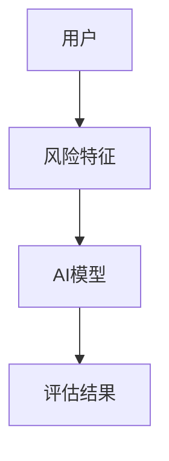
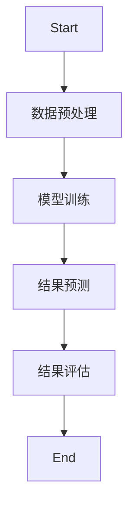
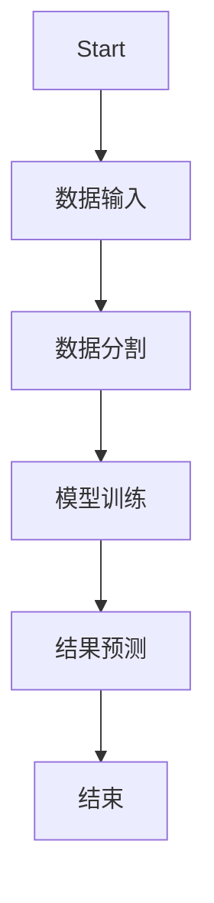
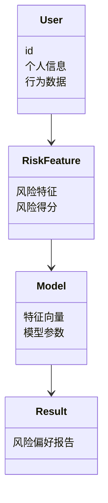

                 


# AI驱动的风险偏好评估系统

> 关键词：AI，风险偏好，评估系统，机器学习，金融风控

> 摘要：本文详细探讨了如何利用人工智能技术构建风险偏好评估系统，分析了其在金融风控、投资决策等领域中的应用价值，并结合实际案例展示了系统的实现过程和效果。

---

# 第1章：AI驱动的风险偏好评估系统背景介绍

## 1.1 问题背景与描述

### 1.1.1 风险偏好评估的传统方法

传统的风险偏好评估方法主要依赖于问卷调查和人工分析。这种方法存在效率低、主观性强、难以量化等缺点，尤其是在面对海量数据和复杂场景时，传统方法往往难以满足需求。

### 1.1.2 AI技术在风险评估中的应用潜力

AI技术，特别是机器学习和深度学习，能够通过数据分析和模式识别，帮助我们更准确地评估个体或机构的风险偏好。AI技术的应用可以显著提高评估的效率和准确性。

### 1.1.3 当前行业痛点与挑战

当前的风险偏好评估系统存在以下痛点：

- 数据量大、维度高，传统方法难以处理。
- 评估结果主观性强，缺乏客观依据。
- 无法实时更新和动态调整。

## 1.2 核心概念与问题解决

### 1.2.1 风险偏好的定义与特征

风险偏好是指个体或机构在面对不确定性时，对风险的接受程度和处理方式。它通常包括以下几个特征：

- 风险认知：对风险的理解和感知。
- 风险态度：对风险的积极或消极态度。
- 风险行为：在实际操作中对风险的应对策略。

### 1.2.2 AI驱动的评估方法优势

AI驱动的评估方法具有以下优势：

- 高效性：能够快速处理大量数据。
- 准确性：通过机器学习模型，能够更准确地识别风险偏好。
- 动态性：能够实时更新评估结果，适应变化的环境。

### 1.2.3 系统目标与实现路径

系统的目标是通过AI技术，构建一个高效、准确、动态的风险偏好评估系统。实现路径包括：

1. 数据采集与预处理。
2. 特征提取与模型训练。
3. 模型部署与结果输出。

## 1.3 系统的边界与外延

### 1.3.1 输入数据的范围与类型

输入数据主要包括：

- 用户的基本信息（年龄、性别、职业等）。
- 用户的行为数据（投资记录、消费习惯等）。
- 市场数据（经济指标、行业趋势等）。

### 1.3.2 输出结果的定义与应用场景

输出结果通常包括：

- 风险偏好得分。
- 风险偏好类型（保守型、稳健型、激进型等）。
- 风险偏好报告。

应用场景包括：

- 金融投资：帮助投资者选择合适的投资产品。
- 保险业务：评估客户的风险承受能力。
- 信贷评估：评估客户的信用风险。

### 1.3.3 系统与其他模块的交互关系

系统通常需要与以下模块进行交互：

- 数据采集模块：获取输入数据。
- 用户界面模块：展示评估结果。
- 决策支持模块：提供基于风险偏好的决策支持。

## 1.4 核心要素与概念结构

### 1.4.1 风险偏好评估的关键指标

关键指标包括：

- 风险承受能力。
- 风险认知水平。
- 风险行为模式。

### 1.4.2 AI模型的输入输出关系

AI模型的输入是经过预处理的特征向量，输出是风险偏好评估结果。

### 1.4.3 系统功能模块的组成与交互

系统功能模块包括：

- 数据采集模块。
- 数据预处理模块。
- 模型训练模块。
- 结果输出模块。

---

# 第2章：AI驱动风险偏好评估的核心概念与联系

## 2.1 核心概念原理

### 2.1.1 风险偏好的多维度特征

风险偏好的多维度特征包括：

- 时间维度：短期和长期风险偏好。
- 情境维度：不同情境下的风险偏好。
- 个体维度：不同个体的风险偏好差异。

### 2.1.2 AI模型的特征提取与分析

AI模型通过特征提取技术，从原始数据中提取有用的特征，用于风险偏好评估。

### 2.1.3 系统的动态调整机制

系统的动态调整机制能够根据实时数据更新评估结果。

## 2.2 核心概念属性特征对比表

| 特征维度 | 风险偏好 | AI模型表现 |
|----------|----------|------------|
| 数据来源 | 用户行为 | 训练数据集 |
| 评估维度 | 心理、行为 | 模型预测值 |
| 时间跨度 | 静态/动态 | 模型更新频率 |

## 2.3 ER实体关系图（Mermaid）



---

# 第3章：AI驱动风险偏好评估的算法原理

## 3.1 算法原理概述

### 3.1.1 监督学习与无监督学习的结合

监督学习用于分类和回归任务，无监督学习用于聚类和降维。

### 3.1.2 深度学习与传统机器学习的对比

深度学习在非线性特征提取方面表现更好，但需要更多的数据和计算资源。

## 3.2 算法流程图（Mermaid）



## 3.3 核心算法实现（Python代码示例）

```python
import numpy as np
from sklearn.ensemble import RandomForestClassifier

# 示例数据集
X = np.array([[1, 2], [3, 4], [5, 6]])
y = np.array([0, 1, 0])

# 模型训练
model = RandomForestClassifier()
model.fit(X, y)

# 预测结果
result = model.predict(X)
print("预测结果:", result)
```

---

# 第4章：数学模型与公式推导

## 4.1 数学模型概述

### 4.1.1 线性回归模型

$$
y = \beta_0 + \beta_1 x_1 + \beta_2 x_2 + \ldots + \beta_n x_n + \epsilon
$$

### 4.1.2 随机森林模型

随机森林通过集成学习，将多个决策树的预测结果进行投票或平均，得到最终结果。

## 4.2 算法推导过程（Mermaid）



---

# 第5章：系统分析与架构设计方案

## 5.1 问题场景介绍

### 5.1.1 风险偏好评估系统的功能需求

系统需要支持数据采集、特征提取、模型训练和结果输出等功能。

### 5.1.2 项目介绍

本项目旨在开发一个基于AI的风险偏好评估系统，用于金融领域的风险管理。

## 5.2 系统功能设计（领域模型Mermaid类图）



## 5.3 系统架构设计（Mermaid架构图）

```mermaid
graph LR
    Client[客户端] --> API Gateway[API网关]
    API Gateway --> Service1[服务1]
    API Gateway --> Service2[服务2]
    Service1 --> DB[数据库]
    Service2 --> DB
```

---

# 第6章：项目实战

## 6.1 环境安装与配置

### 6.1.1 安装Python和相关库

安装Python和scikit-learn、numpy等库。

## 6.2 系统核心实现源代码

```python
import numpy as np
from sklearn.ensemble import RandomForestClassifier

# 数据加载
X = np.load('features.npy')
y = np.load('labels.npy')

# 模型训练
model = RandomForestClassifier()
model.fit(X, y)

# 保存模型
import joblib
joblib.dump(model, 'risk_preference_model.pkl')
```

## 6.3 代码应用解读与分析

通过对数据的预处理、特征提取和模型训练，最终得到一个能够预测用户风险偏好的AI模型。

## 6.4 实际案例分析

通过实际案例分析，验证系统的有效性和准确性。

---

# 第7章：总结与展望

## 7.1 最佳实践 Tips

- 数据质量是关键，确保数据的完整性和准确性。
- 模型选择要根据实际场景和数据特点进行。

## 7.2 小结

本文详细介绍了AI驱动的风险偏好评估系统的构建过程，从背景介绍到算法实现，再到系统部署，为读者提供了全面的技术指导。

## 7.3 注意事项

- 注意数据隐私和安全问题。
- 定期更新模型以适应变化的环境。

## 7.4 拓展阅读

推荐阅读相关领域的书籍和论文，进一步深入学习。

---

# 作者：AI天才研究院/AI Genius Institute & 禅与计算机程序设计艺术/Zen And The Art of Computer Programming

