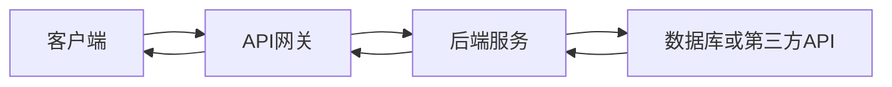
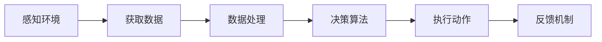
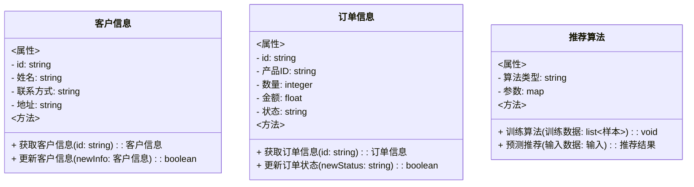
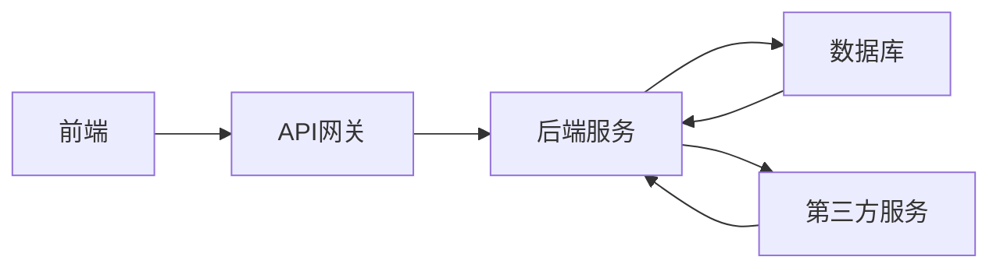
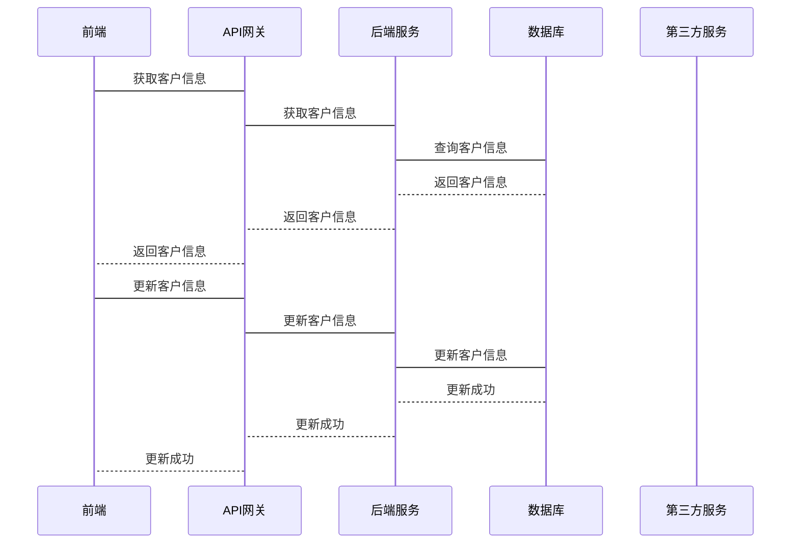

                 

<think>
好，我现在要根据用户的请求，为《API集成：扩展AI Agent的功能与数据源》这本书撰写一个详细的目录大纲。用户希望文章结构清晰，内容丰富，涵盖API集成和AI Agent的核心概念、算法原理、系统架构设计以及实际项目案例。

首先，我会从背景介绍开始，涵盖API集成和AI Agent的基本概念，它们的发展背景以及如何结合。接下来，我需要详细解释核心概念，包括API集成和AI Agent的定义、特点以及它们之间的关系，可能还要用图表来辅助说明。然后，我会深入探讨API集成与AI Agent的算法原理，结合流程图和数学模型来解释。之后，分析系统的架构设计，展示各个模块之间的交互，可能需要使用序列图。接着，通过一个实际的项目案例来展示如何应用这些理论，提供环境安装和代码实现的详细步骤。最后，总结全书，并给出未来的发展方向和建议。

在编写过程中，我需要确保每个章节都有足够的细节，同时保持逻辑的连贯性。可能会遇到如何平衡理论和实践，或者如何选择合适的案例来展示API集成在AI Agent中的应用。此外，图表和代码示例的插入也是关键，确保读者能够直观理解复杂的概念。

总之，我会按照用户的要求，一步步构建一个全面且有深度的目录大纲，确保内容详细、结构清晰，帮助读者系统地理解API集成如何扩展AI Agent的功能与数据源。
</think>

# API集成：扩展AI Agent的功能与数据源

> 关键词：API集成，AI Agent，功能扩展，数据源，算法原理，系统架构

> 摘要：本文探讨了API集成在扩展AI Agent功能与数据源中的作用，详细分析了API集成的核心概念、算法原理、系统架构设计以及实际项目案例，帮助读者全面理解如何通过API集成提升AI Agent的能力。

---

# 第1章: API集成与AI Agent的背景介绍

## 1.1 API集成的基本概念

### 1.1.1 API的定义与特点

API（Application Programming Interface，应用程序编程接口）是一组定义良好的函数、类或接口，用于构建应用程序。其特点包括：

- **抽象性**：隐藏实现细节，只暴露接口。
- **模块化**：便于功能扩展和维护。
- **跨平台性**：支持不同平台和语言的调用。

### 1.1.2 API集成的定义与作用

API集成是指通过API将不同系统或服务连接起来，实现数据交换和功能调用。其作用包括：

- **数据共享**：跨系统共享数据。
- **功能扩展**：通过调用其他系统功能，增强自身能力。
- **服务复用**：复用现有服务，减少开发成本。

### 1.1.3 API集成的分类与应用场景

API按类型可分为**REST API**、**GraphQL**、**SOAP**等。应用场景包括：

- **前后端分离**：前端调用后端API。
- **微服务架构**：服务间通过API通信。
- **第三方服务集成**：如支付网关、社交媒体登录。

## 1.2 AI Agent的发展背景

### 1.2.1 AI Agent的定义与特点

AI Agent（人工智能代理）是能够感知环境并采取行动以实现目标的智能实体。其特点包括：

- **自主性**：无需外部干预。
- **反应性**：能实时响应环境变化。
- **学习能力**：通过数据和经验提升能力。

### 1.2.2 AI Agent的核心功能与应用场景

AI Agent的核心功能包括：

- **感知环境**：通过传感器或API获取环境数据。
- **决策制定**：基于数据进行分析和决策。
- **执行动作**：通过执行器或API调用实现目标。

应用场景包括：

- **智能客服**：通过API调用获取客户信息，提供个性化服务。
- **自动驾驶**：通过API与车辆传感器和控制系统通信。
- **智能助手**：通过API获取日历、天气等信息，提供贴心服务。

### 1.2.3 AI Agent与传统软件的区别

| 特性 | 传统软件 | AI Agent |
|------|-----------|----------|
| 智能性 | 无或有限 | 高       |
| 学习能力 | 无或有限 | 高       |
| 自适应性 | 无或低 | 高       |
| 反应性 | 无或低 | 高       |

## 1.3 API集成与AI Agent的结合

### 1.3.1 API集成在AI Agent中的作用

API集成是AI Agent获取外部数据和调用外部服务的重要方式。其作用包括：

- **数据获取**：通过API获取外部数据，如天气数据、地理位置信息。
- **服务调用**：通过API调用外部服务，如支付服务、通知服务。
- **扩展功能**：通过API集成第三方功能，增强AI Agent的能力。

### 1.3.2 AI Agent通过API扩展功能的方式

AI Agent可以通过以下方式扩展功能：

- **调用外部API**：获取第三方服务的能力，如调用天气API获取天气信息。
- **暴露自身API**：允许其他系统调用AI Agent的功能，如提供智能推荐服务。
- **API网关**：通过API网关统一管理API调用，提供路由、鉴权、限流等功能。

### 1.3.3 API集成对AI Agent性能的影响

API集成对AI Agent的性能有重要影响。如果API调用延迟高或不可靠，将直接影响AI Agent的响应速度和用户体验。因此，需要通过API网关、缓存、负载均衡等技术优化API集成性能。

## 1.4 本章小结

本章介绍了API集成的基本概念和AI Agent的发展背景，重点探讨了API集成在AI Agent中的作用。通过API集成，AI Agent可以获取外部数据和调用外部服务，从而扩展功能和提升能力。

---

# 第2章: API集成与AI Agent的核心概念

## 2.1 API集成的核心概念

### 2.1.1 API的生命周期管理

API的生命周期管理包括API的设计、开发、测试、部署、监控和维护。其核心步骤包括：

1. **设计API**：设计API接口和文档。
2. **开发API**：编写API代码。
3. **测试API**：测试API的功能和性能。
4. **部署API**：将API部署到生产环境。
5. **监控API**：监控API的运行状态和性能。
6. **维护API**：修复API的缺陷和优化性能。

### 2.1.2 API的安全性与权限管理

API的安全性与权限管理是API集成的重要组成部分。常见的安全措施包括：

- **身份认证**：通过JWT、OAuth等协议进行身份认证。
- **权限控制**：通过RBAC（基于角色的访问控制）或ABAC（基于属性的访问控制）进行权限管理。
- **加密传输**：通过HTTPS等协议加密API通信。
- **IP白名单**：限制只能从特定IP地址调用API。

### 2.1.3 API的性能优化与监控

API的性能优化与监控是确保API集成高效运行的关键。常见的性能优化方法包括：

- **缓存**：通过缓存技术减少重复请求。
- **分片**：将大数据集分成小块处理。
- **负载均衡**：通过负载均衡分摊请求压力。
- **压缩**：通过GZIP等技术压缩数据传输。

API监控可以通过APM（Application Performance Monitoring）工具实现，如New Relic、Datadog等。

## 2.2 AI Agent的核心概念

### 2.2.1 AI Agent的智能决策机制

AI Agent的智能决策机制是其核心功能之一。常见的决策算法包括：

- **规则引擎**：基于预定义规则进行决策。
- **机器学习模型**：基于训练好的模型进行预测和决策。
- **强化学习**：通过试错学习最优策略。

### 2.2.2 AI Agent的知识库与数据源管理

AI Agent需要依赖知识库和数据源进行决策。常见的知识库类型包括：

- **关系型数据库**：如MySQL、PostgreSQL。
- **NoSQL数据库**：如MongoDB、Redis。
- **知识图谱**：如Wikidata、Freebase。

数据源管理包括数据的获取、存储、处理和更新。

### 2.2.3 AI Agent的自适应与学习能力

AI Agent的自适应与学习能力使其能够根据环境变化自动调整行为。常见的自适应技术包括：

- **在线学习**：实时更新模型参数。
- **迁移学习**：将已学习的知识迁移到新任务。
- **持续学习**：持续积累知识和经验。

## 2.3 API集成与AI Agent的关联

### 2.3.1 API作为AI Agent的数据源

AI Agent可以通过API获取外部数据源的数据。例如：

- **天气API**：获取天气数据。
- **地理位置API**：获取地理位置信息。
- **社交媒体API**：获取社交媒体数据。

### 2.3.2 API作为AI Agent的执行动作

AI Agent可以通过API调用外部服务执行动作。例如：

- **支付API**：完成支付操作。
- **通知API**：发送通知消息。
- **邮件API**：发送邮件。

### 2.3.3 API作为AI Agent的反馈机制

AI Agent可以通过API接收外部系统的反馈。例如：

- **传感器API**：接收设备传感器数据。
- **日志API**：接收系统日志信息。
- **用户反馈API**：接收用户的反馈信息。

## 2.4 核心概念对比与联系

### 2.4.1 API集成与AI Agent的核心属性对比表

| 属性 | API集成 | AI Agent |
|------|---------|----------|
| 核心功能 | 数据交换与功能调用 | 智能决策与自主行动 |
| 主要技术 | HTTP、JSON-RPC、GraphQL | 机器学习、自然语言处理 |
| 应用场景 | 系统集成、服务调用 | 智能客服、自动驾驶、智能助手 |

### 2.4.2 API集成与AI Agent的ER实体关系图

```mermaid
erd
    客户端 <--[发出API请求]--> API网关
    API网关 <--[路由请求]--> 后端服务
    后端服务 <--[提供数据或服务]--> 数据库或第三方API
    AI Agent <--[调用API]--> API网关
    AI Agent <--[获取数据]--> 数据库或第三方API
    AI Agent <--[执行动作]--> 执行器或第三方服务
```

---

# 第3章: API集成与AI Agent的算法原理

## 3.1 API集成的算法原理

### 3.1.1 API请求的发起与解析

API请求的发起与解析是API集成的第一步。常见的API请求方式包括：

- **GET**：获取数据。
- **POST**：提交数据。
- **PUT**：更新数据。
- **DELETE**：删除数据。

请求解析包括解析请求头、请求体、参数等。

### 3.1.2 API路由与服务发现

API路由与服务发现是API集成中的关键步骤。常见的路由方式包括：

- **基于路径的路由**：根据请求路径分发请求。
- **基于内容的路由**：根据请求内容分发请求。
- **基于策略的路由**：根据预定义策略分发请求。

服务发现可以通过注册中心实现，如Consul、Eureka等。

### 3.1.3 API调用与结果返回

API调用与结果返回是API集成的核心步骤。调用结果返回包括状态码、响应头、响应体等。

### 3.1.4 API集成的流程图



## 3.2 AI Agent的算法原理

### 3.2.1 AI Agent的感知与决策算法

AI Agent的感知与决策算法是其核心算法。常见的算法包括：

- **规则引擎**：基于预定义规则进行决策。
- **机器学习模型**：基于训练好的模型进行预测和决策。
- **强化学习**：通过试错学习最优策略。

### 3.2.2 AI Agent的知识库管理算法

AI Agent的知识库管理算法包括数据的获取、存储、处理和更新。常见的算法包括：

- **数据清洗**：去除无效数据。
- **数据转换**：将数据转换为适合模型训练的格式。
- **数据索引**：建立索引加速数据查询。

### 3.2.3 AI Agent的自适应学习算法

AI Agent的自适应学习算法包括在线学习、迁移学习、持续学习等。常见的算法包括：

- **在线学习**：实时更新模型参数。
- **迁移学习**：将已学习的知识迁移到新任务。
- **持续学习**：持续积累知识和经验。

### 3.2.4 AI Agent的决策流程图



## 3.3 API集成与AI Agent的协同算法

API集成与AI Agent的协同算法是通过API调用实现AI Agent与外部系统的协同工作。常见的协同算法包括：

- **服务发现与调用**：通过API网关发现并调用外部服务。
- **数据同步**：通过API实现数据的实时同步。
- **事件驱动**：通过API实现事件驱动的协同工作。

---

# 第4章: 系统分析与架构设计方案

## 4.1 问题场景介绍

### 4.1.1 项目背景

假设我们正在开发一个智能客服系统，需要通过API集成的方式扩展AI Agent的功能与数据源。

### 4.1.2 项目目标

通过API集成实现以下功能：

- **客户信息获取**：通过API获取客户信息。
- **智能推荐**：通过API调用推荐算法。
- **订单查询**：通过API查询订单状态。

## 4.2 系统功能设计

### 4.2.1 领域模型

智能客服系统的领域模型包括：

- **客户信息**：客户ID、姓名、联系方式、地址等。
- **订单信息**：订单ID、产品ID、数量、金额、状态等。
- **推荐算法**：基于客户行为的推荐算法。

### 4.2.2 领域模型类图



### 4.2.3 系统架构设计

智能客服系统的系统架构设计包括：

- **前端**：Web界面或移动客户端。
- **API网关**：统一管理API调用。
- **后端服务**：处理业务逻辑。
- **数据库**：存储数据。
- **第三方服务**：如推荐算法服务。

### 4.2.4 系统架构图



## 4.3 系统接口设计

### 4.3.1 API接口设计

以下是智能客服系统中API接口的设计：

- **客户信息API**
  - 获取客户信息：`GET /api/customers/{id}`
  - 更新客户信息：`PUT /api/customers/{id}`
- **订单信息API**
  - 获取订单信息：`GET /api/orders/{id}`
  - 更新订单状态：`PUT /api/orders/{id}/status`
- **推荐算法API**
  - 训练推荐算法：`POST /api/recommend/models/train`
  - 获取推荐结果：`GET /api/recommend/models/predict`

### 4.3.2 系统交互设计

以下是系统交互的序列图：



---

# 第5章: 项目实战

## 5.1 环境安装

### 5.1.1 安装工具

- **Python**：安装Python 3.8及以上版本。
- **Django**：安装Django框架。
- **PostgreSQL**：安装PostgreSQL数据库。
- **Docker**：安装Docker容器化工具。

### 5.1.2 安装依赖

安装以下Python依赖：

```bash
pip install django djangorestframework requests python-dotenv
```

## 5.2 核心代码实现

### 5.2.1 客户信息API

以下是客户信息API的实现代码：

```python
# models.py
from django.db import models

class Customer(models.Model):
    id = models.CharField(max_length=255, primary_key=True)
    name = models.CharField(max_length=255)
    contact = models.CharField(max_length=255)
    address = models.CharField(max_length=255)

# serializers.py
from rest_framework import serializers

class CustomerSerializer(serializers.ModelSerializer):
    class Meta:
        model = Customer
        fields = '__all__'

# views.py
from rest_framework import generics
from .serializers import CustomerSerializer
from .models import Customer

class CustomerViewSet(generics.RetrieveUpdateAPIView):
    queryset = Customer.objects.all()
    serializer_class = CustomerSerializer
```

### 5.2.2 推荐算法API

以下是推荐算法API的实现代码：

```python
# recommendation.py
class Recommender:
    def __init__(self):
        self.model = None
        self.params = {}

    def train(self, data):
        # 训练模型
        pass

    def predict(self, input):
        # 预测推荐结果
        pass

# views.py
from rest_framework import views
from rest_framework.response import Response
from .recommendation import Recommender

class RecommendViewSet(views.ViewSet):
    def train_model(self, request):
        # 训练推荐算法
        recommender = Recommender()
        recommender.train(request.data)
        return Response({'status': 'success', 'message': '模型训练成功'})

    def predict(self, request):
        # 预测推荐结果
        recommender = Recommender()
        result = recommender.predict(request.data)
        return Response({'status': 'success', 'result': result})
```

## 5.3 功能解读与实现

### 5.3.1 客户信息API的功能实现

- **获取客户信息**：通过`GET /api/customers/{id}`获取客户信息。
- **更新客户信息**：通过`PUT /api/customers/{id}`更新客户信息。

### 5.3.2 推荐算法API的功能实现

- **训练推荐算法**：通过`POST /api/recommend/models/train`训练推荐模型。
- **获取推荐结果**：通过`GET /api/recommend/models/predict`获取推荐结果。

## 5.4 项目小结

本章通过一个智能客服系统的实际案例，展示了如何通过API集成扩展AI Agent的功能与数据源。通过实现客户信息API和推荐算法API，我们可以看到API集成在实际项目中的应用。

---

# 第6章: 总结与展望

## 6.1 本章总结

本文详细探讨了API集成在扩展AI Agent功能与数据源中的作用，涵盖了API集成与AI Agent的核心概念、算法原理、系统架构设计以及实际项目案例。通过本文的介绍，读者可以全面理解如何通过API集成提升AI Agent的能力。

## 6.2 未来展望

随着AI技术的不断发展，API集成在AI Agent中的应用将更加广泛。未来，API集成将更加智能化和自动化，AI Agent将更加智能化和自主化。通过API集成与AI Agent的结合，我们将能够实现更加复杂和智能的应用场景。

---

# 作者

作者：AI天才研究院/AI Genius Institute & 禅与计算机程序设计艺术 /Zen And The Art of Computer Programming

