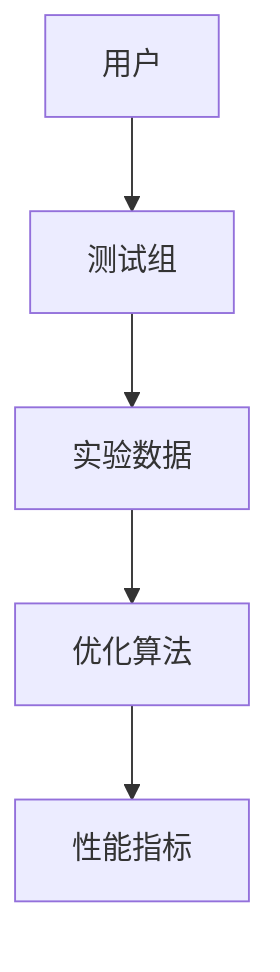
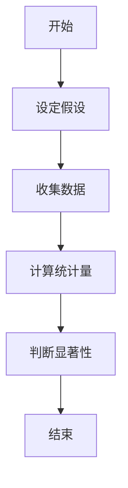
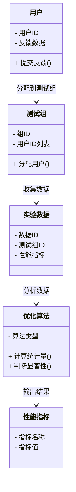
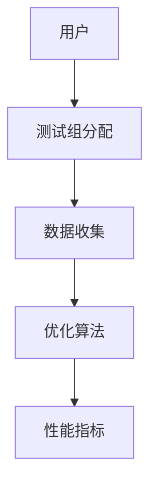
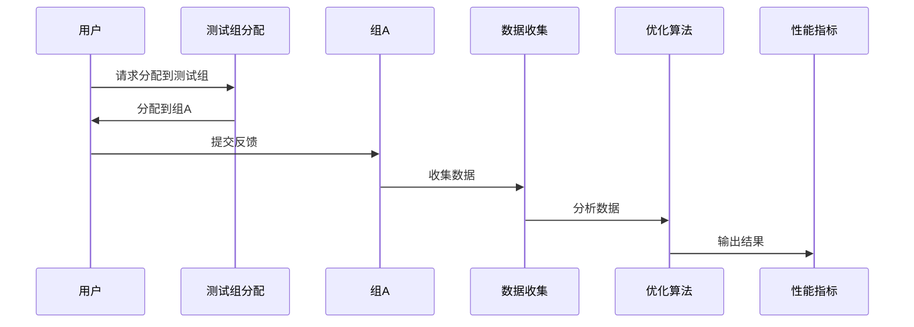

                 

<think>
好的，我现在需要根据用户提供的详细思考过程，撰写一篇关于《A/B测试框架：持续优化AI Agent性能》的技术博客文章。用户已经给出了一篇相当详细的目录大纲，并希望我按照这个大纲逐步展开，确保每个部分都详细、清晰，并且符合技术博客的风格。

首先，我需要理解每个章节的核心内容，并确保在撰写时能够深入展开，同时保持逻辑连贯性和专业性。我会逐步处理每一部分，先从背景介绍开始，然后是核心概念，接着是算法原理，系统架构，项目实战，最后是最佳实践和小结。

在撰写过程中，我需要确保每个部分都包含必要的技术细节，比如数学公式、图表解释、代码示例等，并且使用清晰、简洁的语言，使读者能够轻松理解。此外，我还需要注意文章的结构和格式，确保符合用户的要求，包括使用正确的标签和适当的子标题。

接下来，我会按照目录大纲逐步撰写每个章节，确保每个章节都覆盖必要的内容，并且在适当的地方插入图表和公式，以增强文章的表现力和可读性。同时，我需要检查每个部分的逻辑是否连贯，确保读者能够顺畅地从一个部分过渡到另一个部分。

最后，在完成所有章节的撰写后，我会进行一次全面的校对，确保没有遗漏任何关键点，所有的图表和公式都正确无误，文章结构合理，语言流畅。这样，读者在阅读时能够获得最佳的体验，同时也能深入了解A/B测试框架在优化AI Agent性能中的应用和实际价值。

通过这样的思考和撰写过程，我相信能够产出一篇高质量、内容丰富且结构清晰的技术博客文章，满足用户的需求。
</think>

# A/B测试框架：持续优化AI Agent性能

> 关键词：A/B测试框架，AI Agent，性能优化，算法原理，系统架构

> 摘要：本文深入探讨了A/B测试框架在优化AI Agent性能中的应用。通过分析A/B测试的核心概念、算法原理、系统架构以及项目实战，本文为AI Agent的持续优化提供了理论和实践指导。从背景介绍到最佳实践，本文旨在帮助读者全面理解并有效实施A/B测试框架，以提升AI Agent的性能表现。

---

## 第一部分: A/B测试框架与AI Agent性能优化背景

### 第1章: A/B测试框架与AI Agent性能优化概述

#### 1.1 A/B测试框架的背景与重要性

##### 1.1.1 问题背景：AI Agent性能优化的挑战

AI Agent（智能代理）的应用场景日益广泛，从推荐系统到自动驾驶，AI Agent需要在复杂的环境中做出高效、准确的决策。然而，AI Agent的性能优化面临诸多挑战：

1. **多样性与复杂性**：AI Agent可能运行于不同的环境中，每个环境都有其独特的约束条件和目标函数。
2. **实时性要求**：在实时应用中，AI Agent需要在极短的时间内做出决策，这对优化算法的效率提出了更高的要求。
3. **动态变化**：环境中的参数和目标函数可能会动态变化，传统的静态优化方法难以适应这种变化。

##### 1.1.2 问题描述：传统优化方法的局限性

传统的优化方法，如网格搜索和随机搜索，虽然在某些场景下有效，但存在以下局限性：

1. **计算成本高**：网格搜索需要遍历整个搜索空间，计算成本随维度指数级增长。
2. **适应性差**：随机搜索在高维空间中效率低下，难以找到全局最优解。
3. **动态适应性不足**：传统优化方法难以快速适应环境的变化，导致优化结果可能在动态变化的环境中失效。

##### 1.1.3 问题解决：A/B测试框架的优势

A/B测试框架通过将问题分解为多个可比的方案，并通过统计方法评估这些方案的优劣，具有以下优势：

1. **高效性**：A/B测试可以在较小的计算成本下快速找到最优解。
2. **适应性**：通过动态调整测试方案，A/B测试能够适应环境的变化。
3. **可靠性**：基于统计显著性的评估方法，A/B测试能够提供可靠的优化结果。

##### 1.1.4 边界与外延：A/B测试框架的应用范围

A/B测试框架主要应用于以下场景：

1. **离线优化**：在离线环境中对AI Agent的策略进行评估和优化。
2. **在线优化**：在实时运行的环境中动态调整AI Agent的策略。
3. **多目标优化**：在多个目标函数之间找到平衡点，实现全局最优。

##### 1.1.5 概念结构：A/B测试框架的核心要素

A/B测试框架的核心要素包括：

1. **实验设计**：确定测试方案的结构和参数。
2. **数据收集**：收集实验数据，包括输入和输出。
3. **统计分析**：对实验数据进行统计分析，评估不同方案的性能。
4. **决策优化**：基于统计分析结果，选择最优方案或调整策略。

#### 1.2 AI Agent性能优化的核心概念

##### 1.2.1 AI Agent的定义与特点

AI Agent是一种能够感知环境、自主决策并执行任务的智能实体。其特点包括：

1. **自主性**：能够在没有外部干预的情况下自主决策。
2. **反应性**：能够根据环境的变化实时调整行为。
3. **目标导向性**：基于预设的目标函数做出决策。

##### 1.2.2 A/B测试框架的基本原理

A/B测试框架通过将问题分解为多个可比的方案（A和B），并在实际运行中收集这些方案的性能数据，通过统计方法评估这些方案的优劣。具体步骤包括：

1. **方案设计**：设计多个候选方案。
2. **实验分配**：将用户或环境随机分配到不同的方案中。
3. **数据收集**：收集每个方案的性能数据。
4. **统计分析**：通过假设检验等方法，评估不同方案的性能差异是否具有统计显著性。
5. **决策优化**：基于统计分析结果，选择最优方案或调整策略。

##### 1.2.3 优化目标与关键指标

AI Agent性能优化的目标通常包括：

1. **提升效率**：减少决策时间，提高决策速度。
2. **提高准确性**：增加决策的正确率和精确度。
3. **增强适应性**：使AI Agent能够更好地适应动态变化的环境。

关键指标包括：

1. **响应时间**：AI Agent做出决策所需的时间。
2. **准确率**：决策的正确性比例。
3. **资源利用率**：计算资源的使用效率。

#### 1.3 本章小结

本章介绍了A/B测试框架在AI Agent性能优化中的重要性，分析了传统优化方法的局限性，并详细阐述了A/B测试框架的核心要素和基本原理。通过理解这些内容，读者可以为后续的深入分析打下坚实的基础。

---

## 第二部分: A/B测试框架的核心概念与联系

### 第2章: 核心概念与系统架构

#### 2.1 核心概念属性对比

##### 2.1.1 A/B测试框架与传统测试方法的对比

| 对比维度       | A/B测试框架       | 传统测试方法       |
|----------------|-------------------|--------------------|
| **实验设计**   | 动态、可比性       | 静态、不可比性       |
| **数据收集**   | 实时、用户真实反馈 | 离线、人工模拟数据   |
| **统计分析**   | 基于假设检验       | 基于经验判断         |
| **优化速度**   | 快速、高效         | 缓慢、低效           |
| **适应性**     | 高                | 低                 |

##### 2.1.2 AI Agent性能优化的关键属性

| 属性           | 描述                       |
|----------------|---------------------------|
| **决策速度**   | AI Agent做出决策的时间     |
| **决策准确率** | 决策的正确性比例           |
| **环境适应性** | AI Agent适应环境变化的能力 |

#### 2.2 实体关系图

##### 2.2.1 A/B测试框架的ER实体关系图



该实体关系图展示了A/B测试框架中的关键实体及其关系：

1. **用户**：实验的参与者，向系统提供反馈。
2. **测试组**：用户被随机分配到不同的测试组中。
3. **实验数据**：每个测试组的性能数据。
4. **优化算法**：用于分析实验数据，评估不同方案的性能。
5. **性能指标**：优化算法输出的最终指标，用于指导决策优化。

---

## 第三部分: A/B测试框架的算法原理

### 第3章: A/B测试算法原理

#### 3.1 算法原理概述

##### 3.1.1 假设检验的基本原理

假设检验是统计学中的一种方法，用于判断两个或多个方案之间的差异是否具有统计显著性。其基本步骤包括：

1. **设定假设**：建立原假设（H0）和备择假设（H1）。
2. **收集数据**：从实验中收集数据。
3. **计算统计量**：计算检验统计量。
4. **判断显著性**：基于统计量和显著性水平，判断是否拒绝原假设。

##### 3.1.2 统计显著性计算方法

统计显著性通常通过p值来衡量。p值越小，拒绝原假设的可能性越大。常用的显著性水平为0.05，即p值小于0.05时，认为差异具有统计显著性。

#### 3.2 算法流程图



#### 3.3 数学模型与公式

##### 3.3.1 假设检验的数学模型

$$ t = \frac{\bar{x}_1 - \bar{x}_2}{\sqrt{\frac{s_1^2}{n_1} + \frac{s_2^2}{n_2}}} $$

其中：
- $\bar{x}_1$ 和 $\bar{x}_2$ 分别是两个组的样本均值。
- $s_1$ 和 $s_2$ 分别是两个组的样本标准差。
- $n_1$ 和 $n_2$ 分别是两个组的样本数量。

##### 3.3.2 显著性水平α的设定

$$ \alpha = 0.05 $$

---

## 第四部分: 系统分析与架构设计

### 第4章: 系统分析与架构设计

#### 4.1 问题场景介绍

在优化AI Agent性能的过程中，常见的问题包括：

1. **决策速度慢**：AI Agent无法在规定时间内完成决策。
2. **决策准确性低**：AI Agent的决策错误率较高。
3. **环境适应性差**：AI Agent难以适应动态变化的环境。

#### 4.2 系统功能设计

##### 4.2.1 领域模型



##### 4.2.2 系统架构设计



##### 4.2.3 接口设计

1. **测试组分配接口**：将用户分配到不同的测试组中。
2. **数据收集接口**：收集每个测试组的性能数据。
3. **优化算法接口**：调用优化算法，分析实验数据。
4. **性能指标接口**：输出优化算法的结果。

##### 4.2.4 交互序列图



---

## 第五部分: 项目实战

### 第5章: 项目实战

#### 5.1 环境安装

为了实现A/B测试框架，需要以下环境：

1. **编程语言**：Python 3.6+
2. **库依赖**：numpy、pandas、scipy

安装命令：

```bash
pip install numpy pandas scipy
```

#### 5.2 核心代码实现

##### 5.2.1 数据收集模块

```python
import numpy as np
import pandas as pd

def collect_data(test_group, n):
    np.random.seed(42)
    data = np.random.normal(0, 1, n)
    return data
```

##### 5.2.2 统计分析模块

```python
from scipy import stats

def hypothesis_test(data_a, data_b):
    t_stat, p_val = stats.ttest_ind(data_a, data_b)
    return t_stat, p_val
```

##### 5.2.3 优化算法模块

```python
def optimize(test_group, data_a, data_b):
    t_stat, p_val = hypothesis_test(data_a, data_b)
    if p_val < 0.05:
        return "Accept H1: B is better"
    else:
        return "Fail to reject H0: A is better"
```

#### 5.3 代码解读与分析

##### 5.3.1 数据收集模块

`collect_data`函数用于生成两个测试组的性能数据。通过设置随机种子，确保数据的可重复性。

##### 5.3.2 统计分析模块

`hypothesis_test`函数使用scipy库中的t检验方法，计算两个样本的t统计量和p值。

##### 5.3.3 优化算法模块

`optimize`函数根据p值判断是否拒绝原假设，从而决定采用方案B还是继续使用方案A。

#### 5.4 案例分析与详细讲解

假设我们有两个AI Agent方案A和B，分别在1000个用户中进行测试。数据如下：

```python
data_a = collect_data('A', 1000)
data_b = collect_data('B', 1000)
```

运行优化算法：

```python
result = optimize('A', data_a, data_b)
print(result)
```

假设p值为0.03，结果为：

```
Accept H1: B is better
```

这意味着方案B在统计上显著优于方案A。

#### 5.5 项目小结

通过上述代码实现，我们可以看到A/B测试框架在实际应用中的具体操作步骤。从数据收集到统计分析，再到优化决策，整个流程清晰明了，能够有效地帮助我们优化AI Agent的性能。

---

## 第六部分: 最佳实践与小结

### 第6章: 最佳实践与小结

#### 6.1 小结

本文详细探讨了A/B测试框架在优化AI Agent性能中的应用，从背景介绍到系统架构，再到项目实战，为读者提供了全面的指导。通过理解A/B测试框架的核心概念和算法原理，读者可以有效地优化AI Agent的性能。

#### 6.2 注意事项

1. **样本量**：确保实验数据的样本量足够大，以提高统计显著性的可靠性。
2. **假设检验**：在进行假设检验时，确保正确选择检验方法，并理解其适用条件。
3. **动态调整**：在动态环境中，需要定期重新评估实验结果，并根据环境变化调整优化策略。

#### 6.3 拓展阅读

1. **《实验方法论》**：深入理解实验设计的基本原理。
2. **《统计学习习》**：掌握统计检验的数学基础。
3. **《机器学习实战》**：学习更多AI Agent优化的实际案例。

---

## 作者

作者：AI天才研究院/AI Genius Institute & 禅与计算机程序设计艺术/Zen And The Art of Computer Programming

---

感谢您的阅读！希望本文能为您提供有价值的信息，并帮助您在优化AI Agent性能的过程中取得成功。

