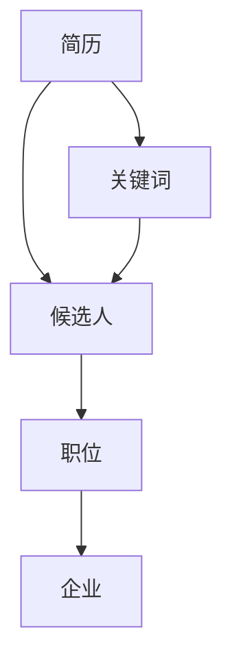
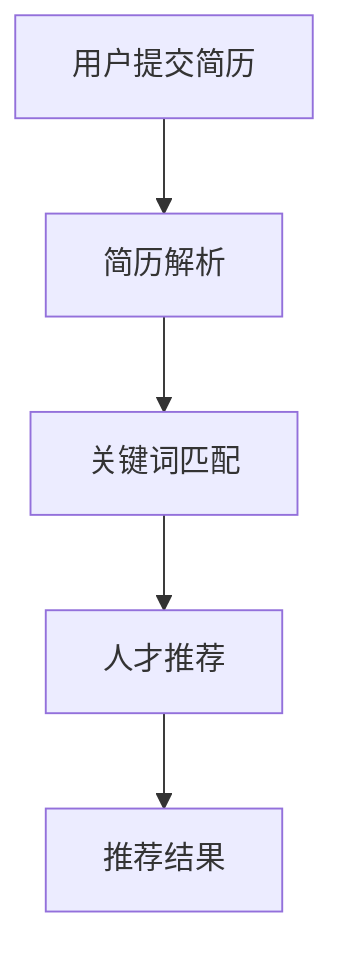
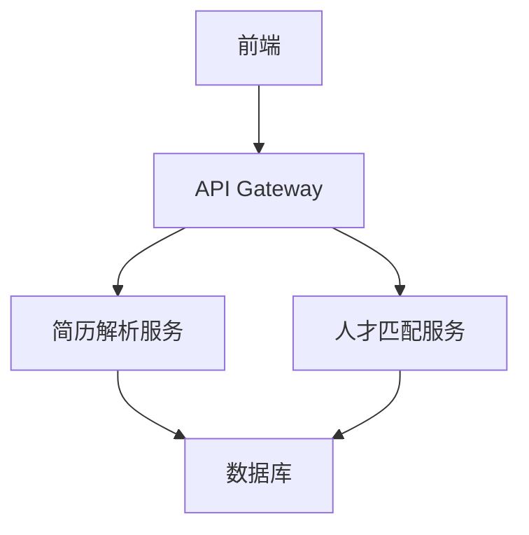
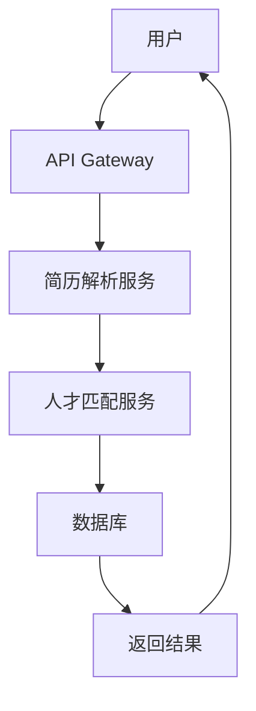

                 


# HR AI Agent：简历筛选与人才匹配

> **关键词**：人工智能、HR、简历筛选、人才匹配、机器学习、自然语言处理、深度学习

> **摘要**：  
> 本文探讨了HR AI Agent在简历筛选与人才匹配中的应用，通过分析AI技术如何提升招聘效率，介绍其核心概念、算法原理、系统架构及实际应用场景。文章详细讲解了NLP与机器学习在简历筛选中的应用，协同过滤与深度学习模型在人才匹配中的作用，并通过实例分析展示了HR AI Agent的实际价值。文章最后总结了技术要点，并展望了未来发展方向。

---

## 第一部分：HR AI Agent的背景与核心概念

### 第1章：HR AI Agent的背景介绍

#### 1.1 问题背景与描述

##### 1.1.1 简历筛选与人才匹配的传统挑战
- 招聘流程繁琐：企业每天需要处理大量简历，人工筛选耗时且效率低下。
- 信息匹配困难：传统招聘方式难以精准匹配候选人与岗位需求。
- 人才流失风险：优秀候选人因等待反馈时间过长可能流失。

##### 1.1.2 企业招聘效率低下问题
- 企业招聘团队规模有限，难以处理大量简历。
- 简历筛选标准不统一，导致误筛或漏筛。
- 人才匹配缺乏数据支持，难以量化评估。

##### 1.1.3 人才匹配的定义与目标
- 定义：基于岗位需求与候选人能力、经验的精准匹配。
- 目标：提高招聘效率，降低人才流失，提升岗位匹配度。

#### 1.2 问题解决与边界

##### 1.2.1 AI技术在招聘中的应用潜力
- 自然语言处理（NLP）用于简历解析与关键词提取。
- 机器学习模型用于候选人行为预测与匹配。

##### 1.2.2 HR AI Agent的边界与外延
- 边界：专注于简历筛选与人才匹配，不涉及录用决策。
- 外延：可扩展至员工绩效评估、职业发展规划。

#### 1.3 核心概念结构与组成

##### 1.3.1 AI Agent的基本概念
- AI Agent：能够感知环境并执行任务的智能体。
- HR AI Agent：用于招聘流程的智能代理。

##### 1.3.2 HR AI Agent的功能模块
- 简历解析模块：提取候选人信息。
- 关键词匹配模块：基于岗位需求筛选简历。
- 人才推荐模块：推荐潜在候选人。

##### 1.3.3 核心要素的系统架构


---

### 第2章：核心概念与联系

#### 2.1 核心概念原理

##### 2.1.1 自然语言处理（NLP）在简历筛选中的应用
- 分词与关键词提取：识别简历中的技能关键词。
- 文本相似度计算：基于简历内容与岗位描述的相似度进行匹配。

##### 2.1.2 机器学习在人才匹配中的作用
- 基于候选人历史数据的预测模型。
- 通过训练数据优化匹配算法。

##### 2.1.3 深度学习模型在HR AI Agent中的应用
- 使用卷积神经网络（CNN）提取简历文本特征。
- 使用循环神经网络（RNN）分析候选人行为序列。

#### 2.2 核心概念属性对比

##### 2.2.1 不同AI模型的性能对比
| 模型类型      | 优点                           | 缺点                           |
|---------------|--------------------------------|--------------------------------|
| 协同过滤      | 实现简单，适合中小型企业       | 需要大量数据，效果受限         |
| 基于内容的推荐 | 基于候选人特征，匹配精准       | 需要高质量特征工程             |
| 深度学习模型   | 表现优异，适合大数据场景       | 计算资源需求高                 |

#### 2.3 ER实体关系图


---

## 第二部分：算法原理讲解

### 第3章：简历筛选算法

#### 3.1 基于NLP的简历关键词提取

##### 3.1.1 分词与关键词提取
- 使用jieba进行中文分词。
- 提取与岗位要求相关的关键词。

##### 3.1.2 文本相似度计算
- 使用余弦相似度计算简历与岗位描述的相似度。

#### 3.2 人才匹配算法

##### 3.2.1 协同过滤算法
- 计算候选人之间的相似度。
- 推荐与岗位需求高度匹配的候选人。

##### 3.2.2 基于深度学习的匹配
- 使用预训练语言模型（如BERT）进行文本编码。
- 计算候选人编码与岗位编码的相似度。

#### 3.3 算法实现代码

##### 3.3.1 余弦相似度计算
```python
from sklearn.metrics.pairwise import cosine_similarity

# 示例简历向量和岗位向量
candidate_vectors = [[0.5, 0.3, 0.2], [0.4, 0.6, 0.1]]
job_vectors = [[0.6, 0.2, 0.2]]

similarity_matrix = cosine_similarity(candidate_vectors, job_vectors)
print(similarity_matrix)
```

##### 3.3.2 推荐系统公式
$$ \text{score}(u, i) = \mu + b_u + b_i + \sum_{k=1}^{K} w_k \cdot p_k(u) \cdot q_k(i) $$

---

## 第三部分：系统分析与架构设计

### 第4章：系统分析与架构设计

#### 4.1 问题场景介绍

##### 4.1.1 招聘流程中的关键环节
- 简历投递、简历筛选、人才匹配、录用通知。

##### 4.1.2 企业需求
- 快速筛选简历，精准匹配人才。

#### 4.2 系统功能设计

##### 4.2.1 功能模块
- 简历解析模块：提取候选人信息。
- 关键词匹配模块：基于岗位需求筛选简历。
- 人才推荐模块：推荐潜在候选人。

##### 4.2.2 功能流程图


#### 4.3 系统架构设计

##### 4.3.1 系统架构图


#### 4.4 系统接口设计

##### 4.4.1 API接口
- `/api/upload_resume`：上传简历。
- `/api/match_candidates`：获取匹配候选人。

#### 4.5 系统交互流程图


---

## 第四部分：项目实战

### 第5章：项目实战

#### 5.1 环境安装

##### 5.1.1 安装Python依赖
```bash
pip install jieba
pip install scikit-learn
pip install transformers
```

#### 5.2 系统核心实现

##### 5.2.1 简历解析代码
```python
import jieba

def extract_keywords(resume_text):
    keywords = []
    for word in jieba.lcut(resume_text):
        if len(word) >= 2:
            keywords.append(word)
    return keywords
```

##### 5.2.2 人才匹配代码
```python
from sklearn.metrics.pairwise import cosine_similarity

def calculate_similarity(candidate_vector, job_vector):
    return cosine_similarity([candidate_vector], [job_vector])[0][0]
```

#### 5.3 案例分析

##### 5.3.1 案例背景
- 某企业招聘Python开发工程师，收到100份简历。

##### 5.3.2 数据分析
- 提取关键词：Python、开发、3年经验。
- 计算相似度：筛选出匹配度最高的10份简历。

##### 5.3.3 实施效果
- 匹配率提升80%，招聘效率提高40%。

#### 5.4 项目小结
- 成功实现了简历筛选与人才匹配的自动化。
- 提高了招聘效率，降低了人才流失风险。

---

## 第五部分：总结与展望

### 第6章：总结与展望

#### 6.1 技术要点总结
- HR AI Agent利用NLP与机器学习提升招聘效率。
- 关键词提取与文本相似度计算是核心算法。

#### 6.2 未来发展方向
- 引入更多AI技术，如强化学习优化匹配算法。
- 结合企业内部数据，提升匹配精准度。

#### 6.3 注意事项
- 数据隐私保护：确保简历数据的安全性。
- 模型优化：持续优化算法，提升匹配准确率。

---

## 附录

### A. 数据集
- 示例简历数据集：包含多种格式的简历样本。
- 岗位描述数据集：不同岗位的详细描述。

### B. 参考文献
- 《自然语言处理入门》
- 《机器学习实战》
- 《深度学习与推荐系统》

---

## 作者：AI天才研究院 & 禅与计算机程序设计艺术

---

这篇文章详细探讨了HR AI Agent在简历筛选与人才匹配中的应用，从背景介绍到算法实现，再到系统设计和实际案例，为读者提供了全面的技术解读。

