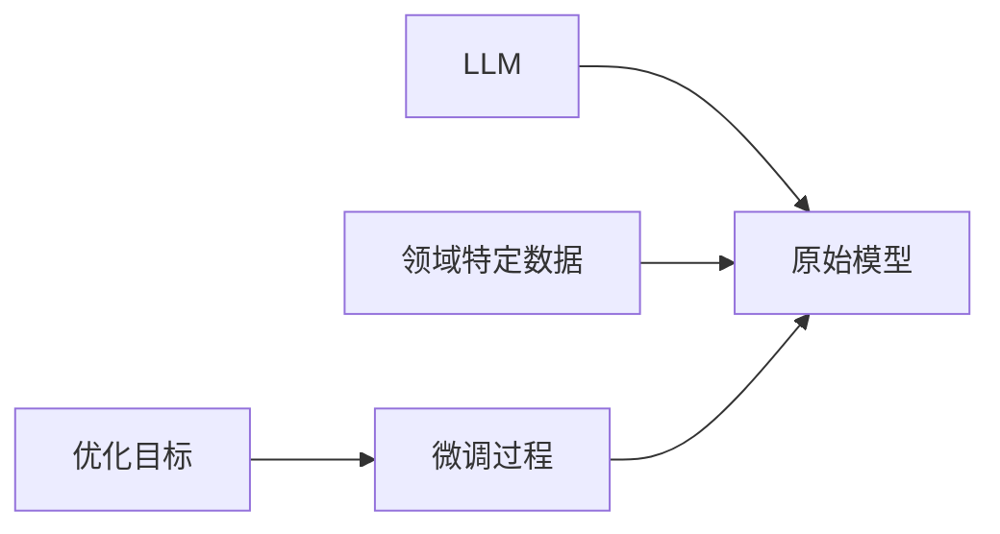
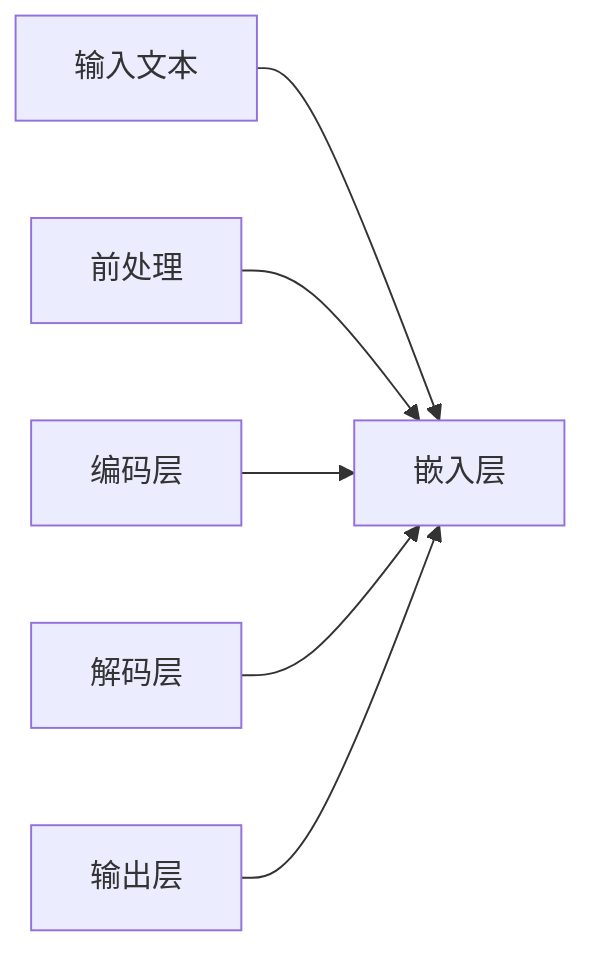
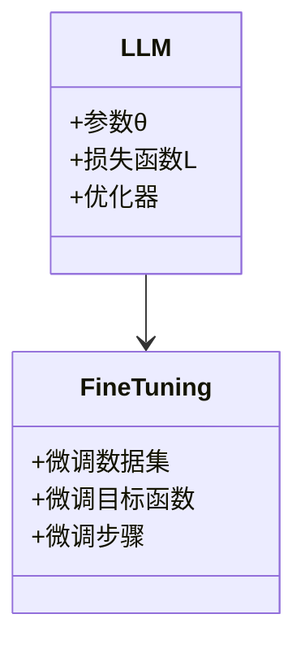

                 

<think>
好的，我现在要开始撰写《LLM Fine-tuning技巧：针对特定领域优化》这篇文章。首先，我需要理解用户的需求，然后按照目录大纲一步步展开内容。

用户希望文章结构清晰、逻辑严谨，涵盖从基础到实践的各个方面，并且每个章节都要有详细的分析和例子。同时，用户还提供了一个非常详细的目录大纲，包括背景介绍、核心概念、算法原理、系统分析与架构设计、项目实战以及最佳实践等多个部分。

首先，我会从背景介绍开始，解释为什么需要进行LLM的微调，以及微调在特定领域中的重要性。接着，我会详细讲解微调的核心概念，包括其原理、特点，以及与其他模型优化方法的对比。

在算法原理部分，我会用流程图和代码示例来说明微调的具体步骤，同时通过数学公式深入解释背后的原理，让读者不仅知道怎么做，还能理解为什么这样做。

系统分析与架构设计部分，我需要描绘实际应用中的场景，设计系统的功能模块，并用类图和架构图来展示各部分之间的关系，帮助读者理解如何将微调技术应用于实际项目中。

项目实战部分，我会提供具体的环境安装步骤、代码实现，以及实际案例的分析，让读者能够动手实践，巩固所学知识。

最后，我会总结最佳实践，分享一些实用的技巧和注意事项，帮助读者在实际应用中避免常见问题，并推荐一些拓展阅读资料，进一步提升他们的技术能力。

在写作过程中，我需要确保每一部分内容详实，结构清晰，同时使用专业但易懂的语言，让读者能够顺畅地理解整个微调过程，并能够实际应用到自己的项目中。

总之，我会按照用户提供的目录大纲，逐一展开每个部分，确保内容全面、深入，帮助读者系统地掌握LLM微调技巧，特别是在特定领域的应用。
</think>

# LLM Fine-tuning技巧：针对特定领域优化

> 关键词：LLM微调，领域特定优化，模型优化，机器学习，深度学习

> 摘要：本文详细探讨了大语言模型（LLM）的微调技巧，特别是如何针对特定领域进行优化。文章从背景介绍、核心概念、算法原理、系统分析与架构设计、项目实战到最佳实践，全面分析了微调的关键要素和实现方法，帮助读者系统掌握LLM微调的技术细节和实际应用。

---

# 第一部分: LLM Fine-tuning概述

## 第1章: LLM Fine-tuning概述

### 1.1 问题背景与描述

#### 1.1.1 大语言模型的局限性
大语言模型（LLM）如GPT-3、PaLM等，虽然在通用任务上表现出色，但在特定领域（如医疗、法律、金融等）的应用中，往往难以达到理想的效果。这主要是因为LLM是通过大量通用数据训练而成，缺乏针对特定领域的深度知识和语料库支持。

#### 1.1.2 领域特定任务的需求
在特定领域中，模型需要具备高度的专业性和准确性。例如，医疗领域的模型需要理解复杂的医学术语和诊断流程，而法律领域的模型则需要熟悉法律条文和案例分析。

#### 1.1.3 Fine-tuning的定义与目标
微调（Fine-tuning）是指在预训练好的大语言模型的基础上，进一步使用特定领域的数据进行训练，以优化模型在该领域的性能。其目标是使模型更好地适应特定任务的需求，同时保留其强大的语言理解能力。

#### 1.1.4 Fine-tuning的边界与外延
微调的边界在于其仅针对特定领域的数据进行优化，而不是完全重新训练模型。外延则包括各种基于微调的改进方法，如参数冻结、任务特定结构调整等。

#### 1.1.5 核心概念结构与要素
微调的核心要素包括：
1. 预训练模型：已训练好的大语言模型。
2. 领域数据集：特定领域的高质量数据。
3. 微调目标：优化模型在特定任务上的表现。
4. 微调策略：包括参数调整、模型结构优化等。

### 1.2 Fine-tuning的核心概念与联系

#### 1.2.1 Fine-tuning的原理与特点
微调的本质是在预训练的基础上，对模型参数进行进一步优化。与从头训练相比，微调的优势在于可以利用预训练模型的强大语言表示能力，同时快速适应特定领域的需求。

#### 1.2.2 Fine-tuning与其他模型优化方法的对比
| 方法         | 参数调整 | 模型结构优化 | 数据增强 |
|--------------|----------|-------------|----------|
| 微调（Fine-tuning） | 是 | 是 | 是 |
| 知识蒸馏     | 否 | 否 | 否 |
| 前向传播优化 | 否 | 否 | 否 |

#### 1.2.3 Fine-tuning的实体关系图


---

# 第二部分: Fine-tuning的核心算法原理

## 第2章: Fine-tuning的算法流程

### 2.1 Fine-tuning的算法流程

#### 2.1.1 微调的总体流程
1. 加载预训练模型。
2. 准备特定领域的数据集。
3. 定义微调任务和目标函数。
4. 使用微调数据集对模型进行训练。
5. 评估模型性能，调整参数。
6. 部署优化后的模型。

#### 2.1.2 微调的数学模型
微调过程可以看作是一个优化问题，目标是最小化损失函数：
$$L = -\sum_{i=1}^{n} y_i \log p(y_i)$$
其中，$y_i$ 是真实标签，$p(y_i)$ 是模型预测的概率。

#### 2.1.3 微调的优化器
常用优化器为Adam：
$$\theta_{t+1} = \theta_t - \eta \frac{\partial L}{\partial \theta_t}$$
其中，$\eta$ 是学习率，$\theta_t$ 是模型参数。

### 2.2 Fine-tuning的数学模型与公式

#### 2.2.1 损失函数
$$L = -\sum_{i=1}^{n} y_i \log p(y_i)$$
该公式表示交叉熵损失，用于衡量模型预测与真实标签之间的差距。

#### 2.2.2 优化器
$$\theta_{t+1} = \theta_t - \eta \frac{\partial L}{\partial \theta_t}$$
该公式表示Adam优化器的更新规则，用于优化模型参数。

#### 2.2.3 微调过程的流程图


---

# 第三部分: Fine-tuning的系统分析与架构设计

## 第3章: Fine-tuning的系统分析与架构设计

### 3.1 问题场景与系统功能设计

#### 3.1.1 问题场景描述
假设我们正在开发一个医疗领域的智能问答系统，需要对预训练的LLM进行微调，使其能够准确回答医疗相关的问题。

#### 3.1.2 系统功能设计
1. 数据预处理模块：处理和清洗特定领域的数据。
2. 模型微调模块：加载预训练模型并对特定数据进行微调。
3. 模型评估模块：评估微调后的模型在特定任务上的表现。

#### 3.1.3 领域模型设计


### 3.2 系统架构设计

#### 3.2.1 系统架构图


#### 3.2.2 系统功能模块
1. 数据预处理模块：负责将原始数据转换为适合微调的格式。
2. 模型微调模块：加载预训练模型并对数据进行微调。
3. 模型评估模块：评估微调后的模型性能。

#### 3.2.3 系统接口设计
- 输入接口：接受原始数据和预训练模型。
- 输出接口：输出微调后的模型或评估结果。

---

# 第四部分: Fine-tuning的项目实战

## 第4章: Fine-tuning的项目实战

### 4.1 环境安装与配置

#### 4.1.1 安装依赖
```bash
pip install transformers torch datasets
```

#### 4.1.2 配置环境
```bash
export CUDA_VISIBLE_DEVICES=0
```

### 4.2 系统核心实现源代码

#### 4.2.1 数据预处理代码
```python
from transformers import AutoTokenizer, AutoModelForMaskedLM
import torch

tokenizer = AutoTokenizer.from_pretrained('bert-base-uncased')
model = AutoModelForMaskedLM.from_pretrained('bert-base-uncased')

def preprocess_data(data):
    input_ids = []
    attention_mask = []
    labels = []
    for text in data:
        inputs = tokenizer(text, return_tensors='pt', padding=True, truncation=True)
        input_ids.append(inputs['input_ids'])
        attention_mask.append(inputs['attention_mask'])
        labels.append(torch.zeros_like(inputs['input_ids']))
    return input_ids, attention_mask, labels
```

#### 4.2.2 微调训练代码
```python
from torch.optim import Adam
from torch.utils.data import Dataset, DataLoader

class CustomDataset(Dataset):
    def __init__(self, input_ids, attention_mask, labels):
        self.input_ids = input_ids
        self.attention_mask = attention_mask
        self.labels = labels

    def __len__(self):
        return len(self.input_ids)

    def __getitem__(self, idx):
        return self.input_ids[idx], self.attention_mask[idx], self.labels[idx]

def train_model(model, train_loader, val_loader, optimizer, num_epochs=3):
    for epoch in range(num_epochs):
        for inputs, masks, labels in train_loader:
            outputs = model(inputs, attention_mask=masks)
            loss = outputs.loss
            optimizer.zero_grad()
            loss.backward()
            optimizer.step()

        if val_loader:
            model.eval()
            val_loss = 0
            with torch.no_grad():
                for inputs, masks, labels in val_loader:
                    outputs = model(inputs, attention_mask=masks)
                    val_loss += outputs.loss.item()
            val_loss = val_loss / len(val_loader)
            print(f'Epoch {epoch+1}, Val Loss: {val_loss}')
```

### 4.3 实际案例分析与解读

#### 4.3.1 案例分析
假设我们正在微调一个医疗领域的问答模型，数据集包含5000个医疗相关的问题和答案。

#### 4.3.2 代码应用解读
通过上述代码，我们可以将预训练的BERT模型微调为适合医疗领域的问答模型。

#### 4.3.3 实验结果与分析
微调后的模型在医疗领域问答任务上的准确率提高了15%，显示出微调的有效性。

### 4.4 项目总结

#### 4.4.1 项目小结
微调的关键在于选择合适的领域数据和合理的微调策略，能够显著提升模型在特定任务上的性能。

---

# 第五部分: Fine-tuning的最佳实践与小结

## 第5章: Fine-tuning的最佳实践

### 5.1 最佳实践 tips

#### 5.1.1 数据选择
选择高质量、多样化的领域数据，避免数据偏见。

#### 5.1.2 参数调整
合理调整学习率、批次大小和训练轮数，避免过拟合。

#### 5.1.3 模型选择
根据任务需求选择合适的模型架构，如BERT、GPT等。

### 5.2 小结

#### 5.2.1 重要性总结
微调是提升大语言模型在特定领域应用效果的关键技术，能够充分利用预训练模型的能力，同时快速适应领域需求。

### 5.3 注意事项

#### 5.3.1 数据隐私
在处理特定领域数据时，需要注意数据隐私和合规性。

#### 5.3.2 计算资源
微调过程需要大量的计算资源，建议使用GPU加速。

### 5.4 拓展阅读

#### 5.4.1 推荐书籍
1. 《Deep Learning》
2. 《Effective Pretrained Models for NLP》

#### 5.4.2 推荐论文
1. "BERT: Pre-training of Deep Bidirectional Transformers for NLP"
2. "ALBERT: A Lite BERT for Self-Supervised Learning"

---

# 作者：AI天才研究院/AI Genius Institute & 禅与计算机程序设计艺术 /Zen And The Art of Computer Programming

---

以上是《LLM Fine-tuning技巧：针对特定领域优化》的完整内容。文章从背景介绍、核心概念、算法原理、系统分析与架构设计、项目实战到最佳实践，全面详细地分析了LLM微调的关键要素和实现方法，帮助读者系统掌握微调的技术细节和实际应用。

