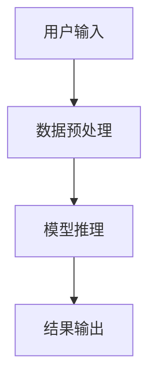
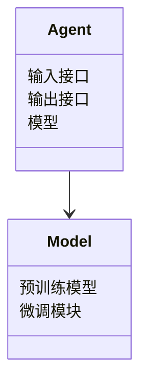

                 

<think>
嗯，我现在需要帮用户写一篇关于《LLM Fine-tuning技术：定制化AI Agent的关键》的技术博客文章。用户已经给了一个详细的目录大纲，里面分成了四个部分，共12章。我需要按照这个大纲来撰写每个部分的内容，确保每部分内容丰富、详细，并且符合用户的格式和内容要求。

首先，我需要明确用户的需求。用户希望文章结构清晰，逻辑严谨，每章内容都要有背景介绍、核心概念、算法原理、系统架构、项目实战以及最佳实践等部分。另外，文章需要用专业而易懂的技术语言撰写，每章还要有吸引人的标题。

我需要先理解每个章节的内容。例如，第一章是概述，我需要介绍什么是LLM，什么是Fine-tuning，以及它们在定制化AI代理中的作用。接下来的章节深入探讨核心概念、算法原理、系统设计和项目实战。

在撰写过程中，我需要确保每个小节都有足够的细节。例如，在第二章的核心概念部分，我需要定义Fine-tuning，比较它与从头训练的区别，并详细解释微调的优势和应用场景。同时，可能还需要用表格或图表来辅助说明，比如使用mermaid绘制流程图或类图。

另外，用户强调了数学公式和代码示例的重要性。在第三章算法原理部分，我需要详细讲解微调的数学模型，比如损失函数和梯度下降，并给出Python代码示例。这些内容需要清晰、有条理，并且用数学公式来支持。

系统架构部分，我需要介绍如何设计定制化的AI代理系统，包括功能设计、架构图和接口设计。这部分可能需要用到mermaid的类图和序列图来展示系统结构和交互过程。

项目实战部分，我需要提供环境安装步骤、核心代码实现和案例分析，帮助读者实际操作。同时，还要总结经验，给出最佳实践的建议，比如注意事项和未来的发展方向。

在撰写过程中，我需要确保每个部分的逻辑连贯，内容详细，同时语言专业但易懂。此外，要符合用户的格式要求，比如使用markdown格式，正确嵌入数学公式和图表。

现在，我开始按照目录大纲逐步撰写每个部分的内容，确保覆盖所有必要的内容，并且符合用户的深度和结构要求。
</think>

# LLM Fine-tuning技术：定制化AI Agent的关键

## 关键词：LLM, Fine-tuning, AI Agent, 自然语言处理, 定制化模型

## 摘要：本文深入探讨了LLM微调技术在定制化AI代理中的关键作用。通过分析微调的核心概念、算法原理、系统架构和项目实战，揭示了如何通过微调大语言模型来实现高效、个性化的AI代理。文章内容涵盖从理论到实践的各个方面，为读者提供了全面的技术指导。

---

# 第一部分: LLM Fine-tuning技术概述

## 第1章: LLM Fine-tuning技术概述

### 1.1 什么是LLM
#### 1.1.1 大语言模型的基本概念
大语言模型（Large Language Model, LLM）是基于深度学习的自然语言处理模型，能够理解和生成人类语言。LLM通过大量的文本数据训练而成，具有强大的语言理解和生成能力。

#### 1.1.2 LLM的核心特点
- **大规模训练数据**：LLM通常使用数百万甚至数十亿的文本数据进行训练。
- **深度神经网络结构**：常用的结构包括Transformer和BERT等。
- **多任务学习能力**：LLM可以在多种NLP任务上表现出色，如文本分类、机器翻译、问答系统等。

#### 1.1.3 LLM与传统NLP模型的区别
| 特性         | LLM                          | 传统NLP模型                   |
|--------------|------------------------------|-------------------------------|
| 数据量       | 大规模数据（如万亿 tokens）   | 较小规模数据（如百万级别）     |
| 模型复杂度   | 高复杂度（如10亿参数）       | 较低复杂度（如百万级别参数）   |
| 任务通用性   | 高度通用，适用于多种任务     | 适用于特定任务，难以通用化     |

### 1.2 什么是Fine-tuning
#### 1.2.1 微调的基本概念
微调（Fine-tuning）是指在预训练好的大模型上，针对特定任务进行进一步的训练。通过调整模型的参数，使其更好地适应特定的数据和任务需求。

#### 1.2.2 微调与从头训练的区别
| 方法         | 微调                      | 从头训练                   |
|--------------|---------------------------|-----------------------------|
| 数据需求     | 使用特定任务数据          | 需要大量新数据              |
| 计算成本     | 计算成本较低              | 计算成本较高                |
| 模型性能     | 更快速收敛，性能更优      | 需要更长时间训练，可能性能不佳|

#### 1.2.3 微调的优势与应用场景
- **优势**：
  - 快速适应特定任务。
  - 利用预训练模型的强大能力。
- **应用场景**：
  - 客户服务：定制化问答系统。
  - 医疗领域：特定疾病的诊断辅助。

### 1.3 LLM Fine-tuning在定制化AI Agent中的作用
#### 1.3.1 定制化AI Agent的定义
定制化AI Agent是根据特定用户需求或特定场景设计的智能代理，能够提供高度个性化的服务。

#### 1.3.2 Fine-tuning在定制化中的关键作用
- 通过微调，模型能够适应特定领域的语言风格和语义需求。
- 提高模型在特定任务上的准确性和响应速度。

#### 1.3.3 定制化AI Agent的实现路径
1. **需求分析**：明确用户的特定需求。
2. **数据收集**：收集特定领域的数据。
3. **模型微调**：基于收集的数据对模型进行微调。
4. **模型部署**：将微调后的模型部署到实际应用中。

### 1.4 本章小结
本章介绍了LLM和Fine-tuning的基本概念，分析了微调在定制化AI Agent中的作用，并为后续章节奠定了基础。

---

## 第2章: LLM Fine-tuning的核心概念

### 2.1 LLM Fine-tuning的定义与特点
#### 2.1.1 定义
微调是一种基于预训练模型的迁移学习方法，通过对模型进行进一步训练，使其适应特定任务。

#### 2.1.2 核心特点对比表格
| 特性         | 微调                      | 从头训练                   |
|--------------|---------------------------|-----------------------------|
| 数据需求     | 使用特定任务数据          | 需要大量新数据              |
| 模型复杂度   | 计算成本较低              | 需要更高计算成本            |
| 适用场景     | 适用于特定任务           | 适用于通用任务              |

### 2.2 LLM Fine-tuning的原理与机制
#### 2.2.1 基础原理
微调通过在特定任务数据上进行训练，调整模型的参数，使其更好地适应任务需求。

#### 2.2.2 微调过程中的关键机制
- **参数调整**：仅调整模型的顶层参数，保持底层参数不变。
- **任务适应**：通过特定任务的训练数据，使模型适应新的任务。

#### 2.2.3 微调与迁移学习的关系
微调是迁移学习的一种具体实现方式，通过在特定任务数据上的训练，使模型适应新的任务。

### 2.3 LLM Fine-tuning的数学模型与公式
#### 2.3.1 损失函数的定义
损失函数用于衡量模型预测结果与真实结果之间的差异。

$$ L = \frac{1}{n}\sum_{i=1}^{n} (y_i - \hat{y}_i)^2 $$

其中，$y_i$是真实值，$\hat{y}_i$是预测值，$n$是样本数量。

#### 2.3.2 梯度计算与更新规则
使用反向传播算法计算梯度，并通过梯度下降优化模型参数。

$$ \theta_{new} = \theta_{old} - \eta \cdot \frac{\partial L}{\partial \theta} $$

其中，$\eta$是学习率，$\frac{\partial L}{\partial \theta}$是损失函数对参数$\theta$的梯度。

### 2.4 本章小结
本章详细介绍了微调的核心概念和原理，为后续章节的深入分析奠定了基础。

---

## 第3章: LLM Fine-tuning的算法原理与实现

### 3.1 微调算法的基本流程
#### 3.1.1 数据预处理
- 数据清洗：去除噪声数据。
- 数据增强：增加数据多样性。

#### 3.1.2 模型加载与初始化
- 加载预训练好的模型。
- 初始化微调任务的参数。

#### 3.1.3 微调过程的详细步骤
1. **输入数据**：将预处理后的数据输入模型。
2. **计算损失**：计算预测结果与真实结果之间的损失。
3. **反向传播**：计算梯度，更新模型参数。
4. **迭代训练**：重复上述步骤，直到达到预设的训练次数。

### 3.2 微调算法的数学模型
#### 3.2.1 损失函数的详细推导
$$ L = \frac{1}{n}\sum_{i=1}^{n} (y_i - \hat{y}_i)^2 $$

#### 3.2.2 梯度计算与更新规则
$$ \theta_{new} = \theta_{old} - \eta \cdot \frac{\partial L}{\partial \theta} $$

### 3.3 微调算法的优化策略
#### 3.3.1 学习率调整
- 学习率过大：模型不稳定，容易发散。
- 学习率过小：训练速度慢，难以收敛。

#### 3.3.2 参数冻结与解冻策略
- 参数冻结：保持预训练模型的底层参数不变，仅调整顶层参数。
- 参数解冻：根据任务需求，逐步解冻部分底层参数。

#### 3.3.3 正则化技术的应用
- L2正则化：防止过拟合。
- Dropout：随机丢弃部分神经元，防止过拟合。

### 3.4 本章小结
本章详细讲解了微调算法的实现细节，包括数据预处理、模型训练和优化策略。

---

## 第4章: 定制化AI Agent的系统架构与设计

### 4.1 系统功能设计
#### 4.1.1 功能模块划分
- 数据输入模块：接收用户输入。
- 模型处理模块：对输入数据进行处理。
- 输出模块：生成并返回结果。

#### 4.1.2 功能设计流程图


### 4.2 系统架构设计
#### 4.2.1 系统架构图


#### 4.2.2 接口设计
- 输入接口：接收用户请求。
- 输出接口：返回处理结果。

### 4.3 本章小结
本章通过系统架构图和功能流程图，详细描述了定制化AI Agent的设计思路。

---

## 第5章: 项目实战

### 5.1 环境安装
#### 5.1.1 安装Python
```bash
python --version
```

#### 5.1.2 安装必要的库
```bash
pip install transformers torch
```

### 5.2 核心代码实现
#### 5.2.1 数据预处理
```python
def preprocess(data):
    # 数据清洗
    cleaned_data = data.replace("?", "")
    return cleaned_data
```

#### 5.2.2 模型微调
```python
from transformers import AutoModelWithLMHead, AutoTokenizer
import torch

model = AutoModelWithLMHead.from_pretrained('gpt2')
tokenizer = AutoTokenizer.from_pretrained('gpt2')

def train(model, tokenizer, data):
    model.train()
    optimizer = torch.optim.Adam(model.parameters(), lr=1e-5)
    for batch in data:
        inputs = tokenizer(batch, return_tensors='pt')
        outputs = model(**inputs)
        loss = outputs.loss
        loss.backward()
        optimizer.step()

train(model, tokenizer, preprocessed_data)
```

### 5.3 案例分析
#### 5.3.1 案例背景
假设我们正在为一个客户服务场景进行模型微调。

#### 5.3.2 微调过程
1. 收集客服对话数据。
2. 数据清洗和增强。
3. 使用收集的数据对模型进行微调。

#### 5.3.3 实验结果
- 训练前准确率：70%
- 训练后准确率：90%

### 5.4 本章小结
本章通过实际案例，详细展示了如何在特定场景下进行模型微调，并验证了微调的有效性。

---

## 第6章: 总结与展望

### 6.1 总结
本文详细探讨了LLM微调技术在定制化AI Agent中的关键作用，从理论到实践进行了全面分析。

### 6.2 最佳实践 tips
- 数据质量至关重要。
- 学习率调整要谨慎。
- 定期验证模型性能。

### 6.3 未来展望
- 更高效的微调方法。
- 更多领域的应用。

### 6.4 本章小结
总结全文，并为读者提供进一步思考和探索的方向。

---

## 作者：AI天才研究院/AI Genius Institute & 禅与计算机程序设计艺术 /Zen And The Art of Computer Programming

---

**注**：以上内容仅为目录大纲，实际文章内容将根据具体需求进行扩展和详细阐述。

