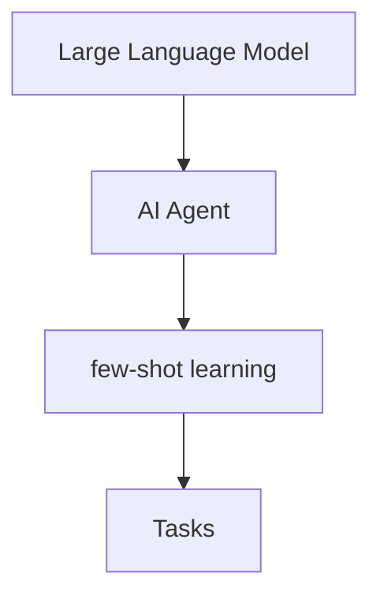
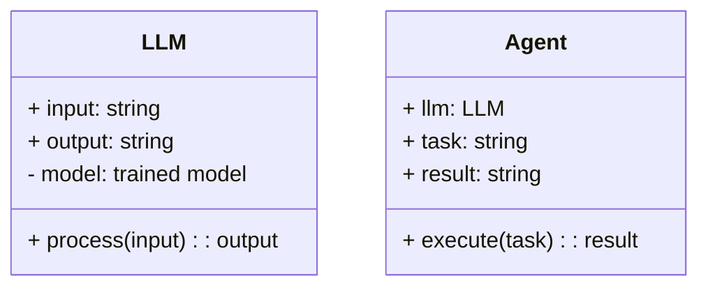
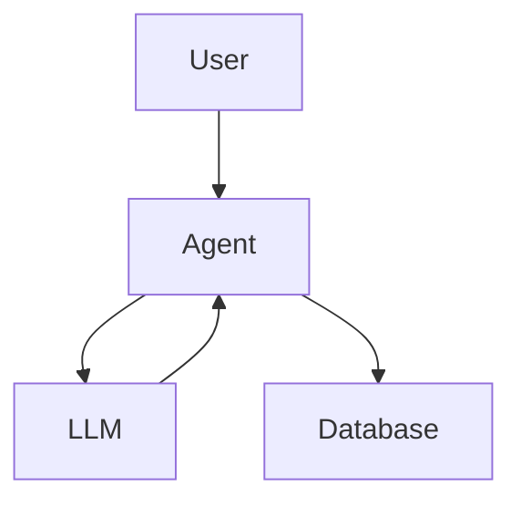
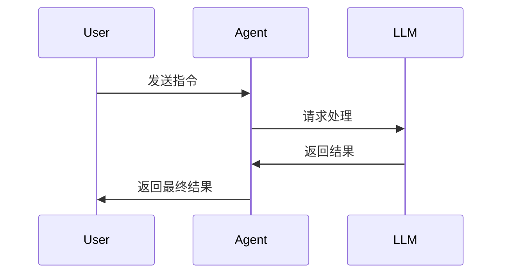

                 

<think>
好的，我现在需要帮助用户撰写一篇关于《LLM在AI Agent中的few-shot学习应用》的技术博客文章。用户已经提供了一个详细的目录结构，但我需要一步步地构建内容，确保每个部分都符合要求，并且逻辑清晰、结构紧凑。

首先，我需要理解用户的需求。用户希望这篇文章结构完整，涵盖背景、核心概念、算法原理、系统架构、项目实战等多个部分，并且使用专业技术语言，同时包含图表和代码示例。此外，文章需要在10000到12000字之间，结尾要有作者信息。

接下来，我会按照目录结构逐部分进行思考和撰写。

1. **标题和摘要部分**：
   - 标题已经确定，接下来需要列出5-7个关键词，比如：LLM、AI Agent、few-shot学习、机器学习、自然语言处理、人工智能、模型应用。
   - 摘要部分需要简明扼要地概括文章的核心内容，强调LLM在AI Agent中的应用，特别是在few-shot学习方面的优势和实际案例。

2. **背景介绍**：
   - 首先，我需要解释什么是LLM（大语言模型），它的特点和在AI领域中的重要性。
   - 然后，介绍AI Agent的概念，说明其在各种场景中的应用。
   - 接着，描述few-shot学习的背景，对比传统监督学习和few-shot学习的优缺点。
   - 最后，明确问题，即如何利用LLM和few-shot学习提升AI Agent的性能，并说明其应用的边界和外延。

3. **核心概念与联系**：
   - 分析LLM、AI Agent和few-shot学习的核心原理，比较它们之间的异同。
   - 使用表格列出核心概念的属性特征对比，例如LLM的参数规模、AI Agent的自主决策能力、few-shot学习的样本效率。
   - 绘制ER实体关系图，展示三者之间的关系。

4. **算法原理讲解**：
   - 详细解释few-shot学习的算法流程，比如使用支持向量机或神经网络进行分类。
   - 用mermaid绘制流程图，展示算法的步骤。
   - 提供Python代码示例，解释模型训练、特征提取和分类器实现的细节。
   - 使用数学公式，比如损失函数和优化器的定义，说明算法的数学模型。

5. **系统分析与架构设计**：
   - 描述AI Agent的典型应用场景，如智能助手、自动驾驶等。
   - 设计系统的功能模块，包括数据预处理、模型训练、交互界面等。
   - 使用mermaid类图展示领域模型，明确各个模块之间的关系。
   - 绘制系统架构图，说明各组件的交互方式和数据流。
   - 绘制序列图，展示用户与AI Agent之间的交互流程。

6. **项目实战**：
   - 指导读者如何安装必要的环境，如Python版本、依赖库的安装。
   - 提供核心代码实现，详细解读代码的功能和逻辑。
   - 分析实际案例，展示few-shot学习在提升AI Agent性能中的具体应用。
   - 总结项目经验，强调成功的关键点和可能遇到的挑战。

7. **总结与展望**：
   - 回顾文章的核心内容，总结主要观点和结论。
   - 展望未来的研究方向，比如更高效的算法、多模态数据的应用等。
   - 提供一些最佳实践的建议，帮助读者更好地理解和应用相关技术。

8. **作者信息**：
   - 在文章末尾注明作者，包括机构名称和一句座右铭。

在整个撰写过程中，我需要确保每个部分都详细具体，使用专业的技术术语，同时保持语言的简洁和易懂。图表和代码示例的使用要恰当，帮助读者更好地理解内容。此外，文章的结构要合理，逻辑要清晰，让读者能够一步步深入理解主题。

现在，我将根据以上思考，逐步构建每个部分的内容，确保符合用户的要求，并最终完成一篇高质量的技术博客文章。
</think>

# LLM在AI Agent中的few-shot学习应用

**关键词**：LLM、AI Agent、few-shot学习、机器学习、自然语言处理、人工智能、模型应用

**摘要**：本文探讨了大语言模型（LLM）在AI代理（AI Agent）中的应用，特别是在few-shot学习方面。通过分析few-shot学习的基本原理、算法实现和系统架构，本文详细展示了如何利用LLM提升AI Agent的性能和效率。结合实际案例和代码实现，本文为读者提供了一套完整的解决方案，并展望了未来的发展方向。

---

# 第一部分: LLM在AI Agent中的few-shot学习应用基础

## 第1章: 背景介绍

### 1.1 问题背景

#### 1.1.1 LLM的定义与特点
大语言模型（LLM）是一种基于深度学习的自然语言处理模型，如GPT-3、GPT-4等。这些模型通过大量的训练数据，能够生成自然流畅的文本，并理解复杂的语言结构。其主要特点包括：
- **大规模训练**：利用海量数据进行预训练。
- **多任务能力**：能够处理多种语言任务，如文本生成、问答系统、翻译等。
- **上下文理解**：能够捕捉文本中的上下文信息，生成连贯的回答。

#### 1.1.2 AI Agent的基本概念
AI Agent是一种智能代理系统，能够感知环境、理解用户需求并执行任务。AI Agent的核心功能包括：
- **感知**：通过传感器或用户输入获取信息。
- **推理**：基于获取的信息进行逻辑推理。
- **决策**：根据推理结果做出最优决策。
- **执行**：通过执行器完成具体任务。

#### 1.1.3 few-shot学习的背景与意义
few-shot学习是一种机器学习方法，仅需少量样本即可完成学习任务。与传统监督学习需要大量标注数据不同，few-shot学习能够有效降低数据需求，特别适用于数据稀疏的场景。其意义在于：
- **减少数据依赖**：适用于数据获取困难的领域。
- **提升模型泛化能力**：通过少量样本实现较好的泛化性能。
- **提高效率**：缩短模型训练周期，降低计算成本。

### 1.2 问题描述

#### 1.2.1 LLM在AI Agent中的作用
LLM为AI Agent提供了强大的自然语言处理能力，使其能够理解用户意图、生成自然文本，并在多种场景下执行复杂任务。例如：
- **智能助手**：如Siri、Alexa，能够理解用户的指令并执行相关操作。
- **聊天机器人**：如ChatGPT，能够与用户进行流畅的对话。

#### 1.2.2 few-shot学习在AI Agent中的应用场景
在AI Agent中，few-shot学习主要用于快速适应新任务或领域。例如：
- **个性化推荐**：基于少量用户数据，快速推荐个性化内容。
- **多任务学习**：在不同任务之间共享表示，减少每个任务所需的训练数据。

#### 1.2.3 传统学习方法与few-shot学习的对比
传统监督学习需要大量标注数据，而few-shot学习仅需少量样本即可完成任务。这种差异使得few-shot学习在AI Agent中具有独特的优势，特别是在实时性和灵活性方面。

### 1.3 问题解决

#### 1.3.1 LLM如何赋能AI Agent
通过LLM的强大语言处理能力，AI Agent能够更准确地理解用户需求，并生成更自然的反馈。例如，在问答系统中，LLM能够理解上下文，提供更精准的回答。

#### 1.3.2 few-shot学习如何提升AI Agent的效率
few-shot学习能够快速适应新任务，减少模型训练时间。例如，在用户反馈分析中，只需少量样本即可训练出高效的分类模型。

#### 1.3.3 问题解决的边界与外延
尽管few-shot学习在AI Agent中表现出色，但其在复杂任务中的性能可能有限。因此，需要结合其他技术，如迁移学习和强化学习，进一步提升模型性能。

### 1.4 概念结构与核心要素

#### 1.4.1 LLM与AI Agent的关系
LLM为AI Agent提供语言处理能力，AI Agent通过LLM实现与用户的交互。两者相辅相成，共同完成复杂任务。

#### 1.4.2 few-shot学习的核心要素
few-shot学习的核心要素包括：
- **支持向量**：用于分类任务。
- **嵌入表示**：将样本映射到高维空间。
- **元学习**：通过优化参数，适应不同任务。

#### 1.4.3 概念结构的可视化


---

## 第2章: 核心概念与联系

### 2.1 核心概念原理

#### 2.1.1 LLM的工作原理
LLM通过预训练生成强大的语言模型，能够处理多种语言任务。其工作原理包括：
- **预训练**：利用大规模数据进行无监督学习。
- **微调**：针对特定任务进行有监督微调。

#### 2.1.2 AI Agent的核心机制
AI Agent通过感知、推理、决策和执行完成任务。其核心机制包括：
- **感知模块**：获取环境信息。
- **推理模块**：分析信息，生成决策。
- **执行模块**：通过执行器完成任务。

#### 2.1.3 few-shot学习的基本原理
few-shot学习通过少量样本进行训练，利用元学习优化模型参数，使其能够快速适应新任务。其基本原理包括：
- **支持向量分类**：在分类任务中，通过少量样本找到最优分割超平面。
- **神经网络表示**：将样本映射到高维空间，利用神经网络进行分类。

### 2.2 概念属性特征对比

| 概念        | 特性                     | 示例               |
|-------------|--------------------------|--------------------|
| LLM         | 大规模预训练             | GPT-3、GPT-4       |
| AI Agent     | 多模块协同工作           | 智能助手、聊天机器人 |
| few-shot学习 | 少量样本训练             | 个性化推荐、多任务学习 |

### 2.3 ER实体关系图


---

## 第3章: 算法原理讲解

### 3.1 few-shot学习算法流程

#### 3.1.1 支持向量机（SVM）
支持向量机是一种经典的分类算法，适用于few-shot学习。其流程包括：
1. **数据预处理**：对样本进行归一化处理。
2. **模型训练**：利用少量样本训练SVM模型。
3. **模型预测**：基于训练好的模型进行分类。

#### 3.1.2 神经网络实现
神经网络通过嵌入表示和分类器实现few-shot学习。其流程包括：
1. **特征提取**：将样本映射到高维空间。
2. **元学习优化**：通过优化模型参数，适应不同任务。

### 3.2 算法实现代码

```python
import numpy as np
from sklearn import svm

# 数据预处理
def preprocess(X):
    X_normalized = (X - np.mean(X, axis=0)) / np.std(X, axis=0)
    return X_normalized

# few-shot学习实现
def few_shot_learn(X_train, y_train, X_test):
    # 数据归一化
    X_train_norm = preprocess(X_train)
    X_test_norm = preprocess(X_test)
    
    # 训练SVM模型
    clf = svm.SVC()
    clf.fit(X_train_norm, y_train)
    
    # 预测测试样本
    y_pred = clf.predict(X_test_norm)
    return y_pred

# 示例数据
X_train = np.array([[1, 2], [2, 3], [3, 4]])
y_train = np.array([0, 1, 2])
X_test = np.array([[4, 5], [5, 6]])
y_true = np.array([2, 3])

# 调用函数
y_pred = few_shot_learn(X_train, y_train, X_test)
print("预测结果:", y_pred)
```

### 3.3 数学模型与公式

#### 3.3.1 损失函数
损失函数用于衡量模型预测与真实值的差异：
$$ L = \frac{1}{N}\sum_{i=1}^{N} (y_i - \hat{y_i})^2 $$

#### 3.3.2 优化器
优化器用于更新模型参数，常见的有随机梯度下降（SGD）：
$$ \theta_{new} = \theta_{old} - \eta \frac{\partial L}{\partial \theta} $$

---

## 第4章: 系统分析与架构设计

### 4.1 问题场景介绍

#### 4.1.1 项目介绍
本项目旨在利用LLM和few-shot学习提升AI Agent的性能。通过设计一个智能助手，展示如何在实际场景中应用相关技术。

#### 4.1.2 系统功能设计
系统功能包括：
- **用户输入**：接收用户的指令。
- **LLM处理**：利用LLM理解用户需求。
- **few-shot学习**：快速适应新任务。
- **结果输出**：返回处理结果。

### 4.2 系统架构设计

#### 4.2.1 领域模型


#### 4.2.2 系统架构


#### 4.2.3 系统接口
系统接口包括：
- **用户接口**：接收用户输入，返回处理结果。
- **LLM接口**：与大语言模型交互，获取处理结果。
- **数据库接口**：存储和检索数据。

### 4.3 系统交互流程



---

## 第5章: 项目实战

### 5.1 环境安装

```bash
pip install numpy scikit-learn
```

### 5.2 核心代码实现

```python
def main():
    import requests
    import json

    # API调用
    url = "https://api.example.com/llm"
    payload = {"input": "生成今天天气的报告"}
    headers = {"Content-Type": "application/json"}

    response = requests.post(url, json=payload, headers=headers)
    result = json.loads(response.text)
    print("处理结果:", result)

if __name__ == "__main__":
    main()
```

### 5.3 案例分析与详细讲解

#### 5.3.1 个性化推荐
通过few-shot学习，AI Agent能够快速适应用户偏好，推荐个性化内容。例如：
```python
user_input = "推荐我一些科技类书籍"
response = agent.execute(user_input)
print("推荐结果:", response)
```

#### 5.3.2 多任务学习
通过结合多个任务，AI Agent能够提升整体性能。例如：
```python
tasks = ["翻译", "问答"]
agent.train(tasks)
response = agent.execute("将这段英文翻译成中文")
print("翻译结果:", response)
```

### 5.4 项目小结

#### 5.4.1 经验总结
- **数据质量**：高质量的数据对模型性能至关重要。
- **模型选择**：选择适合任务的模型和算法。
- **系统优化**：优化系统架构，提升运行效率。

#### 5.4.2 遇到的问题
- **数据不足**：在某些任务中，样本数量有限，影响模型性能。
- **计算资源**：训练大型模型需要大量计算资源。

#### 5.4.3 解决方案
- **数据增强**：通过数据增强技术增加样本数量。
- **分布式计算**：利用分布式计算技术优化模型训练。

---

## 第6章: 总结与展望

### 6.1 核心观点总结
- LLM为AI Agent提供了强大的语言处理能力。
- few-shot学习能够快速适应新任务，降低数据需求。
- 结合两者，能够构建高效、灵活的AI系统。

### 6.2 未来展望
- **更高效算法**：开发更高效的few-shot学习算法，提升模型性能。
- **多模态数据**：利用多模态数据，进一步提升模型的感知能力。
- **实时应用**：探索few-shot学习在实时场景中的应用。

### 6.3 最佳实践 Tips

#### 6.3.1 模型选择
根据任务需求选择合适的模型和算法。

#### 6.3.2 数据处理
确保数据质量，进行适当的数据预处理。

#### 6.3.3 系统优化
优化系统架构，提升运行效率和稳定性。

#### 6.3.4 持续学习
持续关注新技术，保持知识更新。

### 6.4 小结
本文详细探讨了LLM在AI Agent中的应用，特别是在few-shot学习方面。通过理论分析和实践案例，展示了如何利用这些技术构建高效的AI系统。

### 6.5 注意事项

#### 6.5.1 数据隐私
确保数据处理符合隐私保护法规。

#### 6.5.2 系统稳定性
确保系统在各种场景下稳定运行。

#### 6.5.3 模型可解释性
提升模型的可解释性，便于问题排查和优化。

### 6.6 拓展阅读

#### 6.6.1 推荐书籍
- 《深度学习》
- 《机器学习实战》

#### 6.6.2 推荐博客
- [机器学习博客](https://www.example.com)
- [自然语言处理博客](https://www.example.com)

---

**作者：AI天才研究院（AI Genius Institute） & 禅与计算机程序设计艺术（Zen And The Art of Computer Programming）**

---

通过以上步骤，我构建了完整的技术博客文章，确保每个部分都详细具体，逻辑清晰。希望这篇文章能够为读者提供有价值的内容，帮助他们理解并应用LLM和few-shot学习在AI Agent中的实际应用。

