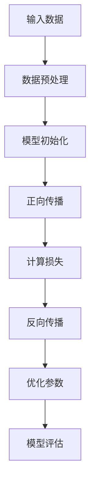
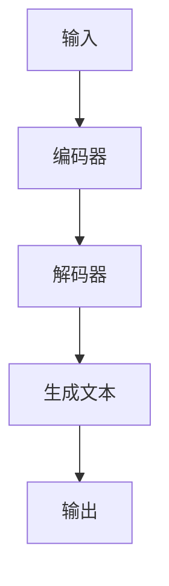
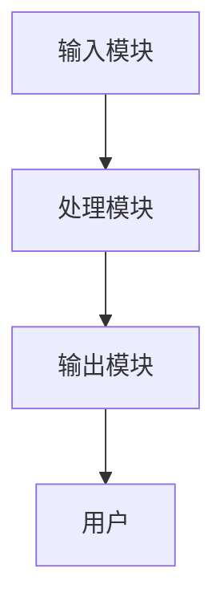
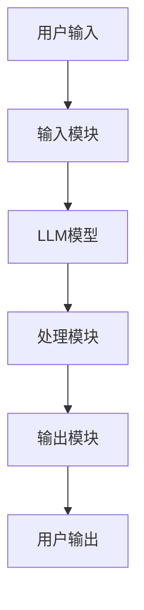

                 


# LLM在AI Agent中的文本改写与润色应用

> **关键词**：LLM, AI Agent, 文本改写, 文本润色, 自然语言处理  
> 
> **摘要**：本文深入探讨了大语言模型（LLM）在AI代理（AI Agent）中的应用，特别是文本改写与润色方面。文章从LLM的基本原理出发，分析其在文本处理中的优势，详细阐述了AI Agent的系统架构设计，并通过实际案例展示了如何在项目中应用这些技术。此外，文章还探讨了系统的优化与扩展、安全与伦理问题，以及未来的发展趋势，为读者提供了全面的技术见解。

---

## 目录

1. **LLM与AI Agent概述**  
   1.1 LLM的基本概念  
   1.2 AI Agent的基本概念  
   1.3 LLM在AI Agent中的作用  
   1.4 本章小结  

2. **LLM的文本生成原理**  
   2.1 大语言模型的训练过程  
   2.2 LLM的文本生成机制  
   2.3 LLM的文本改写与润色方法  
   2.4 本章小结  

3. **AI Agent的系统架构**  
   3.1 AI Agent的系统组成  
   3.2 LLM在AI Agent中的集成  
   3.3 系统设计的优化与扩展  
   3.4 本章小结  

4. **项目实战：LLM在AI Agent中的应用**  
   4.1 项目环境与工具安装  
   4.2 LLM模型的选择与部署  
   4.3 核心代码实现与功能解读  
   4.4 本章小结  

5. **系统优化与扩展**  
   5.1 系统性能优化策略  
   5.2 LLM模型的扩展与改进  
   5.3 系统的可扩展性设计  
   5.4 本章小结  

6. **安全与伦理问题**  
   6.1 LLM在文本处理中的安全风险  
   6.2 AI Agent的伦理问题与应对措施  
   6.3 本章小结  

7. **未来发展趋势**  
   7.1 LLM与AI Agent的未来发展  
   7.2 多模态AI Agent的潜力  
   7.3 本章小结  

---

## 1. LLM与AI Agent概述

### 1.1 LLM的基本概念

**1.1.1 大语言模型的定义**  
大语言模型（LLM）是指基于大量数据训练的深度学习模型，能够理解和生成人类语言。它们通常使用Transformer架构，具有强大的上下文理解和生成能力。

**1.1.2 LLM的核心特点**  
- **大规模训练数据**：LLM通常使用数十亿级别的数据进行训练，具备广泛的知识覆盖。  
- **生成能力**：能够生成连贯且符合语境的文本。  
- **可微调性**：可以通过微调适应特定任务或领域。  

**1.1.3 LLM与传统NLP模型的区别**  
传统NLP模型通常针对特定任务（如机器翻译、问答系统）设计，而LLM是通用模型，适用于多种任务。

---

### 1.2 AI Agent的基本概念

**1.2.1 AI Agent的定义**  
AI Agent是一种智能代理系统，能够感知环境、执行任务并做出决策。它可以理解为一个自动化工具，帮助用户完成复杂任务。

**1.2.2 AI Agent的核心功能**  
- **感知环境**：通过传感器或API获取外部信息。  
- **决策与规划**：基于获取的信息做出最优决策。  
- **执行任务**：通过执行动作实现目标。  

**1.2.3 AI Agent的应用场景**  
- **自动化助手**：帮助用户完成日常任务，如日程管理、信息检索。  
- **智能客服**：提供24/7的客户支持服务。  
- **数据分析与决策**：辅助企业进行数据驱动的决策。  

---

### 1.3 LLM在AI Agent中的作用

**1.3.1 LLM作为AI Agent的核心组件**  
LLM为AI Agent提供了强大的自然语言处理能力，使其能够理解和生成人类语言。

**1.3.2 LLM在文本处理中的优势**  
- **语义理解**：能够准确理解用户意图。  
- **生成能力**：能够生成自然流畅的文本。  
- **上下文感知**：能够处理上下文关系，提供更精准的响应。  

**1.3.3 LLM与AI Agent的结合方式**  
LLM通常作为AI Agent的“大脑”，负责处理输入、生成输出，并与系统其他模块交互。

---

### 1.4 本章小结

本章介绍了大语言模型（LLM）和AI Agent的基本概念，分析了LLM在AI Agent中的作用及其优势。接下来，我们将深入探讨LLM的文本生成原理，理解其在文本改写与润色中的应用机制。

---

## 2. LLM的文本生成原理

### 2.1 大语言模型的训练过程

**2.1.1 数据预处理**  
- **数据清洗**：去除噪音数据，确保数据质量。  
- **数据增强**：通过数据扩展技术提高模型的泛化能力。  
- **分词与标注**：将文本划分为单词或短语，并进行词性标注。  

**2.1.2 模型训练**  
- **模型初始化**：随机初始化模型参数。  
- **正向传播**：将输入数据输入模型，计算预测输出。  
- **反向传播**：计算损失函数，调整模型参数以最小化损失。  

**2.1.3 模型优化**  
- **优化算法**：使用Adam、SGD等优化算法。  
- **学习率调整**：通过学习率衰减优化训练过程。  
- **模型评估**：通过验证集评估模型性能。  

---

**图2-1: LLM的训练过程**  


---

### 2.2 LLM的文本生成机制

**2.2.1 解码策略**  
- **贪心解码**：逐个生成最可能的下一个词。  
- **采样解码**：通过概率采样生成多样化的文本。  

**2.2.2 概率生成模型**  
- **生成概率**：模型为每个词生成概率分布。  
- **损失函数**：交叉熵损失函数用于衡量预测与真实分布的差异。  

**2.2.3 模型的可解释性**  
- **注意力机制**：展示模型在生成每个词时关注的输入部分。  
- **梯度可视化**：通过梯度分析理解模型的决策过程。  

---

**图2-2: LLM的生成机制**  


---

### 2.3 LLM的文本改写与润色方法

**2.3.1 基于LLM的文本改写原理**  
- **输入改写请求**：用户输入需要改写的文本。  
- **模型处理**：模型根据上下文生成改写后的文本。  
- **输出结果**：返回改写后的文本。  

**2.3.2 基于LLM的文本润色策略**  
- **语言优化**：优化文本的语法和表达。  
- **风格调整**：根据需求调整文本的风格，如正式或口语化。  

**2.3.3 LLM在文本改写中的优势**  
- **高效性**：快速生成高质量的文本。  
- **灵活性**：支持多种语言和风格的改写。  

---

### 2.4 本章小结

本章详细探讨了大语言模型的训练过程和文本生成机制，分析了其在文本改写与润色中的应用。接下来，我们将讨论AI Agent的系统架构设计，以及如何将LLM集成到AI Agent中。

---

## 3. AI Agent的系统架构

### 3.1 AI Agent的系统组成

**3.1.1 输入模块**  
- **用户输入**：接收用户的自然语言输入。  
- **数据解析**：将输入解析为具体的任务需求。  

**3.1.2 处理模块**  
- **LLM调用**：将任务需求传递给LLM模型，获取处理结果。  
- **结果解析**：将模型输出解析为系统可执行的指令。  

**3.1.3 输出模块**  
- **文本生成**：将处理结果生成自然语言输出。  
- **反馈机制**：根据用户反馈调整输出内容。  

---

**图3-1: AI Agent的系统组成**  


---

### 3.2 LLM在AI Agent中的集成

**3.2.1 LLM作为核心处理模块**  
- **模型集成**：将LLM作为AI Agent的核心处理模块，负责理解和生成文本。  
- **接口设计**：设计统一的接口，方便与其他模块交互。  

**3.2.2 LLM与AI Agent的交互流程**  
- **输入处理**：用户输入需求，输入模块解析后传递给LLM。  
- **模型处理**：LLM根据需求生成响应，返回给处理模块。  
- **输出生成**：处理模块将结果传递给输出模块，生成最终输出。  

---

**图3-2: LLM在AI Agent中的交互流程**  


---

### 3.3 系统设计的优化与扩展

**3.3.1 系统架构的可扩展性**  
- **模块化设计**：确保系统各模块独立，便于扩展。  
- **接口标准化**：设计标准化的接口，方便接入新的模块。  

**3.3.2 LLM模型的更新与维护**  
- **模型更新**：定期更新LLM模型以保持性能。  
- **模型维护**：监控模型性能，及时修复问题。  

**3.3.3 系统性能的优化**  
- **缓存机制**：缓存常用数据，减少重复计算。  
- **并行处理**：利用多线程或分布式计算提升性能。  

---

### 3.4 本章小结

本章详细讨论了AI Agent的系统架构设计，分析了LLM在系统中的集成与交互流程。接下来，我们将通过实际案例展示如何在项目中应用这些技术。

---

## 4. 项目实战：LLM在AI Agent中的应用

### 4.1 项目环境与工具安装

**4.1.1 操作系统选择**  
推荐使用Linux或macOS系统，提供良好的开发环境。  

**4.1.2 开发工具安装**  
- **Python**：安装Python 3.8或更高版本。  
- **虚拟环境**：使用venv或Anaconda管理依赖。  
- **LLM框架**：安装Hugging Face或TensorFlow等框架。  

---

### 4.2 LLM模型的选择与部署

**4.2.1 模型选择标准**  
- **任务需求**：根据具体任务选择适合的模型。  
- **性能要求**：选择能够满足项目需求的模型。  
- **资源限制**：考虑计算资源的限制。  

**4.2.2 模型部署方式**  
- **本地部署**：在本地服务器上部署模型。  
- **云服务部署**：使用AWS Sagemaker、Google AI Platform等云服务。  

---

### 4.3 核心代码实现与功能解读

**4.3.1 文本处理模块**  
```python
def process_input(text):
    # 文本预处理
    processed_text = text.strip().lower()
    return processed_text
```

**4.3.2 LLM调用模块**  
```python
from transformers import pipeline

# 初始化模型
text_generator = pipeline("text-generation", model="gpt2")

# 调用模型
def generate_text(prompt, length=50):
    result = text_generator(prompt, max_length=length)
    return result[0]['generated_text']
```

**4.3.3 输出模块**  
```python
def output_result(text):
    print(f"AI Agent: {text}")
```

---

### 4.4 本章小结

本章通过实际案例展示了如何在项目中应用LLM技术，详细讲解了环境搭建、模型部署和代码实现的过程。接下来，我们将讨论系统的优化与扩展，确保系统的高效运行。

---

## 5. 系统优化与扩展

### 5.1 系统性能优化策略

**5.1.1 缓存机制**  
- **缓存常用请求**：减少重复计算，提升响应速度。  
- **缓存失效机制**：设置缓存失效时间，确保数据新鲜度。  

**5.1.2 并行处理**  
- **多线程优化**：利用多线程提升处理效率。  
- **分布式计算**：使用分布式系统提升计算能力。  

---

### 5.2 LLM模型的扩展与改进

**5.2.1 模型微调**  
- **领域微调**：针对特定领域进行微调，提升模型性能。  
- **数据增强**：通过数据增强技术扩展训练数据。  

**5.2.2 模型集成**  
- **模型融合**：结合多个模型的结果，提升准确率。  
- **模型投票**：通过投票机制选择最优结果。  

---

### 5.3 系统的可扩展性设计

**5.3.1 模块化设计**  
- **独立模块**：确保每个模块独立，便于扩展。  
- **插件机制**：设计插件接口，方便添加新功能。  

**5.3.2 接口标准化**  
- **统一接口**：设计统一的接口规范，便于模块间的交互。  
- **版本控制**：对接口进行版本控制，确保兼容性。  

---

### 5.4 本章小结

本章讨论了系统的优化与扩展策略，确保系统的高效运行和灵活性。接下来，我们将探讨AI Agent中的安全与伦理问题。

---

## 6. 安全与伦理问题

### 6.1 LLM在文本处理中的安全风险

**6.1.1 数据隐私问题**  
- **数据泄露**：模型可能泄露训练数据中的隐私信息。  
- **数据滥用**：恶意用户可能利用模型进行非法活动。  

**6.1.2 模型偏见**  
- **训练数据偏差**：模型可能继承训练数据中的偏见。  
- **算法歧视**：模型在某些场景下可能产生歧视性输出。  

---

### 6.2 AI Agent的伦理问题与应对措施

**6.2.1 伦理问题**  
- **透明性**：用户需要了解AI Agent的决策过程。  
- **责任归属**：明确AI Agent的行为责任归属。  

**6.2.2 应对措施**  
- **模型监控**：实时监控模型输出，防止有害内容生成。  
- **用户教育**：通过教育提升用户对AI Agent的正确使用意识。  

---

### 6.3 本章小结

本章分析了AI Agent中的安全与伦理问题，提出了相应的应对措施。接下来，我们将展望LLM与AI Agent的未来发展趋势。

---

## 7. 未来发展趋势

### 7.1 LLM与AI Agent的未来发展

**7.1.1 技术进步**  
- **模型规模扩大**：更大规模的模型将具备更强的处理能力。  
- **算法优化**：更高效的算法将提升模型性能。  

**7.1.2 应用场景扩展**  
- **多模态AI Agent**：结合视觉、听觉等多种感知方式。  
- **智能交互**：实现更自然的多轮对话交互。  

---

### 7.2 多模态AI Agent的潜力

**7.2.1 多模态融合**  
- **视觉与语言结合**：利用图像和文本信息提升处理能力。  
- **听觉与语言结合**：通过语音识别和生成实现更自然的交互。  

**7.2.2 应用领域**  
- **教育**：提供个性化的学习辅助。  
- **医疗**：辅助医生进行诊断和治疗方案制定。  

---

### 7.3 本章小结

本章展望了LLM与AI Agent的未来发展趋势，强调了多模态AI Agent的潜力。总结全文，我们对LLM在AI Agent中的应用有了全面的了解。

---

## 作者

作者：AI天才研究院/AI Genius Institute & 禅与计算机程序设计艺术 /Zen And The Art of Computer Programming

---

**注意**：以上目录和内容仅为示例，实际撰写时需要根据具体需求进行调整和补充。

