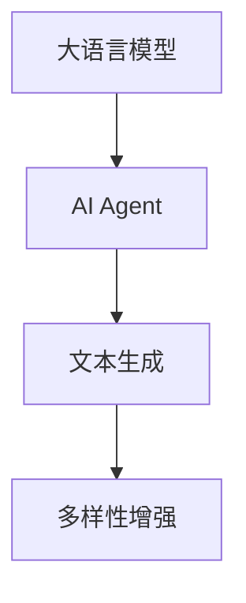
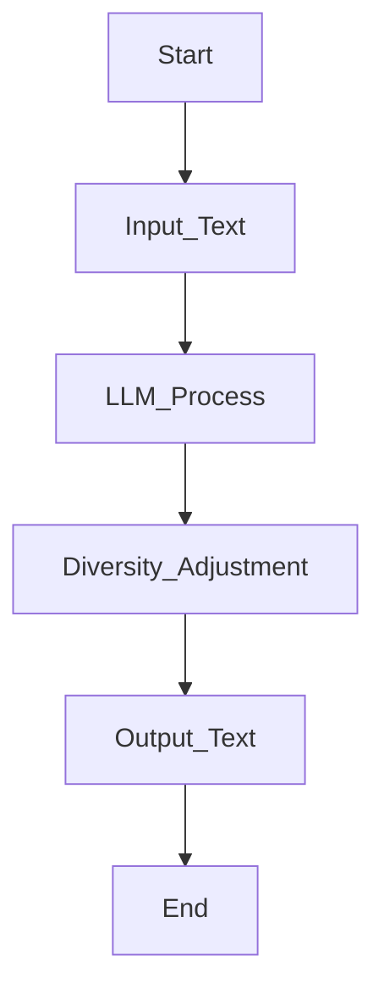
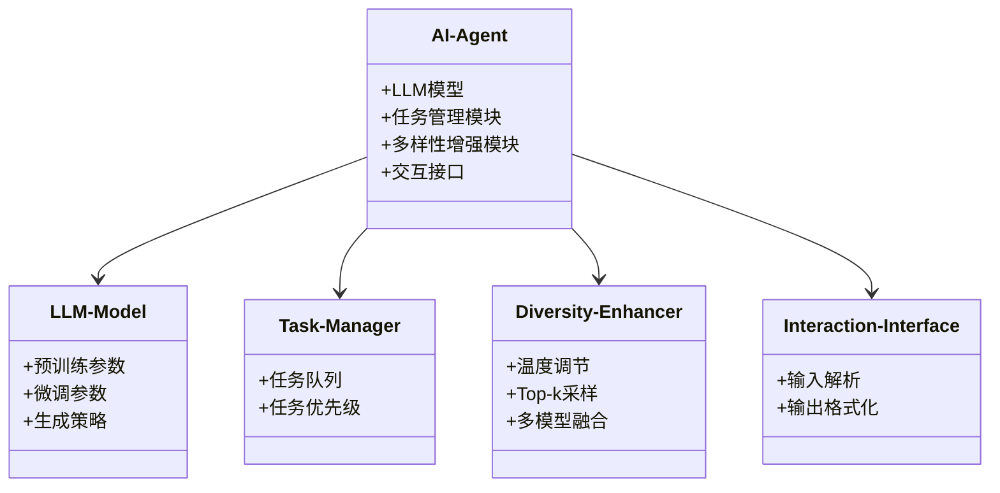
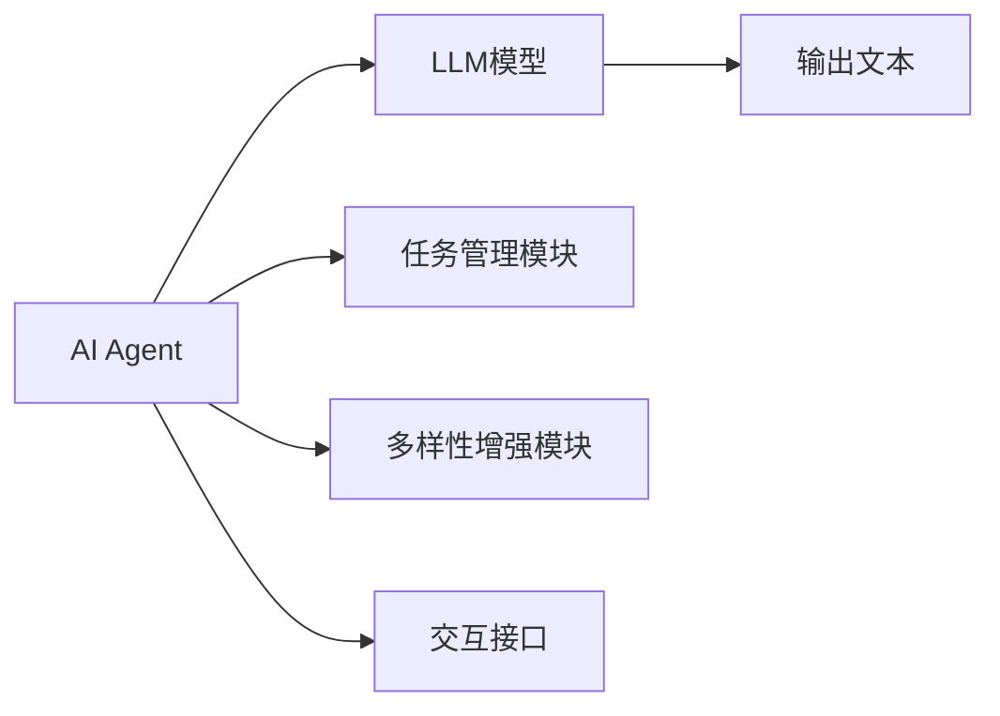
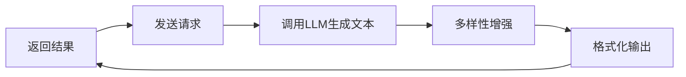

                 


# LLM在AI Agent中的文本生成多样性增强

## 关键词：LLM, AI Agent, 文本生成, 多样性增强, 自然语言处理, 生成模型, 人工智能

## 摘要：本文将深入探讨如何在AI Agent中利用LLM（大语言模型）实现文本生成的多样性增强。从基本概念到算法原理，从系统架构到项目实战，我们将全面解析LLM在AI Agent中的应用，分析文本生成多样性的挑战与解决方案，结合实际案例，为读者提供一份完整的技术指南。

---

## 第1章: 背景介绍

### 1.1 问题背景

#### 1.1.1 LLM与AI Agent的基本概念
- **大语言模型（LLM）**：基于Transformer架构的大规模预训练模型，如GPT系列、BERT系列等，能够理解和生成自然语言文本。
- **AI Agent**：智能体（Agent）是一种能够感知环境、自主决策并执行任务的实体，可以是软件程序或物理设备。

#### 1.1.2 文本生成多样性的挑战
- LLM在文本生成时，容易出现生成内容单一化的问题，缺乏多样性。
- 在AI Agent中，文本生成的多样性直接影响用户体验和任务执行效果。

#### 1.1.3 多样性增强的必要性
- 提高生成文本的多样性有助于提升AI Agent的适应性和智能性。
- 在复杂场景中，多样性生成能够帮助AI Agent更好地应对不确定性。

### 1.2 问题描述

#### 1.2.1 LLM在AI Agent中的作用
- LLM为AI Agent提供强大的自然语言处理能力，支持文本生成、理解等任务。
- AI Agent通过LLM生成多样化的文本，以满足不同场景的需求。

#### 1.2.2 文本生成多样性不足的问题
- 单一的生成方式导致文本内容缺乏变化，无法满足多样化的需求。
- 在某些场景中，生成的文本可能过于趋同，影响用户体验。

#### 1.2.3 问题解决的路径与目标
- 通过改进LLM的生成策略，增强文本生成的多样性。
- 在AI Agent中引入多样性增强机制，提升生成文本的质量和多样性。

### 1.3 问题解决

#### 1.3.1 LLM与AI Agent的结合方式
- **嵌入式结合**：将LLM作为AI Agent的核心模块，直接生成文本。
- **外部服务调用**：AI Agent通过调用外部的LLM服务进行文本生成。
- **混合架构**：结合多种LLM模型，提升生成多样性。

#### 1.3.2 多样性增强的方法与技术
- **采样方法**：如随机采样、温度调节等。
- **多模型集成**：通过多个模型的生成结果进行融合。
- **任务特定优化**：针对不同任务设计不同的生成策略。

#### 1.3.3 解决方案的实现思路
- 在AI Agent中引入多样性增强模块，对LLM的生成结果进行处理。
- 设计多样化的生成策略，结合任务需求动态调整生成参数。

### 1.4 边界与外延

#### 1.4.1 LLM在AI Agent中的应用边界
- LLM的应用场景主要集中在文本生成、理解和对话交互。
- 在非文本生成任务中，LLM的作用有限。

#### 1.4.2 多样性增强的适用场景
- 对生成文本的多样性有明确需求的场景。
- 复杂场景中，需要生成多样化文本以应对不确定性。

#### 1.4.3 相关技术的对比与选择
- 对比不同的多样性增强技术，选择最适合当前场景的方法。

### 1.5 概念结构与核心要素组成

#### 1.5.1 核心概念的层次结构
- **顶层概念**：LLM、AI Agent、文本生成。
- **底层概念**：多样性增强、生成策略、模型参数。

#### 1.5.2 核心要素的对比分析
| 概念       | 输入 | 输出 | 方法 |
|------------|------|------|------|
| LLM        | 文本 | 文本 | 预训练+微调 |
| AI Agent    | 任务 | 行动 | 决策+执行 |
| 文本生成    | 指令 | 文本 | 采样+优化 |

#### 1.5.3 概念之间的关系与依赖
- LLM为AI Agent提供生成能力。
- AI Agent通过LLM实现多样化的文本生成。

### 1.6 本章小结

---

## 第2章: 核心概念与联系

### 2.1 核心概念原理

#### 2.1.1 LLM的基本原理
- **预训练**：基于大规模文本数据，学习语言的规律和语义。
- **微调**：针对特定任务，调整模型参数，提升任务表现。

#### 2.1.2 AI Agent的核心机制
- **感知**：通过传感器或接口获取环境信息。
- **决策**：基于感知信息，选择最优动作。
- **执行**：通过执行机构或API实现动作。

#### 2.1.3 文本生成的多样性增强原理
- **采样策略**：通过调整生成过程中的采样参数，引入多样性。
- **多模型融合**：结合多个模型的生成结果，提升多样性。

### 2.2 概念属性特征对比表格

| 概念       | 属性1 | 属性2 | 属性3 |
|------------|-------|-------|-------|
| LLM        | 参数量 | 模型深度 | 预训练数据量 |
| AI Agent    | 行为决策能力 | 任务理解能力 | 交互能力 |
| 文本生成    | 多样性 | 准确性 | 可控性 |

### 2.3 ER实体关系图



### 2.4 本章小结

---

## 第3章: 算法原理讲解

### 3.1 算法原理概述

#### 3.1.1 LLM的训练过程
- **预训练**：使用大规模无标签数据，训练模型理解语言。
- **微调**：在特定任务上进行微调，提升模型的生成能力。

#### 3.1.2 多样性增强的算法选择
- **随机采样**：通过调整温度参数，引入生成结果的多样性。
- **Top-k采样**：在生成过程中，选择Top-k可能的候选词，提升多样性。

#### 3.1.3 算法的优缺点分析
- **随机采样**：简单易实现，但生成结果的多样性可能不足。
- **Top-k采样**：生成质量较高，但计算量较大。

### 3.2 算法流程图



### 3.3 算法实现代码

```python
def diversity_enhancement(input_text, model, temperature=1.2, top_k=5):
    # 调整温度参数，增强多样性
    input_ids = model.encode(input_text)
    # 使用Top-k采样
    tokens = model.generate(input_ids, max_length=50, temperature=temperature, top_k=top_k)
    return model.decode(tokens)
```

### 3.4 数学公式与详细讲解

#### 3.4.1 LLM的损失函数
$$ \text{Loss} = -\sum_{i=1}^{n} \log p(y_i|x_{<i}) $$

#### 3.4.2 多样性增强的数学表达
$$ \text{Diversity} = \sum_{i=1}^{k} \log p(y_i|x_{<i}) $$

---

## 第4章: 系统分析与架构设计

### 4.1 问题场景介绍

#### 4.1.1 场景描述
- AI Agent需要在多种场景中生成多样化文本，如客服对话、内容创作等。

#### 4.1.2 场景特点
- 高实时性：快速生成文本。
- 高多样性：生成多样化的内容。

### 4.2 系统功能设计

#### 4.2.1 领域模型



### 4.3 系统架构设计



### 4.4 系统接口设计

#### 4.4.1 输入接口
- **输入解析**：将用户输入解析为模型可处理的格式。
- **任务参数**：传递任务相关参数，如温度、Top-k值。

#### 4.4.2 输出接口
- **输出格式化**：将生成的文本格式化为指定格式。
- **结果反馈**：将生成结果反馈给用户或调用方。

### 4.5 系统交互流程图



---

## 第5章: 项目实战

### 5.1 环境安装

#### 5.1.1 安装依赖
```bash
pip install transformers torch
```

#### 5.1.2 环境配置
- 安装Python 3.8及以上版本。
- 安装GPU支持（如NVIDIA GPU）。

### 5.2 系统核心实现源代码

```python
from transformers import AutoTokenizer, AutoModelForCausalLM
import torch

class AI-Agent:
    def __init__(self, model_name):
        self.tokenizer = AutoTokenizer.from_pretrained(model_name)
        self.model = AutoModelForCausalLM.from_pretrained(model_name)
    
    def generate_diverse_text(self, input_text, temperature=1.2, top_k=5):
        input_ids = self.tokenizer.encode(input_text, return_tensors="pt")
        outputs = self.model.generate(
            input_ids,
            max_length=50,
            temperature=temperature,
            top_k=top_k
        )
        return self.tokenizer.decode(outputs[0], skip_special_tokens=True)
```

### 5.3 代码应用解读与分析

#### 5.3.1 代码功能分析
- 初始化模型和分词器。
- 定义生成函数，通过调整温度和Top-k参数，实现多样性增强。

#### 5.3.2 代码运行流程
1. 初始化AI Agent，加载LLM模型。
2. 调用生成函数，生成多样化文本。

### 5.4 实际案例分析

#### 5.4.1 案例描述
- 场景：AI Agent作为客服，生成多样化的回复。

#### 5.4.2 案例实现
```python
agent = AI-Agent("gpt2")
response = agent.generate_diverse_text("用户询问产品信息")
print(response)
```

#### 5.4.3 生成结果分析
- 生成多个不同的回复，满足用户需求。

### 5.5 本章小结

---

## 第6章: 最佳实践与总结

### 6.1 最佳实践Tips
- **参数调优**：根据具体场景调整温度和Top-k参数。
- **模型选择**：选择适合任务的LLM模型。
- **持续优化**：定期更新模型，提升生成质量。

### 6.2 小结
- 本文详细讲解了如何在AI Agent中利用LLM实现文本生成的多样性增强。
- 从理论到实践，结合代码示例，帮助读者掌握相关技术。

### 6.3 注意事项
- 注意生成文本的质量和多样性之间的平衡。
- 避免生成不符合伦理的内容。

### 6.4 拓展阅读
- 《生成式AI：大语言模型的应用与实践》
- 《AI Agent：智能体的设计与实现》

---

## 作者：AI天才研究院/AI Genius Institute & 禅与计算机程序设计艺术 /Zen And The Art of Computer Programming

