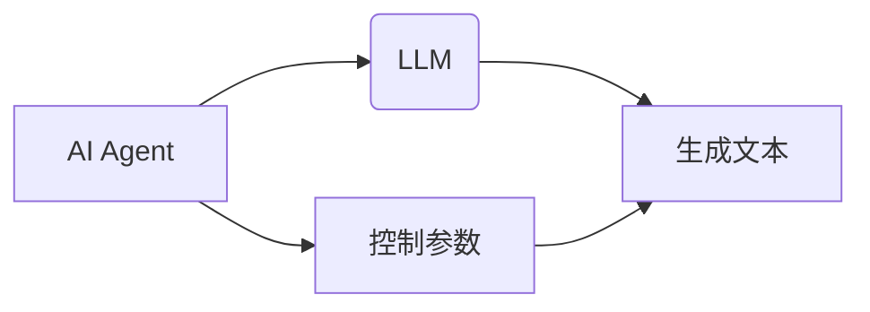

                 

<think>
好，我需要为《LLM在AI Agent中的文本生成控制：精确度与创造性平衡》这篇文章构建一个结构清晰、内容详实的目录结构。文章需要涵盖背景介绍、核心概念、算法原理、系统架构、项目实战以及最佳实践等部分。

首先，我需要理解每个部分的核心内容。在背景介绍中，我需要解释什么是LLM和AI Agent，以及它们在文本生成中的应用。接着，核心概念部分需要详细讲解LLM和AI Agent的原理和相互关系。然后是算法原理，这部分需要涉及生成式模型的数学模型和具体实现。系统架构部分要描述AI Agent的整体结构和各部分的协作方式。项目实战部分则需要通过具体的代码示例来展示如何实现文本生成控制。最后，最佳实践部分总结全书内容，并给出实际应用中的注意事项。

接下来，我需要确保每个部分都有足够的细节。例如，在算法原理部分，我需要解释概率分布、损失函数等概念，并使用数学公式详细说明。在系统架构部分，可能需要绘制类图和序列图来展示系统结构。

此外，我还需要考虑读者的背景。文章的语言应该专业但易懂，避免过于复杂的术语堆砌，同时提供足够的解释和例子，帮助读者理解。

最后，检查整个目录结构，确保逻辑清晰，每个章节之间有良好的衔接，覆盖所有必要的主题，并且内容全面。这包括每个小节的细化，确保没有遗漏重要的知识点。

总结一下，我需要构建一个涵盖背景、概念、算法、系统、实战和实践的目录结构，确保内容详实且逻辑清晰，帮助读者全面理解LLM在AI Agent中的应用及其精确度与创造性的平衡问题。
</think>

# LLM在AI Agent中的文本生成控制：精确度与创造性平衡

## 关键词：LLM, AI Agent, 文本生成, 精确度, 创造性, 平衡

## 摘要：本文探讨了大语言模型（LLM）在AI Agent中的文本生成控制，重点分析了如何在生成文本时平衡精确度与创造性。文章从背景介绍、核心概念、算法原理、系统架构、项目实战和最佳实践等方面展开，详细阐述了LLM与AI Agent的协同优化策略，帮助读者理解如何在实际应用中实现文本生成的高效控制。

---

# 目录

## 第1章: 背景介绍

### 1.1 问题背景
- 1.1.1 LLM与AI Agent的基本概念
- 1.1.2 文本生成中的精确度与创造性问题
- 1.1.3 平衡精确度与创造性的必要性

### 1.2 核心概念术语说明
- 1.2.1 大语言模型（LLM）的定义
- 1.2.2 AI Agent的定义
- 1.2.3 文本生成控制的定义

### 1.3 问题描述
- 1.3.1 LLM在文本生成中的常见挑战
- 1.3.2 AI Agent对文本生成控制的需求

### 1.4 问题解决
- 1.4.1 精确度与创造性的平衡方法
- 1.4.2 LLM与AI Agent的协同优化策略

### 1.5 边界与外延
- 1.5.1 LLM与AI Agent的边界
- 1.5.2 文本生成控制的边界
- 1.5.3 精确度与创造性的平衡边界

### 1.6 概念结构与核心要素组成
- 1.6.1 LLM与AI Agent的组成要素
- 1.6.2 文本生成控制的核心要素
- 1.6.3 精确度与创造性的平衡要素

---

## 第2章: 核心概念与联系

### 2.1 LLM的核心概念
- 2.1.1 LLM的基本原理
- 2.1.2 LLM的训练机制
- 2.1.3 LLM的生成机制

### 2.2 AI Agent的核心概念
- 2.2.1 AI Agent的基本原理
- 2.2.2 AI Agent的任务执行机制
- 2.2.3 AI Agent的决策机制

### 2.3 LLM与AI Agent的联系
- 2.3.1 LLM作为AI Agent的核心模块
- 2.3.2 AI Agent对LLM的控制与调用
- 2.3.3 LLM与AI Agent的协同优化

### 2.4 核心概念属性特征对比表格
| 概念      | 属性1 | 属性2 | 属性3 |
|-----------|-------|-------|-------|
| LLM       | 训练数据量 | 模型参数 | 生成能力 |
| AI Agent  | 任务目标 | 决策机制 | 执行能力 |

### 2.5 ER实体关系图
```mermaid
er
actor(AI Agent) -[控制]-> entity(LLM)
entity(LLM) -[生成]-> entity(文本)
```

---

## 第3章: 算法原理

### 3.1 生成式模型的数学模型
- 3.1.1 概率分布与文本生成
- 3.1.2 损失函数与模型优化
- 3.1.3 解码策略与生成控制

### 3.2 LLM的生成机制
- 3.2.1 变量定义与符号说明
  - 输入序列：$x_1, x_2, ..., x_n$
  - 输出序列：$y_1, y_2, ..., y_m$
  - 注意力机制：$A_i$

- 3.2.2 损失函数公式
  $$ \text{损失} = -\sum_{i=1}^{n} \log P(y_i | x_{\leq i}, y_{<i}) $$

- 3.2.3 解码策略
  - 最大似然解码（Greedy Decoding）
  - 采样解码（Sampling）
  - 动态调整解码（Dynamic Adjusting）

### 3.3 文本生成控制的算法实现


---

## 第4章: 系统分析与架构设计

### 4.1 问题场景介绍
- 4.1.1 AI Agent的典型应用场景
- 4.1.2 文本生成控制的具体需求
- 4.1.3 精确度与创造性的平衡目标

### 4.2 项目介绍
- 4.2.1 项目目标
- 4.2.2 项目范围
- 4.2.3 项目关键成功因素

### 4.3 系统功能设计
- 4.3.1 领域模型设计
  ```mermaid
  classDiagram
      class LLM {
          输入：String
          输出：String
          精确度控制：Boolean
          创造性控制：Boolean
      }
      class AI Agent {
          任务：String
          输入：String
          输出：String
      }
      LLM --> AI Agent
  ```

- 4.3.2 系统架构设计
  ```mermaid
  architecture
      User
      ↔
      AI Agent
      ↔
      LLM
      ↔
      文本数据库
  ```

- 4.3.3 系统接口设计
  - AI Agent与LLM的交互接口
  - LLM与文本数据库的交互接口

- 4.3.4 系统交互流程
  ```mermaid
  sequenceDiagram
      AI Agent ->> LLM: 提供输入和控制参数
      LLM ->> 文本数据库: 查询相关数据
      LLM --> AI Agent: 返回生成文本
  ```

---

## 第5章: 项目实战

### 5.1 环境安装
- 5.1.1 安装Python
- 5.1.2 安装深度学习框架（如TensorFlow或PyTorch）
- 5.1.3 安装NLP库（如Hugging Face的Transformers）

### 5.2 系统核心实现源代码
```python
import torch
from transformers import AutoModelForCausalLM, AutoTokenizer

class TextGenerator:
    def __init__(self, model_name):
        self.tokenizer = AutoTokenizer.from_pretrained(model_name)
        self.model = AutoModelForCausalLM.from_pretrained(model_name)
    
    def generate(self, input_text, max_length=50, temperature=1.0, do_sample=False):
        inputs = self.tokenizer(input_text, return_tensors="pt").input_ids
        outputs = self.model.generate(
            inputs=inputs,
            max_length=max_length,
            temperature=temperature,
            do_sample=do_sample
        )
        return self.tokenizer.decode(outputs[0], skip_special_tokens=True)
```

### 5.3 代码应用解读与分析
- 5.3.1 类`TextGenerator`的实现
  - 初始化模型和分词器
  - `generate`方法的参数解释
  - 模型生成过程的详细说明

### 5.4 实际案例分析
- 5.4.1 案例1：精确度控制
  ```python
  generator = TextGenerator("gpt2")
  print(generator.generate("今天天气很好，", max_length=50, temperature=0.7, do_sample=True))
  ```

- 5.4.2 案例2：创造性控制
  ```python
  print(generator.generate("如果时光可以倒流，", max_length=50, temperature=1.2, do_sample=True))
  ```

### 5.5 项目小结
- 5.5.1 项目实现的关键点
- 5.5.2 项目的可扩展性
- 5.5.3 项目的实际应用价值

---

## 第6章: 最佳实践

### 6.1 实用技巧与注意事项
- 6.1.1 参数调优建议
- 6.1.2 模型选择建议
- 6.1.3 性能优化建议

### 6.2 小结
- 6.2.1 全文总结
- 6.2.2 核心观点回顾
- 6.2.3 未来发展方向展望

### 6.3 注意事项
- 6.3.1 LLM的训练数据质量
- 6.3.2 模型的泛化能力
- 6.3.3 系统的安全性与稳定性

### 6.4 拓展阅读
- 6.4.1 推荐书籍
- 6.4.2 推荐论文
- 6.4.3 推荐技术博客

---

## 作者：AI天才研究院/AI Genius Institute & 禅与计算机程序设计艺术 /Zen And The Art of Computer Programming

---

以上目录结构涵盖了文章的核心内容，确保逻辑清晰、结构紧凑，并且每个章节都有足够的细节和深度。希望这篇文章能够为读者提供关于LLM在AI Agent中的文本生成控制的全面理解。

