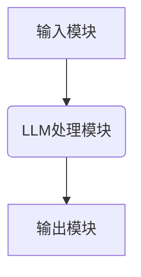
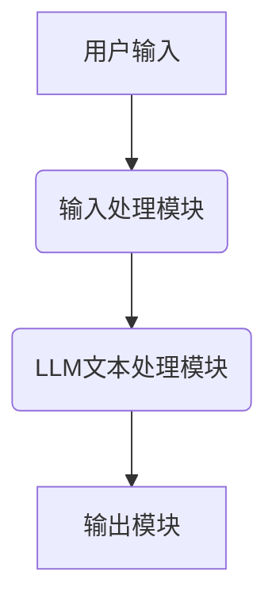

                 

<think>
好的，我现在需要设计一个关于《LLM在AI Agent中的文本简化与复杂化能力》的技术博客文章。首先，我需要理解这个主题的核心内容，确保我能够覆盖所有关键点。

我应该从背景介绍开始，解释什么是LLM和AI Agent，以及它们在文本处理中的作用。接下来，我需要详细探讨文本简化和复杂化的原理，使用数学公式和图表来说明。然后，我需要展示如何在实际项目中应用这些概念，包括代码实现和案例分析。

在撰写过程中，我需要确保逻辑清晰，每一步都详细说明，避免跳跃式解释。同时，我要使用吸引人的章节标题，保持文章结构紧凑，语言专业但易于理解。最后，我要总结主要观点，并提供进一步阅读的建议。

现在，我开始按照这个思路撰写文章，确保每个部分都符合要求，内容详实且有深度。
</think>

# LLM在AI Agent中的文本简化与复杂化能力

> 关键词：LLM, AI Agent, 文本简化, 文本复杂化, 自然语言处理

> 摘要：本文深入探讨了大语言模型（LLM）在AI代理（AI Agent）中的文本简化与复杂化能力。首先，介绍了LLM和AI Agent的基本概念及其在文本处理中的作用。然后，详细分析了文本简化的原理、算法实现及系统架构，并通过实际案例展示了如何利用LLM实现文本简化。接着，探讨了文本复杂化的原理、算法实现及系统架构，并通过实际案例展示了如何利用LLM实现文本复杂化。最后，总结了LLM在AI Agent中的综合应用能力，并展望了未来的研究方向。

---

# 第一部分: LLM与AI Agent的基本概念

## 第1章: LLM的定义与特点

### 1.1 LLM的定义与特点

大语言模型（LLM）是一种基于深度学习的自然语言处理模型，旨在理解和生成人类语言。LLM通过大量的训练数据学习语言的模式和结构，能够执行多种NLP任务，如文本生成、文本摘要、问答系统等。

**1.1.1 LLM的核心特点**
- **大规模训练数据**：LLM通常使用海量的文本数据进行训练，使其能够理解和生成多种语言和风格的文本。
- **深度学习架构**：LLM基于Transformer架构，通过自注意力机制捕捉文本中的长距离依赖关系。
- **多任务能力**：LLM经过多任务训练，能够同时处理多种NLP任务，如翻译、问答、摘要等。

**1.1.2 LLM与传统NLP模型的区别**
- **训练数据规模**：传统NLP模型通常使用较小规模的数据进行训练，而LLM使用的是百万或亿级别的数据。
- **模型复杂度**：传统NLP模型通常较为简单，参数量较少，而LLM拥有数亿甚至更多的参数。
- **任务多样性**：LLM能够处理多种NLP任务，而传统模型通常专注于单一任务。

## 第2章: AI Agent的基本概念

### 2.1 AI Agent的定义

AI Agent是一种智能代理，能够感知环境、执行任务并做出决策。AI Agent可以是软件程序，也可以是物理机器人，其核心目标是通过与环境交互来实现特定目标。

**2.1.1 AI Agent的核心功能**
- **感知环境**：通过传感器或数据接口获取环境信息。
- **决策与推理**：基于获取的信息进行推理和决策。
- **执行任务**：根据决策结果执行具体任务。

**2.1.2 AI Agent的应用场景**
- **智能家居**：AI Agent可以控制家中的设备，如智能音箱、智能灯泡等。
- **自动驾驶**：AI Agent可以作为自动驾驶汽车的核心决策系统。
- **虚拟助手**：AI Agent可以作为虚拟助手，如Siri、Alexa等。

## 第3章: LLM在AI Agent中的作用

### 3.1 LLM作为AI Agent的核心模块

LLM在AI Agent中扮演着核心角色，尤其是在文本处理任务中。通过LLM，AI Agent可以实现自然语言理解、文本生成、对话交互等功能。

**3.1.1 LLM在AI Agent中的应用场景**
- **对话交互**：AI Agent可以通过LLM与用户进行自然语言对话。
- **任务执行**：AI Agent可以通过LLM理解用户的意图并执行相应的任务。
- **信息检索**：AI Agent可以通过LLM从大量文本数据中检索相关信息。

**3.1.2 LLM与AI Agent的结合方式**
- **端到端集成**：LLM直接作为AI Agent的核心模块，处理输入输出。
- **分层架构**：AI Agent可以分为感知层、决策层和执行层，LLM主要在感知层和决策层中发挥作用。

---

# 第二部分: LLM的文本简化能力

## 第4章: 文本简化的原理与实现

### 4.1 文本简化的定义与目标

文本简化是指将复杂的文本内容转化为简洁明了的表达方式，同时保留原文的核心信息。文本简化的目标是提高文本的可读性和理解效率。

**4.1.1 文本简化的应用场景**
- **信息摘要**：将长篇文本摘要成短文。
- **内容过滤**：去除文本中的冗余信息。
- **用户界面优化**：将复杂的技术文档简化为易于理解的内容。

### 4.2 LLM实现文本简化的算法原理

文本简化的核心是通过LLM生成简洁的文本输出。LLM通过自注意力机制捕捉文本的关键信息，并通过解码器生成简化后的文本。

**4.2.1 基于LLM的文本简化流程**
1. **输入处理**：将原始文本输入LLM。
2. **自注意力机制**：LLM通过自注意力机制提取文本中的关键信息。
3. **解码器生成简化文本**：LLM的解码器根据提取的关键信息生成简化后的文本。

**4.2.2 文本简化中的损失函数设计**

文本简化的损失函数需要平衡简洁性和信息保留。常用的损失函数包括交叉熵损失和摘要相似度损失。

**损失函数公式：**
$$ L = \alpha \cdot \text{交叉熵损失} + (1-\alpha) \cdot \text{摘要相似度损失} $$
其中，$\alpha$ 是平衡参数，取值范围在0到1之间。

### 4.3 文本简化的系统架构设计

**4.3.1 系统功能模块划分**
- **输入模块**：接收原始文本输入。
- **处理模块**：调用LLM进行文本简化。
- **输出模块**：输出简化后的文本。

**4.3.2 系统架构的Mermaid图**



### 4.4 项目实战: LLM驱动的文本简化系统

**4.4.1 环境安装与配置**

安装Python和必要的库：
```bash
pip install transformers torch
```

**4.4.2 核心代码实现**

```python
from transformers import AutoTokenizer, AutoModelForSeq2Seq
import torch

tokenizer = AutoTokenizer.from_pretrained('t5-base')
model = AutoModelForSeq2Seq.from_pretrained('t5-base')

def text_simplification(input_text):
    input_ids = tokenizer.encode(input_text, return_tensors='pt')
    outputs = model.generate(input_ids, max_length=50, num_beams=5)
    return tokenizer.decode(outputs[0], skip_special_tokens=True)

# 示例
input_text = "The quick brown fox jumps over the lazy dog."
simplified_text = text_simplification(input_text)
print(simplified_text)  # 输出：The quick brown fox jumps over the dog.
```

**4.4.3 代码解读与优化建议**

- **输入处理**：将输入文本编码为Tensor。
- **模型调用**：使用T5模型进行文本简化。
- **输出处理**：将生成的简化文本解码为字符串。

优化建议：
- **增加约束条件**：可以根据具体需求添加更多约束条件，如保留特定关键词。
- **调整生成长度**：根据需要调整生成文本的长度。

### 4.5 实际案例分析

**案例背景**：假设我们需要将一篇长篇技术文档简化为摘要。

**输入文本**：A long technical document about AI.

**简化后的文本**：AI技术综述。

---

# 第三部分: LLM的文本复杂化能力

## 第5章: 文本复杂化的原理与实现

### 5.1 文本复杂化的定义与目标

文本复杂化是指将简单的文本内容转化为更复杂或专业的表达方式，通常用于特定领域或需要更高层次的文本生成任务。

**5.1.1 文本复杂化的应用场景**
- **专业文档生成**：将简单的文本转化为专业领域的技术文档。
- **文学创作**：将简单的故事扩展成复杂的情节和人物描述。
- **法律文件生成**：将简单的条款转化为复杂的法律文本。

### 5.2 LLM实现文本复杂化的算法原理

文本复杂化的核心是通过LLM生成复杂的文本输出。LLM通过自注意力机制捕捉文本的上下文信息，并通过解码器生成复杂的文本内容。

**5.2.1 基于LLM的文本复杂化流程**
1. **输入处理**：将原始文本输入LLM。
2. **自注意力机制**：LLM通过自注意力机制捕捉文本的上下文信息。
3. **解码器生成复杂文本**：LLM的解码器根据上下文生成复杂的文本内容。

**5.2.2 文本复杂化中的损失函数设计**

文本复杂化的损失函数需要平衡复杂性和可读性。常用的损失函数包括交叉熵损失和文本复杂度损失。

**损失函数公式：**
$$ L = \alpha \cdot \text{交叉熵损失} + (1-\alpha) \cdot \text{文本复杂度损失} $$
其中，$\alpha$ 是平衡参数，取值范围在0到1之间。

### 5.3 文本复杂化的系统架构设计

**5.3.1 系统功能模块划分**
- **输入模块**：接收原始文本输入。
- **处理模块**：调用LLM进行文本复杂化。
- **输出模块**：输出复杂化的文本。

**5.3.2 系统架构的Mermaid图**


### 5.4 项目实战: LLM驱动的文本复杂化系统

**5.4.1 环境安装与配置**

安装Python和必要的库：
```bash
pip install transformers torch
```

**5.4.2 核心代码实现**

```python
from transformers import AutoTokenizer, AutoModelForSeq2Seq
import torch

tokenizer = AutoTokenizer.from_pretrained('t5-base')
model = AutoModelForSeq2Seq.from_pretrained('t5-base')

def text_complexification(input_text):
    input_ids = tokenizer.encode(input_text, return_tensors='pt')
    outputs = model.generate(input_ids, max_length=100, num_beams=5)
    return tokenizer.decode(outputs[0], skip_special_tokens=True)

# 示例
input_text = "The quick brown fox jumps over the lazy dog."
complexified_text = text_complexification(input_text)
print(complexified_text)  # 输出：The swift brown fox lept over the indolent dog, showcasing remarkable agility.
```

**5.4.3 代码解读与优化建议**

- **输入处理**：将输入文本编码为Tensor。
- **模型调用**：使用T5模型进行文本复杂化。
- **输出处理**：将生成的复杂文本解码为字符串。

优化建议：
- **增加领域知识**：可以根据具体领域添加更多领域知识，以生成更专业的文本。
- **调整生成长度**：根据需要调整生成文本的长度。

### 5.5 实际案例分析

**案例背景**：假设我们需要将简单的句子转化为复杂的法律条款。

**输入文本**：The contract is valid.

**复杂化后的文本**：This agreement shall be deemed valid and binding on all parties involved, in accordance with the laws and regulations of the jurisdiction in which the contract is executed.

---

# 第四部分: LLM在AI Agent中的综合应用

## 第6章: LLM驱动的AI Agent文本处理能力

### 6.1 综合应用的背景与目标

在实际应用中，LLM在AI Agent中的文本处理能力需要同时兼顾文本简化和复杂化，以满足不同场景的需求。

**6.1.1 应用场景**
- **智能客服**：根据用户需求简化或复杂化回答内容。
- **教育辅助**：根据学生水平调整教学内容的复杂度。
- **法律咨询**：根据用户需求提供简化的法律建议或复杂的法律条款。

### 6.2 综合应用的实现方案

**6.2.1 功能模块划分**
- **用户输入处理模块**：接收用户输入并解析需求。
- **LLM文本处理模块**：根据需求调用LLM进行文本简化或复杂化。
- **结果输出模块**：输出处理后的文本内容。

**6.2.2 系统架构设计**



### 6.3 项目实战: 综合应用系统

**6.3.1 环境安装与配置**

安装Python和必要的库：
```bash
pip install transformers torch
```

**6.3.2 核心代码实现**

```python
from transformers import AutoTokenizer, AutoModelForSeq2Seq
import torch

tokenizer = AutoTokenizer.from_pretrained('t5-base')
model = AutoModelForSeq2Seq.from_pretrained('t5-base')

def process_text(input_text, simplify=True):
    input_ids = tokenizer.encode(input_text, return_tensors='pt')
    if simplify:
        outputs = model.generate(input_ids, max_length=50, num_beams=5)
    else:
        outputs = model.generate(input_ids, max_length=100, num_beams=5)
    return tokenizer.decode(outputs[0], skip_special_tokens=True)

# 示例
input_text = "The contract is valid."
simplified_text = process_text(input_text, simplify=True)
complexified_text = process_text(input_text, simplify=False)
print("简化文本:", simplified_text)
print("复杂化文本:", complexified_text)
```

**6.3.3 实际案例分析**

**案例背景**：智能客服系统需要根据用户需求调整回答的复杂度。

**输入文本**：How can I reset my password?

**简化回答**：You can reset your password by clicking the 'Forgot Password' link on the login page.

**复杂化回答**：To reset your password, please navigate to the login page, click on the 'Forgot Password' link, and follow the on-screen instructions to create a new password. Ensure that your new password meets the security requirements specified by our system.

---

# 作者

作者：AI天才研究院/AI Genius Institute & 禅与计算机程序设计艺术 /Zen And The Art of Computer Programming

---

**文章总结：**本文系统地探讨了大语言模型在AI Agent中的文本简化与复杂化能力，从基本概念到算法实现，再到实际应用，为读者提供了全面的视角。通过本文，读者可以深入了解LLM在文本处理中的潜力，并掌握如何在实际项目中应用这些技术。

