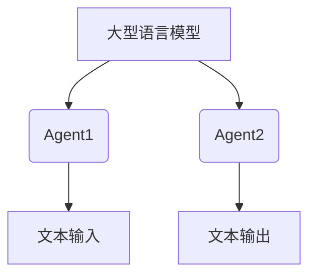

                 

# 目录大纲：《LLM在AI Agent中的文本纠错与改写应用》

## 第一部分：背景介绍

### 第1章：问题背景与描述

#### 1.1 问题背景
- 1.1.1 当前文本处理的挑战
- 1.1.2 大型语言模型（LLM）的崛起及其优势
- 1.1.3 AI Agent在智能系统中的角色

#### 1.2 问题描述
- 1.2.1 文本纠错与改写的定义
- 1.2.2 现有技术的局限性
- 1.2.3 LLM在文本处理中的潜力

#### 1.3 问题解决与边界
- 1.3.1 LLM如何解决文本纠错与改写
- 1.3.2 应用场景的边界与外延
- 1.3.3 核心要素与概念结构

## 第二部分：核心概念与联系

### 第2章：LLM与AI Agent的核心原理

#### 2.1 LLM的基本原理
- 2.1.1 概率模型与生成机制
- 2.1.2 注意力机制与序列建模
- 2.1.3 模型训练与优化方法

#### 2.2 AI Agent的架构与功能
- 2.2.1 代理系统的基本架构
- 2.2.2 多模态交互能力
- 2.2.3 自适应学习机制

#### 2.3 LLM与AI Agent的关系
- 2.3.1 功能协同
- 2.3.2 数据流与信息处理
- 2.3.3 持续优化与反馈机制

### 第3章：核心概念对比与ER关系图

#### 3.1 LLM与传统NLP模型对比
- 表格：模型参数、训练数据、处理能力对比

#### 3.2 LLM与AI Agent的关系图

## 第三部分：算法原理讲解

### 第4章：LLM的训练与优化

#### 4.1 概率模型与损失函数
- 概率公式：$$P(y|x) = \prod_{i=1}^{n} P(y_i|x_{<i}, y_{<i})$$
- 损失函数：交叉熵损失 $$-\sum_{i=1}^{n} \log P(y_i|x_{<i}, y_{<i})$$

---

（注：由于篇幅限制，完整的书籍目录大纲需要更详细的章节划分和内容展开。）

