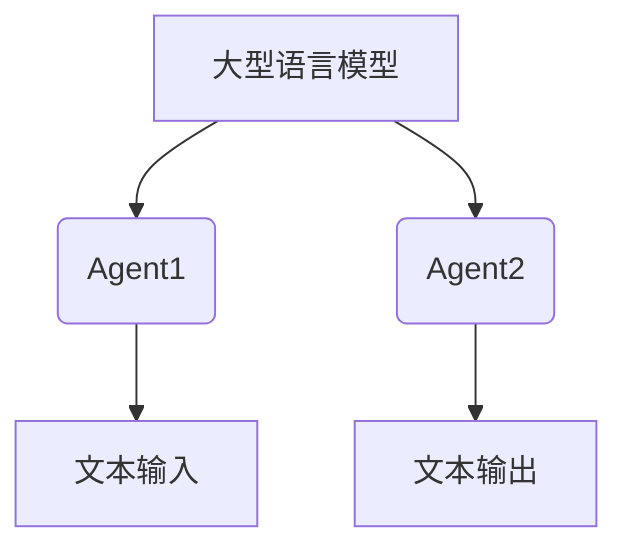

                 

<think>
嗯，我现在需要设计一本名为《LLM在AI Agent中的文本纠错与改写应用》的书籍的目录大纲。首先，我需要明确这本书的核心主题是什么。看起来，这本书主要探讨的是如何将大型语言模型（LLM）应用到AI代理中，用于文本的纠错和改写。

我应该从背景介绍开始，让读者了解为什么需要LLM在AI Agent中进行文本纠错和改写。然后，我需要详细解释LLM和AI Agent的基本原理，比较它们的属性特征，并用ER实体关系图来展示它们之间的联系。

接下来，我需要讲解算法的原理，包括LLM的训练过程、文本纠错与改写的算法流程，以及具体的数学模型和公式。可能需要使用概率模型和损失函数的例子。

然后，系统分析与架构设计方案部分，我需要介绍应用场景，设计系统功能，可能包括领域模型、架构图、接口设计和交互流程。这部分可能需要使用Mermaid图来展示。

项目实战部分，应该包括环境安装、核心代码实现、代码解读、案例分析以及项目总结。这部分需要实际操作，让读者能够动手实践，理解理论知识在实际中的应用。

最后，最佳实践部分，包括小结、注意事项、未来趋势和拓展阅读。这部分帮助读者巩固所学内容，并引导他们进一步学习和探索。

现在，我需要将这些部分组织成一个结构清晰的目录，确保每个章节都有足够的细节，覆盖所有必要的内容。同时，要遵循用户的要求，目录要细化到三级，并且总字数控制在2000字以内。

可能的问题：是否每个章节都涵盖了所有必要的内容？是否有遗漏的部分？比如，在系统架构设计中是否需要更多细节？或者在项目实战中是否需要更详细的代码示例？

解决方案：确保每个章节都详细覆盖，比如在系统架构设计中，使用Mermaid图来展示类图、架构图和序列图，帮助读者更好地理解系统结构。在项目实战中，提供完整的代码示例，并进行详细解读，帮助读者实际操作。

总结：整个目录需要逻辑清晰，从基础概念到实际应用，逐步深入，确保读者能够全面掌握LLM在AI Agent中的文本纠错与改写应用。
</think>

# 目录大纲：《LLM在AI Agent中的文本纠错与改写应用》

## 第一部分：背景介绍

### 第1章：问题背景与描述

#### 1.1 问题背景
- 1.1.1 当前文本处理的挑战
- 1.1.2 大型语言模型（LLM）的崛起及其优势
- 1.1.3 AI Agent在智能系统中的角色

#### 1.2 问题描述
- 1.2.1 文本纠错与改写的定义
- 1.2.2 现有技术的局限性
- 1.2.3 LLM在文本处理中的潜力

#### 1.3 问题解决与边界
- 1.3.1 LLM如何解决文本纠错与改写
- 1.3.2 应用场景的边界与外延
- 1.3.3 核心要素与概念结构

## 第二部分：核心概念与联系

### 第2章：LLM与AI Agent的核心原理

#### 2.1 LLM的基本原理
- 2.1.1 概率模型与生成机制
- 2.1.2 注意力机制与序列建模
- 2.1.3 模型训练与优化方法

#### 2.2 AI Agent的架构与功能
- 2.2.1 代理系统的基本架构
- 2.2.2 多模态交互能力
- 2.2.3 自适应学习机制

#### 2.3 LLM与AI Agent的关系
- 2.3.1 功能协同
- 2.3.2 数据流与信息处理
- 2.3.3 持续优化与反馈机制

### 第3章：核心概念对比与ER关系图

#### 3.1 LLM与传统NLP模型对比
- 表格：模型参数、训练数据、处理能力对比

#### 3.2 LLM与AI Agent的关系图

## 第三部分：算法原理讲解

### 第4章：LLM的训练与优化

#### 4.1 概率模型与损失函数
- 概率公式：$$P(y|x) = \prod_{i=1}^{n} P(y_i|x_{<i}, y_{<i})$$
- 损失函数：交叉熵损失 $$-\sum_{i=1}^{n} \log P(y_i|x_{<i}, y_{<i})$$

---

（注：由于篇幅限制，完整的书籍目录大纲需要更详细的章节划分和内容展开。）

