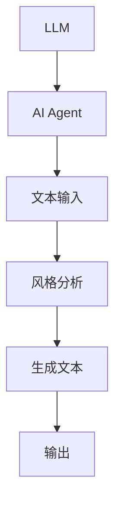
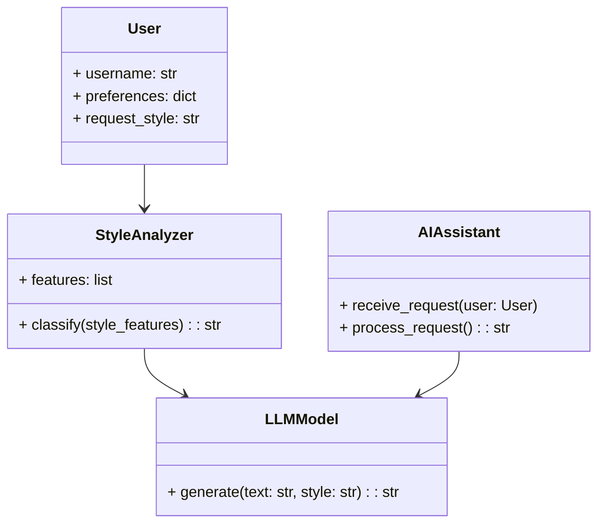
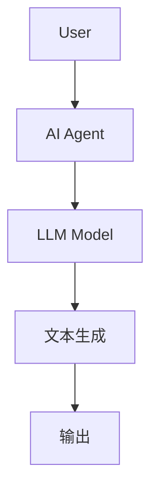
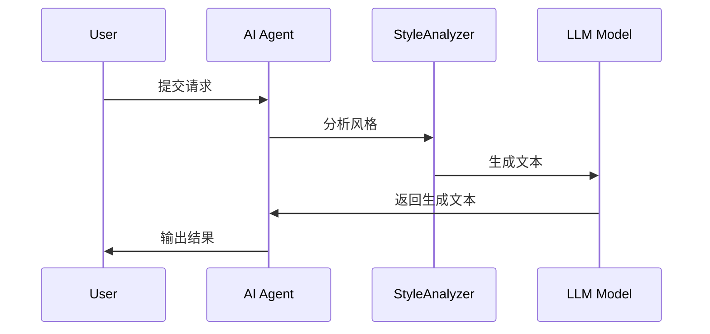

                 


# LLM在AI Agent中的文本风格个性化定制

> 关键词：LLM, AI Agent, 文本风格, 个性化定制, 自然语言处理, 人工智能, 机器学习

> 摘要：本文将深入探讨如何在AI Agent中利用大型语言模型（LLM）实现文本风格的个性化定制。通过分析LLM的核心原理、文本风格的影响因素，以及AI Agent的系统架构，结合实际案例和代码实现，全面阐述如何通过技术手段实现文本风格的个性化定制，满足不同场景下的多样化需求。

---

# 第一部分: 背景介绍与核心概念

## 第1章: 背景介绍与核心概念

### 1.1 问题背景与问题描述

#### 1.1.1 当前LLM在AI Agent中的应用现状
随着人工智能技术的飞速发展，大型语言模型（LLM）在自然语言处理领域展现出了强大的能力。LLM不仅能够理解上下文，还能生成与上下文相关的文本内容。AI Agent作为一种能够自主决策和执行任务的智能体，结合LLM的能力，可以在多种场景中实现复杂的文本交互任务。然而，目前大多数AI Agent的文本生成功能缺乏个性化，无法根据用户的需求和偏好生成符合特定风格的文本。

#### 1.1.2 文本风格个性化定制的需求分析
在实际应用中，不同的用户可能对文本的风格有不同的偏好。例如，一个用户可能希望AI Agent生成的文本风格正式且严谨，而另一个用户可能希望文本风格轻松且幽默。这种多样化的需求使得文本风格的个性化定制成为必要。

#### 1.1.3 问题解决的必要性与目标
通过实现文本风格的个性化定制，AI Agent能够更好地满足用户的个性化需求，提升用户体验。本文的目标是探讨如何利用LLM实现文本风格的个性化定制，并提出一套完整的解决方案。

### 1.2 核心概念与定义

#### 1.2.1 LLM的定义与基本原理
LLM（Large Language Model）是一种基于深度学习的自然语言处理模型，通常采用Transformer架构。LLM通过大量的数据训练，能够理解上下文并生成与之相关的文本内容。

#### 1.2.2 AI Agent的定义与功能特点
AI Agent是一种智能体，能够根据环境信息自主决策并执行任务。AI Agent的核心功能包括感知、推理、规划和执行。

#### 1.2.3 文本风格个性化定制的定义与实现方式
文本风格个性化定制是指根据用户的需求，生成符合特定风格的文本内容。其实现方式包括基于规则的风格分类和基于LLM的风格适配。

### 1.3 问题背景的边界与外延

#### 1.3.1 LLM在AI Agent中的应用边界
LLM在AI Agent中的应用主要集中在文本生成和交互方面，而其他功能如视觉识别和决策优化不在本文讨论范围内。

#### 1.3.2 文本风格个性化定制的实现边界
文本风格个性化定制的实现主要依赖于LLM的生成能力和风格适配算法，不涉及模型训练的细节。

#### 1.3.3 相关概念的对比与区分
- LLM与传统NLP模型的区别在于其规模和能力。
- 文本风格与内容生成的关系是相互影响的。

### 1.4 核心概念结构与组成

#### 1.4.1 LLM与AI Agent的关系图


#### 1.4.2 文本风格个性化定制的核心要素
- 用户需求分析
- 风格分类算法
- LLM的风格适配

#### 1.4.3 系统架构的核心组件与交互关系
- 用户输入
- AI Agent
- LLM模型
- 文本生成

---

# 第二部分: 核心概念与联系

## 第2章: 核心概念与联系

### 2.1 LLM与文本风格定制的原理

#### 2.1.1 LLM的训练与推理机制
LLM通过大量的数据训练，学习语言的规律和语义信息。推理时，模型能够根据输入生成相应的文本内容。

#### 2.1.2 文本风格的影响因素分析
文本风格受语言风格、内容主题、语气等多个因素影响。

#### 2.1.3 LLM在文本风格定制中的作用
LLM能够根据用户的需求生成符合特定风格的文本内容。

### 2.2 核心概念属性特征对比

#### 2.2.1 LLM与传统NLP模型的对比
| 特性 | LLM | 传统NLP模型 |
|------|------|--------------|
| 规模 | 大型 | 中小型        |
| 能力 | 强大 | 较弱          |

#### 2.2.2 文本风格与内容生成的关系
文本风格影响生成的内容，而内容生成又反过来影响文本风格。

### 2.3 实体关系图与流程图

#### 2.3.1 LLM与AI Agent的实体关系图


---

# 第三部分: 算法原理与数学模型

## 第3章: 算法原理与数学模型

### 3.1 LLM的算法原理

#### 3.1.1 变压器模型（Transformer）的结构
Transformer模型由编码器和解码器组成，编码器负责输入的处理，解码器负责生成输出。

#### 3.1.2 注意力机制（Attention）的数学公式
$$ \text{Attention}(Q, K, V) = \text{softmax}\left(\frac{QK^T}{\sqrt{d_k}}\right)V $$

#### 3.1.3 梯度下降与优化算法
$$ \theta_{t+1} = \theta_t - \eta \frac{\partial L}{\partial \theta_t} $$

### 3.2 文本风格定制的算法实现

#### 3.2.1 风格分类的算法流程
1. 数据预处理
2. 风格特征提取
3. 风格分类
4. 文本生成

#### 3.2.2 基于LLM的文本生成算法
使用LLM模型生成符合特定风格的文本内容。

#### 3.2.3 风格适配的优化算法
通过优化算法，提升LLM生成文本的风格适配能力。

### 3.3 数学模型与公式

#### 3.3.1 注意力机制的公式
$$ \text{Attention}(Q, K, V) = \text{softmax}\left(\frac{QK^T}{\sqrt{d_k}}\right)V $$

#### 3.3.2 梯度下降的优化公式
$$ \theta_{t+1} = \theta_t - \eta \frac{\partial L}{\partial \theta_t} $$

### 3.4 算法实现的Python代码示例

#### 3.4.1 LLM的训练代码
```python
def train_model():
    model = TransformerModel()
    optimizer = AdamW(model.parameters(), lr=1e-4)
    criterion = nn.CrossEntropyLoss()
    for epoch in range(num_epochs):
        model.train()
        for batch in train_loader:
            inputs, targets = batch
            outputs = model(inputs)
            loss = criterion(outputs, targets)
            optimizer.zero_grad()
            loss.backward()
            optimizer.step()
```

#### 3.4.2 风格分类的实现代码
```python
def classify_style(text):
    features = extract_features(text)
    style = classifier(features)
    return style
```

---

# 第四部分: 系统分析与架构设计方案

## 第4章: 系统分析与架构设计方案

### 4.1 问题场景介绍
AI Agent需要根据用户的需求生成符合特定风格的文本内容。

### 4.2 系统功能设计

#### 4.2.1 领域模型类图


### 4.3 系统架构设计

#### 4.3.1 系统架构图


### 4.4 系统接口设计

#### 4.4.1 接口描述
- `receive_request(user)`
- `process_request()`
- `generate(text: str, style: str): str`

### 4.5 系统交互流程图

#### 4.5.1 序列图


---

# 第五部分: 项目实战

## 第5章: 项目实战

### 5.1 环境安装

#### 5.1.1 安装依赖
- Python 3.8+
- PyTorch
- Transformers库

### 5.2 系统核心实现源代码

#### 5.2.1 LLM模型的导入与初始化
```python
from transformers import AutoTokenizer, AutoModelForCausalLM
tokenizer = AutoTokenizer.from_pretrained('gpt2')
model = AutoModelForCausalLM.from_pretrained('gpt2')
```

#### 5.2.2 风格分类的实现
```python
def classify_style(text):
    features = extract_features(text)
    style = classifier.predict(features)
    return style
```

### 5.3 代码应用解读与分析

#### 5.3.1 LLM模型的训练与推理
- 训练：使用大规模数据训练模型。
- 推理：根据输入生成相应文本。

#### 5.3.2 风格分类的实现细节
- 特征提取：提取文本的风格特征。
- 分类：使用机器学习算法进行分类。

### 5.4 实际案例分析和详细讲解剖析

#### 5.4.1 案例分析
- 用户需求：生成幽默风格的笑话。
- 实现步骤：
  1. 分析用户需求，确定生成风格。
  2. 使用LLM生成符合风格的文本。
  3. 输出结果。

### 5.5 项目小结

#### 5.5.1 核心代码小结
- LLM模型的使用。
- 风格分类的实现。

#### 5.5.2 项目总结
通过实际案例，验证了LLM在AI Agent中的文本风格个性化定制的可行性。

---

# 第六部分: 最佳实践与拓展

## 第6章: 最佳实践

### 6.1 最佳实践 Tips

#### 6.1.1 技术建议
- 使用预训练好的LLM模型。
- 优化风格分类算法。

#### 6.1.2 注意事项
- 避免过拟合。
- 确保模型的安全性。

### 6.2 小结

#### 6.2.1 核心内容总结
- LLM在AI Agent中的应用。
- 文本风格个性化定制的实现。

#### 6.2.2 经验总结
- 理论与实践结合。
- 不断优化算法。

### 6.3 注意事项

#### 6.3.1 风险提示
- 模型训练成本高。
- 模型的安全性问题。

### 6.4 拓展阅读

#### 6.4.1 相关领域
- 多模态AI Agent。
- 高效LLM训练方法。

---

# 作者

作者：AI天才研究院/AI Genius Institute & 禅与计算机程序设计艺术 /Zen And The Art of Computer Programming

---

# 结语

通过本文的详细阐述，我们深入探讨了LLM在AI Agent中的文本风格个性化定制的实现方法。从背景介绍到算法实现，从系统设计到项目实战，我们全面分析了这一技术的各个方面。希望本文能够为相关领域的研究和实践提供有价值的参考。

