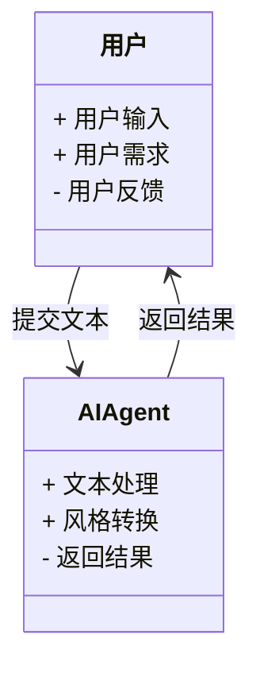
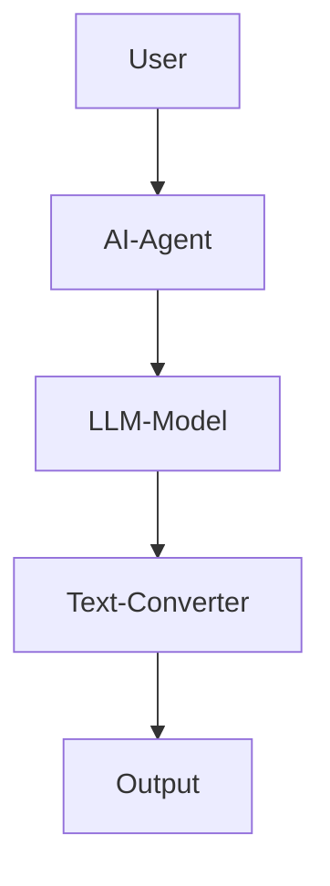
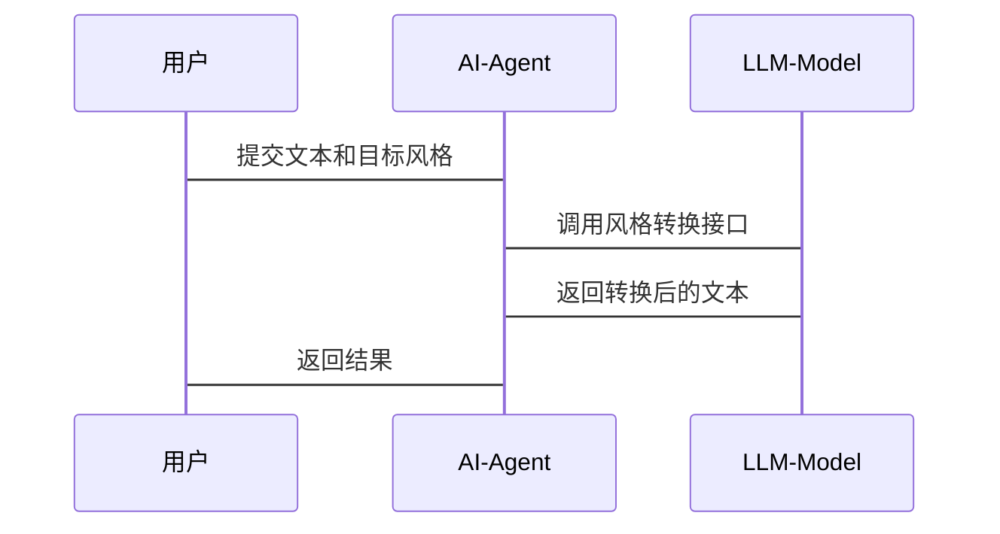

                 


# LLM在AI Agent中的文本风格转换与保持

> 关键词：LLM, AI Agent, 文本风格转换, 风格保持, 大语言模型, 文本处理

> 摘要：本文深入探讨了大语言模型（LLM）在AI Agent中的文本风格转换与保持技术。通过分析文本风格转换的特征与方法，详细阐述了LLM的基本原理及其在风格转换中的应用，结合系统架构设计与项目实战，展示了如何实现高效的文本风格转换与保持。本文旨在为AI Agent的设计者和开发者提供理论支持与实践指导。

---

## 第1章: 背景介绍与核心概念

### 1.1 问题背景与描述

文本风格转换是指将一段文本从一种风格转换为另一种风格，同时保持其语义不变。在AI Agent中，文本风格转换的应用场景广泛，例如将复杂的学术文本转换为通俗易懂的语言，或将正式的商务邮件转换为更亲切的表达方式。

#### 1.1.1 文本风格转换的定义与目标
- **定义**：文本风格转换是指通过对文本的特征提取和重生成，将原文的风格转换为目标风格的过程。
- **目标**：实现从源风格到目标风格的无缝转换，同时保持文本的语义和逻辑不变。

#### 1.1.2 AI Agent在文本处理中的角色
- AI Agent作为智能助手，负责接收用户的输入、分析需求、执行任务并返回结果。在文本处理任务中，AI Agent需要理解用户的意图并生成符合用户风格的输出。

#### 1.1.3 LLM在文本风格转换中的作用
- 大语言模型（LLM）通过预训练掌握了大量语言数据，能够理解上下文并生成符合特定风格的文本。

### 1.2 核心概念与联系

#### 1.2.1 LLM的基本原理
- LLM通过大量的预训练数据学习语言模式，能够根据输入生成符合上下文的文本。

#### 1.2.2 文本风格的特征提取与生成
- **特征提取**：分析文本的词汇选择、句式结构、语气等特征。
- **风格生成**：基于提取的特征生成目标风格的文本。

#### 1.2.3 AI Agent与文本风格转换的关系
- AI Agent通过调用LLM API，实现文本风格转换的功能，提升用户体验。

---

## 第2章: 文本风格转换的特征与方法

### 2.1 文本风格的特征分析

#### 2.1.1 词汇选择与句式结构
- 不同风格的文本在词汇选择和句式结构上有显著差异。例如，正式文本倾向于使用复杂句式和专业术语，而口语化文本则更简洁直接。

#### 2.1.2 风格类别与分类标准
- 文本风格可以分为正式、口语化、学术、商务等多种类别，每种风格都有其独特的特征。

#### 2.1.3 风格转换的边界与外延
- 风格转换需要在保持语义不变的前提下，调整文本的表达方式。边界在于如何平衡风格转换与语义保持。

### 2.2 文本风格转换的核心要素

#### 2.2.1 风格保持的数学模型
- 风格保持可以通过对比原文和目标文本的特征向量，利用相似度计算保持风格一致性。

#### 2.2.2 风格转换的实现步骤
1. **特征提取**：分析原文的风格特征。
2. **目标风格生成**：根据目标风格生成新的文本。
3. **风格保持优化**：通过对比原文和目标文本，优化生成文本的风格一致性。

#### 2.2.3 风格保持的挑战与解决方案
- **挑战**：保持语义的同时，准确转换风格。
- **解决方案**：通过预训练模型和微调优化实现风格保持。

---

## 第3章: LLM的基本原理与文本风格转换

### 3.1 LLM的训练与优化

#### 3.1.1 大语言模型的训练方法
- LLM通过监督学习和无监督学习相结合的方式进行训练，掌握语言模式和语义理解。

#### 3.1.2 模型参数与风格表征
- LLM的参数反映了文本的风格特征，可以通过调整参数实现风格转换。

#### 3.1.3 预训练与微调的对比分析
- **预训练**：在大规模通用数据上进行训练。
- **微调**：针对特定任务进行数据优化。

### 3.2 LLM在文本风格转换中的应用

#### 3.2.1 风格识别与分类
- 利用LLM识别文本的风格特征，并进行分类。

#### 3.2.2 风格生成与转换
- 基于LLM生成目标风格的文本。

#### 3.2.3 风格保持的实现机制
- 在生成目标风格文本时，通过对比原文特征保持语义和风格一致性。

---

## 第4章: 算法原理与数学模型

### 4.1 文本风格转换的算法原理

#### 4.1.1 基于LLM的风格转换算法
- 使用LLM生成目标风格的文本，并通过对比分析优化风格一致性。

#### 4.1.2 风格保持的数学模型
- 利用向量空间模型（VSM）计算原文和目标文本的风格相似度。

#### 4.1.3 风格转换的评估指标
- 基于BLEU、ROUGE等指标评估生成文本的质量。

### 4.2 算法实现的数学公式

#### 4.2.1 风格表征的公式推导
$$ \text{风格表征} = f_{\text{style}}(x) $$

#### 4.2.2 风格转换的损失函数
$$ L = \alpha L_{\text{style}} + (1-\alpha) L_{\text{semantic}} $$

#### 4.2.3 风格保持的优化算法
- 使用Adam优化器进行模型参数优化。

---

## 第5章: 系统分析与架构设计

### 5.1 问题场景介绍

#### 5.1.1 AI Agent的文本处理需求
- AI Agent需要支持多种风格的文本处理功能。

#### 5.1.2 文本风格转换的系统目标
- 实现文本风格转换与保持功能，提升用户体验。

#### 5.1.3 系统边界与功能范围
- 系统边界：AI Agent与用户交互的界面。
- 功能范围：文本风格识别、转换、保持。

### 5.2 系统功能设计

#### 5.2.1 领域模型设计


#### 5.2.2 系统架构设计


#### 5.2.3 系统接口设计
- 输入接口：接收用户输入的文本和目标风格。
- 输出接口：返回风格转换后的文本。

### 5.3 系统交互设计

#### 5.3.1 用户与AI Agent的交互流程
1. 用户提交需要转换的文本和目标风格。
2. AI Agent调用LLM进行风格转换。
3. AI Agent返回转换后的文本。

#### 5.3.2 文本风格转换的交互序列


---

## 第6章: 项目实战与实现

### 6.1 环境安装与配置

#### 6.1.1 开发环境搭建
- 安装Python和必要的库（如TensorFlow、Keras）。

#### 6.1.2 依赖库安装
- 使用pip安装必要的依赖库。

#### 6.1.3 模型下载与加载
- 下载预训练的LLM模型，并加载到系统中。

### 6.2 核心代码实现

#### 6.2.1 文本风格识别的代码实现
```python
def style_detection(text):
    # 代码实现风格识别
    pass
```

#### 6.2.2 风格转换模型的训练与优化
```python
def train_model(train_data):
    # 代码实现模型训练
    pass
```

#### 6.2.3 AI Agent的交互功能实现
```python
def agent_interaction(user_input):
    # 代码实现用户交互
    pass
```

### 6.3 代码解读与分析

#### 6.3.1 关键代码段分析
- 解释关键代码的功能和实现逻辑。

#### 6.3.2 代码实现的优化建议
- 提供代码优化的建议，例如使用更高效的算法或库。

#### 6.3.3 代码运行的注意事项
- 提示运行代码时需要注意的事项。

### 6.4 实际案例分析

#### 6.4.1 案例背景介绍
- 描述案例的背景和目标。

#### 6.4.2 案例实现过程
- 展示如何实现案例中的风格转换功能。

#### 6.4.3 案例结果与分析
- 展示案例的结果并进行分析。

---

## 第7章: 总结与展望

### 7.1 最佳实践 tips
- 提供一些实践中的经验和技巧。

### 7.2 本章小结
- 总结全文的主要内容和结论。

### 7.3 注意事项
- 提醒读者在实际应用中需要注意的问题。

### 7.4 未来研究方向
- 展望未来的研究方向和可能的改进空间。

---

## 作者：AI天才研究院/AI Genius Institute & 禅与计算机程序设计艺术 /Zen And The Art of Computer Programming

