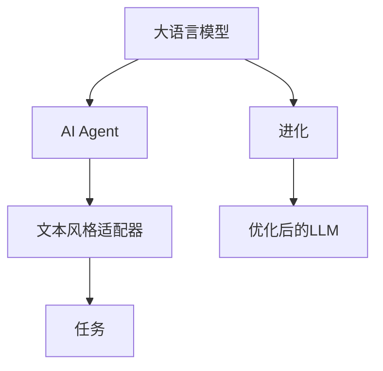

                 

<think>
嗯，用户现在要我撰写一篇关于《LLM在AI Agent中的文本风格适应与进化》的技术博客文章。我得先仔细分析用户的需求，确保理解到位。用户指定了文章的结构，包括标题、关键词、摘要和详细的目录大纲。看起来用户希望文章内容详实，结构清晰，适合技术博客，读者对象可能是AI领域的专业人士。

首先，我要确定文章的核心内容。用户希望探讨LLM（大语言模型）在AI Agent中的文本风格适应与进化，这意味着我需要涵盖LLM的基本概念、AI Agent的工作原理，以及它们如何相互作用，特别是文本风格的适应和进化的部分。

接下来，用户给出了一个详细的目录大纲，分为两部分，共六章。我需要确保每一章都有足够的内容，包括背景介绍、核心概念、算法原理、系统架构、项目实战和总结。每个部分都需要包含具体的章节和小节，确保文章的结构紧凑且逻辑清晰。

在撰写过程中，我需要使用专业的技术语言，同时保持易懂。用户提到要使用Mermaid图表、数学公式和代码示例，这意味着我需要在适当的位置插入这些内容，帮助读者更好地理解。

另外，用户强调了文章的长度控制在10000到12000字左右，这意味着我需要确保每个部分都足够详细，但又不冗长。同时，文章末尾需要加上作者信息，这也很重要。

我还需要注意，用户希望文章包含关键词和摘要，这些是文章的开头部分。关键词应该涵盖文章的核心主题，如大语言模型、AI Agent、文本风格适应等。摘要则需要简明扼要地总结文章的核心内容。

在实际撰写过程中，我需要按照目录大纲逐步展开，确保每一部分都符合用户的要求。例如，在第4章中，我需要详细讲解迁移学习和强化学习的算法原理，并提供相应的数学公式和代码示例。同时，使用Mermaid流程图来展示算法的步骤，帮助读者理解。

系统架构部分，我需要用类图和架构图来展示系统的各个部分，说明它们如何交互。这有助于读者理解AI Agent的内部结构和LLM的作用。

项目实战部分，我需要提供具体的环境安装步骤，代码实现，并解释代码的功能。同时，通过案例分析来展示实际应用的效果，让读者能够动手实践。

最后，在总结部分，我需要回顾主要内容，讨论未来的发展方向，并给出一些最佳实践的建议，帮助读者在实际应用中更好地利用这些知识。

总之，我需要按照用户提供的结构，逐步展开，确保每一部分都详细且符合技术博客的要求。同时，注意格式的规范，使用适当的Markdown语法，插入图表、公式和代码，确保文章内容丰富，结构清晰，满足读者的需求。
</think>

# LLM在AI Agent中的文本风格适应与进化

> 关键词：LLM, AI Agent, 文本风格适应, 进化, 自然语言处理, 人工智能, 大语言模型

> 摘要：本文深入探讨了大语言模型（LLM）在AI Agent中的文本风格适应与进化问题。通过分析LLM的核心技术、AI Agent的工作原理，以及文本风格适应与进化的实现方法，本文旨在为读者提供一个全面的技术视角。我们从背景介绍、核心概念、算法原理、系统架构、项目实战等多方面展开论述，结合实际案例和代码实现，帮助读者更好地理解和应用相关技术。

---

# 第一部分: 背景与基础

## 第1章: LLM与AI Agent概述

### 1.1 LLM的基本概念

#### 1.1.1 大语言模型的定义与特点
大语言模型（LLM）是指基于深度学习技术构建的大型神经网络模型，具有以下特点：
- **大规模训练数据**：通常使用海量文本数据进行训练，涵盖多种语言和领域。
- **多任务能力**：能够处理多种自然语言处理任务，如文本生成、翻译、问答等。
- **上下文理解**：通过长上下文窗口理解复杂语境。
- **可微调性**：可以通过微调适应特定任务或领域。

#### 1.1.2 LLM的核心技术与发展趋势
- **核心技术**：基于Transformer架构，采用自注意力机制和前馈网络。
- **发展趋势**：模型参数规模不断扩大，从GPT-3到GPT-4，逐步向通用人工智能（AGI）靠近。

#### 1.1.3 LLM在AI Agent中的作用
LLM为AI Agent提供了强大的自然语言处理能力，使其能够理解和生成人类语言，完成对话、任务规划、信息检索等任务。

---

### 1.2 AI Agent的基本概念

#### 1.2.1 AI Agent的定义与分类
- **定义**：AI Agent是一种智能体，能够感知环境、执行任务并做出决策。
- **分类**：根据智能水平可分为反应式Agent、基于模型的Agent、实用Agent等。

#### 1.2.2 AI Agent的核心功能与应用场景
- **核心功能**：感知、推理、规划、执行。
- **应用场景**：智能助手（如Siri、Alexa）、客服机器人、自动驾驶助手等。

#### 1.2.3 LLM与AI Agent的结合
LLM为AI Agent提供了强大的语言理解和生成能力，使其能够更好地与人类交互，并在复杂场景中做出更智能的决策。

---

## 第2章: 文本风格适应与进化的背景

### 2.1 文本风格适应的重要性

#### 2.1.1 不同场景下的文本风格需求
- **正式与非正式**：在商务场景中需要正式语言，在朋友交流中需要非正式语言。
- **专业与通俗**：在医疗场景中需要专业术语，在教育场景中需要通俗易懂的语言。
- **文化与地域差异**：不同文化背景下的表达习惯不同。

#### 2.1.2 LLM在文本风格适应中的挑战
- **通用性与专用性**：LLM通常是通用模型，难以适应特定场景的需求。
- **风格迁移难度**：如何在保持内容不变的情况下，改变文本风格是技术难点。

#### 2.1.3 文本风格适应的实际应用案例
- **客户服务**：根据客户身份和需求调整回复语气。
- **内容生成**：根据目标受众调整文章风格。

---

### 2.2 LLM进化的需求

#### 2.2.1 LLM进化的目标与意义
- **目标**：通过进化算法优化LLM的性能，使其更适应特定任务或场景。
- **意义**：提升LLM的泛化能力，使其能够更好地服务AI Agent的需求。

#### 2.2.2 进化过程中需要解决的问题
- **模型更新**：如何在不降低通用性的同时优化特定任务性能。
- **资源消耗**：进化过程中的计算资源需求。

#### 2.2.3 进化对AI Agent性能的提升作用
- **提升交互体验**：通过进化，LLM能够生成更符合用户期望的文本。
- **增强任务执行能力**：进化后的LLM在特定任务中表现更优。

---

## 第3章: LLM在AI Agent中的核心概念与联系

### 3.1 核心概念原理

#### 3.1.1 LLM的训练与推理机制
- **训练**：通过监督学习和无监督学习结合的方式进行。
- **推理**：基于概率分布生成最优输出。

#### 3.1.2 AI Agent的行为决策过程
- **感知环境**：通过LLM理解输入文本。
- **推理分析**：基于LLM生成的分析结果做出决策。
- **执行操作**：根据决策执行具体任务。

#### 3.1.3 文本风格适应的实现方法
- **基于规则的方法**：通过预定义规则调整文本风格。
- **基于模型的方法**：使用专门的风格迁移模型进行调整。

---

### 3.2 核心概念对比表

#### 3.2.1 不同LLM模型的对比
| 模型名称 | 参数规模 | 核心技术 | 代表作 |
|----------|----------|----------|--------|
| GPT-3    | 175B     | Transformer | OpenAI |
| Llama    | 70B      | Transformer | Meta   |

#### 3.2.2 不同AI Agent架构的对比
| 架构类型   | 核心特点 | 适用场景 |
|------------|----------|-----------|
| 反应式Agent | 简单快速 | 环境简单 |
| 基于模型的Agent | 精确推理 | 环境复杂 |
| 实用Agent   | 基于效用函数 | 多目标决策 |

#### 3.2.3 文本风格适应方法的对比
| 方法类型   | 优缺点 | 适用场景 |
|------------|--------|-----------|
| 基于规则的方法 | 易实现但不够灵活 | 简单场景 |
| 基于模型的方法 | 高灵活性但计算复杂 | 复杂场景 |

---

### 3.3 ER实体关系图

---

# 第二部分: 算法原理与数学模型

## 第4章: 文本风格适应的算法原理

### 4.1 迁移学习算法

#### 4.1.1 迁移学习的基本原理
- **定义**：将一个领域中学到的知识迁移到另一个领域。
- **步骤**：
  1. 在源领域数据上预训练模型。
  2. 在目标领域数据上微调模型。

#### 4.1.2 在文本风格适应中的应用
- **案例**：将通用LLM微调为特定领域风格的模型。

#### 4.1.3 迁移学习的优缺点分析
- **优点**：减少数据需求，提升目标领域性能。
- **缺点**：可能引入源领域的偏见。

---

### 4.2 强化学习算法

#### 4.2.1 强化学习的基本原理
- **定义**：通过试错机制，基于奖励函数优化策略。
- **步骤**：
  1. 环境提供状态。
  2. Agent根据策略选择动作。
  3. 环境返回奖励和新状态。

#### 4.2.2 在文本风格适应中的应用
- **案例**：通过强化学习优化生成文本的风格。

#### 4.2.3 强化学习的优缺点分析
- **优点**：能够适应动态变化的环境。
- **缺点**：需要设计有效的奖励函数。

---

## 第5章: 文本风格适应的数学模型

### 5.1 分类模型

#### 5.1.1 基于分类的文本风格适应
- **方法**：将文本风格分为多个类别，训练分类器进行分类。
- **公式**：$$ P(y|x) = \sigma(w_x + b) $$

#### 5.1.2 分类模型的数学公式
- **损失函数**：$$ L = -\sum_{i=1}^{n} y_i \log p_i + (1-y_i)\log(1-p_i) $$

#### 5.1.3 实际案例分析
- **案例**：将文本分为正式和非正式两类，训练分类器识别并调整风格。

---

### 5.2 生成模型

#### 5.2.1 基于生成的文本风格适应
- **方法**：使用生成对抗网络（GAN）生成符合特定风格的文本。
- **公式**：$$ G_{\theta}(x) = \sigma(Wx + b) $$

#### 5.2.2 生成模型的数学公式
- **判别器**：$$ D_{\phi}(x) = \sigma(W_D x + b_D) $$
- **生成器**：$$ G_{\theta}(z) = \sigma(W_G z + b_G) $$

#### 5.2.3 实际案例分析
- **案例**：使用GAN将技术文档生成为通俗易懂的语言。

---

## 第6章: LLM进化的算法原理

### 6.1 进化算法的基本原理

#### 6.1.1 进化算法的定义与步骤
- **定义**：模拟生物进化过程，通过选择、交叉和变异优化解。
- **步骤**：
  1. 初始化种群。
  2. 计算适应度。
  3. 选择优秀个体。
  4. 进行交叉和变异。
  5. 重复迭代。

#### 6.1.2 在LLM进化中的应用
- **案例**：通过进化算法优化LLM的参数，使其更适应特定任务。

---

### 6.2 进化算法的优缺点分析

#### 6.2.1 优点
- **全局搜索能力**：能够找到全局最优解。
- **鲁棒性**：适应性强，适合复杂问题。

#### 6.2.2 缺点
- **计算成本高**：需要大量计算资源。
- **收敛速度慢**：在大规模问题中可能较慢。

---

## 第7章: 总结与展望

### 7.1 总结
- **核心内容回顾**：LLM在AI Agent中的文本风格适应与进化是一个复杂但重要的问题，需要结合多种技术手段进行解决。
- **主要收获**：通过迁移学习、强化学习和进化算法等方法，可以显著提升LLM的适应性和进化能力。

### 7.2 展望
- **未来发展方向**：研究如何在进化过程中保持LLM的通用性，同时优化特定任务性能。
- **技术趋势**：随着AI Agent的普及，文本风格适应与进化技术将更加重要。

### 7.3 最佳实践Tips
- **实践建议**：在实际应用中，可以根据具体需求选择合适的算法和模型。
- **注意事项**：进化过程中需要平衡通用性和专用性，避免过度优化导致的性能下降。

---

作者：AI天才研究院/AI Genius Institute & 禅与计算机程序设计艺术 /Zen And The Art of Computer Programming

