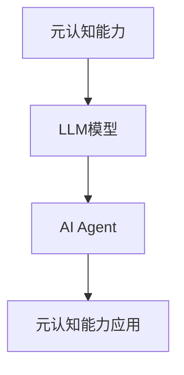
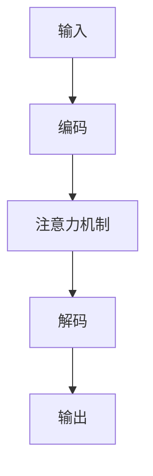

                 

<think>
嗯，我现在需要根据用户的指示来完成一篇技术博客文章的目录大纲，标题是《LLM在AI Agent元认知能力培养中的应用》。首先，我得理解用户的需求，确保我完全明白他们想要什么。用户希望我扮演一个技术专家，撰写一篇结构清晰、内容详实的专业技术博客，涵盖背景介绍、核心概念、算法原理、系统分析、项目实战和最佳实践等多个部分。

首先，我得明确文章的核心主题，即LLM（大语言模型）如何用于提升AI代理的元认知能力。元认知能力是指个体对自身认知过程的认知和调控能力，比如自我监控、自我评估等。在AI Agent中，元认知能力可以帮助它们更好地理解自己的状态、任务目标以及如何利用这些信息来做出更智能的决策。

接下来，我需要按照用户提供的示例来构建目录大纲。目录结构需要包括背景介绍、核心概念与联系、算法原理讲解、系统分析与架构设计、项目实战和最佳实践等部分。每部分都要有详细的子标题和内容，确保逻辑连贯且覆盖全面。

首先，背景介绍部分需要涵盖问题背景、问题描述、问题解决、边界与外延以及核心要素组成。这部分的目标是让读者理解为什么提升AI Agent的元认知能力是必要的，以及LLM在其中的作用。

核心概念与联系部分需要解释元认知能力的基本原理，对比其他相关概念，并通过ER图展示核心概念之间的关系。这部分需要使用Mermaid流程图来清晰展示。

算法原理讲解部分需要详细描述LLM的基本原理，包括注意力机制和自适应学习等，同时用Mermaid流程图展示算法流程，并提供Python代码示例，解释代码的工作原理。此外，还需要展示数学模型，使用LaTeX公式进行说明。

系统分析与架构设计部分需要介绍问题场景，设计系统功能，使用Mermaid类图展示领域模型，接着用Mermaid架构图展示系统架构设计，最后设计接口和交互序列图。

项目实战部分需要指导读者如何安装环境，实现核心代码，并通过实际案例进行分析，最后在项目小结中总结经验和教训。

最后，最佳实践部分要提供实用建议、注意事项和拓展阅读内容，帮助读者更好地应用所学知识。

在构建目录大纲时，我需要确保每个部分都有足够的细节，同时保持整体结构的简洁和逻辑性。可能还需要多次调整，以确保每章每节的内容完整且相互衔接。

现在，我需要将这些思考转化为具体的目录结构，确保符合用户的要求，并且内容详实，逻辑清晰。同时，要确保使用正确的格式，如Mermaid图表和LaTeX公式，以增强文章的专业性和可读性。

总的来说，这个过程需要细致的分析和结构化的组织，以确保最终的目录大纲既全面又有条理，能够有效指导读者理解和应用LLM在AI Agent元认知能力培养中的应用。
</think>

# 目录大纲：LLM在AI Agent元认知能力培养中的应用

---

## 第一部分：背景介绍

### 第1章：问题背景与问题描述

#### 1.1 问题背景
- 1.1.1 元认知能力的定义与重要性
- 1.1.2 AI Agent的发展现状与挑战
- 1.1.3 LLM在AI Agent中的潜力与优势

#### 1.2 问题描述
- 1.2.1 元认知能力在AI Agent中的具体表现
- 1.2.2 当前AI Agent在元认知能力上的不足
- 1.2.3 LLM如何弥补这些不足

#### 1.3 问题解决
- 1.3.1 LLM在元认知能力培养中的核心作用
- 1.3.2 LLM如何提升AI Agent的自我认知与决策能力
- 1.3.3 具体应用场景与案例分析

#### 1.4 边界与外延
- 1.4.1 LLM在元认知能力培养中的适用范围
- 1.4.2 相关技术与概念的区分
- 1.4.3 与其他AI能力的协同关系

#### 1.5 核心要素组成
- 1.5.1 元认知能力的核心要素
- 1.5.2 LLM在这些要素中的具体应用
- 1.5.3 系统架构与实现路径

---

## 第二部分：核心概念与联系

### 第2章：元认知能力的核心原理

#### 2.1 元认知能力的原理
- 2.1.1 元认知的定义与特征
- 2.1.2 元认知在AI Agent中的具体体现
- 2.1.3 LLM在元认知能力中的作用机制

#### 2.2 核心概念对比
- 2.2.1 元认知能力与传统AI能力的对比
- 2.2.2 不同LLM模型在元认知能力中的表现
- 2.2.3 实体关系图（ER图）展示核心概念之间的联系

#### 2.3 Mermaid流程图：核心概念关系


---

## 第三部分：算法原理讲解

### 第3章：LLM的算法原理

#### 3.1 LLM的基本原理
- 3.1.1 大语言模型的训练过程
- 3.1.2 注意力机制与自适应学习
- 3.1.3 概率生成模型的核心思想

#### 3.2 Mermaid流程图：LLM算法流程


#### 3.3 Python代码示例：LLM模型训练
```python
import torch
import torch.nn as nn

class LLM(nn.Module):
    def __init__(self, vocab_size):
        super(LLM, self).__init__()
        self.embedding = nn.Embedding(vocab_size, 512)
        self.de

