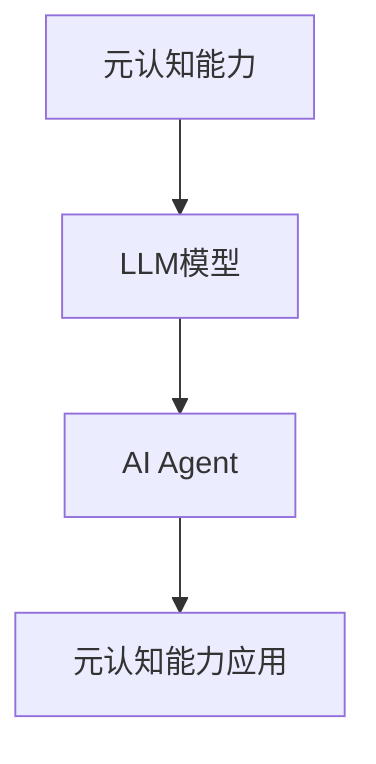
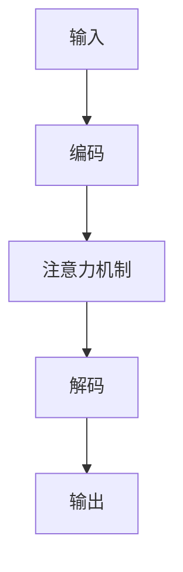

                 


# 目录大纲：LLM在AI Agent元认知能力培养中的应用

---

## 第一部分：背景介绍

### 第1章：问题背景与问题描述

#### 1.1 问题背景
- 1.1.1 元认知能力的定义与重要性
- 1.1.2 AI Agent的发展现状与挑战
- 1.1.3 LLM在AI Agent中的潜力与优势

#### 1.2 问题描述
- 1.2.1 元认知能力在AI Agent中的具体表现
- 1.2.2 当前AI Agent在元认知能力上的不足
- 1.2.3 LLM如何弥补这些不足

#### 1.3 问题解决
- 1.3.1 LLM在元认知能力培养中的核心作用
- 1.3.2 LLM如何提升AI Agent的自我认知与决策能力
- 1.3.3 具体应用场景与案例分析

#### 1.4 边界与外延
- 1.4.1 LLM在元认知能力培养中的适用范围
- 1.4.2 相关技术与概念的区分
- 1.4.3 与其他AI能力的协同关系

#### 1.5 核心要素组成
- 1.5.1 元认知能力的核心要素
- 1.5.2 LLM在这些要素中的具体应用
- 1.5.3 系统架构与实现路径

---

## 第二部分：核心概念与联系

### 第2章：元认知能力的核心原理

#### 2.1 元认知能力的原理
- 2.1.1 元认知的定义与特征
- 2.1.2 元认知在AI Agent中的具体体现
- 2.1.3 LLM在元认知能力中的作用机制

#### 2.2 核心概念对比
- 2.2.1 元认知能力与传统AI能力的对比
- 2.2.2 不同LLM模型在元认知能力中的表现
- 2.2.3 实体关系图（ER图）展示核心概念之间的联系

#### 2.3 Mermaid流程图：核心概念关系


---

## 第三部分：算法原理讲解

### 第3章：LLM的算法原理

#### 3.1 LLM的基本原理
- 3.1.1 大语言模型的训练过程
- 3.1.2 注意力机制与自适应学习
- 3.1.3 概率生成模型的核心思想

#### 3.2 Mermaid流程图：LLM算法流程


#### 3.3 Python代码示例：LLM模型训练
```python
import torch
import torch.nn as nn

class LLM(nn.Module):
    def __init__(self, vocab_size):
        super(LLM, self).__init__()
        self.embedding = nn.Embedding(vocab_size, 512)
        self.de

