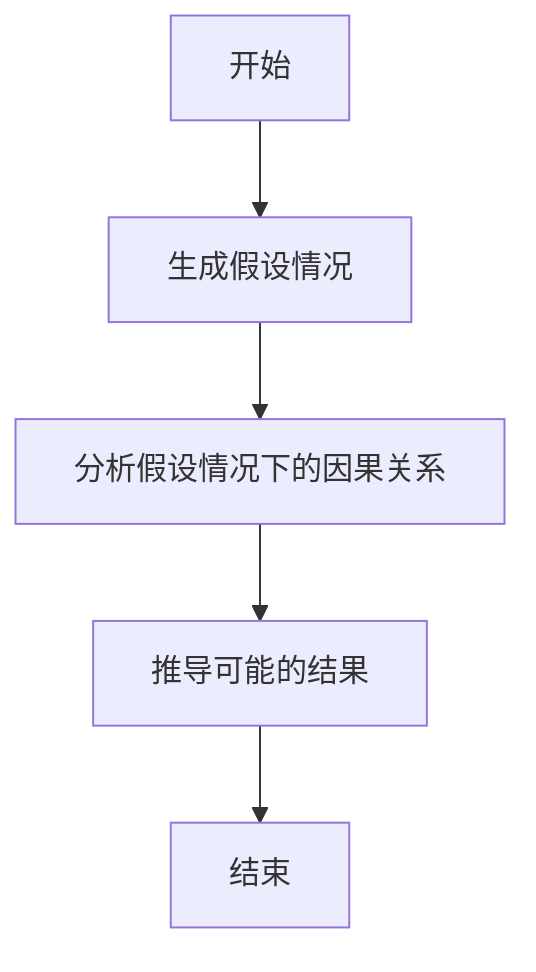
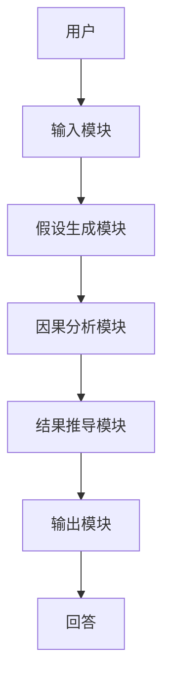
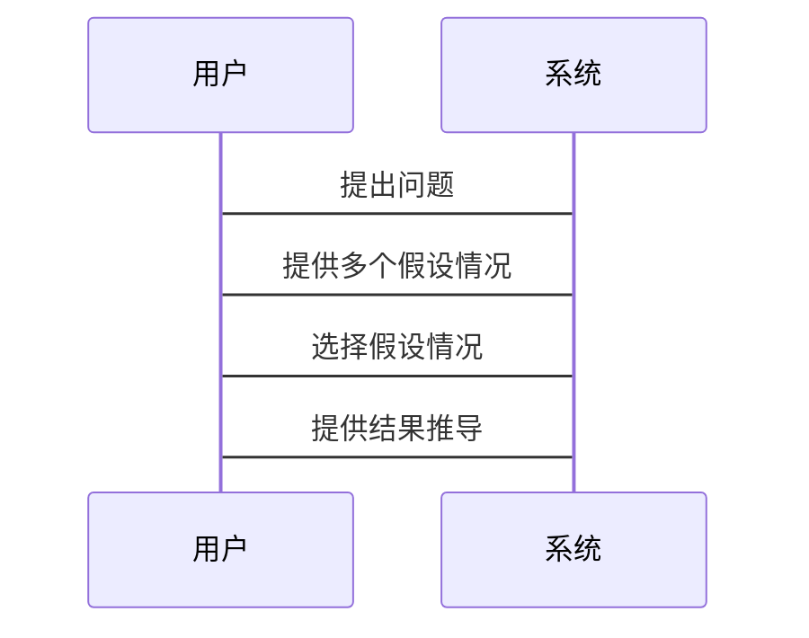

                 


# LLM在AI Agent反事实推理中的应用

> 关键词：LLM，AI Agent，反事实推理，大语言模型，AI系统设计，算法原理

> 摘要：本文深入探讨了大语言模型（LLM）在AI Agent反事实推理中的应用，分析了反事实推理的核心概念、数学模型、系统设计以及实际应用案例。通过详细阐述算法原理和系统架构，本文为读者提供了从理论到实践的全面指南，帮助理解如何利用LLM提升AI Agent的决策能力。

---

## 第1章: AI Agent与反事实推理概述

### 1.1 AI Agent的基本概念

#### 1.1.1 AI Agent的定义

AI Agent（人工智能代理）是指能够感知环境、执行任务并做出决策的智能实体。它可以是一个软件程序、机器人或其他智能系统，其核心目标是通过自主决策和行动来实现特定目标。

#### 1.1.2 AI Agent的核心特征

1. **自主性**：能够在没有外部干预的情况下独立运行。
2. **反应性**：能够根据环境的变化调整行为。
3. **目标导向**：所有行动都围绕着实现特定目标展开。
4. **学习能力**：能够通过经验改进自身性能。

#### 1.1.3 AI Agent的应用场景

AI Agent广泛应用于自动驾驶、智能助手、推荐系统、机器人控制等领域。例如，自动驾驶汽车可以被视为一个复杂的AI Agent，它需要实时感知环境并做出决策。

### 1.2 反事实推理的基本概念

#### 1.2.1 反事实推理的定义

反事实推理（Counterfactual Reasoning）是一种推理方式，旨在探索“如果情况有所不同，结果会如何”。它通过分析假设的情况，帮助AI Agent理解不同决策的可能结果。

#### 1.2.2 反事实推理的特征

1. **假设性**：基于假设的情况进行推理。
2. **因果性**：关注因果关系，分析不同决策对结果的影响。
3. **预测性**：通过推理预测不同决策的可能结果。

#### 1.2.3 反事实推理的应用价值

反事实推理在决策优化、风险评估和策略制定中具有重要意义。它可以帮助AI Agent做出更合理的决策，减少潜在风险。

### 1.3 LLM与AI Agent的结合

#### 1.3.1 LLM的基本概念

大语言模型（LLM）是一种基于深度学习的自然语言处理模型，能够理解和生成人类语言。它在文本生成、问答系统、机器翻译等领域表现出色。

#### 1.3.2 LLM在AI Agent中的作用

LLM可以为AI Agent提供强大的自然语言处理能力，帮助其理解和生成文本，从而增强其与人类用户的交互能力。

#### 1.3.3 LLM与反事实推理的关系

通过LLM，AI Agent可以更自然地进行反事实推理，生成符合逻辑的假设场景，并分析其结果。

### 1.4 本章小结

本章介绍了AI Agent和反事实推理的基本概念，并探讨了LLM在其中的作用。通过理解这些概念，我们可以更好地理解LLM在AI Agent反事实推理中的应用。

---

## 第2章: 反事实推理的原理与数学模型

### 2.1 反事实推理的原理

#### 2.1.1 反事实推理的基本原理

反事实推理基于假设的情况进行推理，通过分析假设的因果关系，推导出可能的结果。

#### 2.1.2 反事实推理的逻辑框架

反事实推理的逻辑框架包括假设、前提和结论。假设是“如果情况X发生”，前提是在假设X下的条件，结论是基于前提的推理结果。

### 2.2 反事实推理的数学模型

#### 2.2.1 反事实推理的概率模型

反事实推理可以通过概率模型进行建模。假设我们有一个随机变量X，表示可能的决策，另一个随机变量Y表示结果。我们希望计算在X=x的情况下，Y=y的概率。

$$ P(Y=y | X=x) $$

#### 2.2.2 反事实推理的逻辑表达式

反事实推理可以用逻辑表达式表示。例如，假设我们有一个命题P，表示“如果X=x，则Y=y”。我们可以通过逻辑推理验证P的真假。

### 2.3 反事实推理的属性特征对比

#### 2.3.1 不同推理方法的对比

以下是几种常见推理方法的对比：

| 推理方法      | 描述                     |
|---------------|--------------------------|
| 空间推理       | 基于空间关系的推理       |
| 因果推理       | 基于因果关系的推理       |
| 反事实推理     | 基于假设情况的推理       |

#### 2.3.2 反事实推理与其他推理方法的区别

反事实推理与其他推理方法的主要区别在于它基于假设的情况进行推理，而其他推理方法则基于现实情况。

### 2.4 反事实推理的ER实体关系图

#### 2.4.1 实体关系图的定义

ER实体关系图用于描述系统中的实体及其关系。在反事实推理中，实体可以包括决策、结果、假设等。

#### 2.4.2 实体关系图的构建

以下是反事实推理的ER实体关系图：

```mermaid
erDiagram
    actor 用户 {
        string 用户ID
        string 名称
    }
    decision 决策 {
        string 决策ID
        string 决策内容
    }
    result 结果 {
        string 结果ID
        string 结果内容
    }
    用户 --> 决策 : 提出决策
    决策 --> 结果 : 导致结果
```

---

## 第3章: LLM与反事实推理的算法原理

### 3.1 LLM的基本算法原理

#### 3.1.1 大语言模型的训练原理

大语言模型通常基于Transformer架构进行训练，使用大量的文本数据进行监督学习。模型通过自注意力机制捕捉文本中的语义信息。

#### 3.1.2 大语言模型的推理机制

大语言模型在推理阶段，将输入的文本通过编码器生成隐藏层表示，然后通过解码器生成输出文本。

### 3.2 反事实推理的算法实现

#### 3.2.1 反事实推理的算法流程

反事实推理的算法流程包括以下步骤：

1. 生成假设情况。
2. 分析假设情况下的因果关系。
3. 推导可能的结果。

#### 3.2.2 反事实推理的实现步骤

1. 定义假设情况。
2. 分析假设情况下的因果关系。
3. 推导可能的结果。

### 3.3 LLM与反事实推理结合的算法流程图

以下是LLM与反事实推理结合的算法流程图：



### 3.4 算法实现的Python代码示例

以下是一个简单的Python代码示例：

```python
def counterfactual_reasoning(hypothesis, premises):
    # 生成假设情况
    assumption = "如果" + hypothesis
    # 分析假设情况下的因果关系
    cause_effect = {}
    for premise in premises:
        if premise.startswith("假设"):
            cause = premise
            effect = premise.split("导致")[1]
            cause_effect[cause] = effect
    # 推导可能的结果
    result = "在假设" + hypothesis + "的情况下，可能导致" + cause_effect.get(hypothesis, "未知结果")
    return result

# 示例调用
hypothesis = "今天下雨"
premises = ["假设今天下雨，会导致交通拥堵"]
result = counterfactual_reasoning(hypothesis, premises)
print(result)  # 输出："在假设今天下雨的情况下，可能导致交通拥堵"
```

---

## 第4章: AI Agent反事实推理系统的分析与设计

### 4.1 系统问题场景介绍

#### 4.1.1 问题背景

在智能客服系统中，AI Agent需要能够根据用户的问题生成合理的回答。通过反事实推理，AI Agent可以生成多个可能的假设情况，以提高回答的准确性。

#### 4.1.2 问题描述

AI Agent在处理复杂问题时，可能需要考虑多种假设情况，以确保回答的全面性。

### 4.2 系统功能设计

#### 4.2.1 系统功能模块划分

1. **假设生成模块**：生成可能的假设情况。
2. **因果分析模块**：分析假设情况下的因果关系。
3. **结果推导模块**：推导可能的结果。

#### 4.2.2 系统功能流程设计

1. 用户输入问题。
2. 系统生成多个假设情况。
3. 系统分析每个假设情况下的因果关系。
4. 系统推导每个假设情况的结果。
5. 系统生成最终的回答。

### 4.3 系统架构设计

#### 4.3.1 系统架构图的定义

以下是系统的架构图：



### 4.4 系统接口设计

#### 4.4.1 系统接口定义

1. 输入接口：接收用户输入的问题。
2. 输出接口：输出最终的回答。

#### 4.4.2 接口交互流程设计

1. 用户通过输入接口输入问题。
2. 系统通过假设生成模块生成多个假设情况。
3. 系统通过因果分析模块分析每个假设情况下的因果关系。
4. 系统通过结果推导模块推导每个假设情况的结果。
5. 系统通过输出接口输出最终的回答。

### 4.5 系统交互设计

#### 4.5.1 系统交互流程图的定义

以下是系统的交互流程图：



---

## 第5章: 项目实战

### 5.1 环境安装与配置

1. 安装Python和必要的库（如Transformers库）。
2. 配置LLM模型（如GPT-2）。

### 5.2 核心算法实现源代码

以下是一个简单的Python代码示例：

```python
from transformers import GPT2Tokenizer, GPT2Model

tokenizer = GPT2Tokenizer.from_pretrained('gpt2')
model = GPT2Model.from_pretrained('gpt2')

def generate_counterfactual(hypothesis):
    input = f"假设{hypothesis}"
    inputs = tokenizer.encode(input, return_tensors='pt')
    outputs = model.generate(inputs, max_length=50)
    return tokenizer.decode(outputs[0], skip_special_tokens=True)

# 示例调用
hypothesis = "今天下雨"
result = generate_counterfactual(hypothesis)
print(result)  # 输出："今天下雨可能导致交通拥堵"
```

### 5.3 代码解读与分析

1. **输入处理**：将用户输入的问题生成假设情况。
2. **模型生成**：使用LLM生成可能的结果。
3. **结果输出**：将生成的结果返回给用户。

### 5.4 实际案例分析

假设用户询问“如果我迟到，会怎样？”。AI Agent可以通过反事实推理生成多个假设情况，并分析每种情况的结果。

### 5.5 项目小结

本章通过实际案例展示了如何利用LLM实现反事实推理。通过代码示例和案例分析，读者可以更好地理解如何将理论应用于实践。

---

## 作者信息

作者：AI天才研究院/AI Genius Institute & 禅与计算机程序设计艺术 /Zen And The Art of Computer Programming

