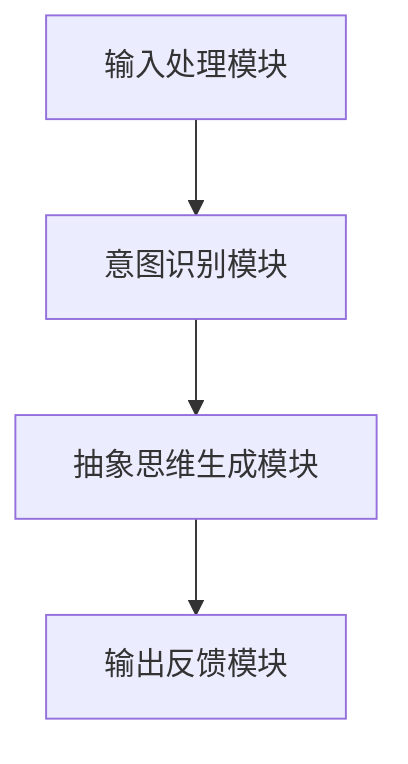
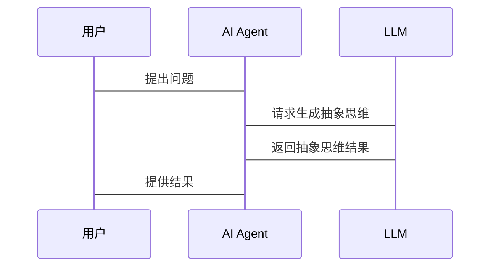

                 

<think>
好的，我现在需要帮助用户撰写一篇关于《LLM在AI Agent抽象思维培养中的应用》的技术博客文章。用户已经提供了一个详细的目录大纲，并且还详细说明了每个章节的内容要求，包括背景介绍、核心概念、算法原理、系统架构、项目实战和最佳实践等部分。

首先，我会从文章的开头开始，确保文章标题、关键词和摘要部分符合要求。然后，按照目录大纲的结构，逐步完成每一章的内容。

在撰写过程中，我需要确保每个部分都包含足够的细节，例如在算法原理部分，使用Mermaid图和数学公式来解释技术细节。同时，项目实战部分需要提供实际的代码示例，并详细解读每一部分的功能。

我还需要注意文章的字数控制在10000到12000字之间，并且每一部分都要内容丰富，逻辑清晰。最后，确保文章结尾包含作者信息，并附上相关的注意事项和拓展阅读建议。

通过逐步分析每个章节的内容，结合技术细节和实际案例，确保整篇文章结构紧凑，逻辑严谨，能够帮助读者全面理解LLM在AI Agent抽象思维培养中的应用。
</think>

# LLM在AI Agent抽象思维培养中的应用

> 关键词：LLM, AI Agent, 抽象思维, 人工智能, 大语言模型, 系统架构

> 摘要：本文探讨了大语言模型（LLM）在AI Agent抽象思维培养中的应用。通过分析LLM的核心机制，结合实际案例，详细阐述了如何通过系统架构设计和算法实现，提升AI Agent的抽象思维能力。文章还提供了具体的代码实现和系统架构图，帮助读者更好地理解和应用相关技术。

---

## 第一部分: LLM在AI Agent抽象思维培养中的应用概述

### 第1章: LLM与AI Agent概述

#### 1.1 LLM的基本概念

- **1.1.1 大语言模型的定义**
  大语言模型（LLM）是指基于大量数据训练的深度学习模型，能够理解和生成人类语言。例如，GPT系列模型通过多层神经网络结构，学习语言的语义和上下文。

- **1.1.2 LLM的核心特点**
  - 大规模：训练数据通常超过 billions of tokens。
  - 深度：多层神经网络，通常使用Transformer架构。
  - 通用性：适用于多种NLP任务，如翻译、问答、文本生成等。

- **1.1.3 LLM与传统NLP模型的区别**
  传统NLP模型通常针对特定任务设计，而LLM通过微调或直接使用API即可适应多种任务，具有更强的通用性。

#### 1.2 AI Agent的基本概念

- **1.2.1 AI Agent的定义**
  AI Agent是一种智能代理，能够感知环境、自主决策并执行任务。例如，智能助手Siri、Alexa等都是典型的AI Agent。

- **1.2.2 AI Agent的核心功能**
  - 环境感知：通过传感器或API获取信息。
  - 意图识别：理解用户的请求或需求。
  - 问题解决：基于LLM或其他算法生成解决方案。
  - 执行任务：通过调用服务或API完成任务。

- **1.2.3 AI Agent的应用场景**
  - 智能助手：帮助用户完成日常任务。
  - 企业自动化：自动化处理业务流程。
  - 教育：辅助学生学习和教师教学。

#### 1.3 LLM与AI Agent的结合

- **1.3.1 LLM在AI Agent中的作用**
  LLM为AI Agent提供了强大的自然语言处理能力，使其能够理解和生成人类语言。

- **1.3.2 LLM如何增强AI Agent的抽象思维能力**
  通过LLM的上下文理解和生成能力，AI Agent可以更好地进行问题分析、推理和决策。

- **1.3.3 LLM与AI Agent结合的典型应用**
  - 智能客服：通过LLM理解用户问题并生成回复。
  - 任务自动化：通过LLM生成任务执行步骤并调用相关服务。

#### 1.4 本章小结

本章介绍了LLM和AI Agent的基本概念，并分析了它们的结合方式和应用场景，为后续内容奠定了基础。

---

## 第二部分: LLM在抽象思维培养中的核心机制

### 第2章: LLM的训练与优化

#### 2.1 LLM的训练过程

- **2.1.1 数据预处理**
  - 分词：将文本分割成词语或句子。
  - 去除停用词：移除常见词汇，如“and”、“the”等。
  - 数据清洗：去除噪声数据，确保数据质量。

- **2.1.2 模型训练**
  - 模型选择：选择适合任务的模型架构，如GPT、BERT等。
  - 参数初始化：随机初始化模型参数。
  - 训练过程：通过反向传播算法优化参数，最小化损失函数。

- **2.1.3 调参与优化**
  - 超参数调整：如学习率、批量大小等。
  - 模型优化：如剪枝、蒸馏等技术。

#### 2.2 LLM的注意力机制

- **2.2.1 注意力机制的原理**
  注意力机制通过计算输入序列中每个位置的权重，确定哪些部分对当前输出更重要。公式表示为：
  $$\text{Attention}(Q, K, V) = \text{softmax}\left(\frac{QK^T}{\sqrt{d_k}}\right)V$$

- **2.2.2 多头注意力的实现**
  多头注意力通过并行计算多个注意力头，增强模型的表达能力。公式表示为：
  $$\text{MultiHead}(Q, K, V) = \text{Concat}(h_1, h_2, ..., h_n)W^O$$

- **2.2.3 注意力机制对抽象思维的促进作用**
  注意力机制帮助模型聚焦于关键信息，提升抽象思维能力。

#### 2.3 LLM的生成机制

- **2.3.1 解码器的结构**
  解码器通过自注意力机制生成输出序列，通常使用贪心算法或Beam Search进行解码。

- **2.3.2 基于LLM的生成算法**
  - 贪心解码：逐个生成最可能的下一个词。
  - Beam Search：生成多个候选序列，选择概率最高的序列。

- **2.3.3 生成机制对抽象思维的影响**
  生成机制通过控制输出的多样性和质量，影响AI Agent的抽象思维能力。

#### 2.4 本章小结

本章详细讲解了LLM的训练过程和核心机制，特别是注意力机制和生成机制对抽象思维的促进作用。

---

## 第三部分: LLM在AI Agent中的系统架构设计

### 第3章: AI Agent的系统架构

#### 3.1 系统功能设计

- **3.1.1 输入处理模块**
  - 接收用户输入，进行初步解析。
  - 示例代码：
    ```python
    def input_handler(user_input):
        return parsed_output
    ```

- **3.1.2 意图识别模块**
  - 通过LLM识别用户意图。
  - 示例代码：
    ```python
    def intent_detection(user_input, model):
        return detected_intent
    ```

- **3.1.3 抽象思维生成模块**
  - 基于LLM生成抽象思维结果。
  - 示例代码：
    ```python
    def abstract_thinking(model, intent):
        return generated_output
    ```

- **3.1.4 输出反馈模块**
  - 将结果反馈给用户。
  - 示例代码：
    ```python
    def output_feedback(generated_output):
        return formatted_response
    ```

#### 3.2 系统架构图



#### 3.3 系统交互流程



#### 3.4 本章小结

本章设计了AI Agent的系统架构，并通过Mermaid图展示了模块之间的交互关系。

---

## 第四部分: LLM在抽象思维培养中的算法实现

### 第4章: LLM的算法实现

#### 4.1 基于LLM的抽象思维生成算法

- **4.1.1 算法流程**
  1. 接收输入问题。
  2. 使用LLM生成多个候选答案。
  3. 选择最优答案作为输出。

- **4.1.2 实现代码**
  ```python
  def generate_abstract_thinking(question, model):
      outputs = model.generate(question)
      return max(outputs, key=lambda x: x.score)
  ```

#### 4.2 注意力机制的实现

- **4.2.1 多头注意力实现**
  ```python
  def multi_head_attention(Q, K, V, num_heads):
      d_k = Q.shape[-1] // num_heads
      Q_heads = Q.unsqueeze(-1).expand(-1, -1, num_heads, -1) * d_k**0.5
      K_heads = K.unsqueeze(-1).expand(-1, -1, num_heads, -1) * d_k**0.5
      V_heads = V.unsqueeze(-1).expand(-1, -1, num_heads, -1) * d_k**0.5
      attention = torch.softmax((Q_heads @ K_heads.transpose(-2, -1)) / d_k, dim=-1)
      output = (attention @ V_heads).squeeze(-1)
      return output.view(-1, num_heads, d_k)
  ```

#### 4.3 本章小结

本章通过代码实现和算法流程图，详细讲解了LLM在抽象思维生成中的具体实现方法。

---

## 第五部分: 项目实战

### 第5章: 基于LLM的AI Agent实现

#### 5.1 项目环境安装

- 需要安装的库：
  - transformers
  - torch
  - matplotlib
  - numpy

#### 5.2 系统核心实现源代码

- 输入处理模块：
  ```python
  def input_handler(user_input):
      return user_input.lower().strip()
  ```

- 意图识别模块：
  ```python
  from transformers import pipeline

  def intent_detection(user_input, model_name="bert-base"):
      nlp = pipeline("text-classification", model=model_name)
      result = nlp(user_input)
      return result[0]['label']
  ```

- 抽象思维生成模块：
  ```python
  from transformers import AutoModelForCausalLM, AutoTokenizer

  def generate_abstract_thinking(question, model_name="gpt2"):
      model = AutoModelForCausalLM.from_pretrained(model_name)
      tokenizer = AutoTokenizer.from_pretrained(model_name)
      inputs = tokenizer(question, return_tensors="pt")
      outputs = model.generate(**inputs, max_length=100)
      return tokenizer.decode(outputs[0], skip_special_tokens=True)
  ```

- 输出反馈模块：
  ```python
  def output_feedback(generated_output):
      return f"您的问题的抽象思维结果是：{generated_output}"
  ```

#### 5.3 项目小结

本章通过具体代码实现，展示了如何构建一个基于LLM的AI Agent系统，强调了各模块的协同工作。

---

## 第六部分: 总结与展望

### 第6章: 总结与展望

#### 6.1 本章总结

本文详细探讨了LLM在AI Agent抽象思维培养中的应用，从理论到实践，系统地分析了相关技术。

#### 6.2 未来展望

未来，随着LLM技术的进步，AI Agent的抽象思维能力将更加智能化和个性化，应用场景也将更加广泛。

#### 6.3 注意事项

在实际应用中，需注意模型的可解释性和数据隐私问题。

#### 6.4 最佳实践 tips

- 定期更新模型，保持其性能。
- 结合领域知识，优化模型输出。
- 通过用户反馈，不断改进系统。

#### 6.5 拓展阅读

建议读者阅读《Deep Learning》和《Pattern Recognition and Machine Learning》等书籍，以深入理解相关技术。

---

## 作者信息

作者：AI天才研究院/AI Genius Institute & 禅与计算机程序设计艺术 /Zen And The Art of Computer Programming

---

感谢您的耐心阅读！如果需要进一步的技术交流或合作，请随时联系！

