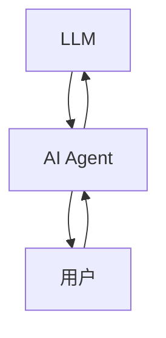
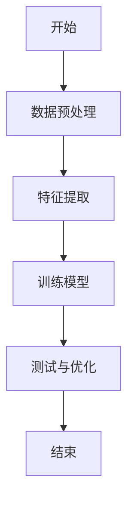
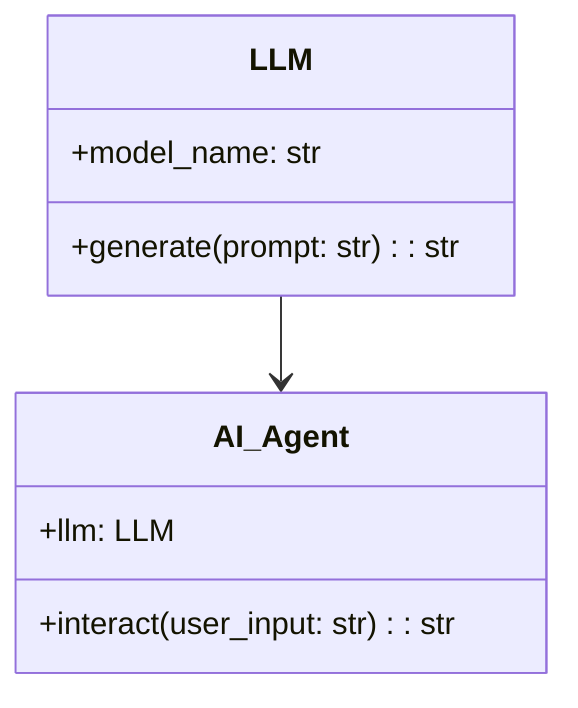
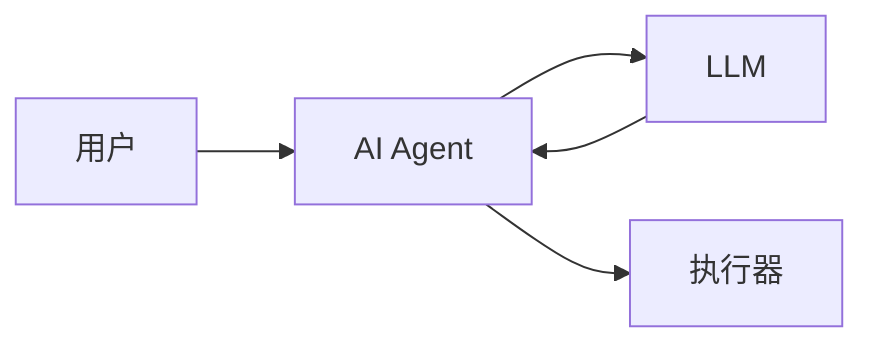
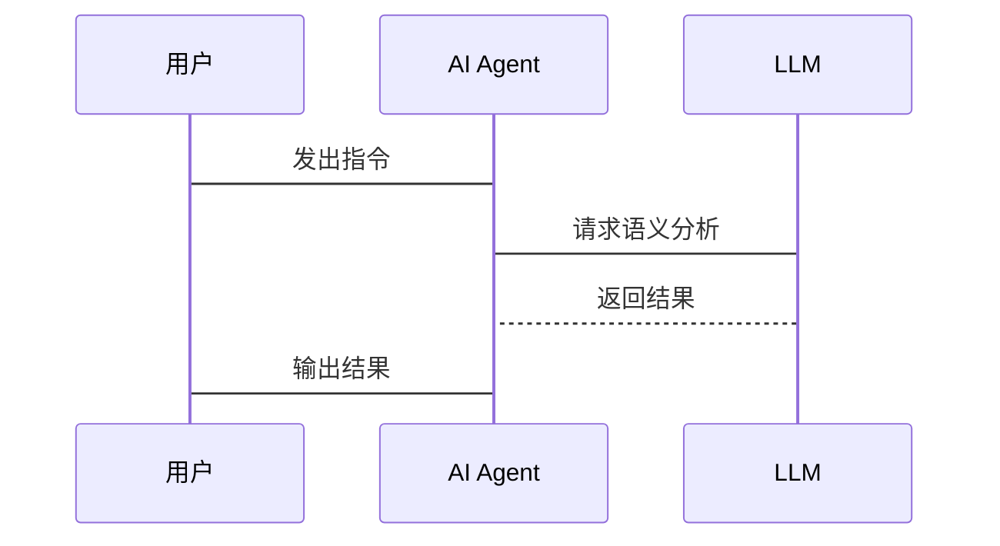

                 


# LLM在AI Agent抽象概念学习中的应用

> 关键词：LLM、AI Agent、抽象概念学习、算法原理、系统架构、项目实战

> 摘要：本文探讨了大语言模型（LLM）在AI Agent抽象概念学习中的应用，系统地分析了核心概念、算法原理、系统架构，并通过项目实战展示了如何利用LLM赋能AI Agent的抽象概念学习。文章旨在为相关领域的研究人员和技术人员提供深入的技术指导和实践参考。

---

## 第1章 背景介绍

### 1.1 问题背景与描述

#### 1.1.1 抽象概念学习的定义与重要性
抽象概念学习是指通过归纳、推理和模式识别，从具体实例中提取出一般性概念的过程。它在机器学习、自然语言处理等领域具有重要意义，是实现AI系统自主性与智能性的关键。

#### 1.1.2 LLM在AI Agent中的角色
LLM（Large Language Model）通过处理大量文本数据，具备强大的语义理解和生成能力。AI Agent需要通过与环境交互，完成特定任务，而LLM为其提供了强大的语言理解和生成支持，使其能够更好地理解和执行任务。

#### 1.1.3 当前技术的挑战与机遇
当前，AI Agent的抽象概念学习面临数据稀疏性、概念表示复杂性等挑战。LLM的引入为解决这些问题提供了新的可能性，同时也带来了技术融合的新机遇。

### 1.2 问题解决与应用前景

#### 1.2.1 LLM如何赋能AI Agent
LLM通过提供语义理解、上下文推理和多语言支持，增强AI Agent的理解能力和生成能力，使其能够更高效地完成复杂任务。

#### 1.2.2 抽象概念学习的实际应用场景
抽象概念学习在智能客服、智能助手、智能推荐等领域有广泛应用。例如，智能客服通过抽象概念学习，能够快速理解用户需求并提供精准服务。

#### 1.2.3 技术发展的边界与外延
LLM与AI Agent的结合不仅限于语言处理，还可能扩展到图像识别、知识图谱构建等更广泛的应用领域。

### 1.3 核心概念与结构

#### 1.3.1 抽象概念学习的核心要素
- 数据多样性：涵盖不同领域的大量数据。
- 概念表示：通过向量、符号等方式表示概念。
- 推理能力：基于已有概念进行推理。

#### 1.3.2 LLM与AI Agent的关系
- LLM作为AI Agent的语言处理模块，提供语义理解与生成支持。
- AI Agent作为LLM的应用场景，通过交互实现特定任务。

#### 1.3.3 系统整体架构与流程
- 输入：用户指令或环境信号。
- 处理：LLM解析指令，AI Agent执行任务。
- 输出：生成结果或反馈。

---

## 第2章 核心概念与联系

### 2.1 LLM与AI Agent的原理对比

#### 2.1.1 LLM的工作机制
- 输入：文本数据。
- 处理：基于Transformer架构生成概率分布。
- 输出：语言生成或语义理解。

#### 2.1.2 AI Agent的核心算法
- 感知：接收输入信号。
- 决策：基于状态和动作选择最优策略。
- 执行：输出行动。

#### 2.1.3 两者原理的异同点
| 对比维度 | LLM | AI Agent |
|----------|-----|-----------|
| 输入     | 文本 | 状态、动作 | 
| 输出     | 语言 | 行动      |
| 目标     | 理解/生成语言 | 执行任务 |

### 2.2 核心概念属性特征对比表

| 概念       | 抽象概念学习 | LLM | AI Agent |
|------------|-------------|------|-----------|
| 输入形式   | 文本/数据   | 文本 | 状态/动作 |
| 输出形式   | 概念表示     | 语言 | 行动      |
| 核心能力   | 概念提取     | 语义理解 | 任务执行 |

### 2.3 ER实体关系图

```mermaid
erd
  entity(LLM) {
    id
    model_name
    parameter
  }
  entity(AI Agent) {
    id
    task
    state
  }
  LLM -[提供语言能力]-> AI Agent
```

---

## 第3章 算法原理与实现

### 3.1 LLM与AI Agent交互算法

#### 3.1.1 用 Mermaid 绘制算法流程图



#### 3.1.2 用 Python 实现核心算法

```python
class LLM:
    def __init__(self):
        pass

    def generate(self, prompt):
        # 示例：简单生成
        return "Response to " + prompt

class AI_Agent:
    def __init__(self, llm):
        self.llm = llm

    def interact(self, user_input):
        response = self.llm.generate(user_input)
        return response
```

#### 3.1.3 数学模型与公式推导
LLM的概率分布公式：
$$ P(\text{word}_i | \text{previous words}) = \text{softmax}(W_{\text{word}_i}) $$

### 3.2 抽象概念学习算法

#### 3.2.1 用 Mermaid 绘制算法流程图



#### 3.2.2 用 Python 实现核心算法

```python
def abstract_concept_learning(data):
    # 示例：简单概念提取
    concepts = []
    for item in data:
        concepts.append(item['concept'])
    return concepts
```

#### 3.2.3 数学模型与公式推导
损失函数公式：
$$ \mathcal{L} = -\sum_{i=1}^{n} \log P(y_i | x_i) $$

---

## 第4章 系统分析与架构设计

### 4.1 问题场景介绍

#### 4.1.1 抽象概念学习的应用场景
- 智能客服：理解用户问题并提供解决方案。
- 智能助手：根据用户需求推荐服务。

#### 4.1.2 LLM与AI Agent的协同工作流程
1. 用户输入指令。
2. AI Agent接收指令并调用LLM进行语义分析。
3. LLM生成语义理解结果。
4. AI Agent根据理解结果执行任务。

### 4.2 系统功能设计

#### 4.2.1 领域模型设计



#### 4.2.2 系统架构设计



#### 4.2.3 系统接口设计
- 输入接口：用户指令。
- 输出接口：生成结果。

#### 4.2.4 系统交互设计



---

## 第5章 项目实战

### 5.1 环境安装与配置

#### 5.1.1 开发环境搭建
- 安装Python 3.8+
- 安装必要的库： transformers, numpy, matplotlib

#### 5.1.2 依赖库安装与配置
```bash
pip install transformers numpy matplotlib
```

### 5.2 核心代码实现

#### 5.2.1 LLM与AI Agent交互代码

```python
from transformers import pipeline

llm = pipeline("text-generation", model="gpt2")
class AI_Agent:
    def __init__(self, llm):
        self.llm = llm

    def interact(self, user_input):
        response = self.llm(user_input, max_length=50, num_return_sequences=1)
        return response[0]['generated_text']
```

#### 5.2.2 抽象概念学习代码

```python
def extract_concepts(text):
    # 示例：简单关键词提取
    import nltk
    from nltk.corpus import stopwords
    from nltk.tokenize import word_tokenize
    tokens = word_tokenize(text.lower())
    filtered = [word for word in tokens if word not in stopwords.words('english')]
    return filtered
```

### 5.3 项目实战与案例分析

#### 5.3.1 环境安装与配置
安装必要的库，如`transformers`、`nltk`等。

#### 5.3.2 核心代码实现
编写AI Agent与LLM交互的代码，实现抽象概念学习。

#### 5.3.3 代码应用解读与分析
通过具体案例，展示AI Agent如何利用LLM完成抽象概念学习任务，并进行结果分析。

#### 5.3.4 项目小结
总结项目实施过程中的经验与教训，提出改进建议。

---

## 第6章 总结与展望

### 6.1 小结
本文详细探讨了LLM在AI Agent抽象概念学习中的应用，从核心概念、算法原理到系统设计和项目实战，全面分析了技术细节和实现方法。

### 6.2 最佳实践 Tips
- 确保数据多样性，提升模型泛化能力。
- 定期更新模型，适应新应用场景。

### 6.3 注意事项
- 数据隐私问题需谨慎处理。
- 模型选择应根据具体任务需求。

### 6.4 拓展阅读
建议阅读相关领域的最新研究论文和书籍，深入了解LLM与AI Agent的前沿技术。

---

## 作者

作者：AI天才研究院/AI Genius Institute & 禅与计算机程序设计艺术 /Zen And The Art of Computer Programming

---

以上是文章的完整目录大纲和初步内容框架，后续可以根据具体需求进一步补充和细化各章节内容。

