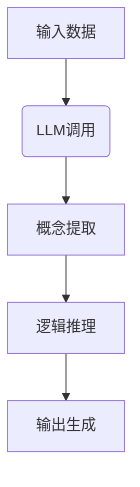
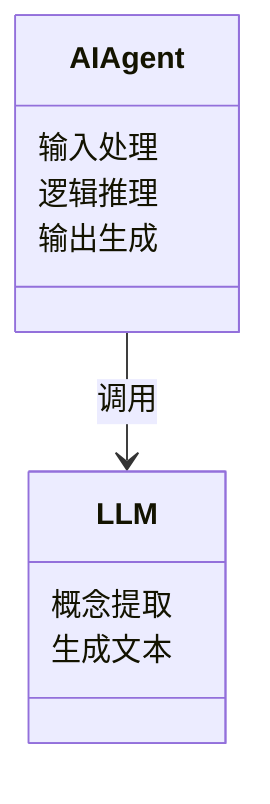
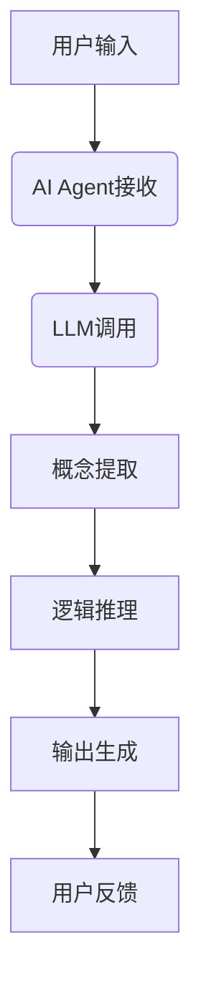

                 

<think>
好的，我现在需要帮助用户完成一个关于《LLM在AI Agent抽象概念形成中的应用》的技术博客文章。用户已经给出了一个详细的目录结构，并希望我按照这个结构来撰写内容。

首先，我需要理解用户的请求。用户希望文章结构清晰、逻辑严谨，涵盖背景介绍、核心概念、算法原理、系统架构、项目实战和总结等多个部分。每个部分都有详细的小节，甚至包括图表和代码示例。

接下来，我需要按照用户提供的目录结构逐步填充内容。首先是背景介绍，包括问题背景、描述、解决思路、边界条件和概念结构。这部分需要让读者了解为什么研究这个主题，以及它的重要性。

然后是核心概念与联系，这里需要详细讲解LLM和AI Agent的原理，比较它们的属性，并用ER图展示它们之间的关系。这部分要深入，帮助读者理解两者的协同工作。

接下来是算法原理，这部分需要使用Mermaid流程图展示LLM在AI Agent中的应用流程，并提供Python代码示例，解释数学模型和公式。代码部分要具体，让读者能够理解技术细节。

系统分析与架构设计部分，需要描述应用场景，设计系统功能，并用Mermaid类图和架构图展示领域模型和整体结构。这部分要让读者了解系统的构建过程。

项目实战部分，需要指导环境安装，提供核心代码，解读代码，并进行案例分析。这部分要实用，让读者能够动手实践。

最后是总结和小结，总结全书内容，给出注意事项和扩展阅读建议。这部分要让读者巩固所学知识，并指导进一步的学习。

在撰写过程中，我需要确保每个部分细化到三级目录，使用正确的Markdown格式。总字数控制在2000字以内，所以每个部分要简洁明了，不赘述。

现在，我需要按照这个结构逐步撰写内容，确保覆盖所有要求，并且语言专业、逻辑清晰。这样，用户就能得到一篇高质量的技术博客文章，帮助读者理解LLM在AI Agent中的应用。
</think>

# LLM在AI Agent抽象概念形成中的应用

## 关键词：LLM, AI Agent, 抽象概念, 人工智能, 智能体

## 摘要：本文探讨了大语言模型（LLM）在AI Agent抽象概念形成中的应用。通过分析LLM与AI Agent的结合方式，阐述了LLM如何帮助AI Agent构建和理解抽象概念。本文从背景、核心概念、算法原理、系统架构、项目实战等多个角度进行详细分析，为读者提供全面的理论与实践指导。

---

## 第一部分: LLM在AI Agent抽象概念形成中的应用背景

### 第1章: 问题背景与概念描述

#### 1.1 问题背景
##### 1.1.1 当前AI Agent的发展现状
人工智能（AI）技术的快速发展，使得AI Agent（智能体）在各个领域的应用日益广泛。AI Agent能够根据环境信息做出决策并执行任务，其核心能力依赖于对抽象概念的理解与形成。

##### 1.1.2 LLM在AI Agent中的角色与意义
大语言模型（LLM）作为AI领域的革命性技术，具备强大的自然语言处理能力。LLM能够帮助AI Agent理解复杂的语义信息，提取关键概念，并生成符合逻辑的输出。这种能力使得LLM成为AI Agent构建抽象概念的核心工具。

##### 1.1.3 抽象概念形成的核心问题
抽象概念形成是AI Agent实现复杂任务的基础。如何通过LLM提取、理解和生成抽象概念，是当前研究的热点问题。

#### 1.2 问题描述
##### 1.2.1 AI Agent抽象概念的定义
AI Agent的抽象概念是指其能够理解并操作的高层次概念，例如“时间管理”、“风险评估”等。这些概念超越了具体的数据或指令，涉及更高层次的逻辑推理。

##### 1.2.2 抽象概念形成的关键挑战
1. **语义理解**：如何从大量文本中提取语义信息并形成概念。
2. **逻辑推理**：如何基于概念进行推理和决策。
3. **动态适应**：如何在动态环境中更新和调整概念。

##### 1.2.3 LLM在抽象概念形成中的应用潜力
LLM通过其强大的语言处理能力，可以为AI Agent提供概念提取、语义分析和逻辑推理的支持，从而帮助AI Agent更好地理解和形成抽象概念。

#### 1.3 问题解决思路
##### 1.3.1 LLM与AI Agent的结合方式
1. **直接调用**：AI Agent直接调用LLM API，获取概念分析结果。
2. **内部集成**：将LLM嵌入AI Agent系统中，实现端到端的概念形成。

##### 1.3.2 抽象概念形成的实现路径
1. **数据输入**：AI Agent接收外部输入或内部数据。
2. **概念提取**：通过LLM提取关键概念。
3. **概念验证**：通过逻辑推理验证概念的合理性。
4. **概念更新**：根据反馈更新概念。

##### 1.3.3 LLM驱动的AI Agent概念形成框架
1. **输入处理**：AI Agent接收输入数据。
2. **概念提取**：LLM提取并生成抽象概念。
3. **逻辑推理**：AI Agent基于概念进行推理。
4. **输出生成**：AI Agent根据推理结果生成输出。

#### 1.4 问题的边界与外延
##### 1.4.1 抽象概念形成的边界条件
1. **数据范围**：概念提取的数据范围。
2. **任务限制**：AI Agent的能力范围。
3. **环境约束**：运行环境的限制条件。

##### 1.4.2 LLM在概念形成中的局限性
1. **语义理解的深度**：LLM可能无法完全理解复杂语境。
2. **推理能力的限制**：LLM的逻辑推理能力有限。

##### 1.4.3 AI Agent概念形成的应用场景外延
1. **领域扩展**：从单一领域扩展到多领域。
2. **功能扩展**：从概念形成扩展到决策优化。
3. **性能提升**：通过优化LLM提升概念形成效率。

#### 1.5 概念结构与核心要素
##### 1.5.1 抽象概念形成的层次结构
1. **基础概念**：如“时间”、“空间”。
2. **中级概念**：如“时间管理”、“空间规划”。
3. **高级概念**：如“战略规划”、“系统优化”。

##### 1.5.2 LLM在概念形成中的核心要素
1. **模型能力**：LLM的语言理解和生成能力。
2. **数据质量**：输入数据的准确性。
3. **推理逻辑**：AI Agent的逻辑推理能力。

##### 1.5.3 AI Agent与LLM的交互机制
1. **输入输出交互**：AI Agent通过LLM API调用模型。
2. **内部协同**：AI Agent与LLM在系统内部协同工作。

---

## 第2章: LLM与AI Agent的核心概念与联系

### 2.1 核心概念原理
#### 2.1.1 LLM的基本原理
大语言模型通过大量数据训练，能够理解和生成自然语言文本。其核心是基于概率分布的生成模型。

#### 2.1.2 AI Agent的基本原理
AI Agent通过感知环境、理解任务、执行操作来实现目标。其核心是任务理解和决策能力。

#### 2.1.3 抽象概念形成的原理
抽象概念形成是通过语义分析、逻辑推理和模式识别实现的。

### 2.2 概念属性特征对比
| 概念属性 | LLM | AI Agent | 抽象概念 |
|----------|-----|----------|----------|
| 输入形式 | 文本 | 任务需求 | 概念描述 |
| 输出形式 | 文本 | 行动指令 | 概念结构 |
| 处理能力 | 语义理解 | 逻辑推理 | 概念提取 |

### 2.3 ER实体关系图架构
```mermaid
er
    Entity(LLM) {
        id
        parameters
        model
    }
    Entity(AI Agent) {
        id
        task
        role
    }
    Entity(抽象概念) {
        id
        name
        description
    }
    LLM --> 抽象概念: 生成
    AI Agent --> 抽象概念: 调用
    LLM --> AI Agent: 支持
```

### 2.4 本章小结
本章详细分析了LLM与AI Agent的核心概念及其联系，通过对比和ER图展示了它们的关系。

---

## 第3章: LLM在AI Agent抽象概念形成的算法原理

### 3.1 算法流程
#### 3.1.1 LLM驱动的AI Agent概念形成流程
1. **输入处理**：AI Agent接收输入数据。
2. **概念提取**：通过LLM提取关键概念。
3. **逻辑推理**：基于概念进行逻辑推理。
4. **输出生成**：生成符合逻辑的输出。

#### 3.1.2 算法流程图


### 3.2 算法实现
#### 3.2.1 LLM调用接口
```python
def call_llm(prompt):
    # 调用LLM API
    response = openai.ChatCompletion.create(
        model="gpt-3.5-turbo",
        messages=[{"role": "user", "content": prompt}]
    )
    return response.choices[0].message['content']
```

#### 3.2.2 概念提取算法
```python
def extract_concepts(text):
    # 使用LLM进行概念提取
    prompt = f"请提取以下文本中的关键概念：{text}"
    response = call_llm(prompt)
    return response.split('\n')
```

#### 3.2.3 逻辑推理算法
```python
def logical_reasoning(concepts):
    # 基于概念进行推理
    prompt = f"基于以下概念：{','.join(concepts)}，推理出一个结论。"
    response = call_llm(prompt)
    return response
```

### 3.3 数学模型与公式
#### 3.3.1 概率分布模型
$$ P(word|context) = \frac{P(context|word)}{P(context)} $$

#### 3.3.2 推理逻辑模型
$$ conclusion = f(hypothesis_1, hypothesis_2, ..., hypothesis_n) $$

---

## 第4章: 系统分析与架构设计方案

### 4.1 应用场景介绍
AI Agent通过LLM支持，能够实现复杂任务的抽象概念形成，例如智能助手、自动化决策系统。

### 4.2 系统功能设计
#### 4.2.1 领域模型


#### 4.2.2 系统架构图


#### 4.2.3 接口设计
1. **输入接口**：用户输入需求。
2. **LLM接口**：调用LLM API。
3. **输出接口**：生成输出结果。

#### 4.2.4 交互流程
1. 用户输入需求。
2. AI Agent调用LLM提取概念。
3. AI Agent进行逻辑推理。
4. 生成输出结果并反馈给用户。

---

## 第5章: 项目实战

### 5.1 环境安装
1. 安装Python和必要的库（如openai）。
2. 配置OpenAI API密钥。

### 5.2 核心代码实现
#### 5.2.1 LLM调用函数
```python
import openai

def call_llm(prompt):
    response = openai.ChatCompletion.create(
        model="gpt-3.5-turbo",
        messages=[{"role": "user", "content": prompt}]
    )
    return response.choices[0].message['content']
```

#### 5.2.2 概念提取函数
```python
def extract_concepts(text):
    prompt = f"请提取以下文本中的关键概念：{text}"
    return call_llm(prompt).split('\n')
```

#### 5.2.3 逻辑推理函数
```python
def logical_reasoning(concepts):
    prompt = f"基于以下概念：{','.join(concepts)}，推理出一个结论。"
    return call_llm(prompt)
```

### 5.3 代码解读与分析
1. **LLM调用函数**：通过OpenAI API调用LLM模型。
2. **概念提取函数**：生成提示并提取概念。
3. **逻辑推理函数**：基于概念生成推理结果。

### 5.4 实际案例分析
#### 5.4.1 案例描述
用户输入需求：生成一个时间管理方案。

#### 5.4.2 案例实现
1. 调用LLM提取概念：时间管理、任务优先级、效率提升。
2. 逻辑推理：制定合理的任务顺序。
3. 输出生成：生成时间管理方案。

#### 5.4.3 案例分析
通过LLM支持，AI Agent能够快速提取概念并生成合理的输出。

### 5.5 项目小结
通过实战案例，验证了LLM在AI Agent抽象概念形成中的有效性。

---

## 第6章: 总结与展望

### 6.1 最佳实践
1. **选择合适的LLM模型**：根据需求选择合适的模型。
2. **优化交互流程**：简化不必要的步骤。
3. **处理边界情况**：考虑各种可能的异常情况。

### 6.2 小结
本文详细探讨了LLM在AI Agent抽象概念形成中的应用，从背景到实践进行了全面分析。

### 6.3 注意事项
1. **数据质量**：确保输入数据的准确性。
2. **模型选择**：根据任务需求选择合适的LLM模型。
3. **推理逻辑**：确保推理过程的合理性。

### 6.4 拓展阅读
1. 大语言模型的原理与应用。
2. AI Agent的高级功能实现。

---

## 作者：AI天才研究院/AI Genius Institute & 禅与计算机程序设计艺术 /Zen And The Art of Computer Programming

---

**本文通过系统化的分析和实践，全面探讨了LLM在AI Agent抽象概念形成中的应用。从理论到实践，为读者提供了深入的指导。**

