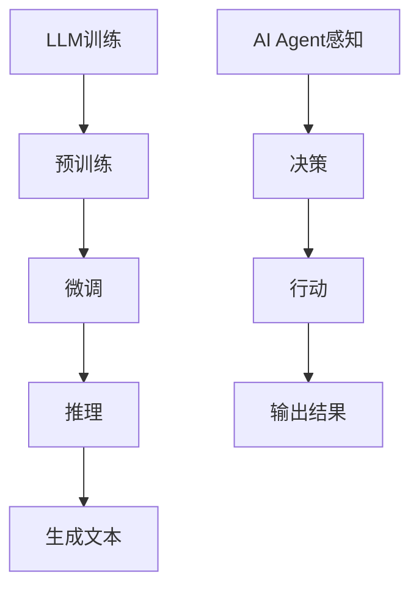
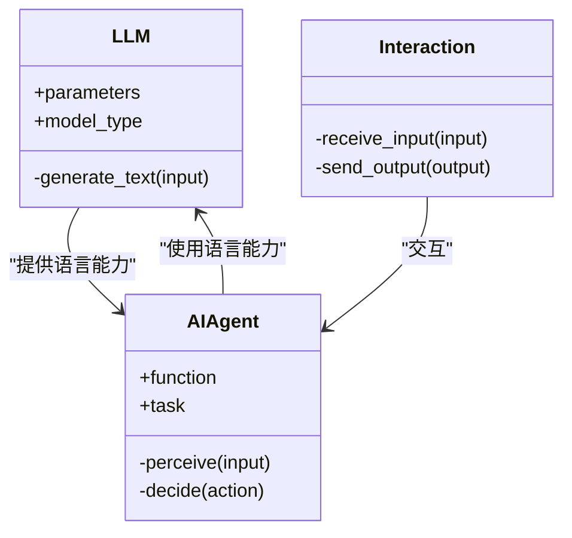
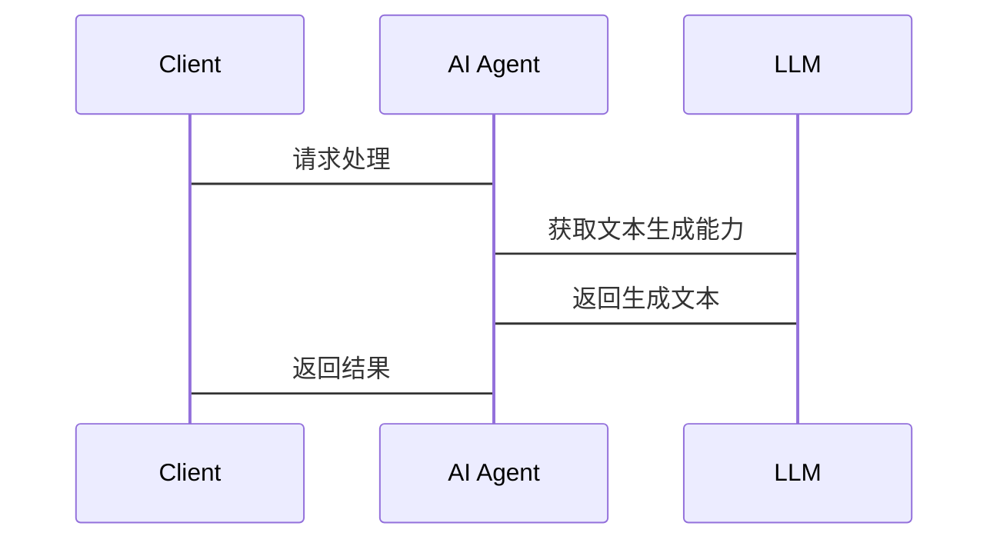

                 


# LLM在AI Agent概念形成与泛化中的作用

## 关键词
- 大语言模型
- AI Agent
- 概念形成
- 泛化能力
- 算法原理
- 系统架构

## 摘要
本文探讨了LLM在AI Agent概念形成与泛化中的关键作用，从背景介绍、核心概念对比、算法原理、系统架构设计到项目实战，全面分析了LLM如何提升AI Agent的能力和泛化能力。通过详细的技术分析和实例，展示了如何结合LLM与AI Agent构建高效的人工智能系统。

---

# 第1章: 背景介绍

## 1.1 问题背景
### 1.1.1 LLM的定义与特点
- **大语言模型（LLM）**：基于深度学习的自然语言处理模型，如GPT系列，具有强大的文本生成和理解能力。
- **特点**：
  - 大规模参数（如175B参数的GPT-3）。
  - 预训练-微调模式。
  - 基于Transformer架构。

### 1.1.2 AI Agent的概念与功能
- **AI Agent**：智能体，能够感知环境、执行任务、与用户交互。
- **功能**：
  - 感知：通过传感器或API获取信息。
  - 推理：基于信息做出决策。
  - 行动：执行任务或输出结果。

### 1.1.3 LLM与AI Agent结合的必要性
- LLM提供强大的语言理解和生成能力。
- AI Agent需要多任务处理能力，LLM可以作为其语言模块。

## 1.2 问题描述
### 1.2.1 LLM在AI Agent中的作用
- 提供语言理解与生成能力。
- 协助推理与决策。

### 1.2.2 LLM如何影响AI Agent的概念形成
- 通过LLM的泛化能力，AI Agent可以处理更多任务。
- LLM帮助AI Agent理解上下文。

### 1.2.3 LLM在AI Agent泛化中的应用
- 通过LLM，AI Agent可以处理多种语言和领域。
- 提高AI Agent的可扩展性。

## 1.3 问题解决
### 1.3.1 LLM如何帮助AI Agent理解上下文
- 通过上下文窗口和上下文理解机制。
- 示例：在对话中，AI Agent通过LLM理解上下文，生成合适的回复。

### 1.3.2 LLM如何增强AI Agent的推理能力
- 利用LLM的推理能力，AI Agent可以解决复杂问题。
- 示例：数学问题求解。

### 1.3.3 LLM如何提升AI Agent的泛化能力
- 通过迁移学习和微调，提升AI Agent在不同领域的适应能力。

## 1.4 边界与外延
### 1.4.1 LLM在AI Agent中的边界
- LLM擅长文本处理，不适合非语言任务。
- 示例：图像识别需要结合其他模型。

### 1.4.2 LLM在AI Agent中的外延
- LLM可以与其他技术结合，如计算机视觉。
- 示例：AI Agent结合LLM和图像识别，处理多模态任务。

### 1.4.3 LLM与AI Agent的其他技术的关系
- 与其他AI技术（如决策树、强化学习）协同工作。

## 1.5 概念结构与核心要素组成
### 1.5.1 LLM与AI Agent的关系
- LLM作为AI Agent的语言模块。
- AI Agent作为LLM的应用载体。

### 1.5.2 LLM在AI Agent中的核心要素
- LLM的训练数据、模型架构、推理机制。

### 1.5.3 LLM对AI Agent概念形成的影响
- 通过LLM的泛化能力，AI Agent可以形成更广泛的概念。

---

# 第2章: 核心概念与联系

## 2.1 LLM的核心原理
### 2.1.1 LLM的训练过程
- 预训练：使用大规模数据训练模型。
- 微调：针对特定任务调整模型。

### 2.1.2 LLM的推理机制
- 基于概率的生成式推理。
- 示例：给定上下文，生成下一步文本。

### 2.1.3 LLM的语言模型特点
- 多语言支持。
- 上下文理解能力。
- 可解释性有限。

## 2.2 AI Agent的核心原理
### 2.2.1 AI Agent的定义
- 智能体，能够感知环境、执行任务。

### 2.2.2 AI Agent的感知与行动
- 感知：接收输入数据。
- 行动：输出结果或执行操作。

### 2.2.3 AI Agent的决策机制
- 基于感知信息做出决策。
- 示例：聊天机器人根据用户输入生成回复。

## 2.3 LLM与AI Agent的关系
### 2.3.1 LLM作为AI Agent的核心模块
- LLM为AI Agent提供语言理解和生成能力。
- 示例：AI Agent通过LLM生成回复。

### 2.3.2 LLM如何增强AI Agent的能力
- 提供强大的自然语言处理能力。
- 示例：AI Agent利用LLM分析文本数据。

### 2.3.3 LLM与AI Agent的协同工作
- LLM帮助AI Agent处理语言任务。
- AI Agent为LLM提供应用场景。

## 2.4 核心概念对比与ER实体关系图
### 2.4.1 LLM与AI Agent的核心原理对比
- 对比表格：

| 特性         | LLM                     | AI Agent               |
|--------------|-------------------------|-------------------------|
| 主要功能     | 处理语言任务             | 感知环境、执行任务       |
| 决策机制     | 基于概率生成式推理       | 基于感知做出决策         |
| 适应性       | 高，通过微调             | 中，依赖具体任务设计     |

### 2.4.2 ER实体关系图
```mermaid
er
    entity(LLM) {
        id
        parameters
        model_type
    }
    entity(AI Agent) {
        id
        function
        task
    }
    relationship(r1) {
        LLM -> AI Agent: "提供语言能力"
        AI Agent -> LLM: "使用语言能力"
    }
```

---

# 第3章: 算法原理讲解

## 3.1 LLM的算法原理
### 3.1.1 LLM的训练过程
- 使用Transformer架构。
- 预训练任务：预测下一个词。

### 3.1.2 LLM的推理过程
- 基于概率生成文本。
- 示例：输入“今天天气很好”，LLM生成“适合外出”。

### 3.1.3 LLM的数学模型
- **自注意力机制**：
  $$ \text{Attention}(Q,K,V) = \text{softmax}(\frac{QK^T}{\sqrt{d_k}})V $$
- **前馈网络**：
  $$ f(x) = \text{ReLU}(Wx + b) $$

## 3.2 AI Agent的算法原理
### 3.2.1 AI Agent的感知过程
- 接收输入数据。
- 示例：用户输入查询。

### 3.2.2 AI Agent的决策过程
- 基于感知做出决策。
- 示例：根据查询内容选择合适的LLM模型。

### 3.2.3 AI Agent的行动过程
- 执行任务或输出结果。
- 示例：生成回复。

### 3.2.4 AI Agent的数学模型
- **决策树**：
  - 通过训练数据构建决策树。
- **强化学习**：
  - 基于奖励机制优化决策。

## 3.3 算法流程图


---

# 第4章: 系统分析与架构设计方案

## 4.1 项目介绍
### 4.1.1 项目目标
- 构建结合LLM和AI Agent的系统。
- 提供高效的智能服务。

## 4.2 系统功能设计
### 4.2.1 功能模块
- **LLM模块**：处理语言任务。
- **AI Agent模块**：感知环境、执行任务。
- **交互模块**：用户与系统交互。

### 4.2.2 功能流程


## 4.3 系统架构设计
### 4.3.1 架构图


### 4.3.2 接口设计
- **LLM接口**：提供文本生成API。
- **AI Agent接口**：提供感知和决策API。

## 4.4 系统交互设计
### 4.4.1 序列图


---

# 第5章: 项目实战

## 5.1 环境安装
### 5.1.1 安装Python
- 安装Anaconda或Miniconda。
- 安装Python 3.8+。

### 5.1.2 安装依赖
- 使用pip安装必要的库，如`transformers`和`llm`.

## 5.2 系统核心实现
### 5.2.1 LLM模块实现
```python
from transformers import GPT2LMHeadModel, GPT2Tokenizer

model_name = 'gpt2'
tokenizer = GPT2Tokenizer.from_pretrained(model_name)
model = GPT2LMHeadModel.from_pretrained(model_name)
```

### 5.2.2 AI Agent模块实现
```python
class AI_Agent:
    def __init__(self):
        self.llm = LLM()

    def perceive(self, input):
        # 处理输入，返回LLM需要的上下文
        return input

    def decide(self, context):
        # 根据上下文决定行动
        return self.llm.generate_text(context)
```

### 5.2.3 交互模块实现
```python
def main():
    agent = AI_Agent()
    while True:
        input = input("请输入：")
        if input == '退出':
            break
        context = agent.perceive(input)
        action = agent.decide(context)
        print(action)

if __name__ == "__main__":
    main()
```

## 5.3 代码应用解读与分析
### 5.3.1 LLM模块分析
- 使用预训练的GPT-2模型。
- 通过tokenizer和model进行文本生成。

### 5.3.2 AI Agent模块分析
- 组合LLM模块，提供感知和决策功能。
- 示例：用户输入“今天天气好”，AI Agent通过LLM生成回复。

## 5.4 实际案例分析
### 5.4.1 案例1：聊天机器人
- 用户输入：“你今天过得怎么样？”
- AI Agent通过LLM生成回复：“谢谢，我很好。”

### 5.4.2 案例2：任务处理
- 用户输入：“计算1+1”。
- AI Agent通过LLM生成“2”。

## 5.5 项目小结
- 成功实现了结合LLM和AI Agent的系统。
- 展示了LLM在AI Agent中的重要作用。

---

# 第6章: 总结与展望

## 6.1 总结
- LLM为AI Agent提供了强大的语言处理能力。
- 通过结合LLM，AI Agent能够处理更多任务，提升泛化能力。

## 6.2 展望
- 进一步研究多模态AI Agent。
- 探索LLM与AI Agent的更深层次结合。

---

# 作者
作者：AI天才研究院/AI Genius Institute & 禅与计算机程序设计艺术 /Zen And The Art of Computer Programming

