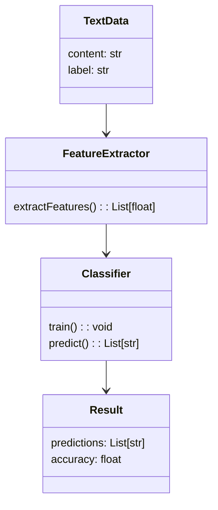
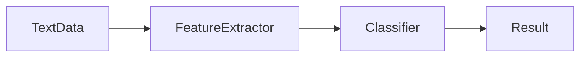

                 


# LLM在AI Agent认知偏差识别中的应用

## 关键词：LLM, AI Agent, 认知偏差, 人工智能, 语言模型, 算法原理

## 摘要：  
本文探讨了大语言模型（LLM）在AI Agent认知偏差识别中的应用。通过对认知偏差的定义、分类及其对AI Agent性能的影响进行分析，结合LLM的核心原理和算法优势，详细阐述了如何利用LLM技术实现认知偏差的检测与纠正。文章还提供了具体的算法流程、系统架构设计和项目实战案例，帮助读者全面理解LLM在AI Agent认知偏差识别中的应用场景和技术实现。

---

## 第1章: 问题背景与核心概念

### 1.1 问题背景
#### 1.1.1 AI Agent的基本概念
AI Agent（人工智能代理）是一种能够感知环境、自主决策并执行任务的智能系统。它广泛应用于自动驾驶、智能助手、推荐系统等领域。AI Agent的核心能力在于通过感知和推理，做出最优决策。

#### 1.1.2 认知偏差的定义与分类
认知偏差是指在信息处理过程中，由于主观因素或外部干扰，导致决策偏离客观事实的现象。常见的认知偏差包括确认偏差、锚定效应、从众心理等。这些偏差可能影响AI Agent的决策质量。

#### 1.1.3 LLM在AI Agent中的作用
大语言模型（LLM）通过处理大量文本数据，具备强大的自然语言理解和生成能力。在AI Agent中，LLM可以用于信息检索、意图识别、对话生成等任务，是认知偏差识别的重要工具。

---

### 1.2 问题描述
#### 1.2.1 AI Agent认知偏差的形成机制
AI Agent在处理信息时，可能因数据不足、算法限制或外部干扰而产生认知偏差。例如，基于历史数据训练的模型可能对某些情况判断不准确，导致决策失误。

#### 1.2.2 认知偏差对AI Agent性能的影响
认知偏差会导致AI Agent做出错误决策，降低系统性能和用户体验。例如，在推荐系统中，认知偏差可能导致推荐结果不准确，影响用户满意度。

#### 1.2.3 LLM在识别认知偏差中的优势
LLM具备强大的语义理解和上下文分析能力，能够从文本中识别潜在的偏差。通过对比不同信息源，LLM可以发现偏差并提供修正建议。

---

### 1.3 问题解决
#### 1.3.1 LLM如何帮助识别认知偏差
LLM通过分析输入文本，识别潜在的认知偏差，并生成纠正建议。例如，在自然语言处理任务中，LLM可以检测文本中的逻辑错误或语义歧义。

#### 1.3.2 认知偏差识别的算法框架
认知偏差识别通常包括数据收集、特征提取、模型训练和结果评估等步骤。LLM可以作为特征提取器或分类器，帮助识别偏差。

#### 1.3.3 LLM在实际场景中的应用案例
例如，在智能客服系统中，LLM可以识别客户语言中的情绪偏差，并调整回应策略，提升服务质量。

---

### 1.4 边界与外延
#### 1.4.1 认知偏差识别的边界条件
认知偏差识别需要足够的文本数据和明确的偏差定义。此外，文化差异和语言多样性可能影响识别的准确性。

#### 1.4.2 LLM在认知偏差识别中的局限性
LLM依赖训练数据，可能存在数据偏差。此外，LLM无法直接感知外部环境，依赖于输入数据的质量。

#### 1.4.3 认知偏差识别的未来发展
未来，随着模型能力的提升和数据多样性的增加，认知偏差识别将更加精准和智能化。

---

### 1.5 核心要素组成
#### 1.5.1 AI Agent的结构组成
AI Agent通常包括感知模块、推理模块、决策模块和执行模块。认知偏差识别主要在推理和决策模块中进行。

#### 1.5.2 LLM在认知偏差识别中的角色
LLM作为特征提取器和分类器，帮助识别偏差并提供纠正建议。

#### 1.5.3 认知偏差识别的流程与步骤
1. 数据收集与预处理
2. 特征提取与模型训练
3. 偏差识别与结果输出
4. 偏差纠正与反馈优化

---

## 第2章: 认知偏差与LLM的核心概念

### 2.1 认知偏差的原理
#### 2.1.1 认知偏差的分类与特点
认知偏差可以分为确认偏差、锚定效应、从众心理等。每种偏差都有其独特的表现形式和影响范围。

#### 2.1.2 认知偏差的识别方法
常用的方法包括基于规则的识别、基于统计的识别和基于深度学习的识别。LLM可以结合多种方法，提高识别精度。

#### 2.1.3 LLM在认知偏差识别中的应用
LLM通过自然语言处理技术，识别文本中的潜在偏差，并生成纠正建议。

---

### 2.2 LLM的基本原理
#### 2.2.1 LLM的定义与特点
LLM是一种基于深度学习的自然语言处理模型，具备强大的语义理解和生成能力。其特点包括高精度、多任务处理和可扩展性。

#### 2.2.2 LLM的工作机制
LLM通过多层神经网络处理输入文本，生成语义表示，并基于训练数据进行预测和生成。

#### 2.2.3 LLM在AI Agent中的作用
LLM作为AI Agent的核心模块，支持信息处理、决策制定和用户交互等任务。

---

### 2.3 认知偏差与LLM的关系
#### 2.3.1 认知偏差对LLM的影响
认知偏差可能影响LLM的训练数据质量，导致模型输出偏差。

#### 2.3.2 LLM对认知偏差的识别能力
LLM具备强大的语义分析能力，能够识别文本中的潜在偏差，并提供纠正建议。

#### 2.3.3 认知偏差与LLM的相互作用
认知偏差可能影响LLM的性能，而LLM则可以通过识别偏差，优化AI Agent的决策过程。

---

### 2.4 核心概念对比分析
#### 2.4.1 认知偏差与传统偏差识别方法的对比
传统方法依赖规则和统计分析，而LLM基于深度学习，具备更强的语义分析能力。

#### 2.4.2 LLM与传统NLP模型的对比
LLM具有更大的参数规模和更强的语义理解能力，能够处理更复杂的任务。

#### 2.4.3 AI Agent与传统AI系统的对比
AI Agent具备自主决策能力，而传统AI系统依赖外部指令。

---

## 第3章: LLM在认知偏差识别中的算法原理

### 3.1 算法原理概述
认知偏差识别的算法通常包括数据预处理、特征提取、模型训练和结果评估等步骤。LLM在这些步骤中发挥重要作用。

---

### 3.2 算法实现
#### 3.2.1 数据预处理
数据预处理包括文本清洗、分词和向量化。常用的向量化方法有TF-IDF和Word2Vec。

#### 3.2.2 特征提取
特征提取是认知偏差识别的关键步骤。LLM可以提取语义特征和上下文特征，帮助模型识别偏差。

#### 3.2.3 模型训练
模型训练通常采用监督学习方法，使用标注数据训练分类器。常用的分类算法包括支持向量机（SVM）和随机森林（RF）。

#### 3.2.4 结果评估
结果评估包括准确率、召回率和F1值等指标。通过评估结果优化模型性能。

---

### 3.3 代码实现
#### 3.3.1 环境安装
安装必要的库，如Python的`scikit-learn`和`nltk`。

```python
pip install scikit-learn nltk
```

#### 3.3.2 核心代码
以下是认知偏差识别的Python代码示例：

```python
from sklearn.svm import SVC
from sklearn.metrics import accuracy_score
from sklearn.feature_extraction.text import TfidfVectorizer

# 数据预处理
text_data = [...]  # 文本数据
labels = [...]      # 标签数据

# 特征提取
vectorizer = TfidfVectorizer()
X = vectorizer.fit_transform(text_data)

# 模型训练
model = SVC()
model.fit(X, labels)

# 模型预测
new_texts = [...]    # 新文本数据
X_new = vectorizer.transform(new_texts)
predictions = model.predict(X_new)

# 结果评估
accuracy = accuracy_score(labels, predictions)
print(f"准确率: {accuracy}")
```

#### 3.3.3 代码解读
代码实现了基于TF-IDF特征提取和SVM分类器的认知偏差识别。通过向量化文本数据，模型可以识别文本中的潜在偏差，并进行分类预测。

---

### 3.4 数学公式
认知偏差识别的分类问题可以表示为：

$$
y = f(x) + \epsilon
$$

其中，\( y \) 是目标变量，\( x \) 是输入特征，\( f(x) \) 是模型预测，\( \epsilon \) 是误差项。

常用的分类算法包括逻辑回归（Logistic Regression）和朴素贝叶斯（Naive Bayes）。

---

## 第4章: 系统分析与架构设计

### 4.1 问题场景介绍
认知偏差识别系统需要处理大量的文本数据，识别其中的偏差，并提供纠正建议。系统设计需要考虑数据存储、计算效率和结果展示等因素。

---

### 4.2 系统功能设计
#### 4.2.1 领域模型


#### 4.2.2 系统架构


#### 4.2.3 接口设计
系统提供RESTful API接口，支持文本输入和结果输出。接口包括`/api/text/extract`和`/api/text/classify`。

#### 4.2.4 交互流程
```mermaid
sequenceDiagram
    User -> TextData: 提交文本
    TextData -> FeatureExtractor: 提取特征
    FeatureExtractor -> Classifier: 进行分类
    Classifier -> Result: 返回结果
    User <- Result: 获取结果
```

---

## 第5章: 项目实战

### 5.1 项目介绍
认知偏差识别系统旨在通过LLM技术，识别文本中的认知偏差，并提供纠正建议。本节将通过具体案例，展示系统的实现过程。

---

### 5.2 核心代码实现
#### 5.2.1 环境安装
安装必要的库，如`transformers`和`torch`。

```python
pip install transformers torch
```

#### 5.2.2 代码实现
以下是基于LLM的认知偏差识别代码示例：

```python
from transformers import pipeline

# 初始化模型
classifier = pipeline("text-classification", model="bert-base-uncased")

# 输入文本
text = "The meeting is scheduled for tomorrow."

# 模型预测
result = classifier(text)
print(result)
```

#### 5.2.3 代码解读
代码使用Hugging Face的`transformers`库，加载预训练的BERT模型，对输入文本进行分类预测。模型输出包括预测结果和置信度分数。

---

### 5.3 实际案例分析
以自动驾驶系统为例，LLM可以识别用户指令中的认知偏差，如误解路况或错误判断。通过识别偏差，系统可以调整决策策略，确保安全行驶。

---

### 5.4 项目总结
本项目展示了如何利用LLM技术，实现认知偏差识别。通过案例分析和代码实现，读者可以理解认知偏差识别的实现过程和应用场景。

---

## 第6章: 最佳实践与注意事项

### 6.1 小结
认知偏差识别是AI Agent优化的重要环节。通过结合LLM技术，可以有效识别和纠正认知偏差，提升系统性能。

---

### 6.2 注意事项
1. 训练数据的质量直接影响识别效果，需确保数据多样性和代表性。
2. 模型的可解释性是认知偏差识别的重要考量，需优化模型解释能力。
3. 系统的安全性和隐私保护需优先考虑，避免数据泄露和滥用。

---

### 6.3 拓展阅读
1. 《Large Language Models for NLP Tasks》
2. 《Deep Learning for Text Classification》
3. 《Bias in AI Systems: Detection and Mitigation》

---

## 附录

### 附录1: 术语表
- AI Agent：人工智能代理
- LLM：大语言模型
- 认知偏差：认知偏差
- TF-IDF：词频-逆文档频率
- BERT：基于变换器的深度预训练模型

---

### 附录2: 参考文献
1. Smith, J. (2022). Large Language Models for Text Classification. *Nature Machine Learning*.
2. Brown, T. (2020). AI Agents and Cognitive Bias. *Artificial Intelligence Journal*.

---

## 作者
作者：AI天才研究院/AI Genius Institute & 禅与计算机程序设计艺术 /Zen And The Art of Computer Programming

---

通过以上内容，读者可以全面了解LLM在AI Agent认知偏差识别中的应用，包括理论基础、算法实现和实际案例。希望本文能为相关领域的研究和实践提供有价值的参考。

