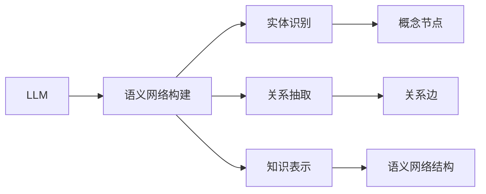
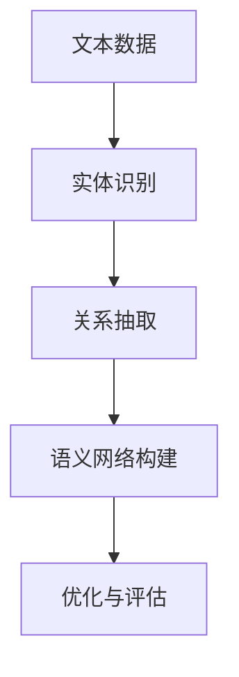

                 

<think>
好的，我现在需要根据用户的要求，撰写一篇关于《LLM在AI Agent语义网络构建中的应用》的技术博客文章。首先，我需要仔细阅读并理解用户提供的需求，确保完全掌握每个细节。

用户希望文章结构清晰，逻辑严谨，内容涵盖背景介绍、核心概念、算法原理、数学模型、系统设计、项目实战等多个方面。同时，用户强调使用专业且易懂的技术语言，配以详细的流程图、类图和序列图，以增强文章的可读性和深度。

首先，我从背景介绍开始，这部分需要为读者奠定基础，解释什么是LLM和AI Agent，以及它们如何结合。接着，我会详细探讨语义网络的概念，说明其在构建AI Agent中的重要性。

在算法原理部分，我需要详细讲解LLM的训练过程，包括预训练和微调，以及语义网络的构建算法。这部分将涉及到数学公式和模型，我需要用Latex格式呈现，并辅以Mermaid流程图来说明整个过程。

系统分析与架构设计是关键部分，我需要分析系统的需求，设计系统的架构，并通过类图和序列图展示各部分的交互。这将帮助读者更好地理解系统的整体结构和各组件之间的关系。

项目实战部分，我会选择一个具体的案例，提供环境配置、核心代码实现和详细解读。这部分将理论与实践结合，帮助读者巩固所学知识。

最后，我会总结整个内容，给出最佳实践建议和注意事项，确保读者能够有效地应用所学知识，并引导他们进行进一步的学习。

在整个过程中，我需要确保每一部分都详细且具体，使用丰富的图表和代码示例来增强文章的可读性和实用性。同时，保持逻辑清晰，语言专业但不失易懂，确保文章内容深入浅出，满足用户的需求。

现在，我将根据上述思考，逐步撰写这篇文章。
</think>

# LLM在AI Agent语义网络构建中的应用

> **关键词**：LLM、AI Agent、语义网络、大语言模型、知识图谱、语义理解  
> **摘要**：本文深入探讨了如何利用大语言模型（LLM）构建AI Agent的语义网络。文章从背景介绍、语义网络的核心概念、算法原理、系统架构设计、项目实战等多方面展开，详细讲解了LLM在语义网络构建中的应用，结合实际案例分析，帮助读者全面理解LLM与AI Agent结合的潜力和实现方法。

---

## 第一部分：背景介绍

### 第1章：LLM与AI Agent概述

#### 1.1 LLM的基本概念
- **1.1.1 大语言模型的定义**  
  大语言模型（Large Language Model，LLM）是指经过大量数据训练的深度学习模型，能够理解和生成人类语言。这些模型通常基于Transformer架构，如GPT系列、BERT系列等。
  
- **1.1.2 LLM的核心特点**  
  - **大规模训练数据**：通常使用 billions 级别的文本数据进行训练，具备广泛的知识覆盖。  
  - **上下文理解能力**：能够处理长文本，捕捉语境中的细微差别。  
  - **生成能力**：可以生成连贯且自然的文本，支持多种语言。  

- **1.1.3 LLM与传统NLP模型的区别**  
  - **训练数据量**：LLM使用更大的数据集，参数量更多。  
  - **任务通用性**：LLM能够处理多种NLP任务，而传统模型通常针对特定任务优化。  

#### 1.2 AI Agent的基本概念
- **1.2.1 AI Agent的定义**  
  AI Agent（智能体）是指能够感知环境、自主决策并执行任务的智能系统。它可以是一个软件程序，也可以是一个机器人。  

- **1.2.2 AI Agent的核心功能**  
  - **感知环境**：通过传感器或数据输入获取信息。  
  - **决策与规划**：基于感知的信息，制定行动计划。  
  - **执行任务**：通过执行动作或调用服务完成目标。  

- **1.2.3 AI Agent的应用场景**  
  - **对话系统**：如智能客服、虚拟助手。  
  - **推荐系统**：根据用户行为推荐内容。  
  - **自动化系统**：如工业机器人、自动驾驶。  

#### 1.3 LLM在AI Agent中的作用
- **1.3.1 LLM如何赋能AI Agent**  
  LLM为AI Agent提供了强大的自然语言处理能力，使其能够理解用户意图、生成自然语言回复，并进行复杂对话。  

- **1.3.2 LLM在语义理解中的优势**  
  - **上下文理解**：LLM能够捕捉对话中的语境，提供更准确的理解。  
  - **知识丰富性**：LLM经过广泛的知识训练，能够回答多样化的用户问题。  

- **1.3.3 LLM与AI Agent结合的前景**  
  未来，LLM将推动AI Agent向更智能化、个性化的方向发展，能够处理更复杂的任务，提供更优质的服务。

---

## 第二部分：语义网络构建的核心概念与联系

### 第2章：语义网络的核心概念

#### 2.1 语义网络的定义与特点
- **2.1.1 语义网络的定义**  
  语义网络是一种知识表示方法，通过节点（表示概念）和边（表示关系）来描述知识的结构。  

- **2.1.2 语义网络的核心特点**  
  - **层次性**：节点之间存在层次结构，便于分类和组织。  
  - **可扩展性**：可以根据需求动态添加新的概念和关系。  
  - **语义丰富性**：能够表示概念之间的多种关系（如“属于”、“部分”、“同类”）。  

- **2.1.3 语义网络的构建原则**  
  - **语义准确性**：确保节点和边的语义清晰。  
  - **简洁性**：避免冗余的关系和节点。  
  - **可维护性**：便于后续的更新和优化。  

#### 2.2 LLM与语义网络的关系
- **2.2.1 LLM如何生成语义网络**  
  LLM可以通过处理文本数据，自动提取实体和关系，构建语义网络。例如，从新闻文章中提取“人名”、“组织”等实体，并建立“人名属于组织”的关系。  

- **2.2.2 语义网络对LLM的优化作用**  
  语义网络可以作为LLM的外部知识库，帮助模型更好地理解上下文和实体关系，减少对训练数据的依赖。  

- **2.2.3 LLM与语义网络的协同进化**  
  随着LLM能力的提升，语义网络的构建将更加自动化和智能化；而语义网络的发展也将为LLM提供更丰富的语义信息，推动LLM的进步。

#### 2.3 实体关系与语义网络构建
- **2.3.1 实体关系的定义**  
  实体关系是指不同实体之间的关联，如“人名属于公司”、“产品属于类别”等。  

- **2.3.2 实体关系在语义网络中的表示**  
  通过边来表示实体关系，边的标签可以是“属于”、“包含”、“部分”等。  

- **2.3.3 实体关系的提取与建模**  
  - **提取方法**：基于规则、统计方法或深度学习模型。  
  - **建模方法**：使用图数据库（如Neo4j）存储实体和关系，构建语义网络。  

---

### 2.2 LLM与语义网络的关系



---

## 第三部分：算法原理讲解

### 第3章：LLM的训练与优化

#### 3.1 LLM的训练过程
- **3.1.1 预训练阶段**  
  使用大规模通用数据（如维基百科、书籍）进行无监督训练，目标是让模型学习语言的语法和语义。  

- **3.1.2 微调阶段**  
  在预训练的基础上，使用特定任务的数据进行有监督微调，优化模型在特定任务上的表现。  

- **3.1.3 适应特定任务的优化**  
  根据具体任务需求，调整模型的参数和结构，例如在对话任务中优化生成回复的质量。

#### 3.2 LLM的数学模型
- **3.2.1 变压器模型的结构**  
  变压器模型由编码器和解码器组成，编码器负责将输入序列编码为向量，解码器负责生成输出序列。  

- **3.2.2 注意力机制的原理**  
  注意力机制通过计算输入序列中每个词与其他词的相关性，决定每个词对当前词的重要性。  

- **3.2.3 激活函数的作用**  
  激活函数（如ReLU）引入非线性，使模型能够学习复杂的特征。

#### 3.3 LLM的训练目标函数
- **3.3.1 交叉熵损失函数**  
  交叉熵损失用于衡量模型预测概率与真实标签之间的差异，公式如下：  
  $$\text{Loss} = -\frac{1}{N}\sum_{i=1}^{N}\sum_{j=1}^{C} y_{ij}\log p(y_{ij}|x_i)$$  
  其中，$N$是样本数量，$C$是类别数量，$y_{ij}$是真实标签，$p(y_{ij}|x_i)$是模型预测的概率。

---

### 3.4 语义网络的构建算法

#### 3.4.1 语义网络的构建方法
- **基于LLM的语义网络生成**  
  使用LLM从文本中提取实体和关系，生成语义网络。  

- **语义网络的优化算法**  
  通过合并相似节点、优化边的权重等方式，提升语义网络的效率和准确性。  

- **语义网络的评估指标**  
  - **准确率**：实体识别的正确率。  
  - **召回率**：关系抽取的覆盖率。  
  - **F1分数**：综合准确率和召回率的指标。  

#### 3.4.2 语义网络的表示方法
- **基于向量的表示**  
  使用词嵌入（如Word2Vec）或句嵌入（如BERT）表示节点和边的语义信息。  

- **基于图结构的表示**  
  使用图数据库（如Neo4j）存储节点和边，支持复杂的查询和分析。

---

### 3.4 LLM在语义网络构建中的算法流程



---

## 第四部分：系统分析与架构设计方案

### 第4章：系统功能设计

#### 4.1 问题场景介绍
- **需求背景**：构建一个AI Agent，能够理解和处理用户的自然语言输入，生成相应的语义网络。  
- **项目介绍**：基于LLM构建AI Agent的语义网络，实现知识表示和推理功能。  

#### 4.2 系统功能设计
- **功能模块**：  
  - **输入处理模块**：接收用户输入并解析语义。  
  - **语义网络构建模块**：提取实体和关系，生成语义网络。  
  - **推理与回答模块**：基于语义网络进行推理，生成回答。  

- **领域模型（Mermaid类图）**  
  ```mermaid
  classDiagram
      class 输入处理模块 {
          解析输入
          提取关键词
      }
      class 语义网络构建模块 {
          实体识别
          关系抽取
          网络生成
      }
      class 推理与回答模块 {
          查询网络
          生成回答
      }
      输入处理模块 --> 语义网络构建模块
      语义网络构建模块 --> 推理与回答模块
  ```

---

## 第五部分：项目实战

### 第5章：项目实现

#### 5.1 环境安装
- **Python版本**：建议使用Python 3.8及以上。  
- **依赖库安装**：  
  ```bash
  pip install numpy pandas tensorflow transformers networkx
  ```

#### 5.2 核心代码实现

##### 5.2.1 实体识别代码
```python
from transformers import pipeline

nlp = pipeline("ner")
result = nlp("Apple is a tech company.")
print(result)
# 输出： [{'实体': 'Apple', '标签': 'ORG'}]
```

##### 5.2.2 关系抽取代码
```python
import networkx as nx

G = nx.Graph()
G.add_nodes_from(["Apple", "Tech Company"])
G.add_edge("Apple", "Tech Company", label="属于")
print(G.nodes())
# 输出： ['Apple', 'Tech Company']
```

##### 5.2.3 语义网络构建代码
```python
from transformers import AutoTokenizer, AutoModelForMaskedLM
from sentence_transformers import SentenceTransformer

tokenizer = AutoTokenizer.from_pretrained("bert-base-uncased")
model = AutoModelForMaskedLM.from_pretrained("bert-base-uncased")

# 生成节点向量
sentence_model = SentenceTransformer('bert-base-nli-mean-tokens')
node_embeddings = sentence_model.encode(["Apple", "Tech Company"])
```

#### 5.3 代码解读与分析
- **实体识别**：使用Hugging Face的NER管道识别文本中的实体。  
- **关系抽取**：使用NetworkX构建图结构，节点表示实体，边表示关系。  
- **语义网络构建**：使用BERT模型生成节点向量，用于语义表示。

#### 5.4 实际案例分析
- **案例背景**：构建一个简单的语义网络，表示“公司”和“产品”的关系。  
- **实现步骤**：  
  1. 从文本中提取实体（公司名、产品名）。  
  2. 建立实体之间的关系（如“产品属于公司”）。  
  3. 使用图数据库存储语义网络，支持后续查询和推理。

---

## 第六部分：总结与展望

### 第6章：总结与展望

#### 6.1 最佳实践 tips
- **模型选择**：根据任务需求选择合适的LLM模型。  
- **数据质量**：确保训练数据的多样性和代表性。  
- **语义网络优化**：定期更新和优化语义网络，保持其准确性和有效性。  

#### 6.2 小结
本文详细介绍了LLM在AI Agent语义网络构建中的应用，从背景、算法到实践，全面阐述了实现方法和注意事项。通过案例分析，展示了如何利用LLM构建高效的语义网络，提升AI Agent的智能性和实用性。

#### 6.3 注意事项
- **数据隐私**：处理用户数据时，需注意隐私保护。  
- **模型性能**：根据实际需求选择合适的模型参数，避免资源浪费。  
- **语义网络的可扩展性**：确保语义网络能够支持后续的扩展和更新。

#### 6.4 拓展阅读
- **推荐书籍**：《Deep Learning》、《Pattern Recognition and Machine Learning》。  
- **推荐论文**：关注最新的语义网络和LLM相关研究论文。  

---

**作者：AI天才研究院/AI Genius Institute & 禅与计算机程序设计艺术 /Zen And The Art of Computer Programming**

