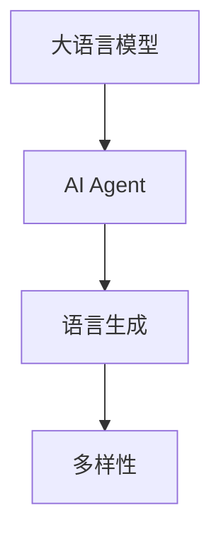
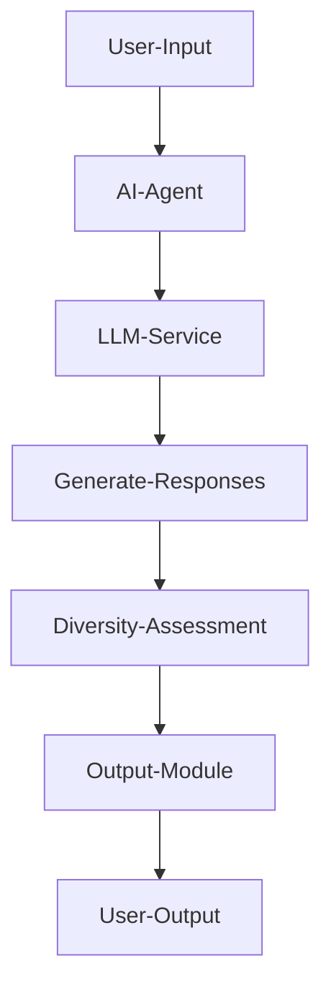
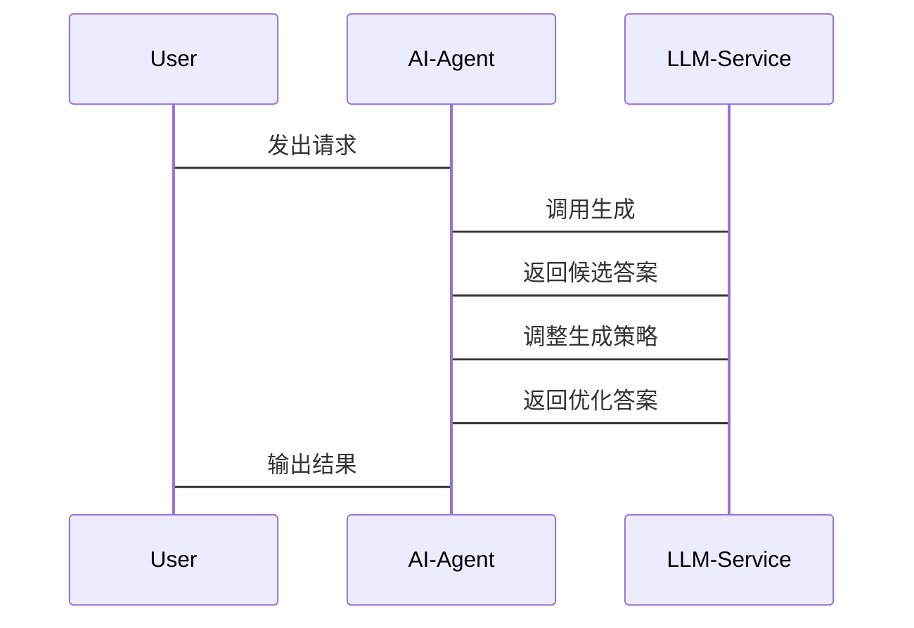

                 


# LLM在AI Agent语言生成多样性上的优化

## 关键词：LLM, AI Agent, 多样性优化, 语言生成, 大语言模型

## 摘要：本文深入探讨了大语言模型（LLM）在AI Agent语言生成多样性上的优化方法。通过分析LLM与AI Agent的关系，结合算法原理和系统架构设计，提出了优化语言生成多样性的策略，并通过实际案例验证了其有效性。文章从背景介绍、核心概念、算法原理、系统设计、实战应用到总结展望，全面阐述了如何利用LLM提升AI Agent的语言生成多样性，为相关领域的研究和实践提供了理论和实践参考。

---

# 第一部分：背景介绍

## 第1章：AI Agent与大语言模型概述

### 1.1 AI Agent的基本概念
#### 1.1.1 AI Agent的定义与特点
- AI Agent（人工智能代理）是指能够感知环境并采取行动以实现目标的智能实体。
- 特点：自主性、反应性、目标导向性、社交能力。

#### 1.1.2 大语言模型（LLM）的定义与特点
- LLM（Large Language Model）是基于深度学习的自然语言处理模型，具有大规模参数和广泛的知识库。
- 特点：上下文理解能力强、生成能力强、可泛化性高。

#### 1.1.3 AI Agent与大语言模型的关系
- LLM为AI Agent提供强大的语言理解和生成能力。
- AI Agent为LLM提供应用场景和决策能力。

---

### 1.2 语言生成多样性的重要性
#### 1.2.1 多样性在语言生成中的作用
- 避免生成重复内容。
- 提供多样化表达，增强用户体验。
- 适应不同语境和用户需求。

#### 1.2.2 多样性对AI Agent性能的影响
- 提高决策的灵活性。
- 增强与用户的交互能力。
- 提升任务执行的效率。

#### 1.2.3 当前语言生成多样性的挑战
- 模型的生成多样性受限。
- 计算资源消耗大。
- 多样性与准确性之间的平衡问题。

---

### 1.3 问题背景与目标
#### 1.3.1 当前语言生成技术的局限性
- 基于规则的生成方法灵活性差。
- 基于模板的生成方法多样性不足。
- 基于概率的生成方法难以控制多样性。

#### 1.3.2 问题描述
- 如何利用LLM提升AI Agent的语言生成多样性？
- 如何在生成过程中平衡多样性和准确性？

#### 1.3.3 优化目标与核心要素
- 优化目标：提升生成内容的多样性。
- 核心要素：生成策略、模型调优、多样性评估。

---

## 第2章：LLM在AI Agent语言生成中的应用背景

### 2.1 语言生成多样性的背景与问题描述
#### 2.1.1 当前语言生成技术的局限性
- 基于传统NLP模型的生成多样性有限。
- 基于LLM的生成多样性受模型训练目标的影响。

#### 2.1.2 多样性优化的必要性
- 提高用户体验。
- 提升AI Agent的智能水平。
- 适应多样化应用场景。

#### 2.1.3 问题边界与外延
- 确定生成多样性优化的范围。
- 明确优化目标的具体指标。

---

### 2.2 LLM在AI Agent中的核心作用
#### 2.2.1 LLM在语言生成中的优势
- 强大的上下文理解和生成能力。
- 模型的可微调性和适应性。

#### 2.2.2 LLM与AI Agent的结合方式
- 通过API调用LLM进行生成。
- 将LLM嵌入AI Agent的决策流程中。

#### 2.2.3 优化目标与核心要素
- 生成多样性：通过调整模型参数和生成策略提升多样性。
- 生成质量：在提升多样性的同时保持生成内容的准确性。

---

## 第3章：LLM与AI Agent的核心概念与联系

### 3.1 核心概念原理
#### 3.1.1 LLM的训练机制
- 预训练：基于大量文本数据的无监督学习。
- 微调：基于特定任务数据的有监督学习。

#### 3.1.2 AI Agent的决策机制
- 感知环境。
- 分析任务需求。
- 调用LLM进行生成。

#### 3.1.3 语言生成多样性的实现原理
- 通过生成多个候选答案。
- 通过调整生成策略控制多样性。

---

### 3.2 核心概念属性特征对比
#### 3.2.1 LLM与传统NLP模型的对比
| 特性         | LLM                     | 传统NLP模型                 |
|--------------|-------------------------|-----------------------------|
| 参数量       | 大规模（百万级以上）    | 小规模（十万级以下）         |
| 训练数据     | 巨大（数千亿 tokens）    | 较小（百万级 tokens）         |
| 适应性       | 强大                    | 较弱                        |

#### 3.2.2 AI Agent与传统自动机的对比
| 特性         | AI Agent                | 传统自动机                  |
|--------------|-------------------------|-----------------------------|
| 智能性       | 高                     | 低                        |
| 交互能力     | 强                     | 弱                        |
| 适应性       | 强                    | 较弱                      |

#### 3.2.3 语言生成多样性与单一样本生成的对比
- 单一样本生成：生成一个最优答案。
- 多样性生成：生成多个优质且多样的答案。

---

### 3.3 ER实体关系图架构


---

## 第4章：LLM优化AI Agent语言生成多样性的算法原理

### 4.1 算法原理概述
#### 4.1.1 基于LLM的生成策略
- 基于贪心算法的生成。
- 基于蒙特卡洛树搜索的生成。
- 基于随机采样的生成。

#### 4.1.2 多样性优化的算法框架
- 输入：任务需求。
- 输出：多个多样化的生成结果。

#### 4.1.3 基于强化学习的多样性优化
- 状态空间：生成的候选答案。
- 行动：选择不同的生成策略。
- 奖励函数：多样性评分。

---

### 4.2 算法流程图
```mermaid
graph TD
    Start --> Input-Task
    Input-Task --> Call-LLM
    Call-LLM --> Generate-Response
    Generate-Response --> Check-Diversity
    Check-Diversity --> Yes ? --> Output-Response
    Check-Diversity --> No --> Adjust-Strategy
    Adjust-Strategy --> Generate-New-Response
    Generate-New-Response --> Output-Response
    Output-Response --> End
```

---

### 4.3 算法实现与代码示例
#### 4.3.1 生成策略实现
```python
def generate_response(prompt, model):
    response = model.generate(
        prompt=prompt,
        max_length=50,
        do_sample=True,
        top_p=0.9
    )
    return response
```

#### 4.3.2 多样性评估
```python
def diversity_score(responses):
    # 计算困惑度
    score = calculate_perplexity(responses)
    return score
```

---

## 第5章：系统分析与架构设计

### 5.1 系统功能设计
#### 5.1.1 系统功能模块
- 输入模块：接收用户需求。
- 处理模块：调用LLM进行生成。
- 输出模块：输出多样化生成结果。

#### 5.1.2 系统功能流程
- 用户输入需求。
- 系统调用LLM生成多个候选答案。
- 系统评估候选答案的多样性。
- 输出最优结果。

---

### 5.2 系统架构设计
#### 5.2.1 系统架构图


#### 5.2.2 接口设计
- 输入接口：接收用户需求。
- 输出接口：输出生成结果。
- 调用接口：调用LLM服务。

---

### 5.3 交互流程图


---

## 第6章：项目实战

### 6.1 环境安装
```bash
pip install transformers torch
```

---

### 6.2 核心代码实现
#### 6.2.1 系统实现代码
```python
import torch
from transformers import AutoModelForCausalLM, AutoTokenizer

class AI-Agent:
    def __init__(self, model_name):
        self.model = AutoModelForCausalLM.from_pretrained(model_name)
        self.tokenizer = AutoTokenizer.from_pretrained(model_name)
    
    def generate(self, prompt, max_length=50, do_sample=True, top_p=0.9):
        inputs = self.tokenizer.encode(prompt, return_tensors="pt")
        outputs = self.model.generate(
            inputs=inputs,
            max_length=max_length,
            do_sample=do_sample,
            top_p=top_p
        )
        return self.tokenizer.decode(outputs[0], skip_special_tokens=True)
```

#### 6.2.2 多样性评估代码
```python
def calculate_diversity(responses):
    unique_tokens = set()
    for response in responses:
        tokens = response.split()
        unique_tokens.update(tokens)
    return len(unique_tokens) / len(responses[0].split())
```

---

### 6.3 实际案例分析
#### 6.3.1 案例描述
- 用户输入：生成关于“气候变化”的多个段落。

#### 6.3.2 代码实现
```python
agent = AI-Agent("gpt2")
prompt = "气候变化"
responses = agent.generate(prompt, max_length=100, do_sample=True, top_p=0.9, num_return_sequences=3)
print(responses)
```

---

## 第7章：总结与展望

### 7.1 总结
- LLM为AI Agent的语言生成多样性提供了强大的技术支撑。
- 通过优化生成策略和评估方法，可以有效提升生成多样性。

### 7.2 展望
- 更多应用场景的探索。
- 更高效生成多样性的算法研究。
- 更好的多样性与准确性的平衡。

---

## 第8章：最佳实践与注意事项

### 8.1 最佳实践
- 合理选择生成策略。
- 定期评估生成结果的多样性。
- 优化模型参数以提升生成质量。

### 8.2 注意事项
- 避免生成不相关内容。
- 注意计算资源的消耗。
- 保护用户隐私和数据安全。

---

## 作者：AI天才研究院/AI Genius Institute & 禅与计算机程序设计艺术 /Zen And The Art of Computer Programming

---

通过以上目录结构和内容安排，文章将系统地阐述LLM在AI Agent语言生成多样性上的优化方法，从理论到实践，为读者提供全面的指导。

