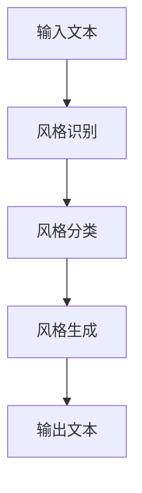

                 

<think>
嗯，我现在要写一篇关于“LLM在AI Agent语言风格适应中的应用”的技术博客。首先，我需要明确什么是LLM，也就是大语言模型，它和AI Agent之间有什么关系呢？AI Agent是人工智能代理，能够自主执行任务，而LLM可以帮助它理解和生成自然语言。接下来，我得考虑如何将LLM应用到AI Agent中，让它能够适应不同的语言风格，比如正式、口语化或者技术性语言。这可能涉及到风格识别和生成，我得详细讲解这些过程，包括模型如何训练、算法如何工作，以及实际应用中的案例。我还需要确保文章结构清晰，逻辑连贯，涵盖基础、原理、设计、实战和未来展望等方面。最后，别忘了加上一些数学公式和图表，让内容更专业。
</think>

# LLM在AI Agent语言风格适应中的应用

> 关键词：大语言模型, AI Agent, 语言风格适应, 人机交互, 自然语言处理

> 摘要：本文探讨了如何利用大语言模型（LLM）来增强AI Agent的语言风格适应能力，分析了LLM在AI Agent中的应用原理，详细讲解了语言风格识别与生成的技术细节，并通过实际案例展示了如何在项目中实现这一目标。

---

# 第一部分: LLM与AI Agent概述

## 第1章: LLM与AI Agent概述

### 1.1 LLM的定义与特点

LLM（Large Language Model）是指基于Transformer架构的大规模预训练语言模型，具有以下特点：

- **大规模训练数据**：通常使用海量文本数据进行预训练，如互联网上的网页内容、书籍、文章等。
- **自注意力机制**：通过自注意力机制捕捉文本中的长距离依赖关系，能够理解上下文。
- **生成能力强**：支持多种任务，如文本生成、问答、翻译等。

### 1.2 AI Agent的定义与应用场景

AI Agent（人工智能代理）是一种智能系统，能够感知环境并自主执行任务，常见应用包括：

- **智能助手**：如 Siri、Alexa，提供信息查询、日程管理等服务。
- **聊天机器人**：如客服机器人，提供客户支持服务。
- **内容生成工具**：如写作助手，帮助生成文章或报告。

### 1.3 LLM在AI Agent中的作用

LLM通过其强大的语言理解和生成能力，能够显著增强AI Agent的语言交互能力，主要体现在以下几个方面：

- **语言理解**：帮助AI Agent准确理解用户输入的自然语言指令。
- **语言生成**：生成符合上下文和用户需求的自然语言回复。
- **风格适应**：根据用户或场景需求，调整语言风格，如正式、非正式、技术性等。

---

## 第2章: LLM的原理与技术实现

### 2.1 LLM的模型架构

Transformer模型是当前主流的LLM架构，由编码器和解码器两部分组成：

- **编码器**：将输入的文本序列转换为隐藏层表示。
- **解码器**：根据编码器的输出生成目标文本序列。

自注意力机制是Transformer的核心，公式表示如下：

$$
\text{Attention}(Q, K, V) = \text{softmax}\left(\frac{QK^T}{\sqrt{d_k}}\right)V
$$

其中，$Q$、$K$、$V$分别为查询、键、值向量，$d_k$是向量的维度。

### 2.2 LLM的训练与优化

LLM的训练过程通常包括预训练和微调两个阶段：

- **预训练**：使用大规模通用数据进行无监督学习，目标是最小化预测目标词的概率损失。
- **微调**：在特定任务上进行有监督微调，优化模型在特定领域的表现。

损失函数通常采用交叉熵损失：

$$
\mathcal{L} = -\sum_{i=1}^{n}\sum_{j=1}^{m} y_{ij}\log p(y_{ij}|x_i)
$$

其中，$y_{ij}$是标签，$p(y_{ij}|x_i)$是模型预测的概率。

### 2.3 LLM的文本生成机制

生成式模型通常采用解码器中的自回归策略，逐步生成每个词：

1. 输入初始序列，生成第一个词。
2. 将生成的第一个词拼接到初始序列，生成第二个词。
3. 重复上述过程，直到生成完整的文本序列。

解码策略包括贪心搜索和随机采样，公式表示如下：

- **贪心搜索**：每次选择概率最高的词。
- **随机采样**：根据概率分布随机选择词。

---

## 第3章: AI Agent的语言风格适应需求

### 3.1 语言风格的基本分类

语言风格可以分为以下几类：

- **正式风格**：适用于商业信函、学术论文等正式场合。
- **非正式风格**：适用于日常对话、社交媒体等非正式场合。
- **技术性语言**：适用于技术文档、编程指南等专业领域。
- **通俗性语言**：适用于面向普通用户的说明、教程等。

### 3.2 AI Agent语言风格适应的目标

- 提高用户体验，使交互更加自然流畅。
- 适应不同用户群体的语言偏好。
- 在不同场景下灵活调整语言风格。

### 3.3 语言风格适应的技术挑战

- **风格识别的准确性**：需要准确识别用户或场景的语言风格。
- **风格生成的多样性与一致性**：生成多种风格的同时保持一致性。
- **多语言支持**：支持多种语言风格的适应。

---

## 第4章: LLM在语言风格适应中的应用原理

### 4.1 LLM的语言风格理解能力

- **风格特征提取**：通过词频、句式复杂度等特征提取风格信息。
- **风格分类**：使用分类模型（如SVM、随机森林）进行风格分类。

### 4.2 LLM的语言风格生成能力

- **风格迁移**：将一种风格的内容转换为另一种风格。
- **风格控制**：在生成文本时，通过调整参数控制风格。

---

## 第5章: 系统设计与实现

### 5.1 系统架构设计

- **输入模块**：接收用户的输入文本。
- **风格识别模块**：分析输入文本的风格特征。
- **风格生成模块**：根据识别的风格生成适应性文本。
- **输出模块**：将生成的文本返回给用户。

### 5.2 算法流程图



### 5.3 核心代码实现

```python
def style_adaptation(input_text, target_style):
    # 输入文本处理
    processed_text = preprocess(input_text)
    # 风格分类
    style = classify_style(processed_text)
    # 风格生成
    adapted_text = generate_style(style, target_style)
    return adapted_text
```

---

## 第6章: 项目实战

### 6.1 环境搭建

- 安装必要的库：如TensorFlow、Keras、Hugging Face的Transformers库。

### 6.2 核心代码实现

```python
from transformers import GPT2LMHeadModel, GPT2Tokenizer

tokenizer = GPT2Tokenizer.from_pretrained('gpt2')
model = GPT2LMHeadModel.from_pretrained('gpt2')

def generate_text(prompt, style='formal'):
    inputs = tokenizer.encode(prompt, return_tensors='pt')
    outputs = model.generate(inputs, max_length=50, do_sample=True)
    return tokenizer.decode(outputs[0])
```

---

## 第7章: 未来展望与注意事项

### 7.1 未来展望

- **多模态风格适应**：结合视觉信息进行语言风格调整。
- **个性化风格定制**：根据用户偏好定制专属语言风格。

### 7.2 注意事项

- **数据隐私**：确保用户数据的安全与隐私。
- **模型可解释性**：提高模型的可解释性，便于用户理解生成结果。

---

# 作者：AI天才研究院 & 禅与计算机程序设计艺术

