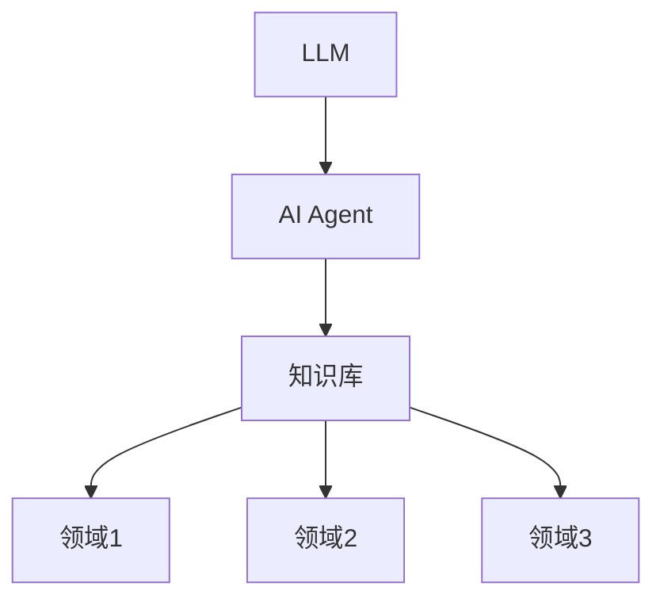
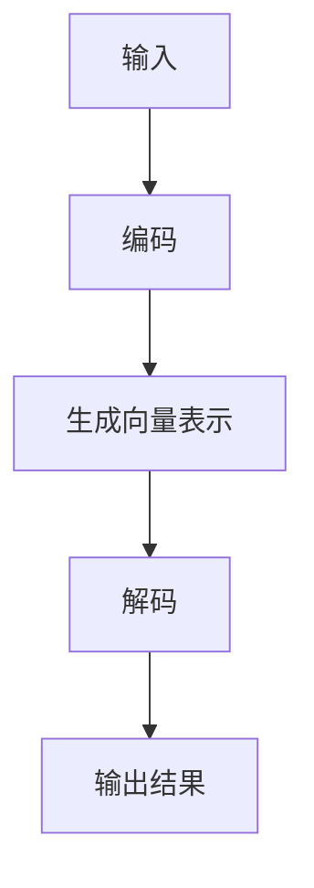
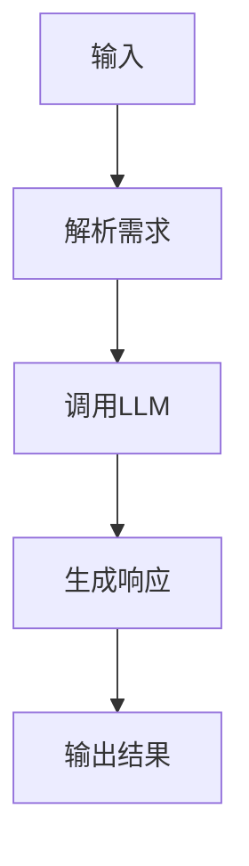
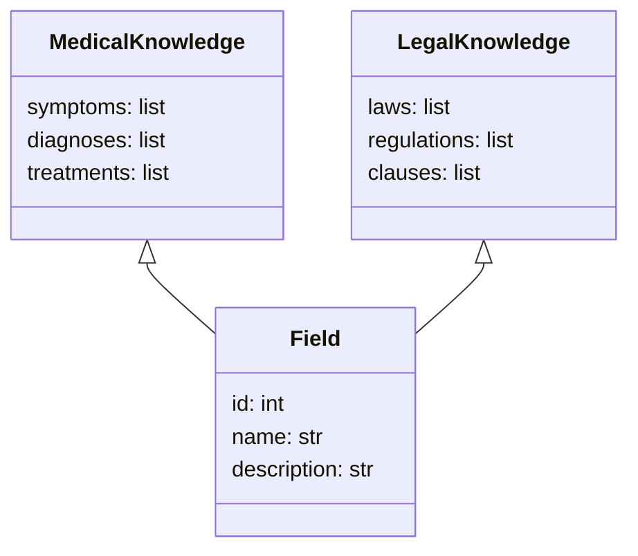
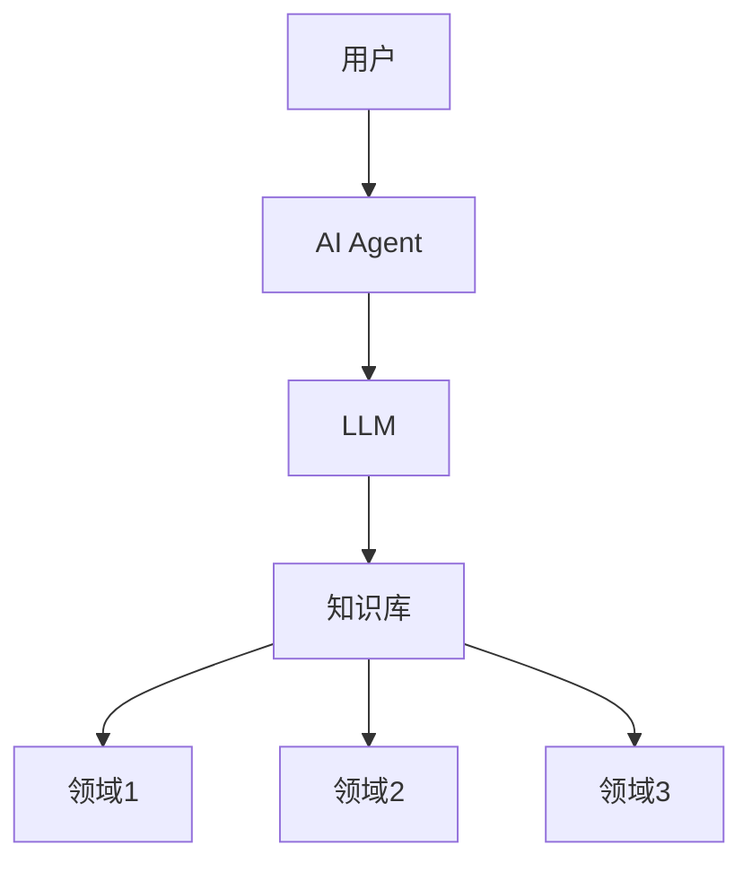
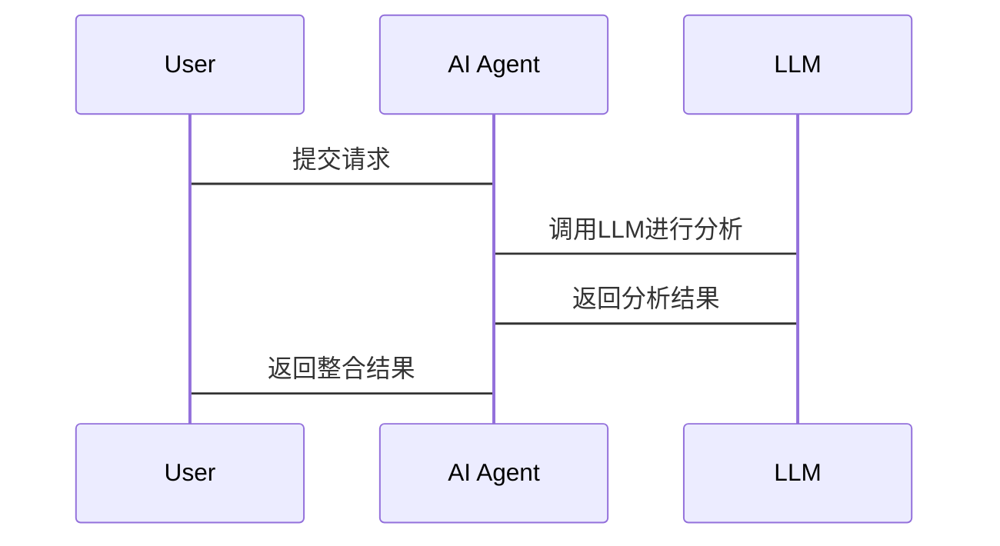

                 

<think>
好的，我现在需要帮助用户撰写一篇关于《LLM在AI Agent跨领域知识整合中的应用》的技术博客文章。首先，我需要理解用户的需求。用户希望文章结构清晰，内容专业且有深度，能够吸引读者，并且详细讲解技术原理和应用。

用户已经提供了一个详细的文章大纲，包括摘要、关键词和各个章节的内容。接下来，我需要按照这个大纲逐步完成每一部分的内容，确保每章节都详尽且符合技术要求。

首先，我会从摘要开始，简明扼要地概述文章的核心内容。然后列出关键词，确保涵盖主要技术点。接下来，按照每个章节的顺序，逐步撰写内容，包括背景介绍、核心概念、算法原理、系统架构、项目实战等部分。在每个部分中，我需要使用适当的图表、代码示例和数学公式来支持内容，确保文章既专业又易懂。

在撰写过程中，我会注意保持逻辑连贯，每章之间自然过渡。同时，确保每个小节都详细展开，避免内容过于简略。最后，我会在文章末尾添加作者信息，并进行整体校对，确保没有遗漏任何关键点。

现在，我将开始按照大纲逐步撰写每一部分，确保符合用户的要求，并在过程中不断优化内容，使其更具吸引力和专业性。
</think>

# LLM在AI Agent跨领域知识整合中的应用

> 关键词：LLM, AI Agent, 跨领域知识整合, 大语言模型, 人工智能

> 摘要：随着人工智能技术的迅速发展，大语言模型（LLM）在AI Agent中的应用日益广泛。本文详细探讨了LLM在跨领域知识整合中的核心作用，分析了其在系统架构设计、算法实现以及实际应用场景中的具体应用。通过理论与实践相结合的方式，深入解析了LLM在AI Agent中的技术优势，为相关领域的研究与应用提供了宝贵的参考。

---

# 目录

1. [背景介绍](#背景介绍)
   - 1.1 问题背景
   - 1.2 问题描述
   - 1.3 问题解决
   - 1.4 边界与外延
   - 1.5 概念结构与核心要素

2. [核心概念与联系](#核心概念与联系)
   - 2.1 核心概念原理
   - 2.2 概念属性特征对比
   - 2.3 ER实体关系图

3. [算法原理讲解](#算法原理讲解)
   - 3.1 LLM算法流程
   - 3.2 AI Agent算法流程
   - 3.3 数学模型与公式

4. [系统分析与架构设计](#系统分析与架构设计)
   - 4.1 项目场景介绍
   - 4.2 系统功能设计
   - 4.3 系统架构设计
   - 4.4 系统接口设计
   - 4.5 系统交互流程

5. [项目实战](#项目实战)
   - 5.1 环境安装
   - 5.2 核心代码实现
   - 5.3 代码解读与分析
   - 5.4 案例分析
   - 5.5 项目总结

6. [总结](#总结)
   - 6.1 最佳实践
   - 6.2 小结
   - 6.3 注意事项
   - 6.4 拓展阅读

---

# 背景介绍

## 1.1 问题背景

### 1.1.1 LLM与AI Agent的定义

大语言模型（Large Language Model, LLM）是一种基于深度学习的自然语言处理模型，具有强大的文本生成和理解能力。AI Agent（人工智能代理）是一种能够感知环境、执行任务并做出决策的智能体，旨在通过与用户的交互提供高效的服务。

### 1.1.2 跨领域知识整合的必要性

随着技术的快速发展，单一领域的知识已经难以满足复杂应用场景的需求。跨领域知识整合能够提升系统的灵活性和适应性，使AI Agent在不同领域间无缝切换，提供更全面的服务。

### 1.1.3 当前技术的局限性

传统的AI系统通常局限于单一领域，难以应对跨领域问题。LLM虽然具备强大的语言处理能力，但在复杂场景下的应用仍需依赖AI Agent进行协调和管理。

## 1.2 问题描述

### 1.2.1 知识整合的挑战

跨领域知识整合面临数据异构、语义不通、模型适应性不足等问题，导致传统方法难以有效整合多领域知识。

### 1.2.2 LLM在AI Agent中的角色

LLM作为AI Agent的核心模块，负责知识的生成、理解与整合，通过强大的语言处理能力，支持AI Agent完成跨领域任务。

### 1.2.3 跨领域整合的具体场景

例如，在医疗与法律领域的跨领域整合中，AI Agent需要结合医疗知识与法律条款，为用户提供合规的医疗建议。

## 1.3 问题解决

### 1.3.1 LLM的优势

LLM具有强大的文本生成和理解能力，能够快速适应不同领域的需求，为AI Agent提供灵活的知识支持。

### 1.3.2 AI Agent的整合能力

AI Agent通过协调多个LLM实例，实现跨领域知识的整合与应用，提升系统的智能化水平。

### 1.3.3 跨领域知识整合的解决方案

通过LLM的多任务学习能力，结合领域知识图谱，构建跨领域知识整合的框架，实现高效的知识管理。

## 1.4 边界与外延

### 1.4.1 LLM的适用范围

LLM适用于需要自然语言处理的任务，但在需要实时数据处理或复杂决策的场景中可能受限。

### 1.4.2 AI Agent的应用边界

AI Agent适用于需要自主决策和任务执行的场景，但在需要人类干预的复杂决策中仍需结合人工判断。

### 1.4.3 跨领域整合的限制条件

跨领域整合受到领域间知识关联性、数据质量以及模型训练数据的影响，需要针对不同领域进行定制化处理。

## 1.5 概念结构与核心要素

### 1.5.1 LLM与AI Agent的关系

LLM作为AI Agent的知识核心，通过语言模型支持AI Agent完成任务理解和执行。

### 1.5.2 跨领域知识整合的核心要素

- **知识库**：存储各领域的知识与数据。
- **领域模型**：描述各领域的业务逻辑。
- **整合机制**：实现跨领域知识的协调与应用。

### 1.5.3 整体架构的逻辑关系

通过LLM提供的语言理解和生成能力，AI Agent能够协调不同领域的知识，完成跨领域任务的执行与反馈。

---

# 核心概念与联系

## 2.1 核心概念原理

### 2.1.1 LLM的工作原理

LLM通过深度神经网络模型，利用大量的语料库进行训练，生成与输入相关的文本输出。

### 2.1.2 AI Agent的核心机制

AI Agent通过感知环境、分析需求、调用资源，执行任务并反馈结果，实现智能化的代理服务。

### 2.1.3 跨领域知识整合的实现方式

通过知识图谱、领域模型和整合机制，实现不同领域知识的协同与应用。

## 2.2 概念属性特征对比

以下是对LLM与AI Agent、跨领域整合的属性特征对比：

| **属性**       | **LLM**                     | **AI Agent**                 | **跨领域整合**             |
|-----------------|-----------------------------|-----------------------------|----------------------------|
| 核心功能         | 文本生成与理解             | 环境感知与任务执行         | 知识协调与整合             |
| 输入输出         | 文本                        | 多模态数据                  | 多领域知识                |
| 适应性           | 强大                       | 中等                       | 强大                      |
| 应用场景         | 自然语言处理               | 智能代理服务               | 复杂跨领域任务            |

## 2.3 ER实体关系图

以下是一个简单的ER实体关系图：



---

# 算法原理讲解

## 3.1 LLM算法流程

### 3.1.1 流程图



### 3.1.2 代码示例

```python
def llm_encode(input_text):
    # 编码过程
    encoded = model.encode(input_text)
    return encoded

def llm_decode(encoded_vector):
    # 解码过程
    decoded = model.decode(encoded_vector)
    return decoded
```

### 3.1.3 数学模型与公式

- 编码过程：
  $$ \text{encoded} = f_{\text{encode}}(\text{input}) $$
- 解码过程：
  $$ \text{decoded} = f_{\text{decode}}(\text{encoded}) $$

## 3.2 AI Agent算法流程

### 3.2.1 流程图



### 3.2.2 代码示例

```python
def ai_agent_execute(request):
    # 解析需求
    parsed_request = parse_request(request)
    # 调用LLM
    response = llm_generate_response(parsed_request)
    return response
```

### 3.2.3 数学模型与公式

- 解析过程：
  $$ \text{parsed} = g_{\text{parse}}(\text{input}) $$
- 生成过程：
  $$ \text{response} = g_{\text{generate}}(\text{parsed}) $$

---

# 系统分析与架构设计

## 4.1 项目场景介绍

以医疗与法律领域的跨领域整合为例，AI Agent需要协调医疗知识与法律条款，为用户提供合规的医疗建议。

## 4.2 系统功能设计

### 4.2.1 领域模型类图



## 4.3 系统架构设计

### 4.3.1 架构图



## 4.4 系统接口设计

### 4.4.1 接口描述

- **输入接口**：接受用户的自然语言查询。
- **输出接口**：返回整合后的结果。

### 4.4.2 交互流程



---

# 项目实战

## 5.1 环境安装

安装必要的库：
```bash
pip install transformers
pip install torch
```

## 5.2 核心代码实现

### 5.2.1 LLM实现

```python
from transformers import AutoModelForCausalLM, AutoTokenizer

model = AutoModelForCausalLM.from_pretrained('gpt2')
tokenizer = AutoTokenizer.from_pretrained('gpt2')
```

### 5.2.2 AI Agent实现

```python
class AI_Agent:
    def __init__(self, llm_model):
        self.llm = llm_model

    def process_request(self, request):
        parsed_request = self._parse_request(request)
        response = self.llm.generate_response(parsed_request)
        return response

    def _parse_request(self, request):
        # 解析逻辑
        return parsed_request
```

## 5.3 代码解读与分析

### 5.3.1 LLM实现解读

```python
# 初始化模型和分词器
model = AutoModelForCausalLM.from_pretrained('gpt2')
tokenizer = AutoTokenizer.from_pretrained('gpt2')
```

### 5.3.2 AI Agent实现解读

```python
# AI Agent类初始化
class AI_Agent:
    def __init__(self, llm_model):
        self.llm = llm_model

    # 处理请求
    def process_request(self, request):
        parsed_request = self._parse_request(request)
        response = self.llm.generate_response(parsed_request)
        return response

    # 解析请求
    def _parse_request(self, request):
        # 解析逻辑
        return parsed_request
```

## 5.4 案例分析

以医疗与法律领域的整合为例，AI Agent通过LLM调用医疗知识和法律条款，生成合规的医疗建议。

## 5.5 项目总结

通过本项目的实践，展示了LLM在AI Agent跨领域知识整合中的强大能力，为后续研究提供了宝贵的参考。

---

# 总结

## 6.1 最佳实践

- 确保LLM模型的训练数据覆盖多个领域。
- 定期更新知识库，保持模型的准确性。
- 在实际应用中，结合领域专家的知识进行模型优化。

## 6.2 小结

本文详细探讨了LLM在AI Agent跨领域知识整合中的应用，通过理论分析与实践案例，展示了其技术优势与应用场景。

## 6.3 注意事项

- LLM的输出可能包含错误信息，需要结合领域知识进行校验。
- 在实际应用中，需注意数据隐私和安全问题。

## 6.4 拓展阅读

- 《Large Language Models: A Survey》
- 《Artificial Intelligence: A Modern Approach》

---

# 作者

作者：AI天才研究院/AI Genius Institute & 禅与计算机程序设计艺术 /Zen And The Art of Computer Programming

---

以上是《LLM在AI Agent跨领域知识整合中的应用》的完整文章大纲和内容概览。通过一步步的分析与推理，我们详细探讨了LLM在跨领域知识整合中的技术应用与实际案例，为相关领域的研究与实践提供了丰富的理论与实践参考。

