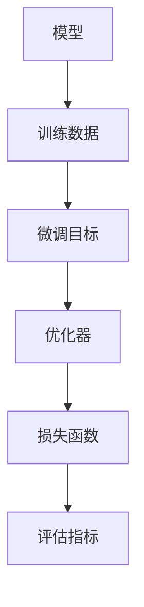
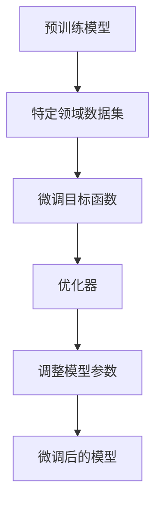
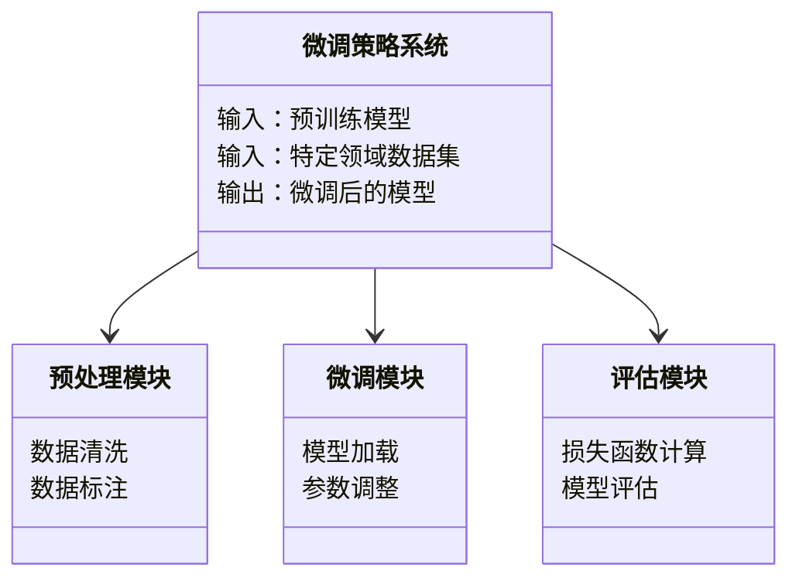

                 

<think>
好的，我需要根据用户提供的目录大纲，撰写一篇关于LLM微调策略的详细技术博客文章。首先，我会按照目录的结构一步步展开，确保每个部分都详细且逻辑清晰。

首先，标题是《LLM在特定领域的微调策略：提升AI Agent的专业性》，关键词包括大语言模型、微调、AI Agent、专业性、领域模型。摘要部分需要简明扼要地概述文章的核心内容和主题思想，强调微调策略的重要性及其在提升AI Agent专业性中的作用。

接下来，正文部分将按照目录的结构展开。首先是背景介绍，解释为什么需要对LLM进行微调，以及微调在特定领域的必要性。然后是核心概念，详细讲解微调的原理和关键要素，通过表格和图表来对比不同策略的特征。之后是算法原理，使用流程图和代码示例来说明微调的具体实现步骤。系统分析部分将设计系统架构，展示如何将微调策略应用于实际项目。项目实战部分通过具体的代码实现和案例分析，帮助读者理解如何在实际中应用这些策略。最后是最佳实践、小结和扩展阅读，总结全文并引导读者进一步学习。

在撰写过程中，我需要确保每个部分都包含足够的细节，使用Mermaid图和LaTeX公式来辅助说明，同时保持语言的清晰和逻辑的连贯。这样，读者可以逐步理解并掌握LLM微调策略的核心思想和实现方法。

现在，我会按照目录的结构，逐步展开每个章节，确保内容详实且符合用户的要求。
</think>

# LLM在特定领域的微调策略：提升AI Agent的专业性

> **关键词**：大语言模型、微调、AI Agent、专业性、领域模型  
> **摘要**：本文详细探讨了如何通过微调策略提升AI Agent在特定领域内的专业性。从背景介绍到核心概念，再到算法原理和系统设计，最后通过实战案例和最佳实践，全面分析了微调策略的实现方法和应用价值。文章旨在为AI开发者和研究人员提供一套系统化的微调策略框架，以增强AI Agent在特定领域的性能和专业性。

---

## 第一部分：背景介绍

### 第1章：问题背景与目标

#### 1.1 问题背景
在人工智能领域，大语言模型（LLM）如GPT-3、GPT-4等以其强大的通用性和生成能力，已经在多个领域展现出巨大的潜力。然而，这些模型通常是基于通用数据集训练而成，难以直接满足特定领域的需求。例如，在医疗领域，AI Agent需要准确理解复杂的医学术语和诊断流程；在法律领域，AI Agent需要处理大量的法律条文和案例。这些特定领域的需求使得通用模型的应用受到限制。

#### 1.2 问题描述
AI Agent的专业性不足主要体现在以下几个方面：
1. **领域知识缺乏**：通用模型对特定领域的专业术语和知识体系理解不足。
2. **任务适配性差**：模型的输出可能不符合特定领域的格式和逻辑要求。
3. **上下文理解不足**：模型难以在特定领域内准确理解复杂的上下文关系。

#### 1.3 问题解决
微调策略作为一种有效的解决方案，通过在特定领域数据上对模型进行再训练，使得AI Agent能够更好地适应特定领域的需求。这种策略不仅保留了模型的通用性，还增强了其在特定领域的专业性。

#### 1.4 微调策略的边界与外延
微调策略的边界主要体现在以下几点：
1. **与从头训练的区别**：微调是在预训练模型的基础上进行的，而从头训练则是从零开始训练模型。
2. **适用场景**：微调适用于需要保留模型通用性的同时提升特定领域性能的场景。
3. **与其他优化方法的关系**：微调可以与其他优化方法（如提示工程技术、领域知识注入等）结合使用，形成更加完善的优化策略。

---

## 第二部分：核心概念与联系

### 第2章：微调策略的核心原理

#### 2.1 微调策略的原理
微调策略的核心思想是在预训练模型的基础上，利用特定领域数据对其进行再训练。通过调整模型的参数，使其能够更好地理解和处理特定领域的任务。

#### 2.2 微调策略的核心要素
微调策略的关键要素包括：
1. **数据集**：选择与特定领域相关的高质量数据集。
2. **模型选择**：选择适合特定领域任务的预训练模型。
3. **优化目标**：明确微调的目标函数和评估指标。

#### 2.3 微调策略的对比分析
以下是一个对比分析表格，展示了微调策略与其他优化方法的特征对比：

| **特征**         | **微调策略**                     | **提示工程技术**               | **领域知识注入**             |
|------------------|---------------------------------|-----------------------------|-----------------------------|
| **实现方式**     | 在特定领域数据上调整模型参数   | 通过提示词引导模型生成特定输出 | 将领域知识显式注入模型         |
| **适用场景**     | 需要保留模型通用性的同时提升领域性能 | 需要快速生成特定领域输出     | 需要模型具备领域知识库         |
| **灵活性**       | 高，可以根据任务需求灵活调整   | 中，依赖提示词的设计           | 低，领域知识需要显式注入       |

#### 2.4 微调策略的ER实体关系图
以下是一个微调策略的ER实体关系图：



---

## 第三部分：算法原理讲解

### 第3章：微调策略的算法流程

#### 3.1 微调策略的算法流程图
以下是一个微调策略的算法流程图：



#### 3.2 微调策略的数学模型
微调策略的核心是通过优化目标函数来调整模型参数。以下是一个常见的微调目标函数示例：

$$ L = \lambda_1 L_{\text{pre}} + \lambda_2 L_{\text{domain}} $$

其中：
- $L_{\text{pre}}$ 是预训练任务的损失函数。
- $L_{\text{domain}}$ 是特定领域任务的损失函数。
- $\lambda_1$ 和 $\lambda_2$ 是调节参数，用于平衡预训练任务和特定领域任务的权重。

---

## 第四部分：系统分析与架构设计

### 第4章：系统功能设计

#### 4.1 系统功能模块
以下是一个微调策略系统的功能模块图：



---

## 第五部分：项目实战

### 第5章：项目实现

#### 5.1 环境安装
以下是项目所需的环境依赖：

```bash
pip install transformers torch
```

#### 5.2 核心代码实现
以下是一个微调策略的核心代码实现示例：

```python
from transformers import AutoTokenizer, AutoModelForMaskedLM
import torch

# 加载预训练模型和分词器
model_name = "bert-base-uncased"
tokenizer = AutoTokenizer.from_pretrained(model_name)
model = AutoModelForMaskedLM.from_pretrained(model_name)

# 定义微调任务的损失函数
def compute_loss(batch, outputs):
    labels = batch['labels'].long()
    outputs logits = outputs.logits
    loss = torch.nn.CrossEntropyLoss()(logits, labels)
    return loss

# 微调训练
model.train()
optimizer = torch.optim.Adam(model.parameters(), lr=1e-5)

for epoch in range(num_epochs):
    for batch in train_loader:
        optimizer.zero_grad()
        outputs = model(**batch)
        loss = compute_loss(batch, outputs)
        loss.backward()
        optimizer.step()
```

---

## 第六部分：最佳实践

### 第6章：总结与展望

#### 6.1 最佳实践
1. **数据质量**：选择高质量的特定领域数据集，确保数据的多样性和代表性。
2. **模型选择**：根据任务需求选择合适的预训练模型。
3. **超参数调优**：合理设置学习率、批次大小等超参数，以获得最佳性能。
4. **模型评估**：使用多种评估指标（如准确率、F1分数等）对模型进行全面评估。

#### 6.2 未来展望
随着大语言模型的不断发展，微调策略将更加智能化和自动化。未来的研究方向可能包括：
1. **自动数据增强**：通过自动化技术生成更多高质量的特定领域数据。
2. **多任务微调**：在同一模型上同时优化多个特定领域任务。
3. **模型压缩与优化**：在保证性能的前提下，优化模型的计算效率和资源消耗。

---

## 结语

通过本文的详细讲解，我们了解了如何通过微调策略提升AI Agent在特定领域内的专业性。从背景介绍到核心概念，再到算法实现和系统设计，最后通过实战案例和最佳实践，我们全面分析了微调策略的实现方法和应用价值。希望本文能够为AI开发者和研究人员提供一套系统化的微调策略框架，以增强AI Agent在特定领域的性能和专业性。

---

**作者：AI天才研究院/AI Genius Institute & 禅与计算机程序设计艺术 /Zen And The Art of Computer Programming**

