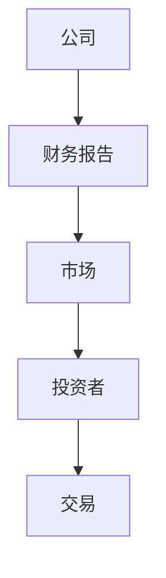
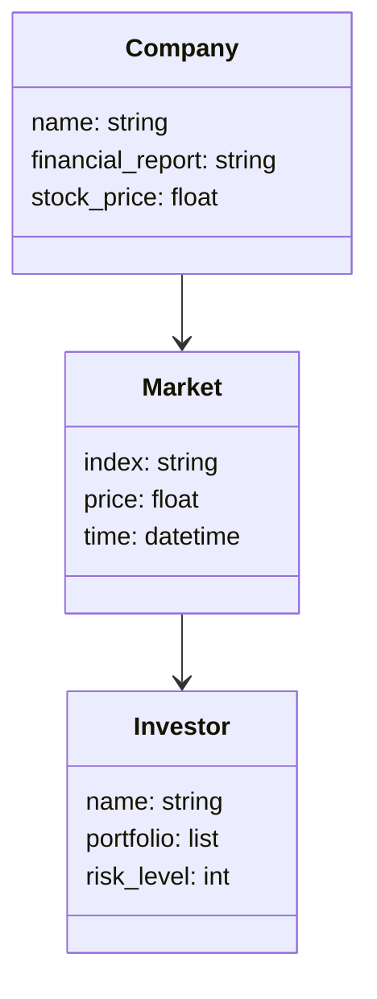

                 


# LLM大模型在金融领域的应用前景与挑战

## 关键词：LLM大模型，人工智能，金融应用，自然语言处理，机器学习

## 摘要：本文深入分析了大语言模型（LLM）在金融领域的应用前景与挑战，探讨了LLM在金融文本分析、智能投顾、风险评估等场景中的优势与局限性，并展望了未来的发展方向。文章从背景介绍、核心概念、算法原理、系统架构到项目实战，全面解析了LLM在金融领域的应用潜力与技术挑战。

---

# 第1章: LLM大模型与金融领域的背景介绍

## 1.1 LLM大模型的定义与特点

### 1.1.1 大语言模型的基本概念
大语言模型（Large Language Model, LLM）是指基于深度学习技术构建的、具有大量参数的自然语言处理模型，如GPT系列、BERT系列等。这些模型通过海量数据的预训练，能够理解和生成人类语言，具备强大的文本处理能力。

### 1.1.2 LLM在金融领域的独特优势
- **金融文本理解**：LLM能够处理复杂的金融文本，如财务报告、新闻公告等，提取关键信息。
- **实时分析能力**：LLM可以快速分析市场动态、公司新闻等信息，辅助投资决策。
- **个性化服务**：LLM能够根据用户需求生成定制化的金融分析报告。

### 1.1.3 金融领域的核心需求与LLM的契合点
- **数据复杂性**：金融数据种类繁多，LLM能够处理结构化和非结构化数据。
- **实时性要求**：LLM具备快速生成和分析的能力，满足金融领域的实时需求。
- **个性化与定制化**：LLM能够根据用户需求生成个性化的内容，满足金融客户的多样化需求。

## 1.2 问题背景与问题描述

### 1.2.1 传统金融业务的痛点与挑战
- **数据孤岛**：金融机构的数据往往分散在不同系统中，难以统一分析。
- **信息滞后**：传统金融分析依赖于历史数据，难以捕捉实时市场变化。
- **人工成本高**：金融分析需要大量人工参与，效率低下。

### 1.2.2 LLM如何解决金融领域的复杂问题
- **自动化分析**：LLM能够自动化处理大量金融数据，生成实时分析结果。
- **智能化决策**：LLM通过深度学习，能够辅助人类做出更明智的决策。
- **降低人工成本**：LLM可以替代部分人工工作，提高效率，降低成本。

### 1.2.3 LLM在金融领域的边界与外延
- **边界**：LLM主要用于金融数据分析、文本生成和预测，无法完全替代人类的决策能力。
- **外延**：LLM的应用范围可以从金融领域扩展到其他领域，但需要针对特定场景进行优化。

## 1.3 核心概念与问题解决

### 1.3.1 LLM在金融分析中的应用场景
- **市场情绪分析**：通过分析新闻和社交媒体，预测市场情绪。
- **财务报告生成**：根据公司数据生成财务报告。
- **风险评估**：基于历史数据和市场信息，评估投资风险。

### 1.3.2 从数据到决策的LLM驱动流程
1. 数据收集：获取金融市场数据、新闻、社交媒体等信息。
2. 数据预处理：清洗和标注数据，确保模型能够理解。
3. 模型训练：基于预处理数据，训练或微调LLM模型。
4. 模型应用：将模型应用于具体金融任务，生成结果。
5. 结果分析：对模型输出进行分析，辅助决策。

### 1.3.3 LLM与传统金融技术的结合方式
- **API集成**：将LLM作为API集成到现有金融系统中。
- **混合部署**：结合传统数据库和LLM模型，构建混合系统。
- **实时交互**：通过自然语言交互，提供实时金融信息服务。

## 1.4 核心要素与概念结构

### 1.4.1 LLM模型的输入输出机制
- **输入**：文本数据，如新闻、财务报告。
- **输出**：生成的文本或预测结果，如市场趋势、风险评估。

### 1.4.2 金融领域的实体关系分析
- **实体**：公司、市场、投资者、交易等。
- **关系**：市场影响公司，投资者影响市场，公司发布财务报告等。

### 1.4.3 LLM在金融决策中的逻辑架构
1. 数据输入：金融市场数据、用户查询。
2. 模型处理：LLM分析数据，生成文本或预测结果。
3. 结果输出：输出决策建议或生成文本内容。

## 1.5 本章小结
本章从背景出发，详细介绍了LLM的定义、特点以及在金融领域的应用优势。同时，分析了金融领域的痛点和LLM如何解决这些问题，并探讨了LLM在金融领域的边界与外延。通过这些分析，为后续章节奠定了基础。

---

# 第2章: LLM大模型的核心概念与原理

## 2.1 LLM的训练与优化原理

### 2.1.1 大语言模型的训练目标
- **预训练**：通过大量未标注数据进行无监督学习，目标是理解语言的结构和语义。
- **微调**：在特定领域数据上进行有监督训练，使模型适应具体任务。

### 2.1.2 模型参数优化的数学基础
- **损失函数**：衡量模型输出与真实值的差异，常用的有交叉熵损失函数。
  $$\text{损失函数} = -\sum_{i=1}^{n} y_i \log p(y_i)$$
- **优化方法**：如随机梯度下降（SGD）、Adam优化器，用于最小化损失函数。

### 2.1.3 预训练与微调的对比分析
- **预训练**：通用性强，适用于多种任务。
- **微调**：针对特定任务优化，性能更佳。

## 2.2 LLM在金融领域的应用原理

### 2.2.1 金融文本的理解与生成机制
- **理解机制**：通过编码器将输入文本转换为向量表示。
- **生成机制**：通过解码器生成符合上下文的输出文本。

### 2.2.2 基于LLM的金融决策逻辑
- **输入**：金融市场数据、用户查询。
- **处理**：模型分析数据，生成决策建议。
- **输出**：生成文本或预测结果。

### 2.2.3 LLM与金融数据的交互模式
- **单向交互**：模型仅生成输出，不与用户互动。
- **双向交互**：模型与用户实时互动，根据反馈调整输出。

## 2.3 核心概念的对比分析

### 2.3.1 LLM与其他AI技术的对比
| 技术 | 优势 | 局限性 |
|------|------|--------|
| LLM  | 强大的文本生成能力 | 对数据和计算资源要求高 |
| SVM  | 简单高效 | 适用于小规模数据 |

### 2.3.2 不同金融场景下的LLM应用特点
| 场景     | 特点                     |
|----------|--------------------------|
| 市场分析 | 高实时性，需要快速生成结果 |
| 风险评估 | 高准确性，依赖历史数据     |

### 2.3.3 LLM在金融领域的性能指标
- **准确率**：模型预测的准确程度。
- **响应时间**：模型处理请求的速度。
- **生成质量**：生成文本的可读性和相关性。

## 2.4 实体关系图的构建

### 2.4.1 金融领域的实体关系分析


### 2.4.2 LLM在实体关系中的作用
LLM通过分析实体之间的关系，生成相关的文本内容或预测结果。

### 2.4.3 实体关系图的构建流程
1. 确定核心实体：公司、市场、投资者等。
2. 分析实体之间的关系：公司发布财务报告，市场受投资者影响等。
3. 绘制关系图：展示实体之间的联系。

## 2.5 本章小结
本章详细讲解了LLM的训练原理及其在金融领域的应用机制，分析了LLM与其他AI技术的对比，并构建了金融领域的实体关系图。这些内容为后续章节的系统分析与架构设计奠定了基础。

---

# 第3章: LLM大模型的算法原理与数学模型

## 3.1 大语言模型的算法原理

### 3.1.1 基于Transformer的模型结构
- **编码器**：将输入文本转换为向量表示。
- **解码器**：根据编码器输出生成目标文本。

### 3.1.2 注意力机制的核心原理
- **自注意力机制**：模型能够关注输入中的重要部分，提高生成质量。
  $$\text{注意力权重} = \frac{\exp(\text{score})}{\sum \exp(\text{score})}$$

### 3.1.3 梯度下降与参数优化方法
- **随机梯度下降（SGD）**：适用于大规模数据训练。
- **Adam优化器**：结合动量和自适应学习率，优化训练效果。

## 3.2 LLM在金融领域的算法优化

### 3.2.1 金融文本的特征提取方法
- **词袋模型**：将文本表示为词的集合。
- **TF-IDF**：基于词频-逆文档频率的特征提取。

### 3.2.2 金融领域的优化策略
- **领域适应**：对金融领域的数据进行微调，提高模型性能。
- **多任务学习**：同时训练多个金融任务，提升模型的泛化能力。

### 3.2.3 算法优化的数学模型
- **损失函数**：交叉熵损失函数。
  $$\text{损失函数} = -\sum_{i=1}^{n} y_i \log p(y_i)$$
- **优化目标**：最小化损失函数，提升模型性能。

## 3.3 算法实现与代码示例

### 3.3.1 环境配置
- **Python版本**：3.8及以上
- **依赖库**：TensorFlow、Keras、numpy

### 3.3.2 核心代码实现
```python
import tensorflow as tf
from tensorflow.keras.layers import Dense, Input, Dropout
from tensorflow.keras.models import Model

# 定义模型
input_layer = Input(shape=(None,))  # 输入层
x = Dense(256, activation='relu')(input_layer)  # 全连接层
x = Dropout(0.5)(x)  # 防止过拟合
output_layer = Dense(10, activation='softmax')(x)  # 输出层

model = Model(inputs=input_layer, outputs=output_layer)
model.compile(optimizer='adam', loss='sparse_categorical_crossentropy', metrics=['accuracy'])
```

### 3.3.3 代码解读与分析
- **输入层**：处理输入文本数据。
- **全连接层**：提取文本特征。
- **Dropout层**：防止过拟合。
- **输出层**：生成预测结果。

## 3.4 本章小结
本章从算法原理出发，详细讲解了大语言模型的训练过程，并结合金融领域的特点，提出了优化策略和具体的实现方法。通过代码示例，读者可以更好地理解模型的实现细节。

---

# 第4章: LLM大模型的系统分析与架构设计

## 4.1 问题场景介绍

### 4.1.1 金融市场的复杂性
- 数据来源多样，包括新闻、社交媒体、财务报告等。
- 市场波动大，需要实时分析。

### 4.1.2 LLM在金融系统中的角色
- 数据处理：清洗和标注金融数据。
- 模型训练：基于金融数据训练或微调LLM模型。
- 应用部署：将模型部署到实际金融系统中。

## 4.2 系统功能设计

### 4.2.1 领域模型设计


### 4.2.2 系统功能模块
1. 数据采集模块：收集金融市场数据。
2. 数据处理模块：清洗和标注数据。
3. 模型训练模块：训练或微调LLM模型。
4. 应用部署模块：将模型部署到实际系统中。

## 4.3 系统架构设计

### 4.3.1 系统架构图


### 4.3.2 系统接口设计
- **输入接口**：接收金融市场数据和用户查询。
- **输出接口**：输出模型生成的文本或预测结果。

### 4.3.3 系统交互流程
1. 用户提交查询或数据。
2. 系统接收数据，进行处理。
3. 模型生成结果。
4. 系统返回结果给用户。

## 4.4 本章小结
本章通过系统分析，设计了LLM在金融系统中的功能模块和架构，并通过mermaid图展示了系统的交互流程。这些设计为后续的项目实战奠定了基础。

---

# 第5章: LLM大模型的项目实战

## 5.1 项目背景与目标

### 5.1.1 项目背景
- **智能投顾**：基于LLM为用户提供个性化的投资建议。
- **风险评估**：通过分析历史数据，评估投资风险。

### 5.1.2 项目目标
- 实现基于LLM的智能投顾系统。
- 提供实时市场分析和风险评估。

## 5.2 项目环境配置

### 5.2.1 环境安装
- **Python版本**：3.8及以上
- **依赖库**：TensorFlow、Keras、numpy

### 5.2.2 数据准备
- **数据来源**：股票价格数据、新闻数据。
- **数据预处理**：清洗和标注数据，提取关键特征。

## 5.3 系统核心实现

### 5.3.1 代码实现
```python
import pandas as pd
import numpy as np
from tensorflow.keras.models import load_model

# 加载预训练模型
model = load_model('financial_model.h5')

# 定义输入数据
input_data = np.array(["公司发布了一份财报，请分析其对股价的影响"])

# 生成输出
output = model.predict(input_data)
print("生成的文本：", output)
```

### 5.3.2 代码解读与分析
- **模型加载**：加载已经训练好的LLM模型。
- **输入数据**：提供需要分析的文本数据。
- **模型预测**：生成分析结果。

## 5.4 项目案例分析

### 5.4.1 案例背景
- **公司财报发布**：某公司发布了一份财报，需要分析其对股价的影响。

### 5.4.2 案例分析
- **模型输入**：公司财报内容。
- **模型输出**：生成的分析报告，预测股价走势。

## 5.5 项目小结
本章通过项目实战，详细讲解了LLM在智能投顾和风险评估中的应用。通过具体的代码实现和案例分析，读者可以更好地理解LLM在金融领域的实际应用。

---

# 第6章: LLM大模型的最佳实践、小结与展望

## 6.1 最佳实践 tips

### 6.1.1 数据处理
- 确保数据的准确性和完整性。
- 对数据进行适当的标注和清洗。

### 6.1.2 模型优化
- 根据具体任务对模型进行微调。
- 使用适当的优化方法，如Adam优化器。

### 6.1.3 系统部署
- 将模型部署到实际系统中，确保系统的稳定性和高效性。

## 6.2 小结
本文从背景介绍、核心概念、算法原理到系统架构和项目实战，全面分析了LLM在金融领域的应用前景与挑战。通过具体的案例分析和代码实现，展示了LLM在金融领域的巨大潜力。

## 6.3 注意事项

### 6.3.1 数据隐私
- 确保金融数据的安全性和隐私性。
- 遵守相关法律法规。

### 6.3.2 模型调优
- 根据具体任务对模型进行优化。
- 定期更新模型，保持模型的准确性。

### 6.3.3 系统维护
- 定期检查系统运行状态。
- 及时修复系统中的问题。

## 6.4 拓展阅读
- **相关书籍**：《Deep Learning》、《自然语言处理实战》。
- **论文推荐**：关注最新的LLM相关论文，了解技术前沿。

## 6.5 本章小结
本章总结了LLM在金融领域的最佳实践，并对未来的发展方向进行了展望。通过这些内容，读者可以更好地理解和应用LLM技术。

---

# 作者：AI天才研究院/AI Genius Institute & 禅与计算机程序设计艺术 /Zen And The Art of Computer Programming

---

以上是《LLM大模型在金融领域的应用前景与挑战》的技术博客文章的完整目录和内容概要。

